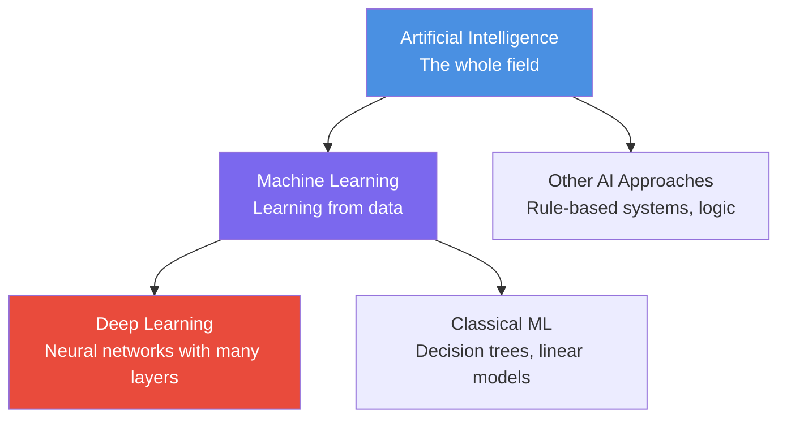
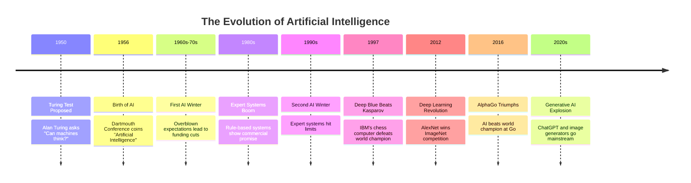
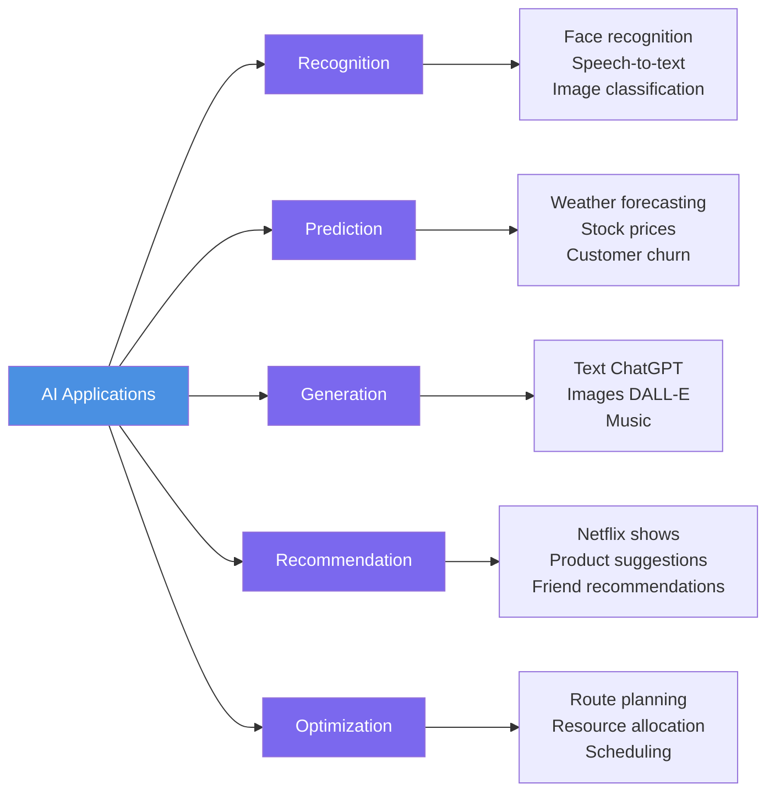
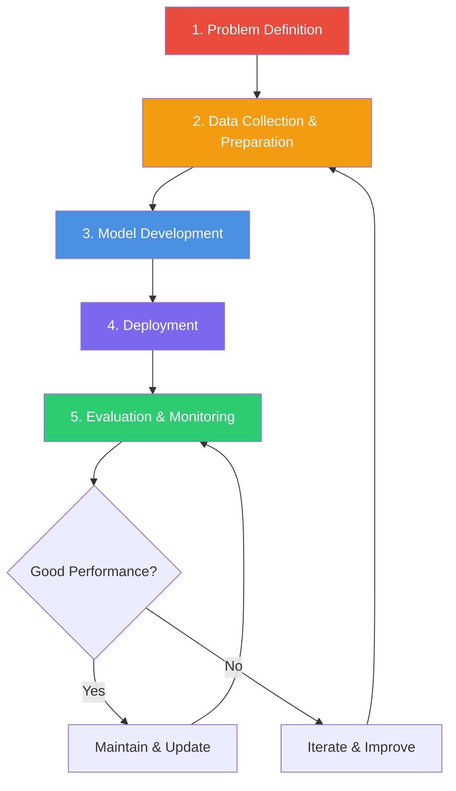
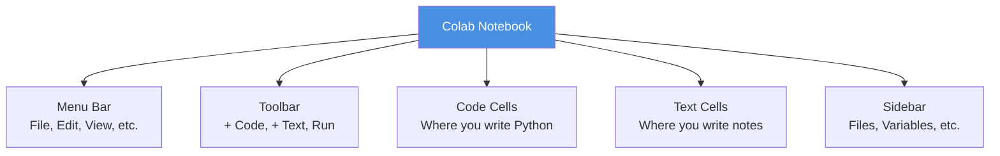
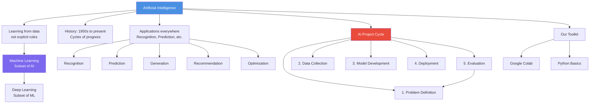

# AI Thinking: A Hands-On Introduction to Artificial Intelligence

# Chapter 1: Welcome to the Age of AI

---

## The Morning Coffee That Changed Everything

Sofia had been working at her family's cafecito window in Little Havana for three years, and she thought she knew the morning rush by heart. Every weekday at 7:15 AM, Mr. Rodriguez ordered a cortadito. Mrs. Chen always wanted her café con leche extra sweet. The construction workers from the site down the street bought six Cuban coffees, black, no sugar.

But last Tuesday, something strange happened. Just as Sofia was preparing Mr. Rodriguez's usual cortadito, her phone buzzed with a notification from the new point-of-sale system her cousin installed: "High probability: Customer wants double cortadito today."

"That's weird," Sofia thought, ignoring the notification and making the single cortadito like always.

"Actually, Sofia," Mr. Rodriguez said when he arrived, "can I get two today? I'm picking one up for my coworker."

Sofia froze. How did the app know?

Later that week, the system predicted Mrs. Chen would skip her usual order (she was running late for a doctor's appointment), warned that the construction crew would arrive 20 minutes early (traffic was light on I-95), and even suggested Sofia prepare extra pastelitos because a cruise ship was docking nearby.

Every prediction was right.

"What is this thing?" Sofia asked her cousin that evening, staring at the app that seemed to read her customers' minds.

Her cousin smiled. "That's AI, prima. Artificial intelligence. It learned your customers' patterns—what they order, when they come, even how traffic and events affect their behavior. It's not magic. It's math."

Sofia looked at her phone differently now. This wasn't just a cash register. It was something that could learn, predict, and help her make better decisions. And if a small cafecito window could use AI to serve coffee better, what else was possible?

Welcome to the age of AI—where the technology that once seemed like science fiction is now helping a family business in Little Havana serve better coffee. And you're about to learn how it all works.

---

## Learning Objectives

By the end of this chapter, you will be able to:

1. **Define** artificial intelligence and distinguish it from related terms like machine learning and deep learning
2. **Trace** the major milestones in AI history from 1950 to present day
3. **Identify** at least five real-world applications of AI you interact with daily
4. **Explain** the AI project cycle and its five phases
5. **Set up** a Google Colab environment and execute basic Python code

---

## Why This Chapter Matters

You live in a world powered by AI. When you ask your phone for directions to Miami Beach, AI calculates the fastest route considering current traffic. When Netflix suggests what to watch next, AI analyzes your viewing patterns. When your bank flags a suspicious transaction, AI detected an unusual spending pattern.

But here's what makes this moment in history special: AI is no longer just for tech giants and research labs. Small businesses, community organizations, and individual creators are using AI tools every day. Understanding AI isn't just about getting a tech job (though it helps with that too)—it's about being an informed citizen in a world where AI influences healthcare decisions, loan approvals, job applications, and even criminal justice.

This chapter is your foundation. We'll start with the big question—what is AI, really?—and build from there. You'll learn the history, see the applications, understand the process, and write your first lines of code. By the time you finish, you won't just use AI tools—you'll understand what's happening under the hood.

---

## 1.1 What Is Artificial Intelligence, Really?

Let's start with a definition that actually makes sense.

**Artificial Intelligence (AI)** is the field of computer science dedicated to creating systems that can perform tasks that typically require human intelligence—things like recognizing speech, making decisions, translating languages, or identifying objects in images.

But that definition alone doesn't capture what makes AI different from regular computer programs. After all, a calculator performs math that requires human intelligence, but we don't call it AI.

Here's the key difference: Traditional programs follow explicit instructions written by programmers. If you want a program to identify whether an image contains a dog, you'd have to write detailed rules: "If it has four legs AND a tail AND fur AND pointed ears..." But what about dogs that are lying down? Dogs with floppy ears? Dogs that are mostly hidden behind a fence?

AI systems, on the other hand, **learn from examples**. You show an AI system thousands of pictures of dogs and thousands of pictures of not-dogs, and it figures out the patterns on its own. It learns what "dog-ness" means without you having to write explicit rules.

### The AI Family Tree

Think of AI as a family with different members:



**Figure 1.1**: The AI Family Tree - Artificial Intelligence is the broadest category, Machine Learning is a subset focused on learning from data, and Deep Learning is a subset of ML using neural networks.

Let's break this down:

- **Artificial Intelligence (AI)**: The entire field—any technique that makes computers behave intelligently
- **Machine Learning (ML)**: A subset of AI where systems learn from data rather than following hard-coded rules
- **Deep Learning (DL)**: A subset of ML that uses neural networks with many layers (we'll explore this in Chapter 8)

💡 **Key Insight**: When people say "AI" in everyday conversation, they're often specifically talking about machine learning. The cafecito app Sofia used? That's machine learning—it learned patterns from past customer behavior.

### A Relatable Analogy: Learning to Make Arroz con Pollo

Think about how you might learn to make arroz con pollo (chicken with rice):

**The Traditional Programming Approach** would be like following a recipe with exact measurements:
- Add exactly 2 cups of rice
- Use precisely 4 cups of water
- Cook for exactly 25 minutes at medium heat

**The Machine Learning Approach** is more like learning from your abuela:
- You watch her make it dozens of times
- You notice she adjusts water based on the rice type
- You see she adds more sazón when the chicken is particularly lean
- Eventually, you develop an intuition—you can look at the rice and know it needs a bit more water, or taste the sofrito and know it needs more garlic

Machine learning systems develop that same kind of "intuition" by observing many examples and identifying patterns.

Of course, the analogy breaks down in one important way: Your abuela understands *why* she's making adjustments (the rice type absorbs water differently), while AI systems often identify patterns without truly understanding the underlying reasons. This difference becomes important when we discuss AI limitations later in the course.

---

## 1.2 A Brief History: From Turing to ChatGPT

AI didn't appear overnight. It's been a long journey with moments of incredible optimism, disappointing setbacks, and surprising breakthroughs.

### The Key Milestones



**Figure 1.2**: AI History Timeline - Notice the cycles of excitement and disappointment ("AI winters") before recent breakthroughs.

Let me walk you through the story:

### 1950: The Turing Test

British mathematician Alan Turing asked a provocative question: "Can machines think?" Instead of trying to define "thinking" (which gets philosophical fast), he proposed a practical test: If a human judge can't tell whether they're chatting with a human or a machine, the machine has demonstrated intelligence.

🤔 **Think About It**: Try this yourself—go to ChatGPT or Claude and have a conversation. At what point (if any) does it feel less than human? What gives it away?

### 1956: The Dartmouth Conference

A group of scientists gathered at Dartmouth College and officially coined the term "Artificial Intelligence." They were wildly optimistic, predicting that human-level AI was just around the corner—maybe 20 years away.

They were wrong. We're still working on it nearly 70 years later.

### The AI Winters

The path wasn't smooth. Twice—in the 1970s and 1990s—AI research hit major roadblocks:

- **First AI Winter (1970s)**: Early AI systems couldn't handle real-world complexity. A program might solve math problems but couldn't recognize a simple object in a photo. Funding dried up.

- **Second AI Winter (1990s)**: Expert systems (programs with hand-coded rules from experts) hit their limits. They were too rigid and couldn't learn or adapt.

⚠️ **Common Pitfall**: Some people worry we're heading for another AI winter after the current hype. History teaches us that progress happens in waves, but each wave builds on the last. Today's AI is fundamentally more capable than previous generations.

### 1997: Deep Blue

IBM's Deep Blue computer beat world chess champion Garry Kasparov. This was huge—chess had long been considered a test of human intelligence. But critics pointed out that Deep Blue didn't really "understand" chess; it just calculated millions of possible moves per second.

### 2012: The Deep Learning Revolution

A breakthrough moment: A neural network called AlexNet dramatically outperformed all other approaches in recognizing objects in images. This sparked the modern deep learning era. Suddenly, AI could:

- Recognize faces in photos
- Transcribe speech accurately
- Translate between languages
- Drive cars (with help)

The key? More data, more computing power, and better algorithms all came together at once.

### 2016-Present: AI Goes Mainstream

AlphaGo beat the world champion at Go (a game far more complex than chess). Self-driving cars started testing on public roads. And then, in late 2022, ChatGPT exploded into public consciousness, bringing AI conversations to millions of people overnight.

**The Present Moment**

Today, we're in an unprecedented era where:
- AI tools are accessible to everyone, not just researchers
- The technology improves month by month, not decade by decade
- AI impacts daily life in ways both visible (ChatGPT) and invisible (content recommendations, spam filters, autocorrect)

---

## 1.3 AI All Around Us: Applications You Already Use

Let's play a game. I'm going to describe a typical morning for a Miami college student, and you count how many AI systems they encounter:

**Carlos's Morning**

Carlos's phone alarm goes off at 7 AM—the alarm that **learned his sleep patterns** and chose the optimal time within a 30-minute window. He checks his phone and sees **personalized news** articles. He asks his voice assistant for the **weather forecast**, which predicts afternoon thunderstorms. 

He opens Spotify, which **recommends a playlist** based on his listening history. On his drive to campus, **Google Maps reroutes him** around an accident on the Palmetto. His **email spam filter** has caught 12 junk messages. He checks Instagram, where the **content feed is ordered** by an algorithm predicting what he'll engage with.

He arrives at campus by 8:15 AM.

**Count: At least 8 different AI systems in just over an hour.**

And that's before he's even opened his laptop for class.

### Five Major Categories of AI Applications

Let's organize the AI applications you encounter into categories:



**Figure 1.3**: Five Categories of AI Applications - Most AI systems you encounter fall into one or more of these categories.

#### 1. Recognition Systems

These identify patterns in data:
- **Face recognition**: Unlocking your phone, tagging friends in photos
- **Speech recognition**: Siri, Alexa, Google Assistant, dictation
- **Image classification**: Google Photos organizing your pictures, medical imaging detecting diseases
- **Text recognition**: Scanning documents, reading license plates

🌎 **Real-World Application**: Miami International Airport uses facial recognition to speed up customs processing. The system matches your face to your passport photo in seconds.

#### 2. Prediction Systems

These forecast what's likely to happen:
- **Weather**: Predicting hurricane paths, daily forecasts
- **Finance**: Detecting fraudulent credit card transactions
- **Healthcare**: Predicting patient readmission risk
- **Marketing**: Estimating customer lifetime value

Local example: The South Florida Water Management District uses AI to predict water demand and optimize reservoir levels based on weather patterns, population data, and historical usage.

#### 3. Generation Systems

These create new content:
- **Text**: ChatGPT, Claude, article writing
- **Images**: DALL-E, Midjourney, Stable Diffusion
- **Music**: AI composition tools
- **Video**: Deepfakes, synthetic media

⚠️ **Common Pitfall**: Generated content can look impressive but may contain errors or "hallucinations." Always verify AI-generated information, especially for important decisions.

#### 4. Recommendation Systems

These suggest what you might like:
- **Entertainment**: Netflix shows, Spotify playlists, YouTube videos
- **Shopping**: Amazon products, targeted ads
- **Social media**: Friend suggestions, content feeds
- **Dating**: Match suggestions on apps

These systems learn from your behavior and the behavior of people similar to you.

#### 5. Optimization Systems

These find the best solution among many options:
- **Navigation**: Best route considering traffic, fastest delivery path
- **Scheduling**: Optimal class schedules, shift assignments
- **Resource allocation**: Hospital bed assignments, inventory management
- **Energy**: Smart grid management, HVAC optimization

Miami-Dade Transit uses AI optimization to adjust bus schedules based on real-time demand and traffic patterns.

### AI You Might Not Have Noticed

Some AI works so seamlessly you don't even realize it's there:

- **Autocorrect and predictive text**: Your keyboard learns how you write
- **Camera features**: Portrait mode, night mode, automatic photo enhancement
- **Search engines**: Google understands your intent, not just your keywords
- **Language translation**: Google Translate, real-time caption translation
- **Accessibility features**: Live captions, voice control, screen readers

📊 **By The Numbers**: A 2023 study found that the average person interacts with AI-powered systems 15-20 times per day, though most people estimate they use AI only 3-4 times daily. We're surrounded by AI we don't even recognize.

---

## 1.4 The AI Project Cycle: Problem → Data → Model → Deploy → Evaluate

Now that you understand what AI is and where it's used, let's talk about how AI systems are actually built. Whether you're creating a system to predict customer preferences or detect spam email, you'll follow the same basic cycle.

### The Five Phases



**Figure 1.4**: The AI Project Cycle - Notice this is iterative, not linear. You'll often loop back to earlier phases as you learn what works.

Let's walk through each phase with a concrete example: Building an AI system for a local bakery to predict daily demand for pastelitos.

#### Phase 1: Problem Definition

**What you're doing**: Clearly defining the problem you want AI to solve.

For our bakery:
- **Problem**: The bakery either runs out of pastelitos (losing sales) or makes too many (wasting ingredients)
- **Goal**: Predict how many pastelitos to make each day
- **Success metric**: Reduce waste by 30% while maintaining less than 5% stockout rate

🔧 **Pro Tip**: The single biggest cause of failed AI projects is poorly defined problems. Spend serious time here. Ask: "What decision will this AI help me make?" and "How will I measure if it's working?"

#### Phase 2: Data Collection & Preparation

**What you're doing**: Gathering and cleaning the data your AI will learn from.

For our bakery:
- **Collect data**: Daily sales records for the past two years
- **Additional data**: Day of week, weather, local events (Heat games, cruise ship arrivals), holidays
- **Clean data**: Fix errors, handle missing values, format consistently

This phase typically takes 60-80% of project time. Real-world data is messy.

**Data requirements**:
- **Quantity**: Generally, more data = better models (we'll need at least 100-200 days of data)
- **Quality**: Accurate, representative data matters more than sheer volume
- **Relevance**: The data must actually relate to the problem

⚠️ **Common Pitfall**: "Garbage in, garbage out." If your data is biased, incomplete, or inaccurate, your AI will learn the wrong patterns. We'll explore this more in Chapter 3.

#### Phase 3: Model Development

**What you're doing**: Choosing and training an AI algorithm to learn patterns in your data.

For our bakery:
- **Choose algorithm**: Start with simple regression, potentially try more complex approaches
- **Split data**: Training set (70%) to learn patterns, test set (30%) to evaluate performance
- **Train model**: Feed the training data to the algorithm
- **Tune parameters**: Adjust settings to improve performance

We'll spend most of this course exploring different algorithms and how to train them effectively.

#### Phase 4: Deployment

**What you're doing**: Putting your AI model into production where it makes real predictions.

For our bakery:
- **Integration**: Connect the model to the point-of-sale system
- **Automation**: Set it to generate daily predictions each morning
- **User interface**: Create a simple dashboard the baker can check

Deployment sounds simple but often reveals unexpected challenges—what if the POS system goes down? What if there's a data format mismatch?

#### Phase 5: Evaluation & Monitoring

**What you're doing**: Continuously checking that your AI is performing well and watching for problems.

For our bakery:
- **Track metrics**: Compare predictions to actual sales daily
- **Monitor drift**: Are predictions getting less accurate over time?
- **Gather feedback**: Talk to the bakers—are the predictions useful?
- **Iterate**: If performance drops, investigate why and retrain with new data

💡 **Key Insight**: AI projects are never truly "done." The world changes, data patterns shift, and models need regular updates. A prediction model trained in 2019 might perform poorly in 2024 because customer behavior has changed.

### A Complete Example: The Cafecito App Story

Remember Sofia's cafecito window from the beginning? Let's see how the AI project cycle applied there:

**Problem Definition**: Sofia's cousin noticed the window was constantly running out of popular items during rush hour but had excess inventory at slow times.

**Data Collection**: They gathered three months of sales data from the cash register: what items sold, when, and to which customers (if they were regulars). They added external data: weather, cruise ship schedules, local event calendars.

**Model Development**: Started with a simple algorithm that looked at day-of-week patterns. Then added weather and event data. Tested multiple approaches and found that a machine learning model considering all these factors performed 40% better than Sofia's intuition alone.

**Deployment**: Integrated predictions into the POS system Sofia already used. Each morning, she gets a notification: "Expect high demand for cortaditos today. Suggest preparing 45 instead of usual 30."

**Evaluation**: After two weeks, Sofia's cousin checked: predictions were 85% accurate, waste decreased 35%, and they stopped running out during rush hour. Success! But they continue monitoring and retraining the model monthly with new data.

---

## 1.5 Your AI Toolkit: Setting Up Google Colab

Time to get hands-on. We'll be writing code throughout this course, and we need a place to run it. Enter **Google Colab**—a free, cloud-based environment where you can write and execute Python code without installing anything on your computer.

Think of Colab like Google Docs, but for code instead of text.

### Why Google Colab?

- **Free**: No cost, no credit card required
- **No installation**: Works in your web browser
- **Pre-installed libraries**: Popular AI libraries are already available
- **Cloud computing**: Uses Google's servers, so even old laptops work fine
- **Shareable**: You can share notebooks like Google Docs

### Setting Up: Step-by-Step

**Step 1: Access Google Colab**

1. Open your web browser and go to [colab.research.google.com](https://colab.research.google.com)
2. Sign in with your Google account (the same one you use for Gmail, Google Drive, etc.)
3. You'll see a welcome screen with example notebooks

**Step 2: Create Your First Notebook**

1. Click "File" → "New notebook"
2. A new notebook opens with an empty code cell
3. At the top, click "Untitled0.ipynb" and rename it to "My_First_AI_Notebook"

**Step 3: Understanding the Interface**



**Figure 1.5**: Google Colab Interface - Your workspace for writing and running Python code.

**Key components**:
- **Code cells**: Where you write Python code (gray background)
- **Text cells**: Where you write notes and explanations (white background)
- **Run button**: The play icon (▶) that executes code
- **Output area**: Below each code cell, shows results

💡 **Key Insight**: Notebooks are made of cells. You can have as many cells as you want, and you can run them in any order (though running them top-to-bottom usually makes the most sense).

### Your First Code Cell

Click in the empty code cell and type:

```python
print("Hello, Miami!")
```

Now click the play button (▶) to the left of the cell, or press `Shift + Enter`.

You should see:
```
Hello, Miami!
```

🎉 Congratulations! You just ran your first line of Python code in Colab.

### Understanding What Just Happened

Let me break down that simple line:

- **`print()`**: A Python function that displays text
- **`"Hello, Miami!"`**: The text we want to display (in quotes because it's a string)

Try changing the text to your name:

```python
print("Hello, [Your Name]!")
```

Run it again. See how the output changes?

### Adding Text Cells

Code is great, but you also want to explain what you're doing. Let's add a text cell:

1. Click "+ Text" in the toolbar
2. A new text cell appears
3. Type: "This is my first Python notebook. I'm learning about AI!"
4. Click outside the cell or press `Shift + Enter`

Your text appears formatted. Text cells support **Markdown**, a simple formatting language. Try this:

```markdown
# My First Notebook
This is **bold** and this is *italic*.

I can make lists:
- Item one
- Item two
- Item three
```

🔧 **Pro Tip**: Use text cells generously to document your thinking. When you return to a notebook weeks later, you'll be glad you explained what the code does.

### Saving Your Work

Good news: Colab automatically saves your notebook to your Google Drive every few minutes. But you can also:
- **Manual save**: "File" → "Save"
- **Download**: "File" → "Download" → "Download .ipynb"
- **Organize**: Move notebooks into folders in Google Drive

---

## 1.6 Your First Lines of Python Code

Now let's write some real code. We'll start simple and build up.

### Example 1: Basic Python Operations (Basic)

```python
# This is a comment - Python ignores lines starting with #
# Comments help explain what your code does

# Creating variables (containers that hold values)
my_age = 20
my_name = "Sofia"
temperature = 85.5

# Printing variables
print("Name:", my_name)
print("Age:", my_age)
print("Temperature in Miami:", temperature, "°F")

# Simple math
years_until_graduation = 2
graduation_year = 2024 + years_until_graduation
print("I'll graduate in", graduation_year)

# Expected Output:
# Name: Sofia
# Age: 20
# Temperature in Miami: 85.5 °F
# I'll graduate in 2026
```

**What's happening here**:
- Lines starting with `#` are comments—notes for humans, ignored by Python
- We create variables with `=` (this is assignment, not equality)
- `print()` displays values
- Python handles different data types: numbers (integers and decimals) and text (strings)

⚠️ **Common Mistake**: Forgetting quotes around text. This works: `name = "Carlos"`. This doesn't: `name = Carlos` (Python thinks Carlos is a variable name, not text).

**Try It Yourself**:
1. Change the values to your own name, age, and a temperature
2. Add a new variable for your favorite number
3. Print it with a descriptive message

### Example 2: Working with Lists (Intermediate)

```python
# A list is a collection of items in a specific order
# Think of it like a shopping list or playlist

# Creating a list of customer orders
orders = ["cortadito", "cafe con leche", "pastelito", "croqueta"]

# Printing the whole list
print("Today's orders:", orders)

# Accessing items by position (counting starts at 0!)
print("First order:", orders[0])
print("Second order:", orders[1])

# How many orders?
number_of_orders = len(orders)
print("Total orders:", number_of_orders)

# Adding a new order
orders.append("guarapo")
print("Updated orders:", orders)

# Looping through all orders
print("\nProcessing each order:")
for order in orders:
    print("- Making:", order)

# Expected Output:
# Today's orders: ['cortadito', 'cafe con leche', 'pastelito', 'croqueta']
# First order: cortadito
# Second order: cafe con leche
# Total orders: 4
# Updated orders: ['cortadito', 'cafe con leche', 'pastelito', 'croqueta', 'guarapo']
# 
# Processing each order:
# - Making: cortadito
# - Making: cafe con leche
# - Making: pastelito
# - Making: croqueta
# - Making: guarapo
```

**What's new here**:
- **Lists**: Created with square brackets `[]`, items separated by commas
- **Indexing**: Access items with `list[position]`, where positions start at 0
- **`len()`**: Function that returns the length of a list
- **`.append()`**: Method that adds an item to the end of a list
- **`for` loop**: Repeats code for each item in a list

💡 **Key Insight**: Python counts from 0, not 1. The first item is `orders[0]`, the second is `orders[1]`, and so on. This trips up beginners constantly!

**Try It Yourself**:
1. Create a list of your five favorite foods
2. Print the third item
3. Add two more foods to the list
4. Use a loop to print each one

### Example 3: Simple Data Analysis (Applied)

Now let's do something practical—analyze daily sales data for a small business.

```python
# Daily pastelito sales for one week
# Each number represents how many sold that day
sales = [45, 52, 38, 61, 58, 73, 49]
days = ["Monday", "Tuesday", "Wednesday", "Thursday", "Friday", "Saturday", "Sunday"]

# Calculate total sales for the week
total_sales = sum(sales)
print("Total pastelitos sold this week:", total_sales)

# Calculate average daily sales
average_sales = total_sales / len(sales)
print("Average daily sales:", round(average_sales, 1))

# Find best and worst days
best_day_index = sales.index(max(sales))
worst_day_index = sales.index(min(sales))

print("\nBest day:", days[best_day_index], "with", sales[best_day_index], "sales")
print("Worst day:", days[worst_day_index], "with", sales[worst_day_index], "sales")

# Analyze weekend vs weekday
weekday_sales = sales[0:5]  # Monday through Friday
weekend_sales = sales[5:7]  # Saturday and Sunday

weekday_average = sum(weekday_sales) / len(weekday_sales)
weekend_average = sum(weekend_sales) / len(weekend_sales)

print("\nWeekday average:", round(weekday_average, 1))
print("Weekend average:", round(weekend_average, 1))

if weekend_average > weekday_average:
    print("Weekends are busier! Consider staffing up.")
else:
    print("Weekdays are busier! Adjust inventory accordingly.")

# Expected Output:
# Total pastelitos sold this week: 376
# Average daily sales: 53.7
#
# Best day: Saturday with 73 sales
# Worst day: Wednesday with 38 sales
#
# Weekday average: 50.8
# Weekend average: 61.0
# Weekends are busier! Consider staffing up.
```

**What's happening here**:
- We use built-in functions: `sum()`, `max()`, `min()`
- **`round()`**: Rounds numbers to specified decimal places
- **List slicing**: `sales[0:5]` means "items from position 0 up to (but not including) position 5"
- **`if/else`**: Makes decisions based on conditions
- Real business logic: comparing weekday vs. weekend performance

🔧 **Pro Tip**: When analyzing data, always start by calculating basic statistics—total, average, min, max. These give you a quick sense of your data before diving deeper.

**Try It Yourself**:
1. Change the sales numbers to different values
2. Add data for a second week
3. Calculate which week performed better
4. Find the day with sales closest to the average

### Common Error Messages and What They Mean

You will make mistakes. Everyone does. Here's how to interpret Python's error messages:

```python
# Error 1: NameError
print(customer_name)  # Forgot to define the variable
# Error message: NameError: name 'customer_name' is not defined
# Fix: Define the variable first: customer_name = "Maria"

# Error 2: SyntaxError
print("Hello"  # Forgot closing parenthesis
# Error message: SyntaxError: unexpected EOF while parsing
# Fix: Add the closing parenthesis: print("Hello")

# Error 3: IndexError
items = ["coffee", "pastry"]
print(items[5])  # List only has 2 items (positions 0 and 1)
# Error message: IndexError: list index out of range
# Fix: Use a valid index: print(items[0]) or print(items[1])

# Error 4: TypeError
age = "25"  # This is text, not a number
next_year = age + 1
# Error message: TypeError: can only concatenate str (not "int") to str
# Fix: Convert to number first: age = int("25")
```

⚠️ **Common Pitfall**: Error messages can look scary, but they're trying to help! Read them carefully—they usually tell you exactly what's wrong and on which line.

---

## Chapter Summary

Let's review what we've covered in this foundational chapter:

### Key Takeaways

- **AI is about learning from data** rather than following hard-coded rules. This makes AI systems flexible and powerful, but also means they need good data to work well.

- **AI, Machine Learning, and Deep Learning** are related but different. AI is the broad field, ML is a subset focused on learning from data, and DL is a subset of ML using neural networks.

- **AI has a rich history** with cycles of optimism and disappointment ("AI winters"), but recent breakthroughs have brought unprecedented capabilities and accessibility.

- **You interact with AI constantly**—from smartphone features to navigation to recommendations—often without realizing it.

- **The AI project cycle** has five phases: Problem Definition, Data Collection & Preparation, Model Development, Deployment, and Evaluation & Monitoring. Real projects iterate through these phases multiple times.

- **Google Colab** provides a free, accessible environment for writing and running Python code without any installation required.

- **Python basics** include variables, data types (numbers, strings, lists), functions (`print()`, `sum()`, `len()`), loops, and conditional statements—everything you need to start analyzing data and building AI systems.

### Concept Map



**Figure 1.6**: Chapter 1 Concept Map - How all the pieces fit together.

### Vocabulary Review

- **Artificial Intelligence (AI)**: Systems that perform tasks typically requiring human intelligence
- **Machine Learning (ML)**: AI approach where systems learn from data
- **Deep Learning (DL)**: ML approach using multi-layered neural networks
- **Training Data**: Examples used to teach an AI system
- **Model**: The learned patterns that an AI system uses to make predictions
- **Algorithm**: Step-by-step procedure for solving a problem or making predictions
- **Google Colab**: Cloud-based environment for writing and running Python code
- **Variable**: Named container that stores a value in programming
- **List**: Ordered collection of items in Python
- **Function**: Reusable block of code that performs a specific task
- **Loop**: Code that repeats for each item in a collection
- **Index**: Position of an item in a list (starting from 0)

---

## What's Next: Your Path Forward

In **Chapter 2: Data—The Fuel of AI**, we'll dive deep into the foundation of all AI systems: data. You'll learn:

- Why data quality matters more than quantity (and what "quality" even means)
- How to collect, clean, and prepare data for AI
- Different types of data (numbers, categories, text, images) and how to work with each
- Visualization techniques to understand your data
- Common data problems and how to fix them

Here's a question to get you thinking: Sofia's cafecito prediction system worked well for a few months, but then accuracy started declining. The predictions were increasingly wrong. What might have changed? How would you investigate?

We'll explore answers to questions like this—and learn how to prevent them—in the next chapter.

---

## Practice & Application

### Self-Check Questions

Test your understanding of the chapter concepts:

1. **What's the key difference between traditional programming and machine learning?**
   - A) Machine learning is faster
   - B) Machine learning learns from examples rather than following explicit rules
   - C) Machine learning doesn't need data
   - D) Machine learning only works with images

2. **Which came first chronologically?**
   - A) ChatGPT
   - B) The Turing Test
   - C) AlphaGo
   - D) Deep Blue

3. **In the AI project cycle, which phase typically takes the most time?**
   - A) Problem definition
   - B) Data collection and preparation
   - C) Model development
   - D) Deployment

4. **When accessing the third item in a Python list called `items`, you would write:**
   - A) `items[3]`
   - B) `items[2]`
   - C) `items(3)`
   - D) `items.3`

5. **Which of these is NOT one of the five main categories of AI applications discussed?**
   - A) Recognition
   - B) Telepathy
   - C) Recommendation
   - D) Optimization

*(Answers: 1-B, 2-B, 3-B, 4-B, 5-B)*

### Hands-On Challenge: AI in My World (40-60 minutes)

**Objective**: Document and analyze AI systems you encounter in your daily life, then create a Python program to organize and visualize your findings.

**Part 1: Discovery (15 minutes)**

Over the next day, keep track of every AI system you interact with. For each one, note:
- What it does
- When you used it
- Which category it falls into (Recognition, Prediction, Generation, Recommendation, Optimization)
- Whether you were aware it was AI before this exercise

**Part 2: Python Analysis (25-35 minutes)**

Create a new Google Colab notebook and use Python to analyze your findings:

```python
# Starter code framework

# Step 1: Create lists to store your data
ai_systems = []  # Names of AI systems
categories = []  # Which category each belongs to
aware_before = []  # True if you knew it was AI, False if not

# Step 2: Add your findings
# Example:
ai_systems.append("Instagram feed")
categories.append("Recommendation")
aware_before.append(True)

# TODO: Add at least 10 AI systems you discovered

# Step 3: Analyze the data
total_systems = len(ai_systems)
print(f"Total AI systems encountered: {total_systems}")

# Count by category
# Hint: Use the count() method
# Example: recommendation_count = categories.count("Recommendation")

# Step 4: Calculate awareness
knew_count = aware_before.count(True)
didnt_know_count = aware_before.count(False)
awareness_percentage = (knew_count / total_systems) * 100

print(f"You were aware of {knew_count} out of {total_systems} ({awareness_percentage:.1f}%)")

# Step 5: Find most common category
# This is challenging! Try using max() with categories.count()
```

**Milestones**:
1. ✅ Found and documented 10+ AI systems
2. ✅ Created lists in Python with your data
3. ✅ Calculated total systems and awareness percentage
4. ✅ Identified most common category
5. ✅ Added text cells explaining your findings

**Extension Ideas** (for advanced students):
- Create a dictionary to count categories more elegantly
- Make a simple bar chart visualization (we'll learn this formally in Chapter 2)
- Compare your findings with a classmate's
- Research one system deeply: How does it work? What data does it use?

### Discussion Prompts

Reflect on these questions. Write a paragraph for each, or discuss with classmates:

1. **Ethics and Bias**: AI systems learn from data created by humans, which means they can inherit human biases. Think about the recommendation algorithms you use daily. Can you think of a situation where an AI recommendation might reflect or reinforce bias? How would you address this if you were building the system?

2. **The Future of Work**: Some people worry AI will take jobs; others believe it will create new opportunities. Based on what you learned about AI capabilities and limitations, what types of tasks do you think AI will handle well in the next 5-10 years? What types of work will likely still require humans?

3. **Personal Data**: AI systems need data to work, and often that means your personal data—your behavior, preferences, and habits. Where do you draw the line between helpful personalization and invasive data collection? Would your answer change if you were building an AI system versus using one?

---

**You've completed Chapter 1!** You now have a foundation in what AI is, how it developed, where it's used, and how to start coding. Everything from here builds on these fundamentals.

Remember: Every AI expert started exactly where you are now—curious, perhaps a bit overwhelmed, but ready to learn. The journey from here is about practice, patience, and persistence.

See you in Chapter 2, where we'll explore the fuel that powers all AI systems: data.

---

*Word count: ~6,400 words*
*Estimated reading time: 25-30 minutes*
*Estimated completion time with exercises: 90-120 minutes*
