# AI Thinking: A Hands-On Introduction to Artificial Intelligence

# Chapter 2: Digital Literacy and Data in the Connected World

---

## The Day Maria's Thermostat Started Talking

Maria Rodriguez lived in a small apartment in Kendall, and like many South Floridians, her biggest monthly expense after rent was the electric bill. Between the air conditioning running almost constantly and four family members charging devices, keeping costs down was a challenge.

Last month, her landlord installed a "smart thermostat" as part of a building upgrade. The installer spent five minutes showing her the basics—how to adjust the temperature from her phone—and left. Maria thought it was just a fancier version of the old dial thermostat.

But three weeks later, something strange appeared in her email: "Your Monthly Energy Report."

The report knew things. It knew she kept the apartment at 68°F overnight (too cold, it suggested—try 72°F). It knew the AC spiked every weekday at 3 PM when her kids got home from school. It knew that last Thursday, when everyone was at her sister's quinceañera, the apartment had been empty but the AC was still blasting cold air.

The report even compared her usage to her neighbors: "You used 23% more energy than similar households."

Maria stared at her phone, a mix of impressed and unsettled. How did it know all this? Was someone watching her home? And who else had access to this information—her landlord? The power company? Random tech companies?

She called her nephew Carlos, a computer science student at Miami Dade College.

"Tía," he explained, "that thermostat is an IoT device—Internet of Things. It's collecting data constantly. Temperature, humidity, when you're home, when you adjust settings. All that data goes to the cloud where algorithms analyze it."

"But who owns that data?" Maria asked. "It's about my life, my family, my home."

Carlos paused. "That's the million-dollar question, Tía. And honestly? Most people never even think to ask."

This chapter is about asking those questions. We'll explore what it means to be digitally literate in a world where everything from your thermostat to your coffee maker is collecting data. You'll learn where data comes from, how to evaluate it, and how to work with it effectively—while understanding the privacy implications of living in a connected world.

---

## Learning Objectives

By the end of this chapter, you will be able to:

1. **Define** digital literacy and explain its five core components
2. **Identify** various data sources including IoT devices and their data production methods
3. **Evaluate** the credibility and quality of digital information sources
4. **Demonstrate** effective digital collaboration using cloud-based tools
5. **Curate** and organize information for AI project research

---

## Why This Chapter Matters

You might wonder: "I already know how to use the internet and my phone. Why do I need a whole chapter on digital literacy?"

Here's why: Using technology is not the same as understanding technology. You can drive a car without knowing how the engine works, but if you want to be a mechanic—or even just avoid getting scammed at the repair shop—you need deeper knowledge.

As an AI practitioner, you'll work with data constantly. You need to know:
- Where data comes from and whether it's trustworthy
- How to collaborate with others on data projects
- What privacy and ethical implications your work might have
- How to organize and manage information effectively

In today's world, digital literacy isn't optional—it's foundational. This chapter gives you the critical thinking skills to navigate our data-saturated world, both as a professional and as a citizen.

---

## 2.1 Digital Literacy: More Than Just Using Technology

Let's start with a definition that goes beyond "knowing how to use computers."

**Digital Literacy** is the ability to find, evaluate, create, and communicate information using digital technologies. It's about being a critical, thoughtful participant in the digital world—not just a passive consumer.

### The Five Components of Digital Literacy

Think of digital literacy as having five interconnected skills:


**Figure 2.1**: The Five Components of Digital Literacy - Each component builds on and reinforces the others.

Let's explore each component:

#### 1. Finding Information

This goes beyond just Googling. It includes:
- **Effective search strategies**: Using advanced operators, knowing which sources to check
- **Database navigation**: Finding academic papers, government data, industry reports
- **Data discovery**: Locating datasets for AI projects

**Example**: Instead of searching "Miami crime," a digitally literate person might search:
- `"Miami-Dade" crime statistics site:gov` (to find official sources)
- `Miami crime data API` (to find machine-readable data)
- `Miami crime trends filetype:csv` (to find downloadable datasets)

#### 2. Evaluating Information

Not all information is created equal. This component involves:
- **Source credibility**: Who created this? What's their expertise? What's their agenda?
- **Accuracy verification**: Can this be confirmed by other reliable sources?
- **Bias recognition**: What perspective is this from? What might be missing?

💡 **Key Insight**: In the age of AI-generated content, evaluation skills are more critical than ever. AI can create convincing but completely false information (hallucinations). Always verify.

#### 3. Creating Content

This includes:
- **Writing code**: Documenting your work clearly
- **Data visualization**: Making information understandable
- **Digital documentation**: Creating reports, presentations, notebooks

For AI practitioners, this often means creating Jupyter notebooks that combine code, explanations, and visualizations in a way others can understand and build upon.

#### 4. Communicating and Collaborating

The digital world enables global collaboration, but it requires:
- **Tool proficiency**: Using Google Colab, GitHub, Slack, shared documents
- **Digital etiquette**: Clear communication in text-based environments
- **Asynchronous work**: Contributing to projects across time zones

🌎 **Real-World Application**: Major AI research happens through global collaboration. The TensorFlow library was built by thousands of contributors worldwide, most of whom never met in person.

#### 5. Understanding Context and Implications

This is the critical thinking layer:
- **Privacy awareness**: What data am I sharing? Who has access?
- **Ethical considerations**: Should I build this? What might go wrong?
- **Social impact**: How does this technology affect different communities?

This is where Maria's question—"Who owns my thermostat's data?"—lives. Understanding the broader implications of technology is essential.

### Digital Literacy vs. Digital Skills

Here's an important distinction:

**Digital Skills** = Knowing how to use specific tools (e.g., "I can create a Google Doc")

**Digital Literacy** = Knowing when, why, and how to use those tools effectively, plus understanding their implications (e.g., "I know when a shared Google Doc is better than email, and I understand the privacy trade-offs")

⚠️ **Common Pitfall**: Many people have strong digital skills but weak digital literacy. They can navigate apps effortlessly but struggle to evaluate if information is trustworthy or understand privacy implications.

### A South Florida Analogy: Hurricane Preparedness

Think about hurricane preparedness. Someone who's merely "hurricane aware" might know a storm is coming. Someone who's "hurricane literate" knows:
- How to interpret the cone of uncertainty
- Which sources to trust (NHC, not random social media)
- How to evaluate conflicting predictions
- How to prepare based on the specific storm characteristics
- How to help their community prepare

Digital literacy works the same way—it's the difference between using technology and truly understanding it.

---

## 2.2 Practical Digital Skills for AI Practitioners

Now let's get practical. What specific skills do you need for AI work?

### Skill 1: Advanced Search Techniques

Google is powerful if you know how to use it properly.

**Basic Search Operators**:
- `"exact phrase"` - Searches for exact wording
- `site:domain.com` - Limits to specific website
- `filetype:csv` - Finds specific file types
- `-excluded` - Removes unwanted terms
- `OR` - Finds either term

**Practical Examples for AI Work**:

```
Example 1: Finding training datasets
"image dataset" cats dogs filetype:zip

Example 2: Finding official data sources
"unemployment data" Florida site:gov

Example 3: Finding code examples
"random forest" python site:github.com

Example 4: Finding academic papers
"machine learning" "medical diagnosis" filetype:pdf

Example 5: Excluding unwanted results
machine learning tutorial -"deep learning" -pytorch
```

🔧 **Pro Tip**: Add "2023" or "2024" to searches for recent information. AI is evolving rapidly, and a tutorial from 2018 might be outdated.

### Skill 2: Organizing Research with Digital Tools

For any AI project, you'll gather lots of information. Here's how to organize it:

**Browser Bookmarks with Folders**:
```
My AI Projects/
├── Project 1: Housing Price Prediction/
│   ├── Datasets
│   ├── Tutorials
│   └── Research Papers
├── Project 2: Image Classification/
│   ├── Pre-trained Models
│   ├── Similar Projects
│   └── Documentation
└── General Resources/
    ├── Python Libraries
    ├── Statistics Refreshers
    └── Ethics in AI
```

**Note-Taking Best Practices**:
- Use Google Docs or Notion for organized notes
- Include source URLs and access dates
- Tag notes with keywords for easy searching
- Write brief summaries in your own words (helps learning and avoids plagiarism)

### Skill 3: Reading Documentation

Every AI library has documentation. Learning to read it efficiently is crucial.

**Anatomy of Good Documentation**:
1. **Overview**: What does this library/function do?
2. **Installation**: How do I set it up?
3. **Quick Start**: Simple example to verify it works
4. **API Reference**: Detailed function/parameter descriptions
5. **Examples**: Real-world use cases
6. **Troubleshooting**: Common errors and fixes

**How to Approach Documentation**:


**Figure 2.2**: How to Learn a New Tool - Start broad, verify it works, then dive deep as needed.

💡 **Key Insight**: Don't try to memorize documentation. Learn to find what you need quickly. Even experienced programmers constantly reference documentation.

### Skill 4: Asking Good Questions Online

You'll get stuck. You'll need help. Here's how to ask questions that get answered:

**Bad Question**:
```
"My code doesn't work. Help!"
```

**Good Question**:
```
"I'm trying to load a CSV file with pandas but getting 
'UnicodeDecodeError'. I'm using pandas 1.5.3 on Python 3.10.

My code:
import pandas as pd
df = pd.read_csv('data.csv')

Error message:
UnicodeDecodeError: 'utf-8' codec can't decode byte 0xff

I've tried adding encoding='latin-1' but get a different error.
Any suggestions?"
```

**Elements of a Good Question**:
1. Clear problem description
2. Your environment (Python version, library versions)
3. Minimal code that reproduces the issue
4. Exact error message
5. What you've already tried

📊 **By The Numbers**: Questions with code examples get answered 3x faster on Stack Overflow than questions without them.

---

## 2.3 Digital Collaboration: Working in the Cloud

AI projects rarely happen in isolation. You'll collaborate with classmates, colleagues, and potentially people around the world. Let's learn how to do it effectively.

### Google Colab Collaboration Features

Remember Google Colab from Chapter 1? It's not just for writing code—it's a collaboration platform.

**Sharing a Colab Notebook**:

1. Click "Share" button (top right)
2. Choose sharing level:
   - **Viewer**: Can see but not edit
   - **Commenter**: Can add comments but not change code
   - **Editor**: Can modify everything

3. Share via:
   - Link (anyone with link)
   - Email (specific people)
   - Make public (anyone can find it)

**Real-Time Collaboration**:
Multiple people can edit the same notebook simultaneously. You'll see:
- **Colored cursors**: Shows where collaborators are working
- **Live updates**: Changes appear instantly
- **Comment threads**: Discuss specific cells

**Best Practices for Colab Collaboration**:

```python
# ============================================
# PROJECT: Miami Beach Hotel Price Prediction
# TEAM: Maria, Carlos, Sofia
# LAST UPDATED: 2024-01-15
# ============================================

# SECTION 1: Data Loading (Carlos)
# Status: Complete
# TODO: None

import pandas as pd
data = pd.read_csv('hotel_prices.csv')

# SECTION 2: Data Cleaning (Maria)
# Status: In Progress
# TODO: Handle missing values in 'rating' column

# [Code here]

# SECTION 3: Visualization (Sofia)
# Status: Not Started
# TODO: Create price distribution plot

# [Code here]
```

⚠️ **Common Pitfall**: Multiple people editing the same cell simultaneously can cause conflicts. Coordinate who's working on what, or divide the notebook into clear sections.

### Version Control Basics: Saving Your Work

Even in Colab (which auto-saves), you should manually save important milestones.

**In Google Colab**:
- **File → Save**: Saves current version
- **File → Revision History**: See all past versions
- **File → Save a copy**: Creates a snapshot you can return to

**Naming Conventions**:
```
hotel_prediction_v1_initial.ipynb
hotel_prediction_v2_cleaned_data.ipynb
hotel_prediction_v3_added_features.ipynb
hotel_prediction_FINAL.ipynb
hotel_prediction_FINAL_v2.ipynb  # (We've all been there!)
```

🔧 **Pro Tip**: Use dates in filenames: `hotel_prediction_2024_01_15.ipynb`. This prevents confusion about which version is newer.

### Collaborative Workflow Example

**The Smart Home Analysis Project**

Three students are analyzing smart thermostat data:

**Week 1 - Setup (Everyone)**:
- Create shared Colab notebook
- Import necessary libraries
- Load the dataset
- Each person reviews and comments

**Week 2 - Division of Labor**:
- **Student 1**: Data cleaning and preprocessing
- **Student 2**: Statistical analysis and visualization
- **Student 3**: Pattern identification and insights

**Week 3 - Integration**:
- Combine everyone's work
- Review each other's code
- Add explanatory text
- Prepare final presentation

**Communication Strategy**:
- Daily check-ins via group chat
- Comments in notebook for specific questions
- Weekly video call to discuss progress

---

## 2.4 Curating Information: Finding and Evaluating Sources

In AI work, you'll constantly search for datasets, research papers, code examples, and tutorials. How do you find quality sources and filter out junk?

### The CRAAP Test for Source Evaluation

No, really—that's what it's called. CRAAP stands for Currency, Relevance, Authority, Accuracy, Purpose.


**Figure 2.3**: The CRAAP Test - Five criteria for evaluating information quality.

Let's apply this to a real scenario:

**Scenario**: You're looking for a dataset of hurricane data for a prediction project.

**Source A**: Blog post from 2015 titled "My Hurricane Data"
- **Currency**: ❌ 9 years old, likely outdated
- **Relevance**: ⚠️ Unclear what data it contains
- **Authority**: ❌ Unknown author, personal blog
- **Accuracy**: ❌ No methodology described
- **Purpose**: ⚠️ Unclear
- **Verdict**: Probably skip this

**Source B**: NOAA (National Oceanic and Atmospheric Administration) historical hurricane database
- **Currency**: ✅ Updated regularly, through 2023
- **Relevance**: ✅ Comprehensive hurricane data
- **Authority**: ✅ Government agency, scientific experts
- **Accuracy**: ✅ Well-documented methodology
- **Purpose**: ✅ Public education and research
- **Verdict**: Excellent source

### Trusted Sources for AI Practitioners

**For Datasets**:
- **Government**: data.gov, census.gov, NOAA, NASA
- **Academic**: UCI Machine Learning Repository, Kaggle
- **Organizations**: World Bank, WHO, Our World in Data

**For Research Papers**:
- **Google Scholar**: Search academic publications
- **arXiv.org**: Pre-prints of AI research papers
- **Papers with Code**: Research papers with implementations

**For Code Examples**:
- **Official Documentation**: Always start here
- **GitHub**: Look for repos with many stars/forks
- **Stack Overflow**: Community Q&A

**For Tutorials**:
- **Medium**: Mix of quality (apply CRAAP test)
- **Towards Data Science**: Generally reliable
- **Official tutorials**: From library creators

⚠️ **Common Pitfall**: Don't trust something just because it's online or looks professional. Even official-looking websites can contain errors or outdated information.

### Building Your Personal Resource Library

Create a system for organizing valuable resources:

**Bookmark Organization**:
```
AI Resources/
├── Datasets/
│   ├── Images
│   ├── Text
│   ├── Time Series
│   └── Government Sources
├── Learning/
│   ├── Python Tutorials
│   ├── Statistics
│   └── ML Algorithms
├── Tools/
│   ├── Visualization Libraries
│   ├── Data Processing
│   └── Model Building
└── Inspiration/
    ├── Project Ideas
    └── Industry Applications
```

**Documentation Template**:

```markdown
# Resource: [Name]
**URL**: [Link]
**Date Found**: 2024-01-15
**Type**: Dataset / Tutorial / Documentation / Paper
**Rating**: ⭐⭐⭐⭐⭐ (5/5)
**Summary**: Brief description of what this is
**Use Cases**: When would I use this?
**Notes**: Anything specific to remember
**Tags**: #python #visualization #tutorial
```

---

## 2.5 Data Sources: Where Does All This Data Come From?

Now let's talk about data itself. If data is the fuel for AI, where does that fuel come from?

### The Data Ecosystem


**Figure 2.4**: The Data Ecosystem - Data comes from human activity, machines, or a combination of both.

#### Human-Generated Data

This is data created directly by people:

**Examples**:
- **Social media posts**: Text, images, videos on Instagram, Twitter, TikTok
- **Online reviews**: Restaurant ratings, product reviews, movie opinions
- **Survey responses**: Customer feedback, census data, research studies
- **Transactions**: Purchase history, banking records, credit card usage
- **Creative content**: Blog posts, articles, photographs, art

**Characteristics**:
- Rich in context and meaning
- Often subjective and biased
- Requires interpretation
- Privacy-sensitive

**South Florida Example**: TripAdvisor reviews of Miami Beach hotels contain valuable data about customer preferences, but they're subjective and may be biased (some might be fake reviews from competitors).

#### Machine-Generated Data

This is data automatically created by systems and sensors:

**Examples**:
- **Server logs**: Website visits, API calls, system errors
- **Sensors**: Temperature, humidity, motion, light levels
- **GPS**: Location tracking, movement patterns, route data
- **Automated systems**: ATM transactions, traffic cameras, security systems

**Characteristics**:
- Highly structured and consistent
- Objective measurements
- Generated continuously (often massive volume)
- Generally more reliable but lacking context

**South Florida Example**: SunPass sensors automatically collect data about toll transactions, traffic flow on Florida's Turnpike, and peak travel times.

#### Hybrid Data

This combines human actions with machine recording:

**Examples**:
- **E-commerce**: You choose products (human), system logs clicks, time spent, etc. (machine)
- **Fitness trackers**: You wear the device (human choice), it measures steps, heart rate (machine)
- **Smart home devices**: You set preferences (human), devices track usage patterns (machine)

### Data Collection Methods

How does data actually get collected?

**1. Active Collection**:
User knowingly provides data:
- Filling out forms
- Taking surveys
- Posting on social media
- Making purchases

**2. Passive Collection**:
Data collected without direct user action:
- Website cookies tracking browsing
- Smartphone location tracking
- Smart TV monitoring viewing habits
- WiFi tracking movement through spaces

**3. Scraped/Harvested Data**:
Automatically extracted from public sources:
- Web scraping social media
- Extracting text from websites
- Collecting public records
- Downloading open datasets

🤔 **Think About It**: Maria's thermostat (from our opening story) is passive collection. She didn't actively decide to share her temperature preferences—the device collected data automatically. Is this okay? Where should we draw the line?

### Open Data vs. Proprietary Data

**Open Data**:
- Freely available to everyone
- Often from governments, nonprofits, researchers
- Examples: Census data, weather data, public health statistics
- Can use for learning and projects

**Proprietary Data**:
- Owned by companies or individuals
- Requires permission or payment to access
- Examples: Netflix viewing data, Facebook user data, medical records
- Protected by privacy laws and business interests

📊 **By The Numbers**: The open data movement has grown dramatically. Data.gov now hosts over 250,000 datasets available for free public use.

---

## 2.6 The Internet of Things: Sensors, Devices, and Data Streams

Now we get to the technology behind Maria's talking thermostat: the Internet of Things.

### What Is IoT?

**Internet of Things (IoT)** refers to physical devices embedded with sensors, software, and network connectivity that collect and exchange data.

Simply put: everyday objects that connect to the internet and share information.

**IoT Devices Include**:
- Smart thermostats (like Maria's)
- Fitness trackers (Fitbit, Apple Watch)
- Smart speakers (Alexa, Google Home)
- Connected cars
- Smart refrigerators
- Security cameras
- Medical monitors
- Industrial sensors

### How IoT Works: The Data Journey


**Figure 2.5**: IoT Data Flow - How data moves from a sensor through the cloud to your phone and back.

Let's break down what happens with Maria's thermostat:

**Step 1: Sensing**
- Temperature sensor reads: 74°F
- Humidity sensor reads: 65%
- Motion sensor: No movement detected
- Time stamp: 2024-01-15 14:30:00

**Step 2: Local Processing**
- Device decides: too warm, AC should turn on
- Logs this decision

**Step 3: Transmission**
- Data sent via WiFi to manufacturer's servers
- Includes: temperature, humidity, motion, time, AC status, user settings

**Step 4: Cloud Analysis**
- AI compares to past patterns
- Notices: apartment usually empty at 2:30 PM on weekdays
- Predicts: no one home, can save energy
- Generates: efficiency recommendations

**Step 5: User Interaction**
- Monthly report sent to Maria's phone
- Suggests: "Lower AC when not home, save $15/month"

### Types of IoT Sensors

Different sensors measure different things:

**Environmental Sensors**:
- **Temperature**: Air, water, surface temperature
- **Humidity**: Moisture levels
- **Light**: Brightness, UV levels
- **Air Quality**: CO2, particulates, pollutants

**Motion & Position Sensors**:
- **Accelerometer**: Movement, tilt, vibration
- **Gyroscope**: Rotation, orientation
- **GPS**: Geographic location
- **Proximity**: Distance to nearby objects

**Biometric Sensors**:
- **Heart Rate**: Beats per minute
- **Blood Pressure**: Systolic/diastolic readings
- **Blood Oxygen**: O2 saturation
- **Sleep Patterns**: Movement during sleep

**Usage Sensors**:
- **Energy Meters**: Electricity consumption
- **Water Meters**: Water usage
- **Pressure**: Weight, force applied
- **Sound**: Noise levels, voice detection

🌎 **Real-World Application**: Miami Beach uses IoT sensors embedded in streets to detect available parking spaces. Your phone can find open spots in real-time, reducing traffic from people circling for parking.

### IoT Data Characteristics

IoT data has unique properties:

**1. High Frequency**:
- Sensors often collect data every few seconds or minutes
- Creates massive datasets quickly
- Example: A fitness tracker might record heart rate every 5 seconds = 17,280 readings per day

**2. Time-Series Nature**:
- Data points are ordered by time
- Patterns emerge over time (daily cycles, weekly trends)
- Example: Thermostat data shows temperature patterns throughout the day

**3. Continuous Streams**:
- Data flows constantly, not in batches
- Real-time processing often needed
- Example: Security camera feeds require immediate analysis

**4. Multivariate**:
- Multiple sensors create multiple data streams simultaneously
- Relationships between streams matter
- Example: Smart home combines temperature, humidity, occupancy, time of day

### Privacy and Ethical Concerns

Here's where we return to Maria's question: "Who owns this data?"

**What IoT Devices Know About You**:

**Smart Thermostat**:
- When you're home vs. away
- Your sleep schedule
- Your temperature preferences
- Number of occupants (inferred)
- Daily routines

**Fitness Tracker**:
- Location history (GPS)
- Exercise patterns
- Sleep quality and duration
- Heart rate (can reveal stress, health conditions)
- Social connections (who you exercise with)

**Smart Speaker**:
- Voice commands (potentially recorded)
- Music preferences
- Shopping habits
- Daily routines (when you set alarms, ask for weather)
- Conversations it overhears

**Smart TV**:
- What you watch and when
- How long you watch
- What you pause or rewind
- Apps you use
- Advertisements you view

**The Privacy Questions**:

1. **Ownership**: Who owns the data your device generates—you, the manufacturer, or both?

2. **Consent**: Did you knowingly agree to all this data collection? Did you read the terms of service?

3. **Access**: Who can see your data? Manufacturer? Government? Hackers? Insurance companies?

4. **Purpose**: What's the data used for? Improving products? Targeted advertising? Training AI? Selling to third parties?

5. **Security**: How is the data protected? What happens if there's a breach?

6. **Duration**: How long is your data kept? Can you delete it?

⚠️ **Common Pitfall**: Many people think "I have nothing to hide" means they don't need privacy. But privacy isn't about hiding bad things—it's about controlling your personal information and preventing misuse.

### The Smart Home Scenario

**The Benefits**:
Let's be fair—IoT provides real value:

- **Energy savings**: Smart devices can reduce utility bills by 10-30%
- **Convenience**: Control your home from anywhere
- **Safety**: Detect water leaks, fire, break-ins
- **Health monitoring**: Track fitness, detect falls in elderly
- **Accessibility**: Voice control helps people with disabilities

**The Risks**:

- **Surveillance**: Detailed records of your private life
- **Hacking**: Vulnerable devices could be exploited
- **Data breaches**: Company servers could be compromised
- **Discrimination**: Data could affect insurance rates, loans
- **Intimate knowledge**: Patterns reveal sensitive information

**Real Example**: In 2017, police obtained Amazon Echo recordings as evidence in a murder trial. The defendant didn't realize his smart speaker might have recorded relevant conversations.

💡 **Key Insight**: The question isn't "Is IoT good or bad?" but "How do we maximize benefits while protecting privacy?" This requires both technical solutions (encryption, security) and policy solutions (laws, regulations).

---

## Bringing It All Together: A Practical Example

Let's work through a complete example using Python to explore IoT-style data.

### Example: Analyzing Smart Home Temperature Data

Imagine you have a week of temperature data from a smart thermostat. Let's analyze it to find patterns.

```python
# Smart Home Temperature Analysis
# This example demonstrates working with time-series IoT data

# Step 1: Import necessary libraries
import pandas as pd
from datetime import datetime, timedelta

# Step 2: Create sample data (simulating a smart thermostat)
# In reality, this would come from the device's API or a CSV file

# Generate 7 days of hourly temperature readings
dates = []
temperatures = []
occupancy = []

# Starting date
start_date = datetime(2024, 1, 8, 0, 0)

# Simulate one week (168 hours)
for hour in range(168):
    current_time = start_date + timedelta(hours=hour)
    dates.append(current_time)
    
    # Simulate temperature pattern
    # Cooler at night (68-70°F), warmer during day (72-76°F)
    hour_of_day = current_time.hour
    
    if 0 <= hour_of_day < 6:  # Night (12 AM - 6 AM)
        temp = 68 + (hour_of_day * 0.3)  # Gradually warming
        occupied = 1  # Home sleeping
    elif 6 <= hour_of_day < 9:  # Morning (6 AM - 9 AM)
        temp = 70 + (hour_of_day - 6) * 1.5  # Warming up
        occupied = 1  # Home, getting ready
    elif 9 <= hour_of_day < 17:  # Daytime (9 AM - 5 PM)
        temp = 74 + ((hour_of_day - 13) ** 2) * 0.1  # Varies
        occupied = 0 if current_time.weekday() < 5 else 1  # Away weekdays
    else:  # Evening (5 PM - midnight)
        temp = 73 - ((hour_of_day - 17) * 0.5)  # Cooling down
        occupied = 1  # Home
    
    temperatures.append(round(temp, 1))
    occupancy.append(occupied)

# Step 3: Create a DataFrame (like a spreadsheet in Python)
df = pd.DataFrame({
    'timestamp': dates,
    'temperature': temperatures,
    'occupied': occupancy
})

# Step 4: Basic analysis
print("=== Smart Home Temperature Analysis ===\n")

print("Dataset Overview:")
print(f"Total readings: {len(df)}")
print(f"Date range: {df['timestamp'].min()} to {df['timestamp'].max()}\n")

print("Temperature Statistics:")
print(f"Average temperature: {df['temperature'].mean():.1f}°F")
print(f"Minimum temperature: {df['temperature'].min():.1f}°F")
print(f"Maximum temperature: {df['temperature'].max():.1f}°F")
print(f"Temperature range: {df['temperature'].max() - df['temperature'].min():.1f}°F\n")

# Step 5: Compare occupied vs. unoccupied temperatures
occupied_avg = df[df['occupied'] == 1]['temperature'].mean()
unoccupied_avg = df[df['occupied'] == 0]['temperature'].mean()

print("Occupancy Analysis:")
print(f"Average temp when occupied: {occupied_avg:.1f}°F")
print(f"Average temp when unoccupied: {unoccupied_avg:.1f}°F")
print(f"Difference: {abs(occupied_avg - unoccupied_avg):.1f}°F\n")

# Step 6: Find patterns
print("Usage Patterns:")
hours_occupied = df['occupied'].sum()
hours_unoccupied = len(df) - hours_occupied
print(f"Hours home: {hours_occupied} ({hours_occupied/len(df)*100:.1f}%)")
print(f"Hours away: {hours_unoccupied} ({hours_unoccupied/len(df)*100:.1f}%)")

# Expected Output:
# === Smart Home Temperature Analysis ===
# 
# Dataset Overview:
# Total readings: 168
# Date range: 2024-01-08 00:00:00 to 2024-01-14 23:00:00
# 
# Temperature Statistics:
# Average temperature: 71.2°F
# Minimum temperature: 68.0°F
# Maximum temperature: 75.6°F
# Temperature range: 7.6°F
# 
# Occupancy Analysis:
# Average temp when occupied: 70.8°F
# Average temp when unoccupied: 74.2°F
# Difference: 3.4°F
# 
# Usage Patterns:
# Hours home: 128 (76.2%)
# Hours away: 40 (23.8%)
```

**What This Code Does**:

1. **Creates synthetic data** simulating a week of thermostat readings
2. **Organizes it** using pandas (a powerful data library we'll explore more)
3. **Calculates statistics** like average, min, max temperatures
4. **Compares patterns** between occupied and unoccupied times
5. **Reveals insights** about home usage

**Key Observations**:
- Temperature is actually *higher* when unoccupied (AC not running as efficiently)
- The home is occupied 76% of the time
- Temperature varies by 7.6°F throughout the week

🔧 **Pro Tip**: This is the foundation of data analysis for AI—load data, explore it, find patterns, generate insights. We'll build on these skills in every chapter.

**Try It Yourself**:
1. Modify the temperature ranges to match your preferences
2. Add a "weekend vs. weekday" comparison
3. Calculate energy usage (hint: more cooling = higher temperature difference)
4. Identify the coldest and warmest hours of the week

---

## Chapter Summary

We've covered a lot of ground in this chapter. Let's consolidate the key concepts.

### Key Takeaways

- **Digital literacy** is more than knowing how to use technology—it's about finding, evaluating, creating, communicating, and understanding the implications of digital information.

- **The five components of digital literacy** work together: finding information, evaluating it, creating content, collaborating, and understanding context. Strong skills in all five areas make you an effective digital citizen and AI practitioner.

- **Effective search strategies** use operators and advanced techniques to find exactly what you need. The right search query saves hours of frustration.

- **Source evaluation** using the CRAAP test (Currency, Relevance, Authority, Accuracy, Purpose) helps distinguish trustworthy information from misinformation.

- **Cloud collaboration tools** like Google Colab enable teams to work together in real-time, but require coordination and clear communication.

- **Data comes from three main sources**: human-generated (social media, surveys), machine-generated (sensors, logs), and hybrid (combining both).

- **IoT devices** are physical objects with sensors that collect and transmit data continuously. They power smart homes, wearables, and industrial systems.

- **IoT data is unique**: high-frequency, time-series, continuous streams that reveal detailed patterns about behavior and environment.

- **Privacy concerns** around IoT are serious. Data ownership, consent, access, purpose, security, and retention all raise important ethical questions.

- **Benefits must be balanced with risks**. IoT provides convenience, efficiency, and safety, but requires thoughtful approaches to privacy and security.

### Concept Map

```mermaid
graph TD
    DL[Digital Literacy] --> FIND[Finding Information<br/>Search strategies]
    DL --> EVAL[Evaluating Sources<br/>CRAAP test]
    DL --> CREATE[Creating Content<br/>Documentation, code]
    DL --> COLLAB[Collaborating<br/>Cloud tools]
    DL --> CONTEXT[Understanding Context<br/>Privacy, ethics]
    
    FIND --> DATA[Data Sources]
    EVAL --> DATA
    
    DATA --> HUMAN[Human-Generated<br/>Social media, surveys]
    DATA --> MACHINE[Machine-Generated<br/>Sensors, logs]
    DATA --> HYBRID[Hybrid<br/>GPS, smart devices]
    
    MACHINE --> IOT[Internet of Things]
    HYBRID --> IOT
    
    IOT --> SENSORS[Sensor Types<br/>Environmental,<br/>motion, biometric]
    IOT --> FLOW[Data Flow<br/>Device→Cloud→Analysis]
    IOT --> PRIVACY[Privacy Concerns<br/>Ownership, consent,<br/>security]
    
    COLLAB --> TOOLS[Google Colab<br/>Real-time editing]
    
    style DL fill:#4A90E2,color:#fff
    style DATA fill:#7B68EE,color:#fff
    style IOT fill:#E94B3C,color:#fff
```



**Figure 2.6**: Chapter 2 Concept Map - How digital literacy, data sources, and IoT interconnect.

### Vocabulary Review

- **Digital Literacy**: Ability to find, evaluate, create, and communicate information using digital technologies
- **CRAAP Test**: Framework for evaluating sources (Currency, Relevance, Authority, Accuracy, Purpose)
- **Cloud Computing**: Delivering computing services over the internet rather than local devices
- **Version Control**: Tracking and managing changes to documents or code over time
- **Open Data**: Data freely available for anyone to use and redistribute
- **Proprietary Data**: Data owned and controlled by specific organizations
- **Internet of Things (IoT)**: Network of physical devices with sensors that collect and exchange data
- **Sensor**: Device that detects and measures physical properties (temperature, motion, light, etc.)
- **Time-Series Data**: Data points collected at successive time intervals
- **Data Stream**: Continuous flow of data generated in real-time
- **Passive Collection**: Gathering data without explicit user action
- **Active Collection**: Data provided knowingly by users

---

## What's Next: Your Path Forward

In **Chapter 3: Data Types, Structures, and Preparation**, we'll get even more hands-on with data. You'll learn:

- Different data types (numerical, categorical, text, images) and how to work with each
- Data structures in Python (lists, dictionaries, DataFrames)
- How to clean messy real-world data
- Techniques for handling missing values and outliers
- Preparing data for machine learning

Here's a teaser question: Look back at the smart home temperature data we analyzed. It was clean and perfect—every reading was there, properly formatted. But real IoT data is messy. What if some readings were missing? What if the thermostat recorded "ERROR" instead of a temperature? What if timestamps were in different formats?

We'll learn how to handle these real-world challenges in Chapter 3.

---

## Practice & Application

### Self-Check Questions

Test your understanding:

1. **Which is NOT a component of digital literacy?**
   - A) Finding information
   - B) Memorizing facts
   - C) Evaluating sources
   - D) Understanding implications

2. **In the CRAAP test, what does the "A" stand for?**
   - A) Accuracy and Authority
   - B) Available and Accessible
   - C) Automated and Analyzed
   - D) Anonymous and Authentic

3. **Which type of data collection happens without direct user action?**
   - A) Survey responses
   - B) Social media posts
   - C) Sensor readings from a fitness tracker
   - D) Online form submissions

4. **IoT data is typically characterized by:**
   - A) Low frequency and high accuracy
   - B) High frequency and time-series nature
   - C) Manual collection and sparse updates
   - D) Static values that rarely change

5. **Who typically owns the data generated by your smart home devices?**
   - A) Always the user exclusively
   - B) Always the device manufacturer
   - C) It varies by device and terms of service
   - D) The government

*(Answers: 1-B, 2-A, 3-C, 4-B, 5-C)*

### Hands-On Challenge: Smart Home Data Detective (40-60 minutes)

**Objective**: Analyze a smart home dataset to identify patterns and discuss privacy implications.

**Part 1: Data Exploration (20 minutes)**

Use the temperature analysis code from Section 2.6 as your starting point. Extend it to answer:

1. What's the temperature pattern for weekdays vs. weekends?
2. Which day of the week has the highest average temperature?
3. During what hours is the home most frequently unoccupied?
4. If the AC costs $0.10 per hour to run, and it runs whenever temperature > 72°F, what's the weekly cooling cost?

**Starter Code**:

```python
# Building on the earlier example

# Add day of week to the DataFrame
df['day_of_week'] = df['timestamp'].dt.day_name()
df['hour_of_day'] = df['timestamp'].dt.hour

# TODO: Calculate weekday vs weekend average temperatures
# Hint: Use df['timestamp'].dt.weekday < 5 for weekdays

# TODO: Find which day has highest average temperature
# Hint: Use df.groupby('day_of_week')['temperature'].mean()

# TODO: Identify unoccupied hours
# Hint: Filter where occupied == 0, then look at hour_of_day

# TODO: Calculate cooling costs
# Hint: Count hours where temperature > 72, multiply by $0.10
```

**Part 2: Privacy Analysis (20 minutes)**

Write a brief analysis (250-300 words) addressing:

1. **What can someone learn about this household from the data?**
   - Daily schedule
   - Number of occupants (estimate)
   - Lifestyle patterns

2. **What are potential privacy risks?**
   - Who might want this data?
   - How could it be misused?
   - What sensitive information is revealed?

3. **How could privacy be better protected?**
   - Technical solutions
   - Policy recommendations
   - User controls

**Milestones**:
1. ✅ Successfully ran the base temperature analysis
2. ✅ Added weekday/weekend comparison
3. ✅ Identified peak usage patterns
4. ✅ Calculated estimated costs
5. ✅ Completed privacy analysis with specific examples

**Extension Ideas** (for advanced students):
- Add humidity data to the simulation
- Create a simple recommendation system ("Lower temp by 2°F when away, save $X")
- Compare multiple weeks to identify changing patterns
- Research and report on a real smart home privacy incident

### Discussion Prompts

Reflect on these questions individually or discuss with classmates:

1. **Digital Literacy in Daily Life**: Think about how you use technology daily. In which of the five digital literacy components (finding, evaluating, creating, communicating, understanding) are you strongest? Which need improvement? Give specific examples.

2. **The IoT Trade-off**: Imagine your health insurance company offers a 20% discount if you wear a fitness tracker that shares your exercise data with them. Would you accept? Why or why not? Where do you draw the line between helpful data sharing and privacy invasion?

3. **Open Data Benefits and Risks**: Miami-Dade County could release detailed, real-time traffic data showing where every car travels (anonymized). This could improve traffic flow and reduce congestion. Should they? What are the benefits and risks? How would you balance them?

---

**You've completed Chapter 2!** You now understand digital literacy, know how to find and evaluate information, can collaborate in the cloud, and understand where data comes from—especially from IoT devices. You're also thinking critically about privacy and ethics.

These aren't just abstract concepts. Digital literacy skills will help you in every AI project you work on, and privacy awareness will make you a more responsible technologist.

In Chapter 3, we'll get our hands dirty with actual data manipulation, learning to clean, transform, and prepare data for machine learning.

---

*Word count: ~6,500 words*
*Estimated reading time: 26-30 minutes*
*Estimated completion time with exercises: 90-120 minutes*
