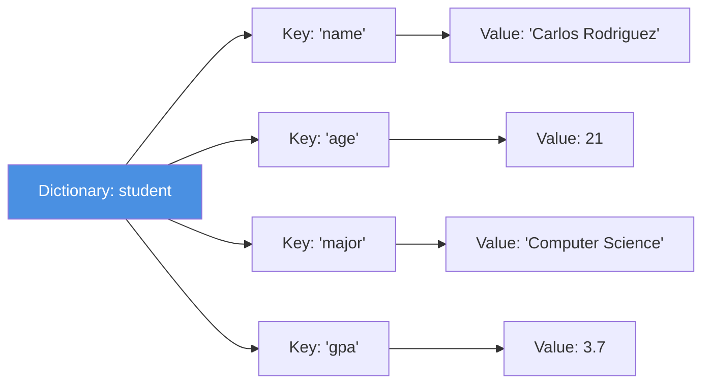
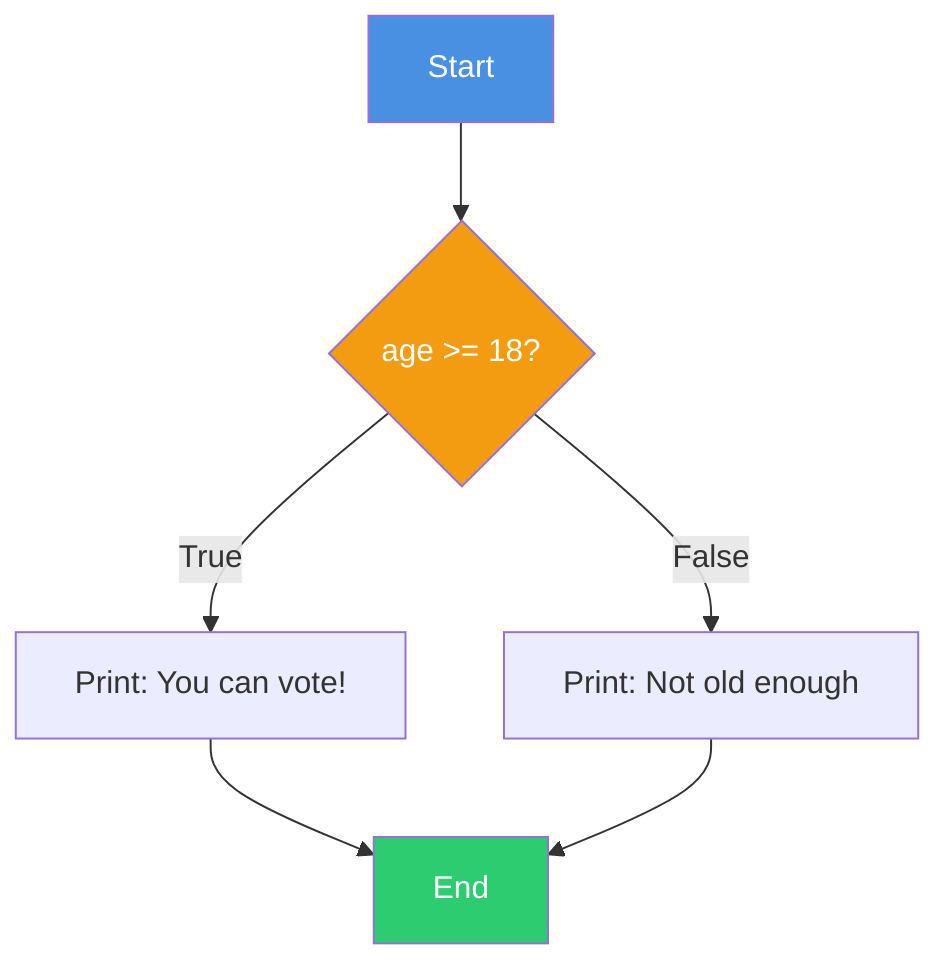
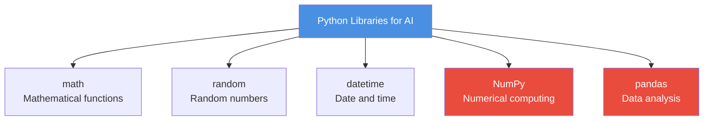
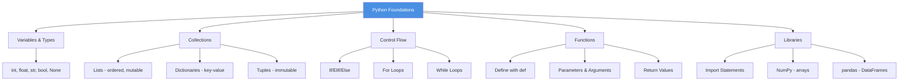

# AI Thinking: A Hands-On Introduction to Artificial Intelligence

# Chapter 3: Python Foundations for AI

---

## The Code That Almost Ruined Abuela's Birthday

Carlos had a problem. His abuela's 80th birthday party was in two weeks, and he'd volunteered to handle the budget. With 50 family members coming to the community center in Hialeah, he needed to track contributions, calculate food costs, and make sure they didn't overspend.

He started with a notebook and pen, writing down who promised what:
- Tía Maria: $50 for decorations
- Uncle Roberto: $100 for the DJ
- Mom: $200 for food
- Various cousins: $5-$20 each

But then people started changing their contributions. His cousin Sofia could only give $10 instead of $20. The DJ raised his price to $150. Tía Maria found cheaper decorations and only needed $35.

Carlos was drowning in crossed-out numbers and margin notes. "There has to be a better way," he muttered.

His roommate, a computer science major, looked over his shoulder. "Dude, write a Python script."

"I don't know Python," Carlos protested.

"You know enough," his roommate said. "Variables, lists, some basic math. That's all you need."

Twenty minutes later, Carlos had written his first real program:

```python
# Abuela's Birthday Budget Tracker
total_collected = 0
contributions = []

# Add each contribution
contributions.append(("Tía Maria", 35))
contributions.append(("Uncle Roberto", 100))
contributions.append(("Mom", 200))
# ... and so on

# Calculate total
for name, amount in contributions:
    total_collected += amount
    
expenses = {
    "food": 250,
    "dj": 150,
    "decorations": 35,
    "cake": 60
}

total_expenses = sum(expenses.values())
remaining = total_collected - total_expenses

print(f"Total collected: ${total_collected}")
print(f"Total expenses: ${total_expenses}")
print(f"Remaining budget: ${remaining}")

if remaining >= 50:
    print("We have room for extra decorations!")
elif remaining >= 0:
    print("Budget is tight but we're good!")
else:
    print(f"Need to collect ${-remaining} more!")
```

When Sofia changed her contribution, Carlos just updated one line. When the DJ's price changed, he edited one number. No erasing, no recalculating everything manually.

The party was a success. And Carlos? He realized something important: programming isn't just for computer scientists. It's a tool for solving real problems—budgets, schedules, data analysis, anything that involves patterns and logic.

This chapter teaches you the Python fundamentals that power AI systems. But more than that, it teaches you to think like a programmer: breaking problems into steps, storing information efficiently, and automating repetitive tasks.

Let's build that foundation.

---

## Learning Objectives

By the end of this chapter, you will be able to:

1. **Write** Python code using variables, data types, and operators
2. **Create and manipulate** lists, dictionaries, and other data structures
3. **Implement** control flow using conditional statements and loops
4. **Define and call** functions with parameters and return values
5. **Import and use** external Python libraries

---

## Why This Chapter Matters

You might wonder: "Why spend a whole chapter on basic Python? I thought this was an AI course!"

Here's why: **AI is built on code**. Every machine learning model, every data analysis, every automation you create requires solid programming fundamentals. You can't train a neural network if you don't understand lists. You can't clean data if you can't write loops. You can't build AI tools if you can't create functions.

Think of this chapter like learning to drive before you can race. Yes, the exciting stuff comes later—but you need to master the basics first. The good news? Python is designed to be readable and intuitive. If you can think logically, you can code in Python.

By the end of this chapter, you'll be able to:
- Automate repetitive tasks (like Carlos's budget tracker)
- Process and analyze data efficiently
- Write reusable code that solves real problems
- Understand the foundations that make AI possible

Let's start at the very beginning: storing information.

---

## 3.1 Variables and Data Types: Storing Information

### What Are Variables?

A **variable** is a named container that stores a value. Think of it like a labeled box where you keep information you want to use later.

In everyday life, you use variables constantly:
- Your bank account balance (a number that changes)
- Your name (text that stays the same)
- Whether you've eaten lunch yet (true or false)

In Python, variables work the same way:

```python
account_balance = 1500.50
student_name = "Carlos Rodriguez"
has_eaten_lunch = False
```

### Creating Variables: The Assignment Operator

The `=` symbol in Python doesn't mean "equals" like in math. It means "assign" or "store."

```python
age = 21  # Store the number 21 in a variable called age
```

Read this as: "age gets the value 21" or "assign 21 to age."

**The Three Steps of Assignment:**
1. Python evaluates the right side (the value)
2. Python creates or updates the variable on the left
3. Python stores the value in that variable

```python
# Right side is evaluated first
score = 85 + 15  # Calculates 100, then stores it
print(score)     # Output: 100
```

💡 **Key Insight**: Variables can change! That's why they're called "variables" not "constants."

```python
temperature = 75  # Morning temperature
print(temperature)  # Output: 75

temperature = 85  # Afternoon gets hotter
print(temperature)  # Output: 85
```

### Variable Naming Rules

**Legal names** (Python allows):
```python
student_name = "Maria"
age2 = 20
_private_data = "hidden"
firstName = "Carlos"
```

**Illegal names** (Python will error):
```python
2nd_place = "Silver"  # Can't start with a number
student-name = "Maria"  # Hyphens not allowed
class = "AI"  # 'class' is a reserved keyword
my name = "Carlos"  # Spaces not allowed
```

**Best Practices** (style conventions):
```python
# Good: descriptive, lowercase with underscores
student_grade = 95
monthly_rent = 1200

# Less good but works: hard to understand
sg = 95
x = 1200

# Bad: not descriptive
data = 95
thing = 1200
```

🔧 **Pro Tip**: Use descriptive names that explain what the variable stores. Your future self (and teammates) will thank you!

### The Five Essential Data Types

Python has several built-in data types. Here are the five you'll use most:

```mermaid
graph TD
    TYPES[Python Data Types] --> INT[Integer<br/>Whole numbers]
    TYPES --> FLOAT[Float<br/>Decimal numbers]
    TYPES --> STR[String<br/>Text]
    TYPES --> BOOL[Boolean<br/>True/False]
    TYPES --> NONE[None<br/>No value]
    
    INT --> INT_EX["42<br/>-17<br/>1000"]
    FLOAT --> FLOAT_EX["3.14<br/>-0.5<br/>98.6"]
    STR --> STR_EX["'Hello'<br/>\"Miami\"<br/>'123'"]
    BOOL --> BOOL_EX["True<br/>False"]
    NONE --> NONE_EX["None"]
    
    style TYPES fill:#4A90E2,color:#fff
    style INT fill:#7B68EE,color:#fff
    style FLOAT fill:#7B68EE,color:#fff
    style STR fill:#7B68EE,color:#fff
    style BOOL fill:#7B68EE,color:#fff
    style NONE fill:#7B68EE,color:#fff
```

**Figure 3.1**: Python's Core Data Types

#### 1. Integers (int)

Whole numbers, positive or negative, with no decimal point:

```python
student_count = 25
temperature = -5  # Negative integers work too
year = 2024
age = 21
```

**Common operations:**
```python
a = 10
b = 3

print(a + b)   # Addition: 13
print(a - b)   # Subtraction: 7
print(a * b)   # Multiplication: 30
print(a / b)   # Division: 3.333... (returns float!)
print(a // b)  # Integer division: 3 (throws away remainder)
print(a % b)   # Modulo (remainder): 1
print(a ** b)  # Exponentiation: 1000 (10^3)
```

#### 2. Floats (float)

Numbers with decimal points:

```python
price = 19.99
temperature = 98.6
average_grade = 87.5
pi = 3.14159
```

**Important:** Division always returns a float, even if the result is a whole number:

```python
result = 10 / 2  # result is 5.0, not 5
```

#### 3. Strings (str)

Text enclosed in quotes (single or double):

```python
name = "Carlos Rodriguez"
city = 'Miami'
message = "It's a beautiful day!"  # Use double quotes for apostrophes
address = '123 Calle Ocho, Miami, FL'
```

**String operations:**
```python
first_name = "Maria"
last_name = "Garcia"

# Concatenation (joining strings)
full_name = first_name + " " + last_name
print(full_name)  # Output: Maria Garcia

# Repetition
laugh = "ja" * 3
print(laugh)  # Output: jajaja

# Length
name_length = len(full_name)
print(name_length)  # Output: 12

# Accessing characters (indexing)
first_letter = full_name[0]  # M (Python starts counting at 0!)
print(first_letter)

# Slicing (getting substrings)
first_word = full_name[0:5]  # Maria
print(first_word)
```

**String methods** (functions that work on strings):
```python
message = "hello miami"

print(message.upper())      # HELLO MIAMI
print(message.capitalize()) # Hello miami
print(message.title())      # Hello Miami
print(message.replace("miami", "world"))  # hello world
```

#### 4. Booleans (bool)

True or False values (note the capital letters!):

```python
is_student = True
has_graduated = False
is_raining = False
passed_exam = True
```

Booleans often come from comparisons:

```python
age = 21
is_adult = age >= 18  # True
is_teenager = age < 20  # False

temperature = 85
is_hot = temperature > 80  # True
```

**Comparison operators:**
```python
5 == 5   # True (equal to)
5 != 3   # True (not equal to)
5 > 3    # True (greater than)
5 < 3    # False (less than)
5 >= 5   # True (greater than or equal)
5 <= 3   # False (less than or equal)
```

⚠️ **Common Mistake**: `=` assigns, `==` compares!

```python
x = 5      # Assignment: x gets 5
x == 5     # Comparison: is x equal to 5? (returns True)
```

#### 5. None

Represents "no value" or "nothing":

```python
result = None  # Variable exists but has no value yet
middle_name = None  # Some people don't have middle names
```

### Checking Data Types

Use `type()` to see what type a variable is:

```python
age = 25
price = 19.99
name = "Carlos"
is_student = True

print(type(age))        # <class 'int'>
print(type(price))      # <class 'float'>
print(type(name))       # <class 'str'>
print(type(is_student)) # <class 'bool'>
```

### Type Conversion

Sometimes you need to convert between types:

```python
# String to integer
age_text = "25"
age_number = int(age_text)  # 25 (integer)

# Integer to string
score = 95
score_text = str(score)  # "95" (string)

# String to float
price_text = "19.99"
price_number = float(price_text)  # 19.99 (float)

# Integer to float
whole_number = 10
decimal_number = float(whole_number)  # 10.0

# Float to integer (drops decimal!)
exact_price = 19.99
rounded_down = int(exact_price)  # 19 (not 20!)
```

⚠️ **Common Pitfall**: Converting float to int doesn't round—it truncates (cuts off the decimal):

```python
print(int(3.9))  # 3, not 4!
print(int(3.1))  # 3
```

To actually round, use `round()`:

```python
print(round(3.9))  # 4
print(round(3.1))  # 3
print(round(3.5))  # 4
```

### A Miami Example: Calculating Your Age in Days

```python
# Calculate how many days you've been alive

name = "Carlos"
age_in_years = 21

days_per_year = 365.25  # .25 accounts for leap years
age_in_days = age_in_years * days_per_year

print(f"{name} has been alive for approximately {int(age_in_days)} days!")

# Output: Carlos has been alive for approximately 7670 days!
```

---

## 3.2 Collections: Lists, Dictionaries, and Tuples

Variables are great for storing single values, but what if you need to store many related items? That's where **collections** come in.

### Lists: Ordered Collections

A **list** is an ordered collection of items enclosed in square brackets `[]`:

```python
# List of strings
family_members = ["Carlos", "Maria", "Roberto", "Sofia"]

# List of numbers
temperatures = [75, 82, 79, 85, 88]

# Mixed types (works but not common)
mixed = [25, "Carlos", True, 3.14]

# Empty list
shopping_list = []
```

#### Accessing List Items

Lists are **indexed** starting at 0:

```python
fruits = ["mango", "papaya", "guava", "maracuyá"]

print(fruits[0])  # mango (first item)
print(fruits[1])  # papaya (second item)
print(fruits[3])  # maracuyá (fourth item)
print(fruits[-1]) # maracuyá (last item!)
print(fruits[-2]) # guava (second to last)
```

**Visual representation:**

```
Index:     0        1        2         3
         [mango, papaya, guava, maracuyá]
Index:    -4       -3       -2        -1
```

#### Modifying Lists

```python
menu = ["empanada", "tostones", "croquetas"]

# Change an item
menu[1] = "maduros"  # Replace tostones with maduros
print(menu)  # ['empanada', 'maduros', 'croquetas']

# Add to end
menu.append("pastelitos")
print(menu)  # ['empanada', 'maduros', 'croquetas', 'pastelitos']

# Insert at specific position
menu.insert(0, "café")  # Add café at the beginning
print(menu)  # ['café', 'empanada', 'maduros', 'croquetas', 'pastelitos']

# Remove item
menu.remove("maduros")  # Remove maduros
print(menu)  # ['café', 'empanada', 'croquetas', 'pastelitos']

# Remove by index
removed_item = menu.pop(0)  # Remove first item, returns it
print(removed_item)  # café
print(menu)  # ['empanada', 'croquetas', 'pastelitos']
```

#### Useful List Operations

```python
prices = [5.99, 12.50, 8.00, 15.99, 6.50]

# Length
count = len(prices)  # 5

# Sum
total = sum(prices)  # 48.98

# Min and Max
cheapest = min(prices)  # 5.99
most_expensive = max(prices)  # 15.99

# Average (not built-in, but easy)
average = sum(prices) / len(prices)  # 9.796

# Sorting
prices.sort()  # Sorts in place (modifies the list)
print(prices)  # [5.99, 6.50, 8.00, 12.50, 15.99]

# Check if item exists
has_budget_option = 6.50 in prices  # True
has_expensive_item = 20.00 in prices  # False
```

#### List Slicing

Get a portion of a list:

```python
days = ["Monday", "Tuesday", "Wednesday", "Thursday", "Friday", "Saturday", "Sunday"]

weekdays = days[0:5]  # First 5 items
print(weekdays)  # ['Monday', 'Tuesday', 'Wednesday', 'Thursday', 'Friday']

weekend = days[5:7]  # Items 5 and 6
print(weekend)  # ['Saturday', 'Sunday']

# Shortcuts
first_three = days[:3]  # Same as days[0:3]
last_three = days[-3:]  # Last 3 items
```

### Dictionaries: Key-Value Pairs

A **dictionary** stores data as key-value pairs, like a real dictionary stores words and definitions:

```python
# Creating a dictionary
student = {
    "name": "Carlos Rodriguez",
    "age": 21,
    "major": "Computer Science",
    "gpa": 3.7,
    "is_enrolled": True
}
```



**Figure 3.2**: Dictionary Structure - Each key points to a value

#### Accessing Dictionary Values

```python
student = {
    "name": "Maria Garcia",
    "age": 20,
    "city": "Miami"
}

# Access by key
print(student["name"])  # Maria Garcia
print(student["age"])   # 20

# Safer access (doesn't error if key missing)
major = student.get("major", "Undeclared")  # Returns "Undeclared" if key doesn't exist
print(major)  # Undeclared
```

#### Modifying Dictionaries

```python
student = {"name": "Carlos", "age": 21}

# Add new key-value pair
student["major"] = "Computer Science"

# Update existing value
student["age"] = 22

# Remove a key-value pair
del student["age"]

print(student)  # {'name': 'Carlos', 'major': 'Computer Science'}
```

#### Looping Through Dictionaries

```python
menu_prices = {
    "café cubano": 1.50,
    "cortadito": 2.00,
    "croqueta": 1.00,
    "pastelito": 1.50
}

# Loop through keys
for item in menu_prices:
    print(item)
# Output: café cubano, cortadito, croqueta, pastelito

# Loop through values
for price in menu_prices.values():
    print(f"${price}")

# Loop through both
for item, price in menu_prices.items():
    print(f"{item}: ${price}")
```

### Tuples: Immutable Lists

A **tuple** is like a list, but you can't change it after creation (immutable):

```python
# Creating tuples
coordinates = (25.7617, -80.1918)  # Miami's latitude and longitude
rgb_color = (255, 0, 128)
single_item = (42,)  # Note the comma!

# Accessing items (same as lists)
lat = coordinates[0]  # 25.7617
lon = coordinates[1]  # -80.1918

# Cannot modify!
# coordinates[0] = 30  # This will ERROR!
```

**When to use tuples:**
- Data that shouldn't change (coordinates, RGB colors, dates)
- Slightly faster than lists
- Can be used as dictionary keys (lists cannot)

```python
# Tuples as dictionary keys
locations = {
    (25.7617, -80.1918): "Miami",
    (40.7128, -74.0060): "New York",
    (34.0522, -118.2437): "Los Angeles"
}
```

---

## 3.3 Making Decisions: Conditional Statements

Programs need to make decisions based on conditions. That's where **if statements** come in.

### The Basic If Statement

```python
temperature = 85

if temperature > 80:
    print("It's hot outside!")
    print("Drink plenty of water!")
```

**Structure:**
- `if` keyword
- Condition (evaluates to True or False)
- Colon `:`
- Indented block (runs only if condition is True)

💡 **Key Insight**: **Indentation matters in Python!** It defines which code belongs to the if block.

### If-Else: Two Paths

```python
age = 17

if age >= 18:
    print("You can vote!")
else:
    print("You're not old enough to vote yet.")
```



**Figure 3.3**: If-Else Decision Flow

### If-Elif-Else: Multiple Paths

```python
grade = 85

if grade >= 90:
    letter = "A"
elif grade >= 80:
    letter = "B"
elif grade >= 70:
    letter = "C"
elif grade >= 60:
    letter = "D"
else:
    letter = "F"

print(f"Your grade: {letter}")
```

**How it works:**
1. Check first condition
2. If True, run that block and skip the rest
3. If False, check next elif
4. Continue until one is True or reach else
5. Only ONE block runs (the first True condition)

### Comparison Operators

```python
x = 10
y = 5

x == y   # Equal to: False
x != y   # Not equal to: True
x > y    # Greater than: True
x < y    # Less than: False
x >= y   # Greater than or equal: True
x <= y   # Less than or equal: False
```

### Logical Operators

Combine multiple conditions:

```python
age = 20
has_id = True

# AND: both must be True
if age >= 18 and has_id:
    print("You can enter the club")

# OR: at least one must be True
day = "Saturday"
if day == "Saturday" or day == "Sunday":
    print("It's the weekend!")

# NOT: reverses True/False
is_raining = False
if not is_raining:
    print("Go to the beach!")
```

**Truth tables:**

| A | B | A and B | A or B |
|---|---|---------|--------|
| True | True | True | True |
| True | False | False | True |
| False | True | False | True |
| False | False | False | False |

### Nested If Statements

If statements inside if statements:

```python
temperature = 88
is_sunny = True

if temperature > 85:
    if is_sunny:
        print("Hot and sunny - perfect beach day!")
    else:
        print("Hot but cloudy")
else:
    print("Nice temperature")
```

### Practical Example: Restaurant Bill Calculator

```python
bill = 45.50
service_quality = "excellent"

# Calculate tip based on service
if service_quality == "excellent":
    tip_percent = 0.20  # 20%
elif service_quality == "good":
    tip_percent = 0.15  # 15%
else:
    tip_percent = 0.10  # 10%

tip_amount = bill * tip_percent
total = bill + tip_amount

print(f"Bill: ${bill:.2f}")
print(f"Tip ({tip_percent*100:.0f}%): ${tip_amount:.2f}")
print(f"Total: ${total:.2f}")
```

---

## 3.4 Repetition: Loops and Iteration

**Loops** let you repeat code multiple times without writing it over and over.

### For Loops: Iterate Over Sequences

Use `for` loops when you know how many times to repeat or need to go through a collection:

```python
# Loop through a list
fruits = ["mango", "papaya", "guava"]

for fruit in fruits:
    print(f"I love {fruit}!")

# Output:
# I love mango!
# I love papaya!
# I love guava!
```

#### The Range Function

`range()` generates a sequence of numbers:

```python
# range(stop) - from 0 to stop-1
for i in range(5):
    print(i)
# Output: 0, 1, 2, 3, 4

# range(start, stop)
for i in range(1, 6):
    print(i)
# Output: 1, 2, 3, 4, 5

# range(start, stop, step)
for i in range(0, 10, 2):
    print(i)
# Output: 0, 2, 4, 6, 8
```

#### Practical For Loop Examples

**Example 1: Calculate total**
```python
prices = [12.99, 5.50, 8.00, 15.99]
total = 0

for price in prices:
    total += price  # Same as: total = total + price

print(f"Total: ${total:.2f}")  # Total: $42.48
```

**Example 2: Count items matching a condition**
```python
temperatures = [75, 82, 88, 79, 91, 85, 87]
hot_days = 0

for temp in temperatures:
    if temp >= 85:
        hot_days += 1

print(f"Hot days (85°+): {hot_days}")  # Hot days (85°+): 4
```

**Example 3: Create a new list**
```python
fahrenheit_temps = [75, 82, 88, 79]
celsius_temps = []

for f_temp in fahrenheit_temps:
    c_temp = (f_temp - 32) * 5/9
    celsius_temps.append(round(c_temp, 1))

print(celsius_temps)  # [23.9, 27.8, 31.1, 26.1]
```

### While Loops: Repeat While Condition is True

Use `while` loops when you don't know how many iterations you need:

```python
count = 1

while count <= 5:
    print(f"Count: {count}")
    count += 1  # IMPORTANT: must update or loop runs forever!

# Output:
# Count: 1
# Count: 2
# Count: 3
# Count: 4
# Count: 5
```

⚠️ **Common Pitfall**: Infinite loops! Always make sure your condition eventually becomes False.

```python
# INFINITE LOOP - DON'T RUN THIS!
count = 1
while count <= 5:
    print(count)
    # Forgot to increment count - loops forever!
```

#### Practical While Loop Example

```python
# Keep asking for valid input
age = -1  # Start with invalid value

while age < 0 or age > 120:
    age = int(input("Enter your age: "))
    if age < 0 or age > 120:
        print("Invalid age. Try again.")

print(f"You are {age} years old.")
```

### Loop Control: Break and Continue

**Break**: Exit the loop immediately

```python
# Find first number divisible by 7
for number in range(1, 100):
    if number % 7 == 0:
        print(f"First multiple of 7: {number}")
        break  # Stop looping
# Output: First multiple of 7: 7
```

**Continue**: Skip to next iteration

```python
# Print only odd numbers
for number in range(1, 11):
    if number % 2 == 0:
        continue  # Skip even numbers
    print(number)

# Output: 1, 3, 5, 7, 9
```

### Nested Loops

Loops inside loops:

```python
# Multiplication table
for i in range(1, 4):
    for j in range(1, 4):
        result = i * j
        print(f"{i} × {j} = {result}")
    print()  # Blank line after each row

# Output:
# 1 × 1 = 1
# 1 × 2 = 2
# 1 × 3 = 3
#
# 2 × 1 = 2
# 2 × 2 = 4
# 2 × 3 = 6
# ...
```

### Loop Patterns You'll Use Often

**Pattern 1: Accumulator**
```python
total = 0
for number in [5, 10, 15, 20]:
    total += number
```

**Pattern 2: Counter**
```python
count = 0
for item in shopping_cart:
    if item.price > 10:
        count += 1
```

**Pattern 3: Build a list**
```python
results = []
for value in data:
    processed = value * 2
    results.append(processed)
```

**Pattern 4: Find item**
```python
found = False
for student in students:
    if student.name == "Carlos":
        found = True
        break
```

---

## 3.5 Functions: Reusable Code Blocks

**Functions** are reusable blocks of code that perform specific tasks. Think of them like recipes—once defined, you can use them again and again.

### Why Functions?

Imagine you need to calculate sales tax multiple times in your program:

```python
# Without functions - repetitive!
price1 = 10.00
tax1 = price1 * 0.07
total1 = price1 + tax1

price2 = 25.50
tax2 = price2 * 0.07
total2 = price2 + tax2

price3 = 5.99
tax3 = price3 * 0.07
total3 = price3 + tax3
```

With a function:

```python
def calculate_total(price):
    tax = price * 0.07
    total = price + tax
    return total

total1 = calculate_total(10.00)
total2 = calculate_total(25.50)
total3 = calculate_total(5.99)
```

Much cleaner!

### Defining Functions

**Basic syntax:**

```python
def function_name(parameters):
    # Code to execute
    return result
```

**Example:**

```python
def greet(name):
    message = f"¡Hola, {name}!"
    return message

# Call the function
greeting = greet("Carlos")
print(greeting)  # ¡Hola, Carlos!
```

### Parameters and Arguments

**Parameters** are variables in the function definition
**Arguments** are the actual values you pass when calling

```python
def add_numbers(a, b):  # a and b are parameters
    return a + b

result = add_numbers(5, 3)  # 5 and 3 are arguments
print(result)  # 8
```

#### Multiple Parameters

```python
def calculate_bmi(weight_kg, height_m):
    bmi = weight_kg / (height_m ** 2)
    return round(bmi, 1)

# Carlos is 75kg and 1.75m tall
carlos_bmi = calculate_bmi(75, 1.75)
print(f"BMI: {carlos_bmi}")  # BMI: 24.5
```

#### Default Parameters

```python
def greet(name, greeting="Hello"):
    return f"{greeting}, {name}!"

print(greet("Carlos"))  # Hello, Carlos!
print(greet("Maria", "¡Hola"))  # ¡Hola, Maria!
```

### Return Values

Functions can return values using `return`:

```python
def multiply(a, b):
    return a * b

result = multiply(5, 4)
print(result)  # 20
```

**Multiple return values** (returns a tuple):

```python
def get_min_max(numbers):
    return min(numbers), max(numbers)

temperatures = [75, 82, 79, 88, 85]
lowest, highest = get_min_max(temperatures)

print(f"Low: {lowest}, High: {highest}")  # Low: 75, High: 88
```

**No return = None:**

```python
def print_message(text):
    print(text)
    # No return statement

result = print_message("Hello")
print(result)  # None
```

### Function Examples

**Example 1: Temperature Converter**

```python
def fahrenheit_to_celsius(f_temp):
    """Convert Fahrenheit to Celsius"""
    c_temp = (f_temp - 32) * 5/9
    return round(c_temp, 1)

def celsius_to_fahrenheit(c_temp):
    """Convert Celsius to Fahrenheit"""
    f_temp = c_temp * 9/5 + 32
    return round(f_temp, 1)

# Use the functions
miami_temp_f = 85
miami_temp_c = fahrenheit_to_celsius(miami_temp_f)
print(f"{miami_temp_f}°F = {miami_temp_c}°C")  # 85°F = 29.4°C
```

**Example 2: Grade Calculator**

```python
def calculate_letter_grade(score):
    """Convert numeric score to letter grade"""
    if score >= 90:
        return "A"
    elif score >= 80:
        return "B"
    elif score >= 70:
        return "C"
    elif score >= 60:
        return "D"
    else:
        return "F"

def is_passing(score):
    """Check if score is passing (60 or higher)"""
    return score >= 60

# Use the functions
student_score = 85
letter = calculate_letter_grade(student_score)
passing = is_passing(student_score)

print(f"Score: {student_score}")
print(f"Grade: {letter}")
print(f"Passing: {passing}")
```

**Example 3: Miami Beach Budget Splitter**

```python
def split_bill(total, num_people, tip_percent=0.18):
    """
    Calculate how much each person pays including tip
    
    Parameters:
    total: bill amount before tip
    num_people: number of people splitting the bill
    tip_percent: tip percentage (default 18%)
    
    Returns:
    amount each person owes
    """
    tip = total * tip_percent
    total_with_tip = total + tip
    per_person = total_with_tip / num_people
    return round(per_person, 2)

# Dinner at a restaurant in South Beach
bill = 120.00
people = 4

each_pays = split_bill(bill, people)
print(f"Each person pays: ${each_pays}")  # Each person pays: $35.40

# With custom tip
each_pays_20 = split_bill(bill, people, 0.20)
print(f"With 20% tip: ${each_pays_20}")  # With 20% tip: $36.00
```

### Docstrings: Documenting Functions

Use **docstrings** (triple quotes) to explain what your function does:

```python
def calculate_area(length, width):
    """
    Calculate the area of a rectangle.
    
    Parameters:
    length (float): The length of the rectangle
    width (float): The width of the rectangle
    
    Returns:
    float: The area (length × width)
    """
    return length * width
```

Access the docstring:

```python
print(calculate_area.__doc__)
```

---

## 3.6 Libraries: Standing on the Shoulders of Giants

Python's real power comes from **libraries**—collections of pre-written code you can use in your programs.

### Why Use Libraries?

Instead of writing code from scratch, use tested, optimized solutions:

```python
# Without a library: calculate square root manually (complex!)
def sqrt(number):
    # ... many lines of complex math ...
    
# With a library: one line!
import math
result = math.sqrt(16)  # 4.0
```

### Importing Libraries

**Method 1: Import entire library**

```python
import math

result = math.sqrt(25)  # 5.0
pi = math.pi  # 3.14159...
```

**Method 2: Import specific functions**

```python
from math import sqrt, pi

result = sqrt(25)  # No need for math. prefix
circle_area = pi * (5 ** 2)
```

**Method 3: Import with alias**

```python
import numpy as np  # Common convention

arr = np.array([1, 2, 3, 4, 5])
```

### Essential Python Libraries



**Figure 3.4**: Common Python Libraries - NumPy and pandas are essential for AI

### Built-in: math

```python
import math

# Common functions
print(math.sqrt(16))      # 4.0 (square root)
print(math.ceil(4.2))     # 5 (round up)
print(math.floor(4.8))    # 4 (round down)
print(math.pow(2, 3))     # 8.0 (2^3)

# Constants
print(math.pi)            # 3.14159...
print(math.e)             # 2.71828...

# Trigonometry
print(math.sin(math.pi/2))  # 1.0
```

### Built-in: random

```python
import random

# Random integer
dice_roll = random.randint(1, 6)  # 1-6 inclusive

# Random float (0.0 to 1.0)
probability = random.random()

# Random choice from list
fruits = ["mango", "papaya", "guava"]
selected = random.choice(fruits)

# Shuffle list
cards = ["A", "K", "Q", "J"]
random.shuffle(cards)
print(cards)  # Random order
```

### Introduction to NumPy

**NumPy** (Numerical Python) is the foundation of data science in Python:

```python
import numpy as np

# Create arrays (like lists, but faster for math)
temperatures = np.array([75, 82, 79, 88, 85])

# Array operations
print(temperatures.mean())  # 81.8 (average)
print(temperatures.std())   # 4.76 (standard deviation)
print(temperatures.max())   # 88
print(temperatures.min())   # 75

# Math on entire array at once!
celsius = (temperatures - 32) * 5/9
print(celsius)
```

**Why NumPy?**
- **Fast**: Optimized for numerical operations
- **Convenient**: Operations on entire arrays
- **Foundation**: Used by pandas, scikit-learn, TensorFlow

### Introduction to pandas

**pandas** is the go-to library for working with tabular data (like spreadsheets):

```python
import pandas as pd

# Create a DataFrame (like a table)
data = {
    'name': ['Carlos', 'Maria', 'Sofia', 'Roberto'],
    'age': [21, 20, 22, 19],
    'grade': [85, 92, 88, 79]
}

df = pd.DataFrame(data)
print(df)

#      name  age  grade
# 0  Carlos   21     85
# 1   Maria   20     92
# 2   Sofia   22     88
# 3 Roberto   19     79

# Calculate statistics
print(df['grade'].mean())  # 86.0
print(df['age'].max())     # 22

# Filter data
honor_students = df[df['grade'] >= 85]
print(honor_students)
```

We'll explore pandas much more deeply in Chapter 4!

### Installing Libraries

Most libraries need to be installed first:

```python
# In Google Colab (already installed):
import numpy
import pandas

# In local Python, use pip:
# pip install numpy pandas
```

---

## Chapter Summary

You've covered a LOT of ground in this chapter! Let's consolidate the key concepts.

### Key Takeaways

- **Variables** store values using the assignment operator (`=`). Choose descriptive names that explain what they hold.

- **Data types** include integers, floats, strings, booleans, and None. Use `type()` to check types and conversion functions (`int()`, `float()`, `str()`) to convert between them.

- **Lists** store ordered collections of items. Access items by index (starting at 0), modify with methods like `.append()`, `.remove()`, and `.pop()`.

- **Dictionaries** store key-value pairs, like a real dictionary. Perfect for structured data where each piece has a label.

- **If statements** let programs make decisions. Use `if`, `elif`, and `else` with comparison operators (`==`, `!=`, `>`, `<`) and logical operators (`and`, `or`, `not`).

- **For loops** repeat code for each item in a collection or range. **While loops** repeat while a condition is true. Use `break` to exit early and `continue` to skip iterations.

- **Functions** make code reusable. Define with `def`, use parameters to pass data in, and `return` to send data back. Document with docstrings.

- **Libraries** provide pre-written code. `import` to use them. Key libraries: `math`, `random`, `numpy` (numerical computing), `pandas` (data analysis).

### Concept Map



**Figure 3.5**: Chapter 3 Concept Map - Everything connects!

### Vocabulary Review

- **Variable**: Named storage for a value
- **Data Type**: Category of data (int, float, str, bool)
- **List**: Ordered, mutable collection enclosed in `[]`
- **Dictionary**: Key-value pairs enclosed in `{}`
- **Tuple**: Immutable sequence enclosed in `()`
- **Index**: Position of an item (starting at 0)
- **Condition**: Expression that evaluates to True or False
- **Loop**: Code that repeats multiple times
- **Iteration**: One pass through a loop
- **Function**: Reusable block of code with a name
- **Parameter**: Variable in function definition
- **Argument**: Actual value passed to function
- **Return Value**: Data sent back from a function
- **Library**: Collection of pre-written code
- **Import**: Keyword to use a library
- **Array**: NumPy's version of a list (faster for math)
- **DataFrame**: pandas table-like structure

---

## What's Next: Your Path Forward

In **Chapter 4: Data Preparation and Analysis with Pandas**, we'll build on these Python foundations to work with real datasets. You'll learn:

- Loading data from CSV files and other sources
- Cleaning messy data (missing values, duplicates, errors)
- Transforming data for analysis
- Calculating statistics and aggregations
- Visualizing data to find patterns

Here's a teaser: Remember Carlos's budget tracker from the opening story? What if instead of 5 family members, you had 500 data points? What if the data came from a spreadsheet with missing values and typos? That's where pandas comes in—and you already know the Python fundamentals you need to use it!

---

## Practice & Application

### Self-Check Questions

1. **What's wrong with this variable name: `2nd_place = "Silver"`**
   - A) Nothing, it's valid
   - B) Can't start with a number
   - C) Should use camelCase
   - D) "Silver" should not have quotes

2. **What does this code output: `print(5 // 2)`**
   - A) 2.5
   - B) 2
   - C) 3
   - D) Error

3. **What type is this value: `True`**
   - A) string
   - B) integer
   - C) boolean
   - D) None

4. **How do you access the first item in list `fruits`?**
   - A) `fruits[1]`
   - B) `fruits[0]`
   - C) `fruits.first()`
   - D) `fruits{0}`

5. **What's the output? `x = 5; x = x + 1; print(x)`**
   - A) 5
   - B) 6
   - C) 11
   - D) Error

*(Answers: 1-B, 2-B, 3-C, 4-B, 5-B)*

### Coding Challenges

**Challenge 1: Temperature Analyzer**
```python
# Write a function that takes a list of temperatures
# and returns a dictionary with min, max, and average

def analyze_temps(temperatures):
    # Your code here
    pass

# Test it
miami_week = [75, 82, 79, 88, 85, 81, 77]
result = analyze_temps(miami_week)
print(result)
# Should output: {'min': 75, 'max': 88, 'avg': 81.0}
```

**Challenge 2: Grade Categorizer**
```python
# Write a function that takes a list of student grades
# and returns a dictionary counting how many A's, B's, C's, etc.

def categorize_grades(grades):
    # Your code here
    pass

# Test it
class_grades = [85, 92, 78, 88, 95, 73, 65, 90]
result = categorize_grades(class_grades)
print(result)
# Should output: {'A': 3, 'B': 3, 'C': 1, 'D': 1}
```

**Challenge 3: List Cleaner**
```python
# Write a function that removes duplicates from a list
# and returns the unique items sorted

def clean_list(items):
    # Your code here
    pass

# Test it
messy = [5, 2, 8, 2, 9, 5, 1, 8]
clean = clean_list(messy)
print(clean)
# Should output: [1, 2, 5, 8, 9]
```

---

## Guided Project: Personal Finance Calculator

**Objective**: Build a Python program that helps manage personal finances by tracking income, expenses, and calculating savings.

**Time Required**: 60-90 minutes

**Skills Practiced**: Variables, dictionaries, functions, conditionals, loops, user input

### Project Specifications

Create a program that:
1. Accepts monthly income
2. Tracks expenses by category (rent, food, transport, entertainment, etc.)
3. Calculates total expenses
4. Determines savings (income - expenses)
5. Calculates savings rate (savings / income)
6. Provides financial feedback based on savings rate

### Starter Code

```python
def get_monthly_income():
    """Prompt user for monthly income"""
    income = float(input("Enter your monthly income: $"))
    return income

def get_expenses():
    """Collect expenses by category"""
    expenses = {}
    
    categories = ["rent", "food", "transportation", "utilities", 
                  "entertainment", "other"]
    
    print("\nEnter expenses for each category:")
    for category in categories:
        amount = float(input(f"  {category.capitalize()}: $"))
        expenses[category] = amount
    
    return expenses

def calculate_totals(income, expenses):
    """Calculate total expenses, savings, and savings rate"""
    # TODO: Calculate total expenses
    # TODO: Calculate savings (income - expenses)
    # TODO: Calculate savings rate (savings / income * 100)
    # TODO: Return all three values
    pass

def provide_feedback(savings_rate):
    """Give financial advice based on savings rate"""
    # TODO: Use if/elif/else to provide feedback
    # Excellent: >= 20%
    # Good: >= 10%
    # Needs improvement: < 10%
    pass

def main():
    """Main program flow"""
    print("=== Personal Finance Calculator ===\n")
    
    # Get income
    income = get_monthly_income()
    
    # Get expenses
    expenses = get_expenses()
    
    # Calculate totals
    total_expenses, savings, savings_rate = calculate_totals(income, expenses)
    
    # Display results
    print("\n=== Financial Summary ===")
    print(f"Monthly Income: ${income:.2f}")
    print(f"Total Expenses: ${total_expenses:.2f}")
    print(f"Savings: ${savings:.2f}")
    print(f"Savings Rate: {savings_rate:.1f}%")
    
    # Provide feedback
    print("\n=== Financial Advice ===")
    provide_feedback(savings_rate)

# Run the program
main()
```

**See the separate guided project notebook for complete implementation!**

---

## Non-Guided Project: Grade Book Manager

**Objective**: Create a program that manages student grades, calculates averages, assigns letter grades, and identifies students needing support.

**Requirements**:

1. Store student data in a dictionary (name → list of grades)
2. Add new students and grades
3. Calculate each student's average
4. Assign letter grades (A/B/C/D/F)
5. Identify students with average < 70 (need support)
6. Display a formatted grade report

**Minimum Functions Required**:
- `add_student(gradebook, name, grades)`
- `calculate_average(grades)`
- `assign_letter_grade(average)`
- `find_struggling_students(gradebook)`
- `print_grade_report(gradebook)`

**Sample Output**:
```
=== Grade Book Report ===

Carlos Rodriguez
  Grades: [85, 92, 78, 88]
  Average: 85.8
  Letter Grade: B

Maria Garcia
  Grades: [95, 98, 92, 97]
  Average: 95.5
  Letter Grade: A

... (more students) ...

Students Needing Support:
  - Roberto Santos (Average: 65.5)
  - Sofia Martinez (Average: 68.0)
```

**Extension Ideas**:
- Add weighted grades (tests worth more than homework)
- Calculate class average
- Find highest/lowest performing students
- Export results to a text file

---

**You've completed Chapter 3!** You now have the Python foundations needed for AI and data science. These skills—variables, collections, control flow, functions, and libraries—are the building blocks for everything that follows.

In the next chapter, we'll put these skills to work with real data using pandas. Get ready to analyze, clean, and transform datasets!

---

*Word count: ~6,800 words*
*Estimated reading time: 28-32 minutes*
*Estimated completion time with exercises: 2-3 hours*
