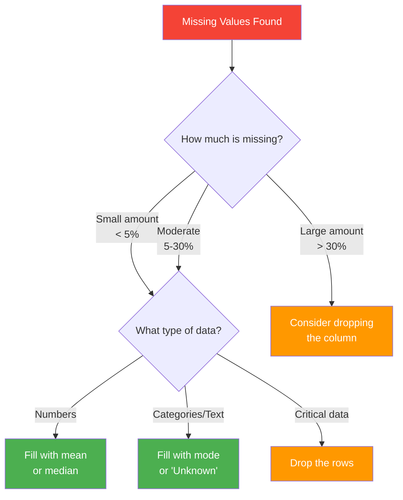
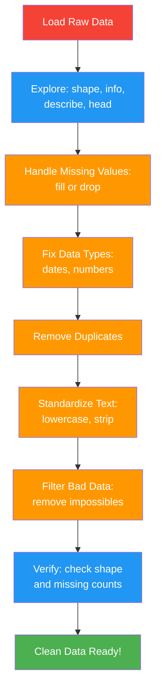
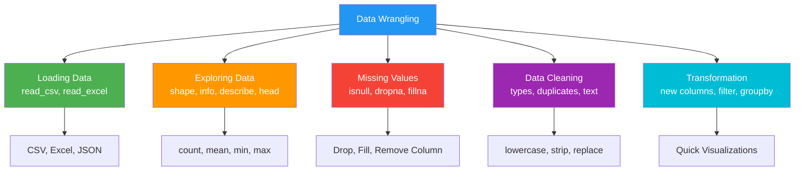

# AI Thinking: A Hands-On Introduction to Artificial Intelligence

# Chapter 4: Data Wrangling and Preparation

---

## The Restaurant That Almost Closed Because of Bad Data

Lucia ran a small Cuban restaurant near Calle Ocho called *Sabor de Casa*. Business was good—regulars loved her ropa vieja, and the lunch crowd from the nearby hospital kept things steady. When a friend suggested she sign up for a food delivery app, Lucia figured more exposure couldn't hurt.

Within a month, hundreds of orders poured in. But something was wrong. Customers were leaving one-star reviews, her food cost was climbing, and she was losing money on nearly every delivery order.

Lucia's nephew, Diego, a data analytics student at Miami Dade College, offered to help. He downloaded six months of order data from the delivery app and opened it in a spreadsheet. What he found was a mess.

Some orders had no customer name—just blank fields. The "delivery address" column mixed formats: some had full addresses, others just said "Brickell" or "downtown." Prices were inconsistent—the same *sandwich cubano* appeared as $8.99, $9.99, and sometimes just "$9" with no cents. A handful of entries listed negative quantities (how do you order -2 empanadas?). And about 15% of orders were missing a timestamp entirely, making it impossible to know when they happened.

"Tía, your data is a disaster," Diego said. "The app is calculating your costs wrong because it's reading bad numbers. The delivery zones are a mess. And you can't even see your busiest times because half the timestamps are missing."

"So what do we do?" Lucia asked.

Diego smiled. "We wrangle it."

Over the next weekend, Diego cleaned and standardized every record. He filled in missing prices using the menu, fixed address formats, removed the impossible negative orders, and estimated missing timestamps based on order patterns. When the clean data finally told its story, the answer was clear: Lucia was undercharging on delivery orders by an average of $2.50, and her busiest delivery window—Friday evenings—was exactly when she was *understaffed*.

Two weeks of adjustments later, Sabor de Casa was profitable again.

---

*Technical Connection*: Lucia's story is the story of nearly every real-world dataset. Raw data is messy—it has gaps, inconsistencies, errors, and formatting problems. **Data wrangling** (also called data cleaning or data preparation) is the process of transforming raw, messy data into clean, usable data. In AI and data science, professionals spend an estimated 60-80% of their time on this step. This chapter teaches you the tools to do it.

---

## Learning Objectives

By the end of this chapter, you will be able to:

1. **Load** datasets into pandas DataFrames from various sources
2. **Explore** data structure, statistics, and quality using pandas methods
3. **Identify and handle** missing values using appropriate strategies
4. **Clean and standardize** data by fixing types, removing duplicates, and correcting errors
5. **Transform** data to prepare it for analysis and visualization

---

## Why This Chapter Matters

Here's a truth that surprises most beginners: the "exciting" part of AI—training models, making predictions, building chatbots—depends almost entirely on the boring part: having clean data.

Think of it this way. Imagine you're making your abuela's famous *arroz con pollo*. You can have the best recipe in the world, the most expensive cookware, and a professional kitchen. But if your rice is old, your chicken is freezer-burned, and you accidentally grabbed sugar instead of salt? The dish is ruined. No amount of cooking skill can fix bad ingredients.

Data is the ingredient. AI models are the recipe. If your data is messy, incomplete, or wrong, your AI will produce garbage results. The phrase in the industry is simple: **garbage in, garbage out.**

This chapter gives you the skills to make sure what goes in is clean, consistent, and ready to use.

📊 **By The Numbers**: According to industry surveys, data scientists spend approximately 60-80% of their project time on data preparation and cleaning. Only 20-40% goes to actual modeling and analysis. Mastering data wrangling isn't just a nice-to-have—it's the majority of the job.

---

## Chapter Roadmap

Here's what we'll cover:


**Figure 4.1**: Chapter 4 Roadmap — We'll move from loading raw data all the way through to clean, transformed data ready for analysis.

---

## 4.1 Pandas Refresher: Your Data Toolkit

In Chapter 3, we briefly introduced pandas as a library for working with tabular data—data organized in rows and columns, like a spreadsheet. Now it's time to go deeper, because pandas is the single most important tool you'll use for data wrangling.

### What Is pandas?

**pandas** is a Python library designed for data manipulation and analysis. The name comes from "panel data," a term from statistics. Think of pandas as a supercharged spreadsheet that lives inside Python—it can do everything Excel can do, plus much more, and it can handle millions of rows without breaking a sweat.

The core object in pandas is the **DataFrame**—a table with labeled rows and columns. If you've ever used a spreadsheet, you already understand the concept.

### Importing pandas

Every time you work with pandas, you start the same way:

```python
# Import pandas with its standard nickname
import pandas as pd
```

The `pd` is a convention—almost everyone uses it. When you see `pd.something()` in code, you know it's a pandas function.

### Creating a DataFrame

Let's start with something familiar. Imagine you're tracking orders at a small cafecito window:

```python
import pandas as pd

# Create a DataFrame from a dictionary
orders = {
    'customer': ['Maria', 'Carlos', 'Sofia', 'Roberto', 'Ana'],
    'drink': ['cortadito', 'café con leche', 'colada', 'cortadito', 'café con leche'],
    'price': [2.50, 3.75, 5.00, 2.50, 3.75],
    'tip': [0.50, 1.00, 0.75, 0.00, 0.50]
}

df = pd.DataFrame(orders)
print(df)

# Expected Output:
#   customer           drink  price   tip
# 0    Maria       cortadito   2.50  0.50
# 1   Carlos  café con leche   3.75  1.00
# 2    Sofia          colada   5.00  0.75
# 3  Roberto       cortadito   2.50  0.00
# 4      Ana  café con leche   3.75  0.50
```

Notice how each **column** represents a different piece of information (customer, drink, price, tip), and each **row** is one order. The numbers on the left (0, 1, 2, 3, 4) are the **index**—pandas automatically numbers each row starting at 0.

### Accessing Data in a DataFrame

There are a few basic ways to grab data from a DataFrame:

```python
# Get a single column (returns a Series)
print(df['price'])

# Expected Output:
# 0    2.50
# 1    3.75
# 2    5.00
# 3    2.50
# 4    3.75
# Name: price, dtype: float64

# Get multiple columns (returns a DataFrame)
print(df[['customer', 'price']])

# Get a single row by position
print(df.iloc[0])  # First row

# Get a single row by index label
print(df.loc[2])   # Row with index 2
```

💡 **Key Insight**: A single column in pandas is called a **Series**. A DataFrame is essentially a collection of Series that share the same index. You'll use both regularly.

### Basic Calculations

pandas makes calculations on columns simple:

```python
# Total revenue
total_sales = df['price'].sum()
print(f"Total sales: ${total_sales:.2f}")
# Total sales: $17.50

# Average price
avg_price = df['price'].mean()
print(f"Average drink price: ${avg_price:.2f}")
# Average drink price: $3.50

# Most expensive order
max_price = df['price'].max()
print(f"Most expensive order: ${max_price:.2f}")
# Most expensive order: $5.00

# Total tips
total_tips = df['tip'].sum()
print(f"Total tips: ${total_tips:.2f}")
# Total tips: $2.75
```

🔧 **Pro Tip**: The most common pandas calculations you'll use are `.sum()`, `.mean()`, `.max()`, `.min()`, and `.count()`. Memorize these five—they cover about 80% of basic data exploration.

---

## 4.2 Loading Data: Getting Data into pandas

In the real world, you rarely type data into Python by hand. Instead, you **load** data from files. The most common format is the CSV file—**Comma-Separated Values**—which is basically a text file where each line is a row and commas separate the columns.

### Loading a CSV File

```python
import pandas as pd

# Load a CSV file into a DataFrame
df = pd.read_csv('restaurant_orders.csv')

# See the first few rows
print(df.head())
```

That's it. One line of code to load potentially thousands of rows of data.

### Loading Data in Google Colab

In Google Colab, you have a few options for loading data:

**Option 1: Upload from your computer**

```python
# This will create an upload button in Colab
from google.colab import files
uploaded = files.upload()

# Then load normally
df = pd.read_csv('your_file.csv')
```

**Option 2: Load from a URL**

```python
# Load directly from a web address
url = 'https://example.com/data/orders.csv'
df = pd.read_csv(url)
```

**Option 3: Load from Google Drive**

```python
# Connect to your Google Drive
from google.colab import drive
drive.mount('/content/drive')

# Load the file
df = pd.read_csv('/content/drive/MyDrive/data/orders.csv')
```

⚠️ **Common Pitfall**: File paths are case-sensitive and must be exact. If your file is called `Orders.csv` (capital O), writing `orders.csv` (lowercase) will give you a "FileNotFoundError." Double-check your filenames!

### What Else Can pandas Load?

While CSV is the most common, pandas can read many file types:

```python
# Excel files
df = pd.read_excel('data.xlsx')

# JSON files (common in web APIs)
df = pd.read_json('data.json')

# From a clipboard (copy-paste from a spreadsheet!)
df = pd.read_clipboard()
```

For this course, we'll primarily work with CSV files—they're simple, universal, and easy to inspect.

---

## 4.3 Exploring Data: Understanding What You Have

**The Kitchen Inspector**

Before a restaurant health inspector starts looking for problems, they walk through the entire kitchen first. They note how big it is, what equipment is present, what's on the counters, and the general state of things. Only *then* do they start checking temperatures and looking for issues.

Data exploration works the same way. Before you start cleaning or analyzing, you need to understand what you're working with. How big is the dataset? What columns does it have? What do the values look like? Are there obvious problems?

---

*Technical Connection*: This "look before you act" approach is called **Exploratory Data Analysis (EDA)**. It's one of the most important habits in data science—always explore your data before making assumptions about it.

---

### The Essential Exploration Commands

Let's say we've loaded a dataset of restaurant orders. Here are the commands you'll use every single time:

```python
import pandas as pd

# Assume we've loaded our data
df = pd.read_csv('miami_restaurant_orders.csv')

# 1. How big is the dataset?
print(df.shape)
# (500, 8)  <-- 500 rows, 8 columns

# 2. What are the column names?
print(df.columns)
# Index(['order_id', 'customer', 'item', 'price', 
#        'quantity', 'date', 'neighborhood', 'rating'])

# 3. What do the first few rows look like?
print(df.head())

# 4. What do the last few rows look like?
print(df.tail())

# 5. What data types are in each column?
print(df.dtypes)
# order_id          int64
# customer         object    <-- "object" means text/string
# item             object
# price           float64
# quantity          int64
# date             object
# neighborhood     object
# rating          float64

# 6. Quick statistical summary
print(df.describe())
```

The `.describe()` method is especially powerful—it gives you a statistical snapshot of every numerical column:

```python
print(df.describe())

# Expected Output:
#          price    quantity    rating
# count   485.00     500.00    472.00    <-- how many non-empty values
# mean     12.35       1.82      3.85    <-- average
# std       5.20       0.95      1.12    <-- spread
# min       3.50       1.00      1.00    <-- smallest
# 25%       8.99       1.00      3.00    <-- lower quarter
# 50%      11.50       2.00      4.00    <-- middle (median)
# 75%      15.00       2.00      5.00    <-- upper quarter
# max      35.00       6.00      5.00    <-- largest
```

Notice something important in that output: the `count` row shows different numbers for different columns—485 for price, 500 for quantity, and 472 for rating. That tells us right away that **some data is missing**. The price column is missing 15 values, and the rating column is missing 28. We'll deal with that soon.

### One More Essential: `.info()`

```python
print(df.info())

# <class 'pandas.core.frame.DataFrame'>
# RangeIndex: 500 entries, 0 to 499
# Data columns (total 8 columns):
#  #   Column        Non-Null Count  Dtype  
# ---  ------        --------------  -----  
#  0   order_id      500 non-null    int64  
#  1   customer      488 non-null    object 
#  2   item          500 non-null    object 
#  3   price         485 non-null    float64
#  4   quantity      500 non-null    int64  
#  5   date          500 non-null    object 
#  6   neighborhood  495 non-null    object 
#  7   rating        472 non-null    float64
# dtypes: float64(2), int64(2), object(4)
```

The `.info()` method is like an X-ray of your DataFrame. It shows you every column, how many non-null (non-empty) values each has, and the data type. This is usually the *first* thing experienced data scientists run on a new dataset.

🤔 **Think About It**: Looking at the `.info()` output above, which column has the most missing data? What might cause that column to have gaps? (Hint: Think about when customers might skip leaving a rating.)

---

## 4.4 Missing Values: The Gaps in Your Data

Missing data is one of the most common problems you'll face. It happens for all kinds of reasons: a customer skips a survey question, a sensor goes offline, a form field isn't required, or data gets lost during transfer.

### Why Missing Values Matter

Think of it like taking attendance in a class. If 3 out of 30 students are absent, you can still get a good picture of the class. But if 15 are absent, your view is incomplete—you might draw the wrong conclusions about the whole group.

The same applies to data. A few missing values? Usually manageable. A lot? You have a problem that needs careful attention.

### Detecting Missing Values

pandas represents missing values as `NaN` (Not a Number). Here's how to find them:

```python
# Check for missing values in each column
print(df.isnull().sum())

# Expected Output:
# order_id          0
# customer         12
# item              0
# price            15
# quantity          0
# date              0
# neighborhood      5
# rating           28
# dtype: int64
```

This tells you exactly how many values are missing in each column. The `rating` column has the most gaps (28), which makes sense—not every customer leaves a rating.

You can also see the percentage of missing values, which is more meaningful for large datasets:

```python
# Percentage of missing values
missing_pct = (df.isnull().sum() / len(df)) * 100
print(missing_pct.round(1))

# Expected Output:
# order_id         0.0
# customer         2.4
# item             0.0
# price            3.0
# quantity         0.0
# date             0.0
# neighborhood     1.0
# rating           5.6
# dtype: float64
```

Now you can see that the `rating` column is missing 5.6% of its values. That's pretty manageable. If a column were missing 50% or more, you'd need to seriously consider whether it's useful at all.

### Strategies for Handling Missing Values

There are three main approaches, and the right one depends on your situation:



**Figure 4.2**: Decision Tree for Handling Missing Values — The right strategy depends on how much data is missing and what type it is.

**Strategy 1: Drop the rows**

Simply remove rows that have missing values. This works when you have lots of data and only a few rows are affected.

```python
# Drop ALL rows with ANY missing value
df_clean = df.dropna()
print(f"Before: {len(df)} rows")
print(f"After: {len(df_clean)} rows")

# Before: 500 rows
# After: 448 rows  <-- lost 52 rows!
```

⚠️ **Common Pitfall**: Be careful with `dropna()`! It removes a row if *any* column has a missing value. In our example, we lost 52 rows—over 10% of our data. That might be too much. You can be more targeted:

```python
# Drop rows only if a SPECIFIC column is missing
df_clean = df.dropna(subset=['price'])
print(f"After: {len(df_clean)} rows")
# After: 485 rows  <-- only lost 15 rows
```

**Strategy 2: Fill with a value**

Replace missing values with something reasonable.

```python
# Fill missing prices with the average price
avg_price = df['price'].mean()
df['price'] = df['price'].fillna(avg_price)

# Fill missing ratings with the median rating
median_rating = df['rating'].median()
df['rating'] = df['rating'].fillna(median_rating)

# Fill missing customer names with 'Unknown'
df['customer'] = df['customer'].fillna('Unknown')

# Fill missing neighborhoods with the most common one (mode)
most_common = df['neighborhood'].mode()[0]
df['neighborhood'] = df['neighborhood'].fillna(most_common)
```

💡 **Key Insight**: For numerical data, **median** is often better than **mean** for filling missing values. Why? The mean is sensitive to outliers. If most orders are $10-15 but one is $200, the mean gets pulled up. The median stays in the middle where most data actually is.

**Strategy 3: Drop the column**

If a column is missing too much data, it might not be useful at all.

```python
# Drop a column entirely
df = df.drop(columns=['rating'])
```

Use this sparingly—only when a column has so much missing data (typically 40%+) that filling it would be more fiction than fact.

---

## 4.5 Data Cleaning: Fixing the Mess

Once you've handled missing values, it's time to tackle other common data quality issues. Let's go through them one by one.

### Fixing Data Types

Sometimes pandas guesses the wrong data type for a column. A common example: dates get loaded as plain text instead of actual date objects.

```python
# Check current data types
print(df.dtypes)
# date    object  <-- This should be a datetime, not text!

# Convert to proper datetime
df['date'] = pd.to_datetime(df['date'])
print(df.dtypes)
# date    datetime64[ns]  <-- Now pandas knows it's a date!
```

Why does this matter? Once a column is a proper datetime, you can do things like:

```python
# Extract the month from each date
df['month'] = df['date'].dt.month

# Extract the day of the week (0=Monday, 6=Sunday)
df['day_of_week'] = df['date'].dt.dayofweek
```

Similarly, sometimes numbers get loaded as text because of stray characters:

```python
# If prices were loaded as text like "$12.50"
# Remove the dollar sign and convert to number
df['price'] = df['price'].replace({'\$': '', ',': ''}, regex=True)
df['price'] = df['price'].astype(float)
```

### Removing Duplicates

Duplicate rows are another common issue—maybe the same order got recorded twice:

```python
# Check for duplicates
print(f"Duplicate rows: {df.duplicated().sum()}")

# Remove duplicates
df = df.drop_duplicates()
print(f"Rows after removing duplicates: {len(df)}")
```

You can also check for duplicates based on specific columns:

```python
# Remove duplicates based on order_id only
# (same order_id = same order, even if other fields differ slightly)
df = df.drop_duplicates(subset=['order_id'])
```

### Standardizing Text

Text data is often messy—people type things differently:

```python
# Check unique values in a column
print(df['neighborhood'].unique())
# ['Brickell', 'brickell', 'BRICKELL', 'Little Havana', 
#  'little havana', 'Wynwood', 'wynwood ']

# Standardize to lowercase and remove extra spaces
df['neighborhood'] = df['neighborhood'].str.lower().str.strip()

print(df['neighborhood'].unique())
# ['brickell', 'little havana', 'wynwood']
```

That's much cleaner! The `.str.lower()` converts everything to lowercase, and `.str.strip()` removes any extra whitespace at the beginning or end.

🔧 **Pro Tip**: Always standardize text columns early in your cleaning process. Inconsistent capitalization and extra spaces are the #1 cause of "my data looks right but my analysis is wrong" problems.

### Filtering Out Bad Data

Sometimes data just doesn't make sense—negative quantities, impossible values, or obvious errors:

```python
# Check for suspicious values
print(df['quantity'].describe())

# Find negative quantities (shouldn't exist!)
bad_data = df[df['quantity'] < 0]
print(f"Negative quantities found: {len(bad_data)}")

# Remove rows with negative quantities
df = df[df['quantity'] > 0]

# Remove unreasonably high prices (likely data entry errors)
df = df[df['price'] <= 100]
```

**The Cafecito Counter Story**

Every afternoon at 3 PM, the line at the cafecito window wraps around the block. Yolanda, who's worked the counter for fifteen years, knows every regular by name and order. But the new digital ordering system? Not so much.

Last week, a receipt printed for "3 coladas, -2 cortaditos, 1 café con leche." Negative two cortaditos? Yolanda laughed. The new employee had been hitting the minus button instead of entering a separate order for a return.

"Mira," Yolanda told her manager, "the computer doesn't know that -2 cortaditos makes no sense. But *we* know. That's why someone has to check the data."

Her manager nodded. "We need someone who understands the data and the business."

---

*Technical Connection*: Yolanda is describing exactly what data cleaning requires—**domain knowledge**. Software can find patterns, but a human who understands the context is needed to decide what's an error and what's real. When you clean data, you're not just running code—you're applying your understanding of what the data *should* look like.

---

### Putting It All Together: A Cleaning Workflow

Here's a typical data cleaning workflow in one place:

```python
import pandas as pd

# Step 1: Load the data
df = pd.read_csv('restaurant_orders.csv')

# Step 2: Explore the data
print(df.shape)
print(df.info())
print(df.describe())

# Step 3: Handle missing values
df['price'] = df['price'].fillna(df['price'].median())
df['customer'] = df['customer'].fillna('Unknown')
df['rating'] = df['rating'].fillna(df['rating'].median())

# Step 4: Fix data types
df['date'] = pd.to_datetime(df['date'])

# Step 5: Remove duplicates
df = df.drop_duplicates(subset=['order_id'])

# Step 6: Standardize text
df['neighborhood'] = df['neighborhood'].str.lower().str.strip()
df['item'] = df['item'].str.lower().str.strip()

# Step 7: Filter bad data
df = df[df['quantity'] > 0]
df = df[df['price'] > 0]

# Step 8: Verify the result
print(f"Clean dataset: {df.shape[0]} rows, {df.shape[1]} columns")
print(f"Missing values remaining: {df.isnull().sum().sum()}")
```



**Figure 4.3**: The Data Cleaning Pipeline — Follow these steps in order for every new dataset. The blue steps are about understanding; the orange steps are about fixing.

---

## 4.6 Data Transformation: Shaping Data for Analysis

Once your data is clean, you often need to **transform** it—create new columns, reorganize values, or reshape the data to answer specific questions.

### Creating New Columns

You can create new columns based on existing ones:

```python
# Calculate total for each order
df['total'] = df['price'] * df['quantity']

# Add a tip percentage column
df['tip_pct'] = (df['tip'] / df['total'] * 100).round(1)

print(df[['customer', 'price', 'quantity', 'total', 'tip_pct']].head())
```

### Filtering Data

Filtering lets you focus on specific subsets of your data:

```python
# Orders from Brickell only
brickell = df[df['neighborhood'] == 'brickell']
print(f"Brickell orders: {len(brickell)}")

# High-value orders (over $20)
big_orders = df[df['total'] > 20]
print(f"Orders over $20: {len(big_orders)}")

# Combine conditions with & (and) or | (or)
# Brickell orders over $20
brickell_big = df[(df['neighborhood'] == 'brickell') & (df['total'] > 20)]
```

⚠️ **Common Pitfall**: When combining filter conditions in pandas, you need parentheses around each condition and use `&` instead of `and`, and `|` instead of `or`. This is different from regular Python!

```python
# WRONG (will cause an error):
# df[df['neighborhood'] == 'brickell' and df['total'] > 20]

# CORRECT:
df[(df['neighborhood'] == 'brickell') & (df['total'] > 20)]
```

### Sorting Data

```python
# Sort by total, highest first
df_sorted = df.sort_values('total', ascending=False)
print(df_sorted.head())

# Sort by neighborhood, then by price within each neighborhood
df_sorted = df.sort_values(['neighborhood', 'price'])
```

### Grouping and Aggregating

One of the most powerful pandas features is **groupby**—splitting data into groups and calculating something for each group. Think of it like organizing receipts by category before adding them up.

```python
# Average price by neighborhood
avg_by_area = df.groupby('neighborhood')['price'].mean()
print(avg_by_area.round(2))

# Expected Output:
# neighborhood
# brickell        14.25
# little havana   10.50
# wynwood         12.75
# Name: price, dtype: float64
```

```python
# Total orders and revenue by neighborhood
summary = df.groupby('neighborhood').agg(
    total_orders=('order_id', 'count'),
    avg_price=('price', 'mean'),
    total_revenue=('total', 'sum')
).round(2)

print(summary)
```

🌎 **Real-World Application**: Groupby is one of the most-used operations in data analysis. Businesses use it constantly: sales by region, average rating by product, total cost by department. Once you master groupby, you can answer a huge range of business questions with just a few lines of code.

### Adding Simple Visualizations

While we'll cover data visualization in more depth later, a quick chart can help you see patterns in your data right away. pandas has built-in plotting:

```python
import matplotlib.pyplot as plt

# Bar chart: average price by neighborhood
df.groupby('neighborhood')['price'].mean().plot(kind='bar')
plt.title('Average Order Price by Neighborhood')
plt.ylabel('Price ($)')
plt.xlabel('Neighborhood')
plt.tight_layout()
plt.show()
```

```python
# Histogram: distribution of ratings
df['rating'].plot(kind='hist', bins=5)
plt.title('Distribution of Customer Ratings')
plt.xlabel('Rating')
plt.ylabel('Number of Orders')
plt.tight_layout()
plt.show()
```

These quick visualizations help you spot patterns and verify your cleaning worked correctly—if you see a bar at -2 on a rating chart, something is still wrong!

---

## Practical Application: Miami Beach Hotel Reviews

**Mini Case Study**

A boutique hotel on Ocean Drive wants to understand their guest reviews. They've collected six months of data, but it's messy. Here's a walkthrough of how you'd approach it.

**The Scenario**: The hotel manager gives you a CSV file with 200 reviews. They want to know: *What are our guests' biggest complaints, and does satisfaction differ between domestic and international guests?*

**Step 1: Load and Explore**

```python
import pandas as pd

df = pd.read_csv('hotel_reviews.csv')
print(df.shape)        # How big is it?
print(df.info())       # What columns? Any missing data?
print(df.head())       # What does the data look like?
```

**Step 2: Assess Data Quality**

```python
# Check for missing values
print(df.isnull().sum())

# Check for duplicates
print(f"Duplicates: {df.duplicated().sum()}")

# Look at unique values in key columns
print(df['guest_type'].unique())
# Might reveal: ['Domestic', 'domestic', 'International', 'intl', 'INTL']
```

**Step 3: Clean It Up**

```python
# Standardize guest_type
df['guest_type'] = df['guest_type'].str.lower().str.strip()
df['guest_type'] = df['guest_type'].replace({
    'intl': 'international',
    "int'l": 'international'
})

# Fill missing ratings with median
df['rating'] = df['rating'].fillna(df['rating'].median())

# Remove duplicates
df = df.drop_duplicates()
```

**Step 4: Analyze**

```python
# Average rating by guest type
print(df.groupby('guest_type')['rating'].mean().round(2))

# Count of reviews by guest type
print(df.groupby('guest_type')['rating'].count())
```

**Your Turn**: How would you find the most common complaints? What if the "complaint" column has free text—how might you approach categorizing it? (We'll explore text analysis in a later chapter, but think about what you'd try with the tools you have now.)

---

## Chapter Summary

### Key Takeaways

- **Data wrangling** is the process of cleaning and preparing raw data for analysis. It's the most time-consuming step in any data project, but also the most critical.

- **pandas** is the core Python library for data manipulation. The DataFrame is its main data structure—a table of rows and columns, like a spreadsheet.

- **Exploring data** should always come before cleaning. Use `.shape`, `.info()`, `.describe()`, and `.head()` to understand your dataset before making changes.

- **Missing values** can be handled by dropping rows (`dropna()`), filling with statistics (`fillna()` with mean, median, or mode), or dropping entire columns if too much data is missing.

- **Data cleaning** involves fixing data types, removing duplicates, standardizing text (lowercase, strip whitespace), and filtering out impossible values.

- **Data transformation** includes creating new columns from calculations, filtering subsets, sorting, and grouping data with `groupby()` for aggregation.

- **Domain knowledge** is essential—code can find problems, but understanding the context of your data is what tells you how to fix them.

### Concept Map



**Figure 4.4**: Chapter 4 Concept Map — All the data wrangling skills connect to produce clean, analysis-ready data.

### Vocabulary Review

- **Data Wrangling**: The process of cleaning, transforming, and preparing raw data for analysis
- **pandas**: Python library for data manipulation and analysis
- **DataFrame**: A two-dimensional labeled data structure in pandas (rows and columns)
- **Series**: A single column of data in pandas
- **CSV**: Comma-Separated Values — a common text-based file format for tabular data
- **NaN**: "Not a Number" — pandas' representation of missing values
- **Index**: Row labels in a DataFrame (default: 0, 1, 2, ...)
- **EDA**: Exploratory Data Analysis — examining data to understand its structure and quality
- **Imputation**: Filling in missing values with estimated values (mean, median, mode)
- **Outlier**: A data point that is significantly different from other values
- **groupby**: A pandas method for splitting data into groups and applying calculations

---

## What's Next

In **Chapter 5**, we'll take our clean, wrangled data and start doing meaningful analysis and visualization. You'll learn to create charts, spot trends, and tell stories with data. Now that you know how to prepare ingredients properly, it's time to start cooking.

**Teaser Question**: You have a clean dataset of 10,000 Uber rides in Miami. What kinds of questions could you answer just by grouping, filtering, and visualizing the data? Think about it—we'll explore this and more next chapter.

---

## Practice & Application

### Self-Check Questions

1. What pandas method would you use to see the first 10 rows of a DataFrame?
   - a) `df.first(10)`
   - b) `df.head(10)`
   - c) `df.top(10)`
   - d) `df.show(10)`

2. You have a column with 45% missing values. What's the best approach?
   - a) Fill all missing values with 0
   - b) Fill with the mean
   - c) Consider whether the column is useful enough to keep
   - d) Ignore the missing values

3. What does `df['name'].str.lower().str.strip()` do?
   - a) Converts names to lowercase and removes extra whitespace
   - b) Sorts names alphabetically
   - c) Removes names shorter than 5 characters
   - d) Converts names to uppercase

4. Which method checks for missing values in every column?
   - a) `df.missing()`
   - b) `df.isnull().sum()`
   - c) `df.check_null()`
   - d) `df.find_missing()`

5. What's the difference between `.iloc[0]` and `.loc[0]`?
   - a) They're exactly the same
   - b) `.iloc[0]` gets the first row by position; `.loc[0]` gets the row labeled 0
   - c) `.iloc[0]` is faster
   - d) `.loc[0]` only works with numbers

**Answers**: 1-b, 2-c, 3-a, 4-b, 5-b

### Hands-On Challenge

**Objective**: Clean a messy dataset of Miami food truck sales.

You'll receive a CSV file with the following issues:
- Missing prices and locations
- Duplicate order records
- Inconsistent food truck names ("Joe's Tacos", "joes tacos", "JOE'S TACOS")
- Some negative sales amounts
- Dates stored as text strings

**Your Tasks**:

1. Load the data and explore it with `.shape`, `.info()`, and `.describe()`
2. Report how many missing values each column has
3. Fill missing prices with the median price
4. Remove duplicate rows
5. Standardize the food truck names to lowercase
6. Remove rows with negative sales
7. Convert the date column to a proper datetime
8. Create a new column for total sales (price × quantity)
9. Find the average total sales by food truck
10. Print a final summary showing the clean dataset's shape and confirm no missing values remain

**Starter Code**:

```python
import pandas as pd

# Step 1: Load the data
df = pd.read_csv('food_truck_sales.csv')

# Step 2: Explore
print("Dataset shape:", df.shape)
print("\nColumn info:")
print(df.info())
print("\nStatistics:")
print(df.describe())

# Step 3: Check missing values
print("\nMissing values:")
print(df.isnull().sum())

# YOUR CODE BELOW:
# Step 4: Fill missing prices with median
# ...

# Step 5: Remove duplicates
# ...

# Step 6: Standardize food truck names
# ...

# Step 7: Remove negative sales
# ...

# Step 8: Convert dates
# ...

# Step 9: Create total sales column
# ...

# Step 10: Average sales by food truck
# ...

# Final check
print("\nFinal shape:", df.shape)
print("Remaining missing values:", df.isnull().sum().sum())
```

**Extension Ideas** (for students who finish early):
- Find which day of the week has the highest average sales
- Identify the top 3 food trucks by total revenue
- Create a bar chart of average sales by food truck

### Discussion Prompts

1. **The Ethics of Imputation**: When you fill in missing values with the mean or median, you're essentially making up data. In what situations might this be dangerous? Think about medical data, financial data, or criminal justice data—when would "guessing" missing values have serious real-world consequences?

2. **Data Quality in Your Life**: Think about a time you encountered bad data in your own life—maybe a wrong charge on a bill, an incorrect grade in your school records, or bad information online. How was it caught? How was it fixed? What could have prevented the error?

3. **Bias in Data Cleaning**: When we clean data, we make choices—which values to fill, which rows to drop, how to standardize text. How might these choices introduce bias? For example, if we drop all rows with missing "neighborhood" data, could that systematically exclude certain communities?

---

*Word count: ~5,800 words*
*Estimated reading time: 24-28 minutes*
*Estimated completion time with exercises: 90-120 minutes*
