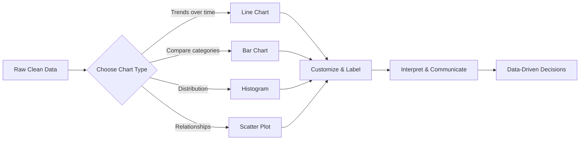
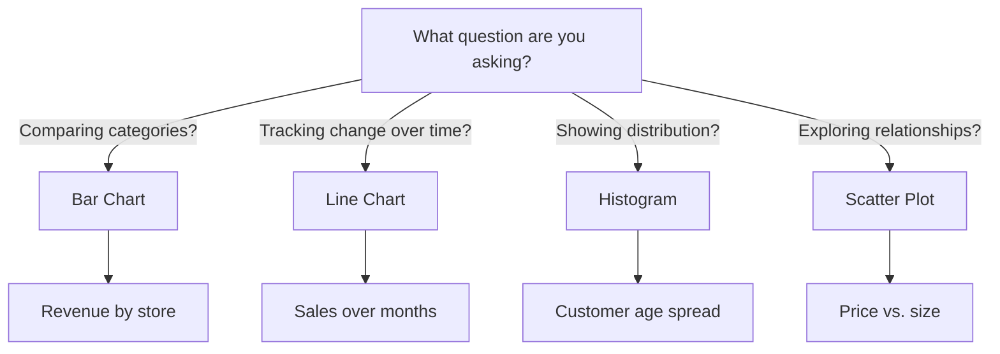
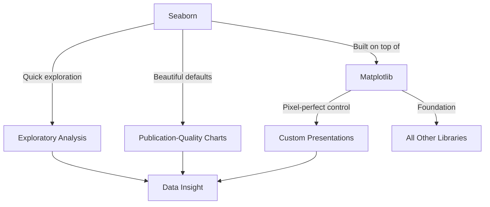
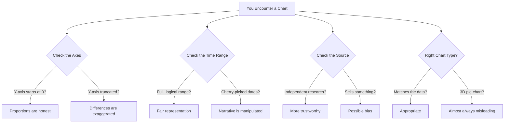
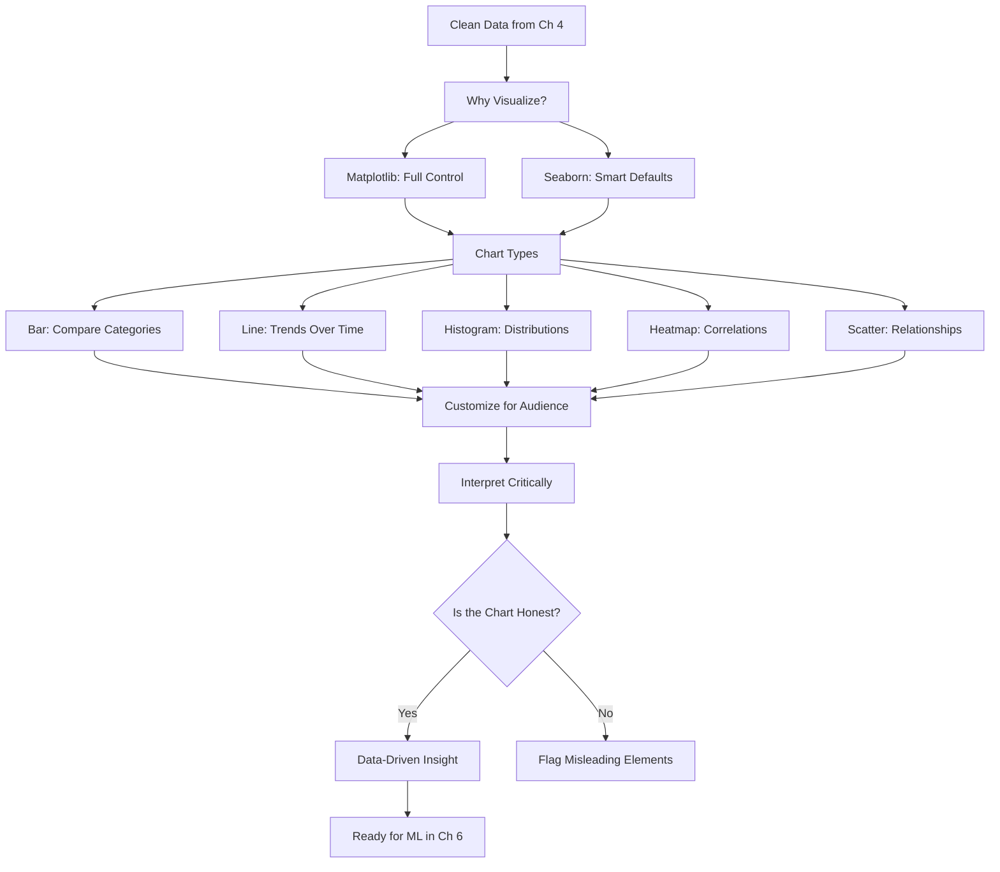

# Chapter 5: Data Visualization


---

## From Numbers to Insight

You've already trusted a data visualization with your life — you just didn't call it that.

Think back to the last hurricane season. Remember refreshing that spaghetti model map at 2 AM, watching a dozen colorful lines snake across the Gulf, trying to figure out if you needed to board up the windows or if you could sleep in on Saturday? That map is a data visualization. Each line represents the output of a different weather model — thousands of atmospheric calculations compressed into a single curve you can trace with your finger. One image replaced millions of data points, and you used it to make a real decision: stay or go, prep or wait, cancel the party or keep it on.

That's the power of visualization. It doesn't just make data look pretty. It makes data *usable*.

In Chapter 4, you learned to clean and transform messy data — handling missing values, fixing types, removing duplicates, and creating new features. You walked out of that chapter holding a clean dataset. But here's the thing: a clean spreadsheet full of numbers still doesn't *tell* you much at a glance. What if you could *see* the story your data is telling? What if three lines of Python could turn a thousand rows of numbers into a picture that changes how you think?

That's exactly what we're doing in this chapter.

### Learning Objectives

By the end of this chapter, you will be able to:

1. **Explain** why data visualization is essential for analysis, communication, and decision-making
2. **Create** line charts, bar charts, and histograms using Matplotlib in Google Colab
3. **Customize** charts with titles, labels, colors, legends, and annotations to make them presentation-ready
4. **Build** polished, publication-quality visualizations using Seaborn with less code
5. **Read and interpret** data visualizations critically, including identifying misleading chart techniques

### Chapter Roadmap

We'll start with *why* visualization matters — not in the abstract, but through a story you'll recognize. Then we'll get our hands dirty building charts from scratch with Matplotlib, learning to control every pixel. We'll upgrade to Seaborn for beautiful charts with less effort. And we'll finish with the skill that separates casual chart readers from data professionals: the ability to look at a chart and know when someone's trying to trick you.

Let's begin with a familiar situation.



**Figure 5.1: The Visualization Pipeline** — Every visualization follows the same path: start with clean data, choose the right chart type for your question, customize it for your audience, and then interpret what you see.

---

## 5.1 Why Visualization Matters: From Spreadsheets to Insight

Every semester, someone asks me: "Why can't I just look at the numbers?" Fair question. Let me answer it with a challenge.

Open a spreadsheet with 10,000 rows of daily sales data. Now tell me: which month had the highest revenue? Are sales trending up or down? Is there a seasonal pattern? You *could* sort, filter, scroll, and calculate your way to those answers. Or you could generate a single line chart and see all three answers in about two seconds.

That's not laziness — that's leveraging how the human brain actually works. Our visual cortex processes images roughly 60,000 times faster than text. A chart doesn't replace analysis; it *accelerates* it. The spreadsheet has the details. The chart has the meaning.

Think of it like the difference between reading a weather report that says "High of 89°F, 70% humidity, 40% chance of afternoon thunderstorms, winds SSW at 12 mph" versus looking at the weather heat index map every local news station shows during a South Florida summer. Both contain the same information. The map tells you where to go — and where to avoid — in a single glance.

**[Story: Sofia's Sales Slump]**

Sofia stared at the spreadsheet on her laptop, the numbers blurring together after twenty minutes. Her family's restaurant in Hialeah had been doing well all year — at least, she thought it had. But the last few weeks felt slower, and she couldn't figure out why.

"Abuela, the numbers are all here, but I can't see what's happening," she said, turning the screen toward Carmen.

Abuela Carmen adjusted her glasses and looked at the screen. "Mija, when I was learning to cook, my mother didn't hand me a list of ingredients and say 'figure it out.' She showed me. She put the sofrito in front of me and said, 'This is what right looks like.' You have to *see* it."

That night, Sofia remembered something from her Python class. She opened Google Colab, loaded the restaurant's sales data into a pandas DataFrame — just like she'd learned in Chapters 3 and 4 — and wrote four lines of code to create a bar chart of daily revenue for the past two months.

The answer jumped off the screen. Saturday lunch revenue had dropped by nearly 40% three weeks ago — exactly when they'd swapped out the lunch specials menu. The weekday numbers hadn't changed at all. The weekend dinner numbers were fine. It was specifically Saturday lunch.

She called her father. "Papi, we need to bring back the Saturday lunch specials. I can show you exactly when the revenue dropped — and exactly what caused it."

He paused. "You can see all that from a chart?"

"I can see all that from *four lines of code*."

---

*Technical Connection*: Sofia's experience illustrates the core promise of data visualization: making invisible patterns visible. The revenue data was there all along — hundreds of rows of daily numbers — but it took a simple bar chart to reveal the specific day and time window where things went wrong. This is what we'll learn to build in this chapter.


💡 **Key Insight**: Visualization isn't decoration — it's analysis. A well-made chart doesn't just present data; it reveals patterns, outliers, and trends that would take much longer to find in a spreadsheet. The best analysts don't choose between numbers and pictures — they use both.

---

## 5.2 Getting Started with Matplotlib

Matplotlib is the foundational visualization library in Python. If Python's data ecosystem were a kitchen, Matplotlib would be learning to cook from scratch — more effort than ordering from a ventanita, but you control every ingredient, every temperature, every seasoning. Once you understand Matplotlib, every other visualization library will feel like a shortcut built on top of it (because most of them are).

The basic workflow is always the same:

1. Import the library
2. Prepare your data
3. Call a plotting function
4. Customize (labels, titles, colors)
5. Display or save

Let's see this in action.

### Example 5.1: Your First Chart — Miami Monthly Temperatures

```python
# ============================================
# Example 5.1: Your First Chart — Miami Monthly Temperatures
# Purpose: Create a simple line chart using Matplotlib
# Prerequisites: None (first code example of chapter)
# ============================================

# Step 1: Import Matplotlib's plotting module
# pyplot is the part of Matplotlib we use most — it gives us
# all the basic chart-building functions
import matplotlib.pyplot as plt

# Step 2: Prepare our data
# Average monthly high temperatures in Miami (°F)
months = ['Jan', 'Feb', 'Mar', 'Apr', 'May', 'Jun',
          'Jul', 'Aug', 'Sep', 'Oct', 'Nov', 'Dec']
avg_temps = [76, 78, 80, 83, 87, 90, 92, 92, 90, 86, 81, 77]

# Step 3: Create the line chart
# plt.plot() connects data points with a line — perfect for
# showing trends over time
plt.plot(months, avg_temps, color='coral', marker='o', linewidth=2)

# Step 4: Add labels and title
# ALWAYS label your axes — a chart without labels is a chart
# nobody can read
plt.xlabel('Month')
plt.ylabel('Temperature (°F)')
plt.title('Average Monthly High Temperatures in Miami')

# Step 5: Add a horizontal reference line at 85°F
# This helps readers quickly see which months are above/below
# a meaningful threshold
plt.axhline(y=85, color='gray', linestyle='--', alpha=0.5)

# Step 6: Display the chart
plt.show()

# Expected Output:
# A line chart showing Miami's temperature curve through the year.
# You'll see temperatures rise from January (76°F), peak in
# July-August (92°F), and fall back down by December (77°F).
# The dashed gray line at 85°F shows that May through October
# stays above that threshold — Miami's long, hot stretch.
```

That's it. Ten lines of meaningful code, and you have a chart that tells a clear story: Miami is hot from May through October, with a plateau in summer. The marker dots help you see each month's exact value, and the reference line gives readers an instant benchmark.

⚠️ **Common Pitfall**: Forgetting `plt.show()`. In Google Colab, charts usually display automatically, but in other Python environments, nothing appears without this line. Get in the habit of including it — it costs nothing and prevents frustration.

🔧 **Pro Tip**: The `alpha` parameter controls transparency (0 = invisible, 1 = fully solid). It's perfect for reference lines, gridlines, or background elements that should inform without distracting.

**Try It Yourself:**
1. Change `avg_temps` to monthly rainfall data (try: `[2.0, 2.1, 2.6, 3.4, 5.3, 9.7, 6.5, 8.9, 9.8, 6.3, 3.3, 2.1]`) and update the labels accordingly
2. Switch from `plt.plot()` to `plt.bar()` — what changes about how you read the data?
3. Change the line color from `'coral'` to `'turquoise'` or try a hex code like `'#FF6B35'`

---

## 5.3 Bar Charts, Line Charts, and Histograms

Choosing the right chart type isn't about preference — it's about matching the chart to the question you're asking. Think of it like different views of Calle Ocho. An aerial photo shows you the layout of the street — where the buildings are, how wide it is. That's like a bar chart: a snapshot comparing different categories side by side. A driving timelapse shows you how the street changes as you move along it — that's a line chart: change over a continuous sequence. A crowd density map during Carnival shows you *how many people* are at different points — that's a histogram: the distribution of values.

Here's the framework:

| Question You're Asking | Chart Type | Example |
|------------------------|------------|---------|
| How do categories compare? | Bar chart | Revenue by restaurant location |
| How does something change over time? | Line chart | Monthly website visitors |
| What's the distribution of values? | Histogram | Age distribution of customers |
| How do two variables relate? | Scatter plot | Price vs. square footage |



**Figure 5.2: Chart Type Decision Tree** — Start with your question, not your data. The question determines the chart type.

🤔 **Think About It**: If someone asks you "What were our sales last quarter?" — that's a bar chart (comparing months). But "How have our sales changed over the past year?" — that's a line chart (trend over time). Same data, different questions, different chart types. Always start with the question.

---

## 5.4 Customizing Your Charts

There's a difference between a chart that *exists* and a chart that *communicates*. Think of it like getting dressed: you wouldn't wear the same outfit to the beach and to a quinceañera. Same person, different presentation for different audiences. Customization is how you take a raw chart and make it ready for its audience — whether that's a class presentation, a business report, or a social media post.

**[Story: Marcus Maps the Port]**

Marcus pulled up his laptop at the campus library, proud of what he'd built. For his data analysis class, he was working with shipping container data from the Port of Miami — something he knew firsthand from his part-time job there. He'd created a line chart showing monthly container volume and was ready to show Prof. Reyes.

The professor leaned in, studied the chart for a moment, then sat back. "Good start. But let me ask you — which terminal? Which cargo type?"

Marcus paused. "It's... all of them. Combined."

"So right now your chart tells me container volume goes up and down. I could have guessed that." Prof. Reyes smiled to soften the critique. "Marcus, a chart should *answer* questions, not just raise them. Right now, this raises more questions than it answers. What if you broke it down by terminal and color-coded each line?"

That evening, Marcus went back to Colab. He added color-coded lines for each terminal, labeled the axes properly, included a legend, and annotated the chart with markers for the holiday shipping surge in November and December. He also added a title that actually said something: not just "Container Volume" but "Monthly Container Volume by Terminal — Port of Miami, 2024."

When he showed it again, Prof. Reyes nodded. "Now that's a chart I'd put in a report."

---

*Technical Connection*: Marcus's experience shows that a raw chart is just the starting point. Customization — colors, labels, legends, annotations, meaningful titles — transforms a basic plot into a professional visualization that communicates clearly. This is what separates beginner charts from charts that belong in business presentations.


Let's build what Marcus built.

### Example 5.2: Customized Port of Miami Shipping Dashboard

```python
# ============================================
# Example 5.2: Customized Port of Miami Shipping Dashboard
# Purpose: Create multiple chart types with full customization
# Prerequisites: matplotlib, pandas
# ============================================

# Step 1: Import libraries
import matplotlib.pyplot as plt
import pandas as pd

# Step 2: Create a sample shipping dataset
# In a real project, you'd load this from a CSV (like Chapter 4)
data = {
    'Month': ['Jan', 'Feb', 'Mar', 'Apr', 'May', 'Jun',
              'Jul', 'Aug', 'Sep', 'Oct', 'Nov', 'Dec'],
    'Terminal_A': [1200, 1150, 1300, 1250, 1400, 1350,
                   1280, 1320, 1450, 1500, 1800, 1950],
    'Terminal_B': [800, 780, 850, 820, 900, 870,
                   840, 860, 950, 1000, 1250, 1400],
    'Shipment_Weights': [45, 52, 38, 67, 55, 48, 72, 61, 43,
                         58, 50, 63, 41, 69, 54, 47, 66, 59,
                         44, 71, 53, 46, 68, 57]
}

df_shipping = pd.DataFrame({
    'Month': data['Month'],
    'Terminal_A': data['Terminal_A'],
    'Terminal_B': data['Terminal_B']
})

# Step 3: Create a figure with 3 subplots (1 row, 3 columns)
# figsize controls the overall size — (16, 5) means 16 inches
# wide by 5 inches tall
fig, (ax1, ax2, ax3) = plt.subplots(1, 3, figsize=(16, 5))

# --- Chart 1: Line chart of monthly container volume by terminal ---
ax1.plot(df_shipping['Month'], df_shipping['Terminal_A'],
         color='coral', marker='o', linewidth=2, label='Terminal A')
ax1.plot(df_shipping['Month'], df_shipping['Terminal_B'],
         color='turquoise', marker='s', linewidth=2, label='Terminal B')

# Annotate the holiday surge — this is the kind of detail
# that transforms a chart from "data dump" to "insight"
ax1.annotate('Holiday\nSurge', xy=('Nov', 1800),
             xytext=('Aug', 1850),
             arrowprops=dict(arrowstyle='->', color='gray'),
             fontsize=9, ha='center')

ax1.set_xlabel('Month')
ax1.set_ylabel('Container Volume')
ax1.set_title('Monthly Volume by Terminal')
ax1.legend()
ax1.tick_params(axis='x', rotation=45)

# --- Chart 2: Bar chart comparing annual totals ---
terminals = ['Terminal A', 'Terminal B']
totals = [df_shipping['Terminal_A'].sum(),
          df_shipping['Terminal_B'].sum()]
colors = ['coral', 'turquoise']

ax2.bar(terminals, totals, color=colors, edgecolor='white')
ax2.set_ylabel('Total Containers (Annual)')
ax2.set_title('Annual Volume Comparison')

# Add value labels on top of each bar
for i, total in enumerate(totals):
    ax2.text(i, total + 200, f'{total:,}', ha='center',
             fontweight='bold')

# --- Chart 3: Histogram of shipment weights ---
ax3.hist(data['Shipment_Weights'], bins=8, color='gold',
         edgecolor='white', alpha=0.8)
ax3.set_xlabel('Weight (tons)')
ax3.set_ylabel('Frequency')
ax3.set_title('Distribution of Shipment Weights')

# Step 4: Adjust layout so nothing overlaps
plt.suptitle('Port of Miami — Shipping Dashboard 2024',
             fontsize=14, fontweight='bold', y=1.02)
plt.tight_layout()
plt.show()

# Expected Output:
# Three side-by-side charts:
# 1. Line chart: Terminal A consistently higher than B, both
#    surge in Nov-Dec (holiday shipping). The annotation draws
#    the reader's eye to this key pattern.
# 2. Bar chart: Terminal A handles roughly 60% more volume
#    annually. The value labels make exact comparison easy.
# 3. Histogram: Shipment weights cluster around 45-65 tons,
#    with a few heavier outliers near 70+.
```

⚠️ **Common Pitfall**: When using `plt.subplots()`, labels and titles can overlap if you don't call `plt.tight_layout()`. This one line automatically adjusts spacing — always include it when you have multiple charts.

⚠️ **Common Pitfall**: Rotating x-axis labels with `rotation=45` helps prevent overlapping month names, but if your labels are very long, try `rotation=90` or use abbreviations.

**Try It Yourself:**
1. Add a third terminal (`Terminal_C`) to the line chart with a new color
2. Change the histogram bin count from 8 to 4, then to 15 — how does the shape of the distribution change?
3. Replace the annotation text with a different insight (e.g., label the lowest-volume month instead)

📊 **By The Numbers**: The Port of Miami is one of the busiest container ports in the United States, handling over 1 million TEUs (twenty-foot equivalent units) annually. Visualization dashboards like the one we just built are how port logistics teams actually monitor operations in real time.

---

## 5.5 Introduction to Seaborn

If Matplotlib is making cafecito from scratch — roasting the beans, grinding them fine, packing the cafetera, watching the flame — then Seaborn is ordering one from the ventanita. You get a beautiful result with significantly less work. Seaborn is built *on top of* Matplotlib, which means everything we just learned still applies. But Seaborn adds smart defaults, gorgeous color palettes, and statistical chart types that would take dozens of Matplotlib lines to create.

Here's the key difference in practice:

| Feature | Matplotlib | Seaborn |
|---------|-----------|---------|
| Control | Total — you set everything | Smart defaults, you override what you want |
| Code length | More lines | Fewer lines |
| Statistical charts | You build them | Built-in (heatmaps, pair plots, distributions) |
| Aesthetics | You style it yourself | Beautiful out of the box |
| Best for | Custom, precise charts | Exploratory analysis, quick insight |

When do you use which? Use Matplotlib when you need pixel-perfect control — a chart for a formal report where every element must be exactly right. Use Seaborn when you're exploring data and want to see patterns quickly, or when you want a polished look with minimal code.

Most professionals use both. They explore with Seaborn, then fine-tune with Matplotlib for final presentations.



**Figure 5.3: Matplotlib vs. Seaborn** — Seaborn is built on Matplotlib. Use Seaborn for quick exploration and beautiful defaults; use Matplotlib when you need full control.

### Example 5.3: Miami Neighborhood Housing Analysis with Seaborn

```python
# ============================================
# Example 5.3: Miami Neighborhood Housing Analysis with Seaborn
# Purpose: Create statistical visualizations with Seaborn
# Prerequisites: matplotlib, seaborn, pandas
# ============================================

# Step 1: Import libraries
# Seaborn is typically imported as 'sns' — a reference to the
# character Samuel Norman Seaborn from The West Wing
import matplotlib.pyplot as plt
import seaborn as sns
import pandas as pd
import numpy as np

# Step 2: Set the visual theme
# This single line upgrades every chart in your notebook
sns.set_theme(style='whitegrid', palette='muted')

# Step 3: Create a simulated Miami housing dataset
# In a real project you'd load this with pd.read_csv()
np.random.seed(42)  # Makes random data reproducible
n = 200  # 200 properties

neighborhoods = np.random.choice(
    ['Brickell', 'Wynwood', 'Little Havana', 'Coral Gables', 'Hialeah'],
    size=n
)

# Base price varies by neighborhood
base_prices = {
    'Brickell': 450000, 'Wynwood': 380000, 'Little Havana': 280000,
    'Coral Gables': 520000, 'Hialeah': 260000
}
prices = [base_prices[n] + np.random.normal(0, 50000) for n in neighborhoods]
sqft = [max(500, int(p / 350 + np.random.normal(0, 100))) for p in prices]
bedrooms = [max(1, min(5, int(s / 400 + np.random.normal(0, 0.5)))) for s in sqft]

df_housing = pd.DataFrame({
    'Neighborhood': neighborhoods,
    'Price': prices,
    'Sqft': sqft,
    'Bedrooms': bedrooms
})

# Step 4: Create a 2x2 grid of Seaborn charts
fig, axes = plt.subplots(2, 2, figsize=(14, 10))

# --- Chart 1: Box plot of prices by neighborhood ---
# Box plots show median, quartiles, and outliers in one view
sns.boxplot(data=df_housing, x='Neighborhood', y='Price',
            ax=axes[0, 0], palette='Set2')
axes[0, 0].set_title('Price Distribution by Neighborhood')
axes[0, 0].set_ylabel('Price ($)')
axes[0, 0].tick_params(axis='x', rotation=30)

# --- Chart 2: Scatter plot of price vs. square footage ---
# hue=Neighborhood colors each point by area — instantly
# shows whether the price/sqft relationship holds everywhere
sns.scatterplot(data=df_housing, x='Sqft', y='Price',
                hue='Neighborhood', ax=axes[0, 1], alpha=0.7)
axes[0, 1].set_title('Price vs. Square Footage')
axes[0, 1].set_xlabel('Square Footage')
axes[0, 1].set_ylabel('Price ($)')

# --- Chart 3: Histogram of square footage distribution ---
# KDE (kernel density estimation) adds a smooth curve over
# the histogram — like a smoothed-out version of the bars
sns.histplot(data=df_housing, x='Sqft', kde=True,
             ax=axes[1, 0], color='coral')
axes[1, 0].set_title('Distribution of Square Footage')
axes[1, 0].set_xlabel('Square Footage')

# --- Chart 4: Heatmap of correlations ---
# A heatmap uses color intensity to show how strongly
# variables are related — like the weather heat index map
# on the local news, but for data relationships
numeric_cols = df_housing[['Price', 'Sqft', 'Bedrooms']]
correlation = numeric_cols.corr()

sns.heatmap(correlation, annot=True, cmap='YlOrRd',
            ax=axes[1, 1], vmin=-1, vmax=1, center=0,
            fmt='.2f', linewidths=1)
axes[1, 1].set_title('Feature Correlation Heatmap')

plt.suptitle('Miami Housing Market Analysis',
             fontsize=16, fontweight='bold')
plt.tight_layout()
plt.show()

# Expected Output:
# A 2x2 dashboard with four charts:
#
# 1. Box plot: Coral Gables and Brickell have the highest
#    median prices. Little Havana and Hialeah are more
#    affordable. Outliers (dots beyond the whiskers) show
#    unusually cheap or expensive properties.
#
# 2. Scatter plot: Clear positive relationship — bigger homes
#    cost more. Color coding shows Brickell and Coral Gables
#    cluster in the upper-right (expensive + large), while
#    Hialeah and Little Havana cluster lower-left.
#
# 3. Histogram: Square footage follows a roughly normal
#    distribution, with most homes between 800-1600 sqft.
#    The KDE curve makes the shape easier to see.
#
# 4. Heatmap: Strong correlation between Price and Sqft
#    (around 0.85+). Moderate correlation between Sqft and
#    Bedrooms. The color intensity makes it instantly clear
#    which relationships are strong vs. weak.
```

⚠️ **Common Pitfall**: Passing non-numeric columns to a heatmap's `.corr()` method will cause an error. Always select only numeric columns first, as we did with `df_housing[['Price', 'Sqft', 'Bedrooms']]`.

⚠️ **Common Pitfall**: Correlation does not mean causation. The heatmap might show that price and square footage are strongly correlated, but that doesn't mean increasing square footage *causes* prices to rise — both might be driven by neighborhood desirability.

🔧 **Pro Tip**: `sns.set_theme()` at the top of your notebook sets the style for *every* chart that follows — both Seaborn and Matplotlib charts. It's one line that instantly makes everything look professional.

**Try It Yourself:**
1. Filter the DataFrame to just one neighborhood and recreate the scatter plot — does the price/sqft relationship still hold?
2. Change the heatmap color palette from `'YlOrRd'` to `'coolwarm'` or `'Blues'`
3. Add a box plot of `Sqft` by `Bedrooms` — does square footage increase linearly with bedroom count?

🌎 **Real-World Application**: Real estate platforms like Zillow and Redfin use visualizations very similar to these. Their price heatmaps overlay on actual maps of Miami neighborhoods, letting buyers instantly see where they can afford. The scatter plots help appraisers identify properties that are priced unusually high or low for their size — potential deals or red flags.

---

## 5.6 Reading and Interpreting Visualizations

Building charts is half the skill. The other half — and honestly, the more important half — is *reading* them. Because here's the uncomfortable truth: not every chart you encounter is honest.

**[Story: The Misleading Infographic]**

It started with a screenshot in the class group chat. Someone shared an infographic from a real estate marketing account claiming that Miami rents had "skyrocketed 300%" with a dramatic upward-shooting bar chart in alarming red.

Sofia felt her stomach drop. Her family rented the space for their restaurant, and a 300% increase would mean closing the doors. She almost shared the infographic with her dad before Marcus interrupted.

"Hold on," Marcus said, pulling up the image on his laptop during their study session. "Look at the y-axis."

Sofia leaned in. The y-axis started at $1,800. Not zero. $1,800.

"The actual change is from $1,900 to $2,200," Marcus said. "That's about a 16% increase. Not 300%. The 300% thing — they're measuring the *rate of increase* compared to the previous year, which is a completely different statistic."

Prof. Reyes, passing by their table, stopped. "Good catch. What else do you notice?"

Sofia looked closer. "The time range is weird. It starts in March 2023 and ends in January 2024. Why not a full year?"

"Because if they showed five years, you'd see that rents went down before they went up," Marcus added. "They cherry-picked the range."

Prof. Reyes smiled. "And the source?"

"A real estate marketing company," Sofia said quietly. "That wants to convince landlords they can charge more."

"Every chart has an author," Prof. Reyes said. "And every author has a purpose. Your job is to read the chart, not just look at it."

---

*Technical Connection*: This story illustrates the three most common techniques for creating misleading visualizations: truncated axes (starting above zero to exaggerate differences), cherry-picked time ranges (selecting dates that support a narrative), and source bias (data presented by parties with a financial interest in the conclusion). Learning to spot these is a critical skill for data literacy.

[IN-CHAPTER IMAGE 3]
Prompt: "A detective with a magnifying glass examining a large wall of charts and graphs, some charts circled in red with warning signs indicating they are misleading, others glowing green as trustworthy, noir-meets-Miami-pastel color scheme, digital watercolor style"
Placement: After Section 5.6
Purpose: Reinforces the critical literacy theme — charts as evidence that require careful analysis



**Figure 5.4: The Chart Credibility Checklist** — Before trusting any chart, check these four things: axis scales, time range, source, and chart type choice.

### Common Misleading Techniques

Here's your detective toolkit — the techniques to watch for every time you encounter a chart in the news, on social media, or in a business presentation:

**Truncated Y-Axis**: Starting the y-axis at a value above zero makes small differences look enormous. A stock price moving from $98 to $102 looks like a modest tick if the axis starts at $0, but looks like a rocket ship if the axis starts at $97.

**Cherry-Picked Time Range**: Showing only the dates that support your story. A company's stock might be down 5% this month but up 200% over five years — the time range you choose determines the narrative entirely.

**Misleading Scale**: Using different scales on dual y-axes to suggest a correlation that doesn't exist, or using non-linear scales without clearly labeling them.

**3D Charts**: Almost always distort proportions. A 3D pie chart makes the slices closest to the viewer look larger than they actually are. There is almost never a good reason to use a 3D chart in professional data communication.

**Omitted Context**: Showing a chart without units, without a source, or without sample size. "90% of customers agree!" means very different things if the sample was 10 people versus 10,000.

🤔 **Think About It**: Next time you're scrolling through social media and see a chart that makes you feel a strong emotion — outrage, fear, excitement — pause. That emotional response is exactly what a misleading chart is designed to produce. Ask yourself: what would this chart look like with a full y-axis? A longer time range? A different source?

💡 **Key Insight**: The ethical responsibility of data visualization runs both ways. As a *creator* of charts, you have an obligation to present data honestly. As a *reader* of charts, you have a responsibility to examine them critically. Both sides of this skill matter equally.

---

## 5.7 Case Study: Visualizing Miami Beach Tourism Trends

Let's bring everything together. You're a data analyst working for the Miami Beach Tourism Board. They've given you a year of visitor data and one question: *"When should we invest in marketing, and to whom?"*

You have a clean dataset (thank you, Chapter 4 skills) with monthly visitor counts, hotel occupancy rates, average daily spending, and visitor categories (families, business travelers, international tourists, spring breakers).

```python
# ============================================
# Case Study: Miami Beach Tourism Dashboard
# Purpose: Apply all visualization skills to a real scenario
# Prerequisites: matplotlib, seaborn, pandas, numpy
# ============================================

import matplotlib.pyplot as plt
import seaborn as sns
import pandas as pd
import numpy as np

sns.set_theme(style='whitegrid')

# --- Load the dataset ---
# (In class, this would be a CSV file. Here we simulate it.)
months = ['Jan', 'Feb', 'Mar', 'Apr', 'May', 'Jun',
          'Jul', 'Aug', 'Sep', 'Oct', 'Nov', 'Dec']

tourism_data = pd.DataFrame({
    'Month': months,
    'Visitors_K': [180, 195, 280, 260, 210, 175,
                   165, 155, 140, 160, 185, 220],
    'Occupancy_Pct': [72, 78, 95, 90, 75, 65,
                      62, 58, 55, 63, 70, 80],
    'Avg_Spending': [285, 310, 420, 380, 290, 245,
                     230, 220, 215, 240, 275, 340],
    'Families_Pct': [35, 30, 15, 20, 40, 50,
                     55, 55, 45, 40, 35, 30],
    'Business_Pct': [25, 25, 10, 15, 25, 20,
                     15, 15, 20, 25, 30, 30],
    'International_Pct': [30, 35, 40, 45, 25, 20,
                          20, 20, 25, 25, 25, 30]
})

# --- Chart 1: Monthly visitors (line chart) ---
# Question: When do the most people visit?
fig, axes = plt.subplots(2, 2, figsize=(14, 10))

axes[0, 0].plot(tourism_data['Month'], tourism_data['Visitors_K'],
                color='coral', marker='o', linewidth=2.5)
axes[0, 0].fill_between(range(12), tourism_data['Visitors_K'],
                         alpha=0.15, color='coral')
axes[0, 0].set_title('Monthly Visitors (thousands)')
axes[0, 0].set_ylabel('Visitors (K)')
axes[0, 0].tick_params(axis='x', rotation=45)

# YOUR TURN: What pattern do you see? Write 2 sentences
# interpreting the seasonal trend.

# --- Chart 2: Spending by category (bar chart) ---
# Question: Which months have the highest spending?
axes[0, 1].bar(tourism_data['Month'], tourism_data['Avg_Spending'],
               color='turquoise', edgecolor='white')
axes[0, 1].set_title('Average Daily Visitor Spending ($)')
axes[0, 1].set_ylabel('Spending ($)')
axes[0, 1].tick_params(axis='x', rotation=45)

# YOUR TURN: Add an annotation marking the peak spending
# month. Use ax.annotate() like we did in Example 5.2.

# --- Chart 3: Visitor composition stacked area ---
# Question: How does the visitor mix change through the year?
axes[1, 0].stackplot(range(12),
                      tourism_data['Families_Pct'],
                      tourism_data['Business_Pct'],
                      tourism_data['International_Pct'],
                      labels=['Families', 'Business', 'International'],
                      colors=['gold', 'steelblue', 'coral'],
                      alpha=0.8)
axes[1, 0].set_xticks(range(12))
axes[1, 0].set_xticklabels(months, rotation=45)
axes[1, 0].set_title('Visitor Composition by Month')
axes[1, 0].set_ylabel('Percentage')
axes[1, 0].legend(loc='upper right')

# --- Chart 4: Correlation heatmap ---
# Question: Which variables move together?
numeric = tourism_data[['Visitors_K', 'Occupancy_Pct',
                         'Avg_Spending', 'International_Pct']]
sns.heatmap(numeric.corr(), annot=True, cmap='YlOrRd',
            ax=axes[1, 1], fmt='.2f', vmin=-1, vmax=1,
            linewidths=1)
axes[1, 1].set_title('Variable Correlations')

plt.suptitle('Miami Beach Tourism Dashboard — 2024',
             fontsize=16, fontweight='bold')
plt.tight_layout()
plt.show()

# YOUR TURN: Based on these four charts, write a 3-sentence
# recommendation to the Tourism Board answering their question:
# "When should we invest in marketing, and to whom?"
#
# Hint: Look at when visitors are LOW but spending is still
# decent. That's your opportunity window. And look at which
# visitor category dominates during that window.
```

The case study asks you to do what real data analysts do every day: look at multiple visualizations together and synthesize them into a recommendation. No single chart tells the whole story. But four charts, each answering a different question, paint a complete picture.

🌎 **Real-World Application**: Tourism boards, city planners, and hospitality companies use dashboards exactly like this one. The Miami Beach Visitor and Convention Authority publishes monthly tourism reports with charts very similar to what we just built — visitor counts, hotel occupancy, spending patterns, and demographic breakdowns.

---

## Chapter Summary



**Figure 5.5: Chapter 5 Concept Map** — From clean data to critical interpretation, this chapter built your complete visualization toolkit. These skills carry directly into Chapter 6, where you'll use visualizations to evaluate machine learning models.

### Key Takeaways

- **Visualization is analysis, not decoration.** A well-designed chart reveals patterns, outliers, and trends that would take much longer to find in raw data. It accelerates understanding and drives better decisions.
- **Start with the question, not the chart type.** Comparing categories? Bar chart. Tracking change over time? Line chart. Showing distribution? Histogram. The question determines the visualization.
- **Matplotlib gives you total control; Seaborn gives you speed and beauty.** Learn Matplotlib to understand the foundation, use Seaborn when you want professional-looking charts with less code. Most professionals use both.
- **Customization is what separates amateur charts from professional ones.** Titles, axis labels, legends, annotations, and color choices transform a raw plot into a visualization that communicates clearly.
- **Always read charts critically.** Check the axes, the time range, the source, and the chart type. Misleading visualizations are everywhere, and your ability to spot them is as important as your ability to create honest ones.
- **Correlation is not causation.** A heatmap showing that two variables move together doesn't mean one causes the other. Always consider alternative explanations.
- **Every chart has an author with a purpose.** Whether you're creating or consuming a visualization, understand the intent behind it.

### Vocabulary Review

| Term | Definition |
|------|-----------|
| **Matplotlib** | Python's foundational plotting library; gives you full control over every element of a chart |
| **Seaborn** | A statistical visualization library built on Matplotlib; provides beautiful defaults and built-in statistical chart types |
| **Histogram** | A chart that shows the distribution of values — how frequently different ranges of values occur in a dataset |
| **Heatmap** | A chart that uses color intensity to represent the magnitude of values, often used to show correlations between variables |
| **Scatter plot** | A chart that plots individual data points using x and y coordinates to show relationships between two variables |
| **Annotation** | Text and arrows added to a chart to highlight specific data points or patterns |
| **Legend** | A key that explains what each color, shape, or line style represents in a chart |
| **Truncated axis** | An axis that doesn't start at zero, which can make differences appear larger than they actually are |
| **Correlation** | A statistical measure of how strongly two variables move together; ranges from -1 to +1 |
| **KDE (Kernel Density Estimation)** | A smooth curve fitted over a histogram that shows the approximate shape of the data distribution |

### Bridge to Chapter 6

You can now clean data *and* visualize it. These are the two foundational skills every machine learning project depends on. In the next chapter, you'll feed your prepared data into your first predictive model — a linear regression that learns from examples instead of following rules. And here's where this chapter pays off directly: the best way to tell if a machine learning model is actually working is often to *look* at its results. The charts you learned to build here will help you judge whether a model's predictions make sense or whether something has gone wrong.

Here's a question to think about before we start: *If a restaurant uses data from the past two years to predict next month's sales, what could go wrong if the data includes the COVID lockdown period?*

### Self-Check Questions

1. You want to show how a city's population has changed over the past 50 years. Which chart type is most appropriate: (a) pie chart, (b) line chart, (c) histogram, (d) heatmap?

2. A news article shows a bar chart where the y-axis starts at 45% instead of 0%. What effect does this have on how readers perceive the data?

3. What is the difference between Matplotlib and Seaborn? When would you choose one over the other?

4. A heatmap shows a correlation of 0.92 between ice cream sales and drowning incidents. Does this mean ice cream causes drowning? What's a more likely explanation?

5. Name three things you should check before trusting a data visualization you find online.

### Hands-On Challenge (40–60 Minutes)

**Build a 3-Chart Personal Dashboard**

Using a provided dataset of your choice (weather, sports, restaurant reviews, or any CSV you find interesting):

1. **Chart 1** (Matplotlib): Create a line or bar chart answering one specific question about the data. Include proper labels, title, and at least one annotation.
2. **Chart 2** (Matplotlib): Create a different chart type answering a different question. Use `plt.subplots()` to display both charts side by side.
3. **Chart 3** (Seaborn): Create a heatmap, box plot, or scatter plot that reveals a relationship or distribution in the data.

For each chart, write a 2–3 sentence interpretation explaining what the chart reveals.

**Milestones:**
- Minutes 0–10: Load and inspect your dataset
- Minutes 10–25: Build Charts 1 and 2 with Matplotlib
- Minutes 25–40: Build Chart 3 with Seaborn
- Minutes 40–60: Write interpretations and customize all three charts

### Discussion Prompts

1. Find a chart online (news article, social media, advertisement) that you think is misleading. Share it with the class and explain which technique(s) it uses to distort the truth. How would you redesign it to be honest?

2. When might a simple bar chart be *better* than a complex Seaborn visualization? Think about your audience — would Abuela Carmen prefer the simple chart or the fancy one? Why does audience matter?

3. Data visualization is powerful because it shapes how people understand information. With that power comes responsibility. How does visualization connect to the ethical responsibilities of data professionals that we discussed in Chapter 4's bias conversation?
