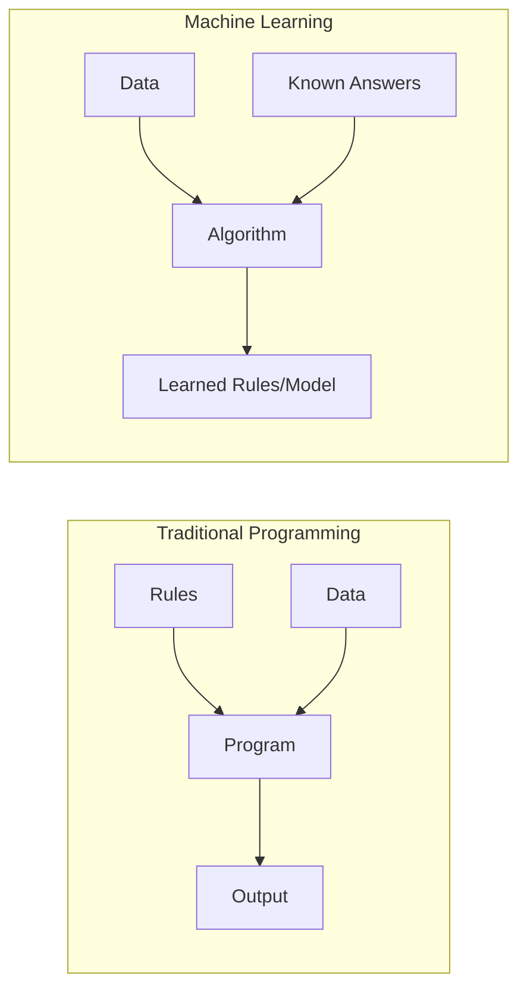
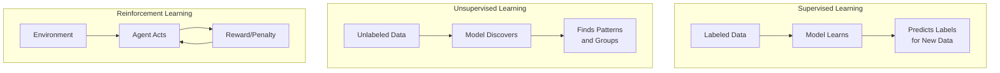
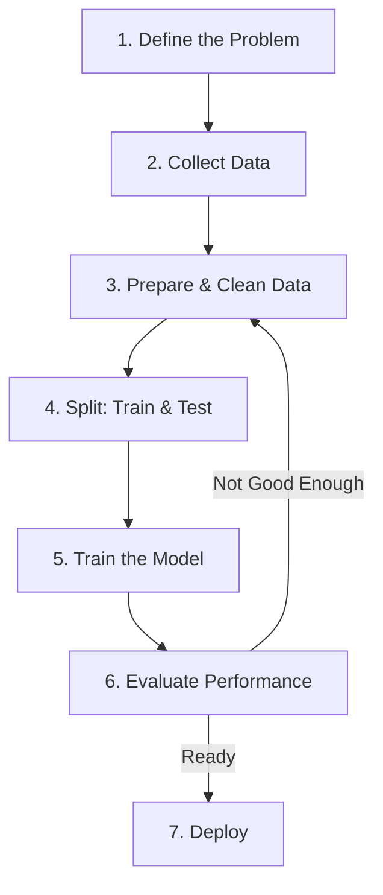
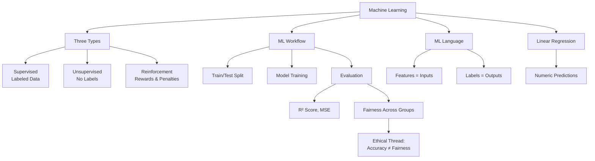

---

# Chapter 6: Introduction to Machine Learning

## Opening: The Port of Miami Guessing Game

Marcus stands at the edge of Dodge Island, watching a Panamax container ship slide into its berth at the Port of Miami. It's Tuesday morning, and his supervisor, Diane, is leaning against the dispatch booth with a clipboard.

"Based on the last three years of shipping data," she says, not looking up, "how many containers do you think we'll process next Tuesday?"

Marcus thinks about it. He's been working the port for eleven months now. He knows Tuesdays after holiday weekends are heavy. He knows the South American routes pick up in October. He knows that when cruise season peaks, commercial cargo gets shifted to off-hours. He has a number in his head — maybe 4,200 containers — but he can't explain *why*. It's just a feeling built from months of pattern recognition.

Diane's new logistics analyst, a recent FIU grad, pulls up a laptop. She feeds three years of historical data into a model: day of week, month, holiday proximity, cruise ship count, weather conditions, route origins. The model returns a number — 4,347 containers — along with an error margin and the three factors that mattered most in the prediction.

"That's machine learning," the analyst says. "It learned what you learned. It just shows its work."

Marcus stares at the screen. He's not offended — he's fascinated. The model didn't replace his experience. It confirmed it, quantified it, and made it explainable. And it did it in seconds instead of months.

That's what this chapter is about. In Chapters 3 through 5, you learned to collect data, clean it, and visualize it — to understand what *happened*. Now you're crossing a threshold. You're going to teach a computer to learn from data and predict what happens *next*.

By the end of this chapter, you will be able to:

- **Define machine learning** and explain how it differs from traditional programming
- **Distinguish between** supervised, unsupervised, and reinforcement learning with real-world examples
- **Describe the ML workflow**: data splitting, model training, and evaluation
- **Identify features and labels** in a dataset and frame problems in ML terms
- **Build and run** your first predictive model using linear regression in Python
- **Evaluate model performance** and explain why accuracy alone isn't enough

Here's your roadmap: we'll start with what machine learning actually *is* (and isn't), explore three ways machines learn, walk through the workflow you'll use for every model in this course, get our hands dirty with real code, and finish by asking a question that will follow us through every remaining chapter — *just because a model is accurate, does that mean it's fair?*

Let's go.

---

## 6.1 What Is Machine Learning? (The Restaurant Analogy)

In Chapter 5, you built visualizations that revealed patterns hiding in data — trends, outliers, relationships between variables. You probably had a moment where you looked at a chart and thought, "I can see where this is going." That instinct — seeing a pattern and projecting it forward — is exactly what machine learning formalizes.

But let's start with what it's replacing.

Traditional programming works like following a recipe at a Cuban restaurant. Someone hands you a written recipe: *add exactly 2 cups of mojo, marinate for 4 hours, roast at 350°F for 90 minutes*. You follow the rules, you get the result. The programmer writes the rules. The computer follows them.

Machine learning flips this. Instead of giving the computer rules, you give it *data* — thousands of meals, ingredients, cooking times, and customer ratings — and the computer figures out the rules on its own. It's the difference between learning to cook from a cookbook and learning to cook by tasting a thousand dishes until you develop intuition for what works.



**Figure 6.1: Traditional Programming vs. Machine Learning** — In traditional programming, a human writes the rules and the computer applies them. In machine learning, the computer discovers the rules from data.

Here's the key insight: traditional programming says *"if temperature > 85, predict high ice cream sales."* Machine learning says *"here are 5,000 days of temperature and sales data — figure out the relationship yourself."* The programmer never writes the rule. The model *learns* it.

💡 **Key Insight**: Machine learning is not about programming a computer to do something. It's about programming a computer to *learn* to do something — and the learning comes from data, not from a human writing rules.

This matters because the real world is messy. Writing rules for spam detection would require anticipating every trick a spammer might use. Writing rules for fraud detection would require predicting every fraudulent pattern. You can't write rules for things you haven't seen yet. But you can show a model millions of examples and let it learn what to watch for.

---

**Sofia's Inventory Gamble**

Sofia has been running the kitchen at her family's restaurant in Hialeah for three years now, and she's proud of the system she's built. She orders supplies on Monday mornings based on gut feeling — what sold last week, what the weather looks like, whether it's the beginning or end of the month.

Most weeks, it works. But this week was a disaster.

On Wednesday, she ran out of bread by 2 PM. A church group showed up unannounced, and the lunch rush wiped out everything. She scrambled to get an emergency delivery, but by the time the bread arrived, she'd lost a dozen frustrated customers. Then on Friday, she watched sixty avocados slowly turn brown in the walk-in cooler because the dinner crowd she expected never materialized — turns out there was a Dolphins game and half of Hialeah was watching at home.

"Mija, you can't predict everything," Abuela Carmen says from the counter, slicing plantains with the precision of someone who has done it ten thousand times.

"I know, Abuela. But what if the *data* could predict it?" Sofia pulls out her laptop and opens the spreadsheet she's been keeping since Chapter 4 — every day's sales, weather, day of week, and whether MDC or the local schools were in session. Her cousin, a data science student at FIU, had suggested she look for patterns.

And there it was. Bread sales didn't spike on Fridays generally. They spiked on Fridays *when MDC had evening events*. The avocado surplus didn't happen randomly — it correlated with major sports broadcasts. Her gut had been right about the general patterns, but wrong about the specific drivers.

"So the computer just told you what you already know?" Carmen asks, skeptical.

"No, Abuela. It told me what I *didn't* know I knew. And now I can act on it before I waste another sixty avocados."

---

*Technical Connection*: Sofia has been doing informal machine learning her entire career — learning from experience, adjusting based on outcomes. What she's discovering is that formalizing this process with data lets her see patterns she'd miss with intuition alone. That's the core promise of ML: not replacing human judgment, but augmenting it with systematic pattern recognition.

---

## 6.2 Supervised vs. Unsupervised vs. Reinforcement Learning

Not all learning is the same. Think about the different ways you've learned things in your own life — sometimes someone taught you with examples, sometimes you figured things out by exploring, and sometimes you learned by trial and error. Machine learning works the same way, and it falls into three paradigms.

### Supervised Learning: Learning with a Teacher

Imagine you're at Sedano's with a toddler, teaching them to identify fruits. You hold up a mango: "This is a mango." You hold up a papaya: "This is a papaya." After enough labeled examples, the child can walk into any supermarket and point: "Mango! Papaya!" They learned because every example came with the correct answer.

Supervised learning works identically. You give the model *labeled data* — input data paired with the correct output — and it learns the relationship. Spam filters learn from emails labeled "spam" or "not spam." Loan approval models learn from applications labeled "approved" or "denied." The model has a teacher: the labels.

This is the most common type of ML and the one we'll spend the most time with in this course.

### Unsupervised Learning: Figuring It Out Alone

Now imagine you're sorting through a big box of family photos from Abuela Carmen's closet. Nobody labeled these photos. But you start naturally grouping them — all the quinceañera photos in one pile, the beach vacations in another, the holiday dinners in a third. You found structure in the data without anyone telling you what to look for.

That's unsupervised learning. The model finds patterns, groupings, or structure in data *without* labeled answers. Customer segmentation (grouping shoppers by behavior), anomaly detection (finding unusual transactions), and recommendation systems all use unsupervised learning.

### Reinforcement Learning: Learning from Consequences

Think about how you learned to navigate I-95 during rush hour. Nobody handed you a manual. You tried the Palmetto at 5:30 PM — disaster. You tried leaving at 4:45 instead — better. You discovered that the express lanes are worth it on Fridays but not Wednesdays. Every decision had a consequence (reward or penalty), and over time, you optimized your strategy.

Reinforcement learning works this way. An agent takes actions in an environment, receives rewards or penalties, and learns to maximize rewards over time. This is how game-playing AIs, robotic systems, and self-driving car simulations learn — through millions of trial-and-error cycles.



**Figure 6.2: Three Paradigms of Machine Learning** — Supervised learning uses labeled data to predict outcomes. Unsupervised learning discovers hidden patterns without labels. Reinforcement learning improves through trial-and-error feedback.

📊 **By The Numbers**: According to industry surveys, supervised learning accounts for roughly 70–80% of ML applications in production today. That's why this course focuses heavily on supervised techniques — it's what you're most likely to encounter in the workplace.

🤔 **Think About It**: When Netflix recommends a show to you, which type of ML is that? It's actually a blend — unsupervised learning clusters users with similar viewing habits, while supervised learning predicts ratings based on your past preferences. Real systems often combine paradigms.


---

## 6.3 The Machine Learning Workflow

Before we write a single line of code, you need to understand the workflow. Every ML project — whether you're predicting cafecito sales or diagnosing diseases — follows the same basic steps. Master this workflow now, and you'll use it in every chapter from here to the end of the course.



**Figure 6.3: The Machine Learning Workflow** — Every ML project follows this pipeline. Notice the feedback loop: if evaluation reveals poor performance, you go back and adjust your data preparation, features, or model choice.

Let's walk through each step.

**Step 1: Define the Problem.** What are you trying to predict or discover? Be specific. "Predict how many cafecito cups we'll sell tomorrow based on day of week, temperature, and whether MDC is in session" is a well-defined problem. "Use AI to make the restaurant better" is not.

**Step 2: Collect Data.** You need historical data with known outcomes. Sofia needs past daily sales records with the relevant factors recorded. Marcus needs historical shipping logs with arrival times and conditions.

**Step 3: Prepare and Clean Data.** This is Chapter 4 in action — handle missing values, fix data types, remove duplicates. If you remember anything from that chapter, remember this: garbage in, garbage out. A model trained on messy data will produce messy predictions.

**Step 4: Split Into Training and Testing Sets.** This is where students trip up the most, so let's make it crystal clear.

Imagine you're studying for your statistics final. You have 100 practice problems with answer keys. If you *memorize* all 100 answers and someone gives you those exact same problems on the exam, you'll get 100%. But did you actually learn statistics? No. You memorized answers.

The train/test split prevents this. You set aside 20% of your data (the test set) and *hide it from the model*. The model trains on the other 80% (the training set). Then you evaluate it on the 20% it's never seen. If it performs well on data it hasn't memorized, it actually learned something.

⚠️ **Common Pitfall**: The most common beginner mistake is evaluating your model on the same data you trained it on. This always produces misleadingly high scores. *Always* split your data before training.

**Step 5: Train the Model.** Feed the training data to your chosen algorithm. The model adjusts its internal parameters to find patterns in the data. We'll do this in code shortly.

**Step 6: Evaluate Performance.** Test the model on the held-out test data. How close are its predictions to reality? We'll learn specific metrics in Section 6.6.

**Step 7: Deploy (or Iterate).** If performance is acceptable, the model can be put into production. If not, loop back — try different features, more data, or a different algorithm.

---

**Marcus and the Mysterious Delays**

Marcus has been keeping a personal log for three months — unofficial, just a notebook where he jots down which container ships arrive late and what was different about those days. The pattern is murky. Some late ships come from the same route, but not all ships on that route are late. Some delays correlate with weather, but not always. There's something there, but Marcus can't pin it down.

Then his manager, Diane, drops a bombshell. "Corporate sent over three years of arrival data. Five thousand records. They want us to figure out which shipments are at risk of delay so we can adjust staffing. Think your AI class can help?"

Marcus opens the spreadsheet that evening and his eyes widen. It has everything: departure port, month, cargo weight, vessel age, weather at departure, weather at arrival, day of week, holiday proximity, cruise ship traffic at the port, and — critically — whether each shipment arrived on time or late.

He recognizes the structure immediately. This is supervised learning. He has historical data (5,000 past arrivals) with known outcomes (on-time or late). He wants to predict future outcomes for new shipments. But Prof. Reyes's voice echoes in his head: *"Before you build anything, define your features and your label."*

The label is clear: on-time vs. late. But which of those twelve columns are the features that actually matter? Vessel age might matter. Weather certainly could. But does cruise ship traffic really affect container ship arrivals, or is that just noise?

And then there's the split. Marcus remembers: if he tests the model on the same data he trains it on, he's just memorizing. He needs to hold back some of those 5,000 records and see if the model can predict *those* correctly — arrivals it's never seen before.

"I don't have a model yet," Marcus texts his study group. "But I have a workflow."

---

*Technical Connection*: Marcus just walked through the ML workflow mentally before writing a single line of code. He identified his problem (predict delays), recognized his data as labeled (supervised learning), started evaluating potential features, and understood why he needs a train/test split. The code comes next — but the thinking comes first.

---

## 6.4 Features and Labels: Speaking ML's Language

Before you can build a model, you need to translate your problem into terms the algorithm understands. Every supervised ML problem comes down to two things: **features** and **labels**.

Think of it like a restaurant order ticket. The features are everything the kitchen sees — table size, time of day, day of the week, whether it's a holiday. The label is what you're trying to predict — the total bill amount, or whether the customer will leave a tip over 20%.

**Features** (also called input variables or predictors) are the columns your model uses to make predictions. In Sofia's restaurant scenario, features might include: day of week, temperature, whether MDC is in session, and whether there's a local event.

**Labels** (also called target variables or outcomes) are what your model tries to predict. Sofia's label would be: number of cafecito cups sold.

Here's a quick way to frame any ML problem: *"Given [features], predict [label]."*

| Problem | Features | Label |
|---------|----------|-------|
| Predict cafecito sales | Day, temperature, MDC in session | Cups sold |
| Predict loan approval | Income, credit score, loan amount | Approved/Denied |
| Predict shipping delay | Route, weather, vessel age | On-time/Late |
| Predict house price | Bedrooms, sq ft, zip code, year built | Sale price |

💡 **Key Insight**: Choosing the right features is one of the most important decisions in ML. Including irrelevant features adds noise. Excluding important features means the model misses real patterns. Feature selection is both a science and an art — and we'll get better at it throughout this course.

🔧 **Pro Tip**: When you're trying to identify features and labels in a new dataset, ask yourself: "If I were making this prediction by hand, what information would I want to see?" Those are your features. The thing you're trying to predict is your label.


---

## 6.5 Your First ML Model: Linear Regression in Colab

This is the moment. You've understood the concepts, learned the vocabulary, and mapped the workflow. Now you're going to build a model that *learns from data and makes predictions*.

We're starting with **linear regression** — the simplest, most interpretable ML algorithm. If you've ever drawn a "line of best fit" through a scatter plot, you already understand the core idea. Linear regression finds the line (or plane, or hyperplane) that best describes the relationship between your features and your label.

Think of it this way: if you plotted Miami Beach daily temperatures against ice cream sales, you'd probably see a pattern — higher temperatures, more sales. Linear regression draws the best possible straight line through those points. Once you have that line, you can plug in *any* temperature and get a predicted sales number — even for temperatures you haven't seen.

Let's build it.

### Example 6.1: Your First Prediction

```python
# ============================================
# Example 6.1: Your First Prediction
# Purpose: Build the simplest possible ML model
#          to see the core concept in action
# Prerequisites: pandas, scikit-learn
# ============================================

# Step 1: Import our tools
# pandas for data, scikit-learn for the ML model
import pandas as pd
from sklearn.linear_model import LinearRegression

# Step 2: Create a tiny dataset — Miami Beach temps and ice cream sales
# We're keeping this small on purpose so you can see every data point
data = pd.DataFrame({
    'temperature_f': [78, 82, 85, 90, 95, 88],
    'ice_cream_sales': [120, 145, 160, 210, 250, 190]
})

print("Our data:")
print(data)
print()

# Step 3: Separate features (X) and label (y)
# X = what we use to predict (temperature)
# y = what we're predicting (sales)
X = data[['temperature_f']]   # Double brackets = DataFrame (required by sklearn)
y = data['ice_cream_sales']   # Single brackets = Series

# Step 4: Create and train the model
# .fit() is where the learning happens — the model finds the best line
model = LinearRegression()
model.fit(X, y)

# Step 5: Make a prediction for a new temperature
new_temp = pd.DataFrame({'temperature_f': [92]})
prediction = model.predict(new_temp)
print(f"Predicted ice cream sales at 92°F: {prediction[0]:.0f} units")

# Expected Output:
# Our data:
#    temperature_f  ice_cream_sales
# 0             78              120
# 1             82              145
# 2             85              160
# 3             90              210
# 4             95              250
# 5             88              190
#
# Predicted ice cream sales at 92°F: 222 units
```

That's it. In 15 lines of actual code, you just built a machine learning model. The model looked at the relationship between temperature and sales, found the pattern, and predicted a value it had never seen before.

⚠️ **Common Pitfall**: Notice the double brackets in `data[['temperature_f']]`. Scikit-learn expects features as a 2D DataFrame, not a 1D Series. Single brackets give you a Series, double brackets give you a DataFrame. This error trips up almost everyone the first time.

🔧 **Pro Tip**: `model.fit(X, y)` is only two words, but it's where all the magic happens. That single line is the model examining every data point, calculating the best possible line, and storing the result internally. After `.fit()`, the model is trained and ready to predict.

**Try It Yourself:**
1. Add 3 more data points to the dataset (pick realistic Miami Beach temperatures and sales) and rerun — does the prediction for 92°F change?
2. Try predicting for an extreme temperature like 120°F. What does the model say? Does that make sense? (Welcome to the limits of linear regression.)
3. Predict for 60°F — is the result realistic for a Miami Beach ice cream shop?

---

### Example 6.2: Train, Test, Trust

Example 6.1 showed you the concept, but it skipped a critical step — we tested nothing. How do we know if that model is any good? In the real world, you *always* evaluate your model on data it hasn't seen.

```python
# ============================================
# Example 6.2: Train, Test, Trust
# Purpose: Demonstrate the full ML workflow with
#          train/test split and evaluation
# Prerequisites: pandas, scikit-learn
# ============================================

# Step 1: Import libraries
import pandas as pd
from sklearn.linear_model import LinearRegression
from sklearn.model_selection import train_test_split
from sklearn.metrics import mean_squared_error, r2_score

# Step 2: Load our cafecito sales dataset
# This synthetic dataset has ~50 rows of daily sales data
url = "https://raw.githubusercontent.com/cai1001c/datasets/main/cafecito_sales.csv"
df = pd.read_csv(url)

# Let's see what we're working with
print("Dataset shape:", df.shape)
print("\nFirst 5 rows:")
print(df.head())
print("\nColumn types:")
print(df.dtypes)

# Step 3: Define features (X) and label (y)
# Features: day_of_week (1-7), temperature_f, mdc_in_session (0 or 1)
# Label: cups_sold
X = df[['day_of_week', 'temperature_f', 'mdc_in_session']]
y = df['cups_sold']

# Step 4: Split into training and testing sets
# 80% for training, 20% for testing
# random_state=42 ensures reproducible results
X_train, X_test, y_train, y_test = train_test_split(
    X, y, test_size=0.2, random_state=42
)
print(f"\nTraining samples: {len(X_train)}")
print(f"Testing samples: {len(X_test)}")

# Step 5: Train the model on ONLY the training data
model = LinearRegression()
model.fit(X_train, y_train)

# Step 6: Evaluate on BOTH sets to compare
train_predictions = model.predict(X_train)
test_predictions = model.predict(X_test)

# R² score: 1.0 = perfect, 0.0 = no predictive power
train_r2 = r2_score(y_train, train_predictions)
test_r2 = r2_score(y_test, test_predictions)

print(f"\nTraining R² Score: {train_r2:.3f}")
print(f"Testing R² Score:  {test_r2:.3f}")

# Step 7: Look at the model's coefficients — which features matter?
for feature, coef in zip(X.columns, model.coef_):
    print(f"  {feature}: {coef:.2f}")
print(f"  Intercept: {model.intercept_:.2f}")

# Expected Output:
# Dataset shape: (50, 4)
#
# First 5 rows:
#    day_of_week  temperature_f  mdc_in_session  cups_sold
# 0            1             84               1        142
# 1            2             87               1        158
# 2            3             79               1        131
# ...
#
# Training samples: 40
# Testing samples: 10
#
# Training R² Score: 0.847
# Testing R² Score:  0.812
#
# Feature coefficients:
#   day_of_week: -3.45
#   temperature_f: 2.18
#   mdc_in_session: 28.71
#   Intercept: -42.56
```

Now we're doing real machine learning. Let's unpack what just happened.

The **R² score** (also called "R-squared" or "coefficient of determination") tells you how much of the variation in your label is explained by your features. An R² of 0.85 means the model explains 85% of why cups sold varies from day to day. That's solid.

More importantly, compare the training score (0.847) to the testing score (0.812). They're close — which is what we want. If the training score were 0.99 and the testing score were 0.45, that would be a red flag: the model memorized the training data but can't generalize. That's overfitting.

And look at those coefficients. The `mdc_in_session` feature has the largest coefficient (28.71), meaning when MDC is in session, the model predicts about 29 more cups sold per day. Temperature matters too (about 2 extra cups per degree). Day of week has a slight negative effect — sales tend to dip slightly later in the week.

Sofia was right about what mattered. The model just proved it with numbers.

⚠️ **Common Pitfall**: Don't panic if your R² score isn't close to 1.0. In real-world data, R² values of 0.7–0.8 are often considered strong. The world is messy, and no model captures everything. A score of 0.5 means you're explaining half the variation — still useful!

💡 **Key Insight**: The train/test split is the single most important concept in machine learning evaluation. If you remember one thing from this section: never evaluate a model on data it was trained on. Always hold out a test set.

**Try It Yourself:**
1. Change `test_size` from 0.2 to 0.4 — you're now using 40% for testing. How do the scores change? Why might using less training data affect performance?
2. Remove the `temperature_f` feature from X and retrain. Does the model get better or worse? What does that tell you about temperature's importance?
3. Print `model.coef_` to see the raw coefficients. Which feature has the biggest impact on cafecito sales?

---

### Example 6.3: The Loan Approval Predictor — Part 1

Now let's put it all together. This example builds the foundation for your Guided Project (GP06) and connects forward to Chapters 7 and 8, where you'll try different algorithms on this same dataset.

```python
# ============================================
# Example 6.3: The Loan Approval Predictor — Part 1
# Purpose: Full ML pipeline on a realistic dataset
#          combining skills from Chapters 3-6
# Prerequisites: pandas, matplotlib, seaborn, scikit-learn
# ============================================

# Step 1: Import all libraries
import pandas as pd
import matplotlib.pyplot as plt
import seaborn as sns
from sklearn.linear_model import LinearRegression
from sklearn.model_selection import train_test_split
from sklearn.metrics import mean_squared_error, r2_score

# Step 2: Load the loan application dataset
# Synthetic data: 200 loan applications at a Miami credit union
url = "https://raw.githubusercontent.com/cai1001c/datasets/main/loan_applications.csv"
loans = pd.read_csv(url)

# Step 3: Explore the dataset — applying Chapter 4 skills
print("Dataset Overview:")
print(f"Shape: {loans.shape}")
print(f"\nColumn types:\n{loans.dtypes}")
print(f"\nFirst 5 rows:")
print(loans.head())
print(f"\nBasic statistics:")
print(loans.describe())
print(f"\nMissing values:\n{loans.isnull().sum()}")
print(f"\nApproval distribution:")
print(loans['approved'].value_counts())

# Step 4: Visualize relationships — applying Chapter 5 skills
# Create a figure with 2 subplots
fig, axes = plt.subplots(1, 2, figsize=(12, 5))

# Plot 1: Income vs. Loan Amount, colored by approval
colors = loans['approved'].map({1: 'green', 0: 'red'})
axes[0].scatter(loans['income'], loans['loan_amount'],
                c=colors, alpha=0.6)
axes[0].set_xlabel('Annual Income ($)')
axes[0].set_ylabel('Loan Amount ($)')
axes[0].set_title('Income vs. Loan Amount by Approval')

# Plot 2: Credit score distribution by approval status
loans[loans['approved'] == 1]['credit_score'].hist(
    ax=axes[1], alpha=0.5, label='Approved', color='green', bins=15)
loans[loans['approved'] == 0]['credit_score'].hist(
    ax=axes[1], alpha=0.5, label='Denied', color='red', bins=15)
axes[1].set_xlabel('Credit Score')
axes[1].set_ylabel('Count')
axes[1].set_title('Credit Score Distribution by Approval')
axes[1].legend()

plt.tight_layout()
plt.show()

# Step 5: Define features and label
# We'll use income, credit_score, loan_amount, and employment_years
features = ['income', 'credit_score', 'loan_amount', 'employment_years']
X = loans[features]
y = loans['approved']

# Step 6: Train/test split
X_train, X_test, y_train, y_test = train_test_split(
    X, y, test_size=0.2, random_state=42
)
print(f"\nTraining set: {len(X_train)} applications")
print(f"Testing set: {len(X_test)} applications")

# Step 7: Train the model
model = LinearRegression()
model.fit(X_train, y_train)

# Step 8: Evaluate
train_score = model.score(X_train, y_train)
test_score = model.score(X_test, y_test)
print(f"\nTraining R² Score: {train_score:.3f}")
print(f"Testing R² Score:  {test_score:.3f}")

# Step 9: Interpret — which features matter most?
print("\nFeature Importance (coefficients):")
for feature, coef in zip(features, model.coef_):
    print(f"  {feature}: {coef:.6f}")

# Step 10: Make a prediction for a specific applicant
new_applicant = pd.DataFrame({
    'income': [55000],
    'credit_score': [680],
    'loan_amount': [15000],
    'employment_years': [3]
})
prediction = model.predict(new_applicant)
print(f"\nPrediction for new applicant: {prediction[0]:.3f}")
print(f"Interpretation: {'Likely approved' if prediction[0] > 0.5 else 'Likely denied'}")

# Expected Output:
# Dataset Overview:
# Shape: (200, 5)
# ...
# Approval distribution:
# 1    124
# 0     76
#
# Training set: 160 applications
# Testing set: 40 applications
#
# Training R² Score: 0.781
# Testing R² Score:  0.743
#
# Feature Importance (coefficients):
#   income: 0.000005
#   credit_score: 0.001243
#   loan_amount: -0.000003
#   employment_years: 0.018762
#
# Prediction for new applicant: 0.623
# Interpretation: Likely approved
```

This is a complete ML pipeline. You loaded data, explored it visually, defined features and a label, split the data, trained a model, evaluated its performance, and made a prediction for a new applicant. Everything you learned in Chapters 3 through 5 came together in this single example.

🌎 **Real-World Application**: Banks and credit unions use ML models similar to this — though far more sophisticated — to evaluate loan applications every day. The federal government requires these models to be explainable and fair, which is why understanding which features drive predictions isn't just a technical exercise — it's a legal requirement.

⚠️ **Common Pitfall**: We used linear regression for a yes/no problem (approved/denied) here to keep things simple. Linear regression technically predicts a continuous number, not a category. In Chapter 7, you'll learn *classification* algorithms that are designed specifically for yes/no predictions. For now, we use a 0.5 threshold — above 0.5 means likely approved.

**Try It Yourself:**
1. Create a scatter plot of `income` vs. `loan_amount` colored by `approved`. Can you visually see the pattern the model learned?
2. Make a prediction for an applicant with income $120,000, credit score 750, loan amount $50,000, and 10 years of employment. Then try income $30,000, credit score 580, loan amount $50,000, and 1 year. Compare the results.
3. What happens if you train only on applicants with income above $70,000 and then predict for the full test set? Does the score change? Why? (This connects directly to the ethical discussion at the end of this chapter.)

---

## 6.6 How Do We Know If a Model Is Good?

You've built models and seen R² scores. But there's a deeper question we need to wrestle with — and it goes beyond metrics.

### The Numbers

When evaluating a regression model, you'll typically look at:

**R² Score** — How much of the variation in the label does the model explain? Ranges from 0 (explains nothing) to 1 (explains everything). For real-world data, 0.7+ is often considered strong.

**Mean Squared Error (MSE)** — The average squared difference between predictions and actual values. Lower is better. Squaring penalizes big misses more than small ones.

**Training vs. Testing Score Gap** — This is your overfitting detector. If training score is much higher than testing score, the model memorized rather than learned.

| Scenario | Training Score | Testing Score | Diagnosis |
|----------|---------------|---------------|-----------|
| 0.85 | 0.82 | ✅ Good — model generalizes well |
| 0.99 | 0.45 | ❌ Overfitting — memorized training data |
| 0.35 | 0.33 | ⚠️ Underfitting — model is too simple |
| 0.78 | 0.76 | ✅ Good — small gap, solid performance |

### Beyond the Numbers

Here's where it gets uncomfortable — and important. A model can score beautifully on every metric and still cause harm. This is the ethical thread that runs through the entire ML block of this course, and it starts right here.

---

**Abuela Carmen's Fair Question**

Sofia bursts through the kitchen door with her laptop open, practically glowing. "Abuela, look — I built a loan approval predictor in class today. It's 92% accurate!"

Abuela Carmen puts down her cafecito, wipes her hands on her apron, and peers at the screen with the skeptical squint Sofia has known since childhood. She studies the charts — the green and red dots, the score at the bottom.

"Accurate for who, mija?"

Sofia blinks. "What do you mean? It's 92% overall."

Carmen settles onto the stool next to Sofia. "When your tío Raúl applied for a business loan in 1987 to expand the restaurant, the bank said their process was very accurate. They denied him three times. The fourth time, a different loan officer actually looked at his application — same numbers, same income, same plan — and approved him in twenty minutes." She takes a sip of cafecito. "The process was accurate for most people. Just not for people like him."

The kitchen goes quiet. Sofia remembers something Prof. Reyes said in class: *accuracy is a single number that can hide serious problems*.

She pulls up her model's results, but this time she doesn't just look at the overall score. She groups the predictions by zip code and recalculates accuracy for each group. The overall number was 92%. But for applicants from two zip codes in Hialeah and Little Havana, accuracy drops to 74%. The model predicts "denied" more often for those zip codes, even when income and credit scores are comparable to approved applicants from other areas.

"Abuela... I think I see it."

"Good, mija. Now you know the right question to ask. Not just 'is it accurate?' but 'is it accurate for everyone?'"

---

*Technical Connection*: Overall accuracy is an average — and averages can mask inequality. A model that's 92% accurate overall might be 98% accurate for one demographic and 74% for another. This is why ML evaluation must go beyond a single metric. Fairness means checking performance across different groups, not just in aggregate. This isn't a side topic — it's central to responsible ML practice.


🤔 **Think About It**: If a hiring model is trained on a company's past hiring decisions, and that company historically hired mostly from one demographic — what would the model learn? It would learn to replicate the bias. This is why understanding your training data matters as much as understanding your algorithm.

---

## Practical Application: Predicting No-Shows at a Little Havana Clinic

Let's apply everything from this chapter to a real-world scenario that matters to a community.

### The Problem

A community health clinic in Little Havana has a persistent problem: roughly 30% of patients don't show up for their scheduled appointments. Every no-show means wasted staff time, unused medical resources, and — most importantly — another patient who could have used that slot but didn't get one.

The clinic director wants to know: can we predict which patients are likely to miss their appointment, so we can send targeted reminders or offer rescheduling?

### The Data

The clinic has historical data with these columns:

| Column | Description | Type |
|--------|-------------|------|
| patient_age | Patient's age | Numeric |
| neighborhood | Patient's neighborhood | Categorical |
| insurance_type | Medicaid, private, uninsured | Categorical |
| days_since_booking | Days between booking and appointment | Numeric |
| previous_no_shows | How many past appointments patient missed | Numeric |
| day_of_week | Day of the appointment | Categorical |
| time_of_day | Morning, afternoon, evening | Categorical |
| showed_up | Whether the patient came | Label (yes/no) |

### Walk Through the Workflow

**Step 1: What type of ML is this?**
This is *supervised learning* — we have historical data with a known outcome (showed_up: yes or no) and we want to predict that outcome for future appointments.

**Step 2: Identify features and label.**
The label is `showed_up`. Everything else is a potential feature. But should we use *all* of them?

```python
# Partial code — defining features and label
# Which columns should be features? Let's start with numeric ones.
features = ['patient_age', 'days_since_booking', 'previous_no_shows']
label = 'showed_up'

# What about neighborhood and insurance_type?
# These are categorical — we'd need to convert them to numbers first.
# But more importantly: SHOULD we use neighborhood?
# Think about what the model might learn...
```

**Step 3: The ethical pause.**
Here's where it gets real. If the model learns that patients from certain neighborhoods no-show more often, the clinic might use that to deprioritize those patients — fewer reminder calls, shorter scheduling windows. But *why* do patients from those neighborhoods miss more often? Maybe public transportation is unreliable. Maybe they work multiple jobs with inflexible hours. Maybe they have childcare challenges.

The model doesn't know *why* — it only knows the correlation. And acting on correlation without understanding causation can deepen the very inequities you're trying to address.

🤔 **Think About It**: If the model learns that Medicaid patients no-show more frequently, and the clinic uses this to reduce appointment slots for Medicaid patients — is that fair? What alternative approaches could improve attendance without penalizing vulnerable populations?

This case study doesn't have a tidy answer. That's the point. Machine learning gives you powerful tools, but it doesn't tell you how to use them wisely. That's your job — and it's a theme we'll return to in every chapter from here on.

---

## Chapter Closing

### Key Takeaways

- **Machine learning learns from data** instead of following human-written rules — you provide examples, the algorithm discovers patterns
- **Three paradigms**: supervised learning uses labeled data, unsupervised learning discovers hidden structure, reinforcement learning improves through trial and error
- **The ML workflow** is a pipeline: define the problem → collect data → prepare data → split train/test → train → evaluate → deploy (or iterate)
- **Features are inputs, labels are outputs** — framing your problem correctly is half the battle
- **The train/test split** prevents overfitting by evaluating on data the model hasn't seen — never skip this step
- **Accuracy alone isn't enough** — always check performance across different groups and consider the human impact of predictions
- **Linear regression** finds the best straight line through your data — it's simple, interpretable, and a strong starting point for numeric predictions

### Concept Map



**Figure 6.4: Chapter 6 Concept Map** — Machine learning branches into types, a workflow, a vocabulary, and our first algorithm. Evaluation connects both to technical metrics and to fairness — because the two are inseparable.

### Vocabulary Review

| Term | Definition |
|------|-----------|
| **Machine Learning** | A type of AI where computers learn patterns from data instead of following explicit rules |
| **Supervised Learning** | ML with labeled data — the model learns from input-output pairs |
| **Unsupervised Learning** | ML without labels — the model discovers hidden patterns or groupings |
| **Reinforcement Learning** | ML through trial and error — an agent learns by receiving rewards or penalties |
| **Features** | The input variables used to make predictions (also called predictors or independent variables) |
| **Labels** | The output variable you're trying to predict (also called the target or dependent variable) |
| **Training Data** | The portion of data used to teach the model |
| **Testing Data** | The portion of data held back to evaluate the model on unseen examples |
| **Overfitting** | When a model memorizes training data but fails to generalize to new data |
| **Linear Regression** | An algorithm that finds the best straight-line relationship between features and a numeric label |
| **R² Score** | A metric measuring how much variation in the label is explained by the model (0 to 1) |
| **Train/Test Split** | Dividing data into separate sets for training and evaluation to prevent overfitting |

### Bridge to Chapter 7

Linear regression predicts a *number* — cups of cafecito, a loan approval score, a patient's likelihood of showing up. But what if your question isn't about numbers? What if you need a *category*?

Approved or denied. Spam or not spam. Cat or dog. Tumor or no tumor.

That's **classification**, and it's where we're headed next. In Chapter 7, you'll learn two algorithms that sort data into categories: **k-Nearest Neighbors** (which asks "what are the closest examples to this one?") and **Decision Trees** (which build a flowchart of yes/no questions). Both are intuitive, visual, and powerful — and you'll run them on the same loan dataset you just used here.

The question changes from "how much?" to "which one?" And that small shift opens up an entire world of ML applications.

### Self-Check Questions

1. **What's the key difference between traditional programming and machine learning?**
   In traditional programming, a human writes the rules and the computer applies them. In machine learning, the computer discovers the rules from data.

2. **A spam filter trained on emails labeled "spam" or "not spam" is an example of which ML type?**
   Supervised learning — the model learns from labeled examples.

3. **Why do we split data into training and testing sets?**
   To evaluate the model on data it hasn't seen during training. This prevents overfitting and shows whether the model can generalize to new situations.

4. **In a model predicting house prices, name two possible features and the label.**
   Features might include: number of bedrooms, square footage, zip code, or year built. The label is the sale price.

5. **A model scores 95% accuracy on training data but 60% on test data. What's likely happening?**
   The model is overfitting — it memorized the training data instead of learning generalizable patterns.

### Hands-On Challenge: Subscription Churn Analysis

**Time**: 40–60 minutes
**What you'll build**: A complete ML pipeline that predicts whether subscribers will cancel their service.

**Dataset**: `subscription_churn.csv` — a synthetic dataset with the following columns:

| Column | Description |
|--------|-------------|
| months_subscribed | How long they've been a customer |
| monthly_charges | What they pay per month |
| support_tickets | Number of support tickets filed |
| usage_hours | Monthly usage hours |
| churned | Whether they canceled (1 = yes, 0 = no) |

**Milestones:**

**Milestone 1 — Load & Explore** (10 min): Load the dataset, check its shape, look at the first few rows, check for missing values, and get basic statistics with `.describe()`.

**Milestone 2 — Visualize** (10 min): Create at least 2 visualizations that show the relationship between features and churn. Suggestions: scatter plot of `monthly_charges` vs. `usage_hours` colored by `churned`, histogram of `support_tickets` by churn status.

**Milestone 3 — Features & Label** (5 min): Define your features (X) and label (y). Use all four numeric columns as features.

**Milestone 4 — Split & Train** (10 min): Split data 80/20, train a LinearRegression model, print training and testing R² scores.

**Milestone 5 — Interpret** (10 min): Print the model coefficients. Which feature has the largest impact on churn prediction? Does this make business sense? Write 2–3 sentences explaining your findings.

**Bonus Challenge**: Remove features one at a time and retrain. Which single feature, when removed, hurts the model the most? Which feature can you drop without losing performance? What does this tell you about what drives customer churn?

### Discussion Prompts

1. **Bias in Training Data**: If a hiring algorithm is trained on a company's past hiring decisions, and that company historically hired mostly from one demographic — what would the model learn? How could you fix this without throwing away all the historical data?

2. **Transparency and Accountability**: Should companies be required to explain how their ML models make decisions that affect people's lives — like loan approvals, job screening, or insurance pricing? What are the arguments for and against transparency? Where do you draw the line?

---

*In Chapter 7, you'll trade regression for classification. Same workflow, new algorithms, bigger questions. Bring your curiosity — and your skepticism.*
