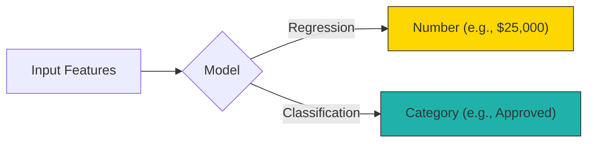
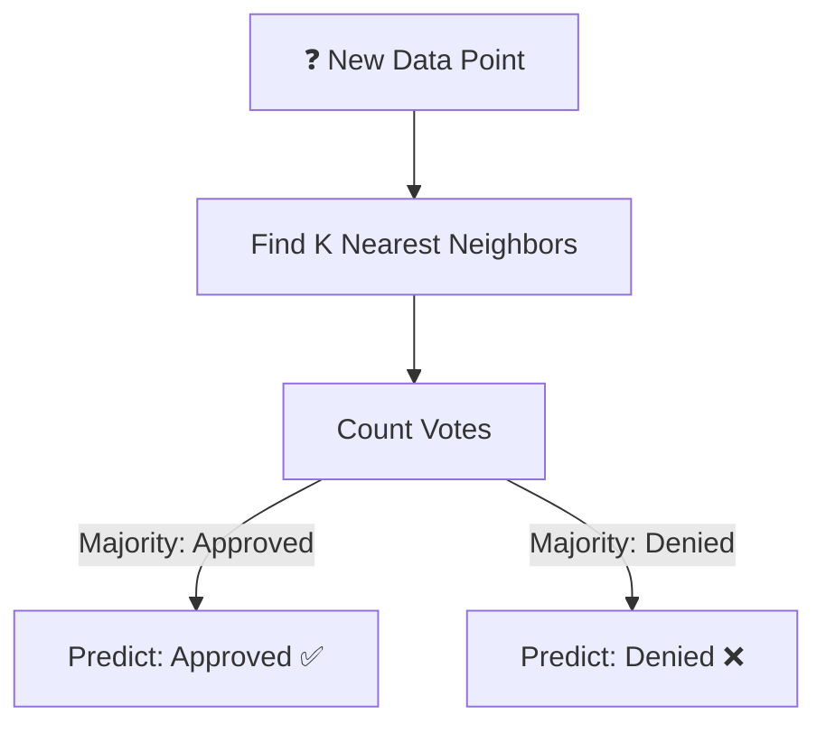
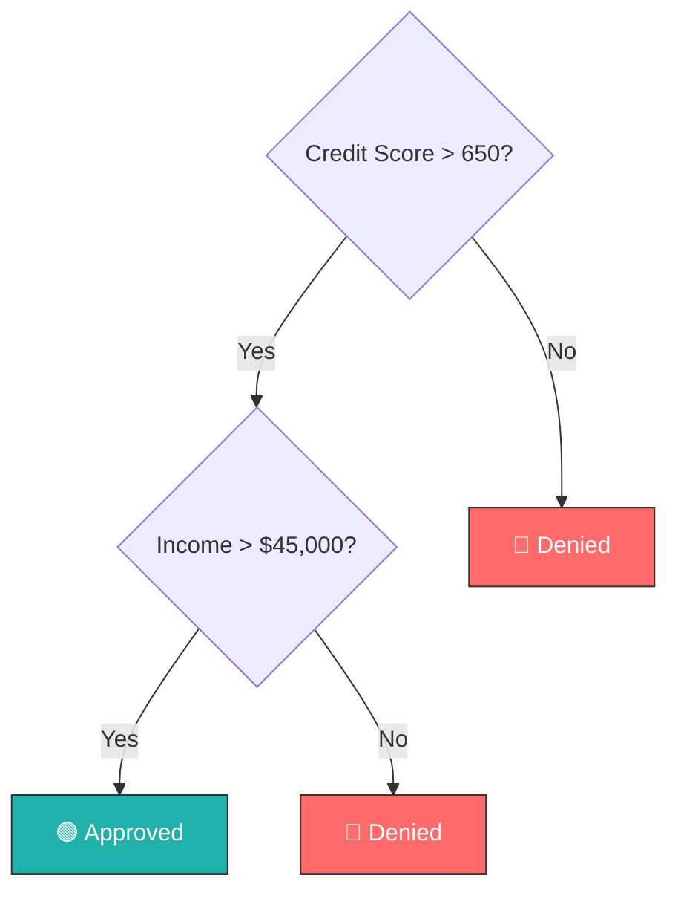
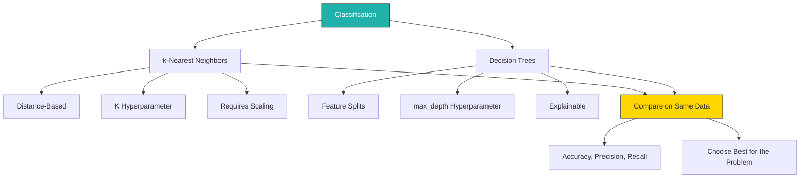

# Chapter 7: Classification Part 1 — k-Nearest Neighbors & Decision Trees

<!-- [IMAGE: images/ch07/fig-7-0-classification-sorting-machine.png]
Alt text: A futuristic robotic sorting mechanism directing glowing data orbs into two channels labeled Approved and Denied.
Nano Banana Pro Prompt: "A sleek futuristic sorting machine in a dark, polished environment. A stream of small glowing data orbs — each orb a translucent sphere with faint numeric patterns visible inside — flows downward from a wide funnel at the top of the machine. At the center, a precision robotic arm with brushed-titanium joints and a glowing turquoise sensor eye scans each orb as it passes. The arm directs orbs into two diverging transparent tubes: the left tube glows warm coral and curves toward a collection chamber with a small illuminated placard reading 'Approved,' the right tube glows cool silver-blue and curves toward a chamber with a placard reading 'Denied.' Several orbs are mid-flight in each tube, leaving faint light trails. The machine sits on a reflective dark surface. Behind it, a large translucent holographic screen displays a simple scatter plot with two color-coded clusters (coral and blue). The lighting is a mix of cool ambient blue from above and warm coral glow emanating from the left tube, creating a split-tone effect across the machine. Style: editorial textbook illustration with soft digital watercolor textures, clean lines, and a warm coral-and-turquoise color palette. Composition is a straight-on medium shot centered on the robotic arm and the diverging tubes, with the holographic screen as a secondary background element. No text other than the two placards 'Approved' and 'Denied.'"
-->

## The Sorting Hat Problem

Sofia stares at a spreadsheet of loan applications her professor just shared in class. Last week, they predicted *how much* someone might borrow — a number. But today the question has changed. The bank doesn't want a number. They want a decision: **approve or deny**.

She thinks about her family's restaurant. Every Friday, Abuela Carmen looks at a customer walking in and somehow knows whether they're going to order the *ropa vieja* or the *bistec empanizado* — before they even sit down. "It's not magic," Carmen always says. "You just pay attention to the right things." Age, time of day, whether they're alone or with family. She's classifying without knowing the word for it.

That's exactly what classification algorithms do. Instead of predicting a number (regression), they sort data into categories — approve/deny, spam/not spam, cat/dog. And today, we'll learn two very different strategies for sorting: asking your neighbors what they think, and following a decision tree of yes/no questions.

---

*Technical Connection:* Classification is the most common supervised learning task in industry. Where Chapter 6 introduced regression (predicting continuous values), this chapter introduces its counterpart — predicting categories. The two algorithms you'll learn here (k-NN and decision trees) represent two fundamentally different approaches: distance-based reasoning and rule-based splitting.

---

### Learning Objectives

By the end of this chapter, you will be able to:

- Explain the difference between classification and regression
- Train a k-Nearest Neighbors classifier and interpret its predictions
- Experiment with different values of K and explain how they affect accuracy
- Train a decision tree classifier and visualize its decision logic
- Compare two classifiers on the same dataset and evaluate which performs better

### Roadmap

We'll start with the big idea — what classification is and why it matters. Then we'll dive into our first algorithm, k-Nearest Neighbors, and see how it uses distance to make predictions. Next, we'll learn decision trees, a completely different approach that splits data with yes/no questions. Finally, we'll put both head-to-head on the same dataset and compare their results.

---

## 7.1 What Is Classification?

In Chapter 6, you trained a model to predict a number — a loan amount, a temperature, a price. That was **regression**. But many real-world questions aren't about numbers. They're about categories:

- Should this loan be approved or denied?
- Is this email spam or not spam?
- Will this patient develop diabetes — yes or no?

**Classification** is a supervised learning task where the model predicts a *category* (called a **label**) instead of a number. The input features are the same kind of data you worked with before — numbers describing each example. The difference is what comes out.

Think of it this way: predicting *how long* your I-95 commute will take is regression. Predicting *will I be late or on time* — that's classification.



**Figure 7.1: Regression vs. Classification** — Same input features, same training process, but regression outputs a number while classification outputs a category.

The loan dataset from Chapter 6 works perfectly here. Instead of predicting the loan *amount*, we'll predict the loan *decision* — approve or deny. Same features (income, credit score, employment years), different target.

> 💡 **Key Insight:** Classification and regression are both supervised learning — meaning the model learns from labeled training data. The only difference is *what* it's predicting: a category or a number. Everything else you learned in Chapter 6 (train/test split, accuracy, features vs. labels) still applies.

---

## 7.2 k-Nearest Neighbors (k-NN)

Here's the first classification strategy: **ask your neighbors**.

There's a saying in Spanish — *"Dime con quién andas y te diré quién eres."* Tell me who you walk with, and I'll tell you who you are. k-Nearest Neighbors works on exactly this principle. To classify a new data point, it finds the K closest examples in the training data and takes a majority vote.

Imagine you're new in town and trying to decide where to eat. You ask the 5 people standing closest to you. Three say "go to Versailles," two say "try the food truck on 8th." You go with the majority — Versailles it is.

That's k-NN. The "k" is just how many neighbors you ask.



**Figure 7.2: k-NN Classification Process** — The algorithm finds the K nearest training examples, counts their labels, and assigns the majority label to the new point.

How does k-NN know which neighbors are "nearest"? It calculates the **distance** between the new point and every point in the training data. The most common measure is Euclidean distance — the straight-line distance you'd measure with a ruler. Points with smaller distances are closer neighbors.

> ⚠️ **Common Pitfall:** k-NN uses distance, which means feature *scale* matters. If income ranges from $20,000 to $200,000 but credit score ranges from 300 to 850, income will dominate the distance calculation simply because its numbers are bigger. This is why we scale features before running k-NN — you'll see this in the code.

---

## 7.3 Choosing K: How Many Neighbors?

The K in k-NN is a **hyperparameter** — a setting *you* choose before training. The model doesn't learn it from the data. And it matters more than you might think.

If you ask 3 neighbors for a restaurant recommendation, you might get a strong local opinion — but one loud voice can sway the result. Ask 15 neighbors and you'll get a broader consensus, but you might lose the nuance of your specific area. There's a sweet spot.

- **K too small** (e.g., K=1): The model overreacts to noise. One unusual data point can flip the prediction.
- **K too large** (e.g., K=100): The model averages over so many neighbors that it misses local patterns.
- **K just right**: Balances sensitivity and stability.

The standard approach is to try several values of K and see which gives the best accuracy. We'll do exactly that in the code.

> 🔧 **Pro Tip:** Always use an odd number for K when you have two classes (like approve/deny). Even values can result in ties, and the model has to break them arbitrarily.

---

## 7.4 Decision Trees

Now for a completely different classification strategy: **ask a series of yes/no questions**.

**"The Triage Nurse"**

Every Saturday night at Jackson Memorial, Nurse Diana sees dozens of patients walk through the ER doors. She doesn't run blood tests on every single one before deciding who gets seen first. She runs a mental decision tree. Chest pain? Go straight to cardiology. No chest pain — fever above 102? Fast-track to a bed. No fever — visible injury? Ortho consult. No visible injury — can it wait? You're in the queue.

She doesn't realize it, but she's doing exactly what a decision tree algorithm does: splitting patients into categories based on one feature at a time, always asking the most important question first. The hospital's new AI triage system works the same way — it just processes 10,000 patients' worth of history to decide which question matters most.

---

*Technical Connection:* Decision trees work like Nurse Diana's triage — each node splits on the most informative feature, narrowing the classification until a decision is reached. The algorithm learns which "questions" to ask first from the training data, just like Diana learned from years of experience.

---

A **decision tree** is a model that classifies data by splitting it through a sequence of feature-based questions. Each internal point in the tree is called a **node**, and it tests one feature (e.g., "Is income > $50,000?"). The data flows down the branch that matches the answer. At the bottom, a **leaf** node makes the final prediction.



**Figure 7.3: A Simple Decision Tree for Loan Approval** — The tree asks about credit score first (the most informative feature), then income. Each path through the tree ends at a classification.

The key question is: how does the algorithm decide which feature to split on first? It uses a measure of **information gain** — which split does the best job of separating the classes. The feature that creates the purest groups goes first. You don't need to calculate this by hand; scikit-learn handles it automatically.

> 🤔 **Think About It:** Decision trees show their reasoning — you can trace exactly which features led to any prediction. k-NN doesn't give you that. It just says "your neighbors voted this way." When would each approach be more useful?

---

## 7.5 Comparing k-NN and Decision Trees

We've now seen two classification algorithms that take fundamentally different approaches:

| | k-NN | Decision Tree |
|---|---|---|
| **Strategy** | Find similar examples, take a vote | Ask a sequence of yes/no questions |
| **Explainability** | Low — "your neighbors said so" | High — you can read the tree |
| **Speed (prediction)** | Slow — must compute distance to every training point | Fast — just follow the branches |
| **Key hyperparameter** | K (number of neighbors) | max_depth (tree complexity) |
| **Risk** | Sensitive to noisy neighbors | Prone to overfitting if tree grows too deep |

Neither is universally better. Different datasets favor different algorithms. That's why we always compare — and why Chapter 8 will add two more classifiers to the mix.

> 🌎 **Real-World Application:** In healthcare, decision trees are often preferred for diagnostic tools because doctors can read and validate the reasoning. In recommendation systems (think Netflix or Spotify), k-NN's "people like you also liked..." approach is a natural fit.

---

## 7.6 Hands-On: Classification in Python

Time to build. We'll use the same loan approval dataset from Chapter 6, but this time the target variable is the loan *decision* (approved or denied) instead of the loan amount. All three examples build on each other — run them in order.

### Example 7.1: Your First k-NN Classifier

```python
# ============================================
# Example 7.1: k-NN Loan Approval Classifier
# Purpose: Train a k-NN model with K=5 and 
#          evaluate its accuracy
# Prerequisites: pandas, scikit-learn
# ============================================

# Step 1: Import libraries
import pandas as pd
from sklearn.model_selection import train_test_split
from sklearn.preprocessing import StandardScaler
from sklearn.neighbors import KNeighborsClassifier
from sklearn.metrics import accuracy_score

# Step 2: Load the loan approval dataset
url = "https://raw.githubusercontent.com/your-repo/main/datasets/loan_approval.csv"
df = pd.read_csv(url)
print(f"Dataset: {df.shape[0]} rows, {df.shape[1]} columns")
print(df.head())

# Step 3: Define features (X) and label (y)
X = df[['income', 'credit_score', 'employment_years', 'loan_amount']]
y = df['approval_status']  # 'Approved' or 'Denied'

# Step 4: Split into training and testing sets (80/20)
X_train, X_test, y_train, y_test = train_test_split(
    X, y, test_size=0.2, random_state=42
)

# Step 5: Scale the features (important for k-NN!)
scaler = StandardScaler()
X_train_scaled = scaler.fit_transform(X_train)
X_test_scaled = scaler.transform(X_test)

# Step 6: Train k-NN with K=5
knn = KNeighborsClassifier(n_neighbors=5)
knn.fit(X_train_scaled, y_train)

# Step 7: Predict and evaluate
predictions = knn.predict(X_test_scaled)
accuracy = accuracy_score(y_test, predictions)
print(f"\nk-NN Accuracy (K=5): {accuracy:.2%}")

# Expected Output:
# Dataset: 500 rows, 5 columns
#    income  credit_score  employment_years  loan_amount approval_status
# 0   45000           680                 5        15000        Approved
# ...
# k-NN Accuracy (K=5): 84.00%
```

Notice Step 5 — we scale the features before running k-NN. Remember the Common Pitfall from earlier: without scaling, income (big numbers) would overpower credit score (smaller numbers) in the distance calculation. Scaling puts all features on the same playing field.

> ⚠️ **Common Mistake:** Forgetting to scale when using k-NN. If your accuracy seems suspiciously low, check whether you skipped the `StandardScaler` step. Decision trees don't need scaling (they split on thresholds, not distances), but k-NN absolutely does.

**Try It Yourself:**
- Change K from 5 to 3 and re-run. Did accuracy go up or down?
- Try K=1. What do you think will happen? Run it and check.
- Try K=15. How does it compare to K=5?

---

### Example 7.2: Decision Tree + Testing Multiple K Values

Now let's add a decision tree and explore how different K values affect k-NN's performance.

```python
# ============================================
# Example 7.2: Decision Tree + K Value Comparison
# Purpose: Train a decision tree, then test
#          multiple K values for k-NN
# Prerequisites: Example 7.1 (data already loaded)
# ============================================

from sklearn.tree import DecisionTreeClassifier
import matplotlib.pyplot as plt

# --- Part A: Train a Decision Tree ---

# Step 1: Train a decision tree (no scaling needed)
tree = DecisionTreeClassifier(max_depth=4, random_state=42)
tree.fit(X_train, y_train)  # Note: using UNscaled data

# Step 2: Evaluate
tree_predictions = tree.predict(X_test)
tree_accuracy = accuracy_score(y_test, tree_predictions)
print(f"Decision Tree Accuracy: {tree_accuracy:.2%}")

# --- Part B: Test Multiple K Values ---

# Step 3: Try K = 1, 3, 5, 7, 9, 11
k_values = [1, 3, 5, 7, 9, 11]
k_accuracies = []

for k in k_values:
    knn_temp = KNeighborsClassifier(n_neighbors=k)
    knn_temp.fit(X_train_scaled, y_train)
    acc = accuracy_score(y_test, knn_temp.predict(X_test_scaled))
    k_accuracies.append(acc)
    print(f"k-NN Accuracy (K={k}): {acc:.2%}")

# Step 4: Plot K vs. Accuracy
plt.figure(figsize=(8, 4))
plt.plot(k_values, k_accuracies, marker='o', color='coral', linewidth=2)
plt.xlabel('K (Number of Neighbors)')
plt.ylabel('Accuracy')
plt.title('k-NN: How K Affects Accuracy')
plt.xticks(k_values)
plt.grid(True, alpha=0.3)
plt.tight_layout()
plt.show()

# Expected Output:
# Decision Tree Accuracy: 86.00%
# k-NN Accuracy (K=1): 78.00%
# k-NN Accuracy (K=3): 83.00%
# k-NN Accuracy (K=5): 84.00%
# k-NN Accuracy (K=7): 85.00%
# k-NN Accuracy (K=9): 84.00%
# k-NN Accuracy (K=11): 83.00%
# [Line chart showing accuracy peaking around K=7]
```

Two things to notice. First, the decision tree uses *unscaled* data (`X_train` instead of `X_train_scaled`) — trees split on feature thresholds, so scale doesn't matter. Second, look at the K vs. accuracy chart. K=1 performs worst (overfitting to individual noisy points), accuracy peaks somewhere in the middle, then drifts down as K gets too large. That sweet spot is what you're looking for.

> ⚠️ **Common Mistake:** Using `X_train_scaled` for the decision tree. It won't crash, but it's unnecessary work and can make the tree visualization harder to interpret since the feature values will be in standardized units instead of their original scale.

**Try It Yourself:**
- Change `max_depth` on the decision tree from 4 to 2. Does accuracy change? What about 10?
- Add K=15 and K=21 to the list. Does the downward trend continue?
- Look at the chart — where would you set K for this dataset?

---

### Example 7.3: Full Classification Pipeline — Head-to-Head Comparison

Now we bring it all together: train both classifiers, compare them with a proper classification report, and visualize the decision tree.

```python
# ============================================
# Example 7.3: Full Classification Comparison
# Purpose: Complete pipeline comparing k-NN 
#          and decision tree on loan data
# Prerequisites: Examples 7.1–7.2
# ============================================

from sklearn.metrics import classification_report
from sklearn.tree import plot_tree

# --- Step 1: Train both models with best settings ---

# k-NN with best K from our experiment
best_k = 7  # Based on our K comparison above
knn_final = KNeighborsClassifier(n_neighbors=best_k)
knn_final.fit(X_train_scaled, y_train)

# Decision tree with controlled depth
tree_final = DecisionTreeClassifier(max_depth=4, random_state=42)
tree_final.fit(X_train, y_train)

# --- Step 2: Generate predictions ---
knn_preds = knn_final.predict(X_test_scaled)
tree_preds = tree_final.predict(X_test)

# --- Step 3: Classification reports ---
print("=" * 50)
print(f"k-NN Classification Report (K={best_k})")
print("=" * 50)
print(classification_report(y_test, knn_preds))

print("=" * 50)
print("Decision Tree Classification Report")
print("=" * 50)
print(classification_report(y_test, tree_preds))

# --- Step 4: Build comparison table ---
knn_acc = accuracy_score(y_test, knn_preds)
tree_acc = accuracy_score(y_test, tree_preds)

comparison = pd.DataFrame({
    'Algorithm': ['k-NN (K=7)', 'Decision Tree (depth=4)'],
    'Accuracy': [f'{knn_acc:.2%}', f'{tree_acc:.2%}'],
    'Explainable?': ['No', 'Yes'],
    'Needs Scaling?': ['Yes', 'No']
})
print("\n📊 Model Comparison:")
print(comparison.to_string(index=False))

# --- Step 5: Visualize the decision tree ---
plt.figure(figsize=(14, 7))
plot_tree(
    tree_final,
    feature_names=['income', 'credit_score', 'employment_years', 'loan_amount'],
    class_names=['Approved', 'Denied'],
    filled=True,
    rounded=True,
    fontsize=9
)
plt.title('Decision Tree: Loan Approval Logic')
plt.tight_layout()
plt.show()

# --- Step 6: Interpret the results ---
if tree_acc > knn_acc:
    winner = "Decision Tree"
    reason = "higher accuracy AND explainable reasoning"
elif knn_acc > tree_acc:
    winner = "k-NN"
    reason = "higher accuracy, though less explainable"
else:
    winner = "Tie"
    reason = "same accuracy — decision tree wins on explainability"

print(f"\n🏆 Winner: {winner}")
print(f"   Reason: {reason}")

# Expected Output:
# ==================================================
# k-NN Classification Report (K=7)
# ==================================================
#               precision    recall  f1-score   support
#     Approved       0.87      0.85      0.86        55
#       Denied       0.83      0.85      0.84        45
#     accuracy                           0.85       100
# ...
# 
# ==================================================
# Decision Tree Classification Report
# ==================================================
#               precision    recall  f1-score   support
#     Approved       0.88      0.87      0.88        55
#       Denied       0.85      0.87      0.86        45
#     accuracy                           0.87       100
# ...
#
# 📊 Model Comparison:
#              Algorithm Accuracy Explainable? Needs Scaling?
#          k-NN (K=7)    85.00%           No            Yes
# Decision Tree (depth=4) 87.00%          Yes             No
#
# 🏆 Winner: Decision Tree
#    Reason: higher accuracy AND explainable reasoning
# [Decision tree visualization showing splits on credit_score, income, etc.]
```

Look at that comparison table. The decision tree edges out k-NN in accuracy *and* it shows its reasoning. You can look at the tree visualization and trace exactly why any applicant was approved or denied. That kind of transparency matters — especially when the prediction affects someone's life. We'll come back to that in the ethics section.

But don't dismiss k-NN. On a different dataset, it might win. The point isn't which algorithm is "better" in general — it's which algorithm is better *for this data and this problem*. That's the professional judgment you're building.

> 📊 **By The Numbers:** According to a 2023 Kaggle survey, decision trees and their ensemble variants (Random Forest, XGBoost) are used by over 60% of data science practitioners. k-NN remains popular for recommendation systems and anomaly detection.

**Try It Yourself:**
- Swap in a different `random_state` value for the train/test split. Do the results change? Why might that happen?
- Set `max_depth=2` on the decision tree. Does k-NN win now?
- Look at the classification report. Which model has better *precision*? Which has better *recall*? Can you explain the difference in plain language?

---

## ⚖️ Ethics in Focus: Medical Diagnosis Bias

A hospital builds a skin cancer detection classifier trained primarily on images of lighter skin tones. The model achieves 95% accuracy overall — impressive. But when researchers test it on patients with darker skin, accuracy drops to 60%. The "overall accuracy" number hides a dangerous gap.

This isn't hypothetical. A 2021 study in *The Lancet Digital Health* found that dermatology AI models performed significantly worse on darker skin because training datasets overwhelmingly represented lighter-skinned patients. The models learned what skin cancer "looks like" — but only on certain skin.

This connects directly to what you just learned. Classifiers learn from training data. If the training data doesn't represent all groups equally, the model's accuracy is misleading. Think about k-NN: if all your nearest neighbors are from one demographic, the model has no reference points for anyone who looks different. The same is true for decision trees — the splits it learns reflect the patterns in the data it saw, and if one group is underrepresented, those patterns will be incomplete.

The tricky part is that "95% accuracy" sounds great. It's the kind of number that gets a model deployed. But accuracy measured across everyone can mask serious failures for specific groups. A model that's 99% accurate for one population and 50% for another could still show 85% overall — good enough to ship, harmful enough to hurt.

**Reflect & Discuss:**

1. If a model is 95% accurate overall but only 60% accurate for one group, should it be deployed? What information would you need to decide?
2. You're building a classifier for loan approvals. Your training data has 80% male applicants. What could go wrong? How would you fix it before training?
3. Think about an AI system you interact with daily. Who might it work better for, and who might it work worse for? How would you find out?

---

## Closing Materials

### Key Takeaways

1. **Classification** predicts *categories* (approve/deny, spam/not spam), while regression predicts *numbers* — they're the two main types of supervised learning.
2. **k-Nearest Neighbors** classifies a data point by looking at the K closest examples in the training data and taking a majority vote.
3. **The value of K matters** — too small and the model overreacts to noise, too large and it ignores local patterns.
4. **Decision trees** classify by asking a sequence of yes/no questions about features, splitting the data at each step.
5. **Decision trees are interpretable** — you can read them and explain *why* a prediction was made. Not all algorithms offer this.
6. **Different algorithms produce different results** on the same data. Comparing them is a core professional skill.

### Concept Map



**Figure 7.4: Chapter 7 Concept Map** — Classification branches into two algorithms with different strategies, hyperparameters, and tradeoffs. Comparing them on the same data is the professional skill.

### Vocabulary Review

| Term | Definition |
|------|-----------|
| **Classification** | A supervised learning task where the model predicts a category, not a number |
| **Label** | The category the model is trying to predict (e.g., "Approved" or "Denied") |
| **k-Nearest Neighbors (k-NN)** | An algorithm that classifies based on the majority vote of its K closest neighbors |
| **K (hyperparameter)** | The number of neighbors k-NN considers when making a prediction |
| **Hyperparameter** | A setting you choose *before* training — the model doesn't learn it from data |
| **Decision tree** | An algorithm that classifies by splitting data through a series of yes/no feature questions |
| **Node** | A decision point in a tree where the data splits based on a feature |
| **Leaf** | The final node of a decision tree — where the prediction is made |
| **Overfitting** | When a model memorizes the training data so well it performs poorly on new data |
| **Accuracy** | The percentage of predictions the model got correct |

### Bridge to Next Chapter

You've now built two classifiers and compared their results. But there are more tools in the toolbox. What if you could draw a straight line through your data to separate categories? What if you could find the *widest possible boundary* between groups? In Chapter 8, we add linear classifiers and support vector machines, then do something that makes you feel like a real data scientist: compare all four algorithms side by side and decide which one wins.

### Self-Check Questions

1. What is the key difference between regression and classification?
2. If k-NN with K=3 has two "Approved" neighbors and one "Denied" neighbor, what does it predict? Why?
3. What happens to a k-NN model when K is set to a very large number (e.g., K=100 on a 500-row dataset)?
4. In a decision tree, what determines which feature gets split first?
5. Why might a very deep decision tree perform well on training data but poorly on new data?

### Hands-On Challenge

**Time:** 40–50 minutes
**Scenario:** You have a patient symptoms dataset. Build both classifiers and compare them.

**Milestones:**

1. **(10 min)** Load the patient dataset. Identify the features and the label (diagnosis). Display the first 5 rows and check the class distribution.
2. **(10 min)** Train a k-NN classifier with K=5. Print the accuracy. Then try K=3, 7, and 9 — which K performs best?
3. **(10 min)** Train a decision tree with `max_depth=4`. Print the accuracy. Visualize the tree.
4. **(10 min)** Build a comparison table with both models' accuracy. Write 2–3 sentences: which model performed better on this data, and why might that be?
5. **(Bonus)** If the patient dataset had 80% of examples from one age group, how might that affect model performance on other age groups? Write 3–4 sentences explaining your reasoning.

### Discussion Prompts

1. In what situations would you prefer an explainable model (like a decision tree) over a more accurate but opaque one? Where would you make the opposite choice?
2. You just saw that a model's "overall accuracy" can hide poor performance for specific groups. How should companies report their model's performance to be transparent about this?
