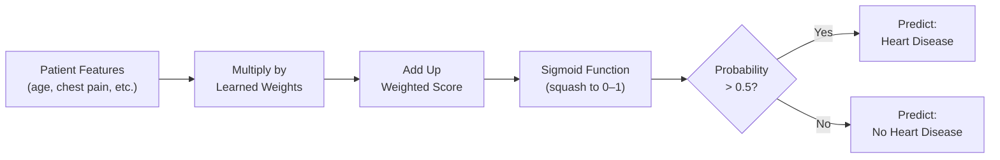
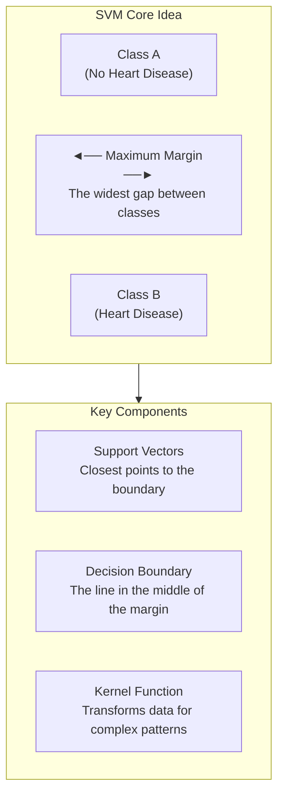
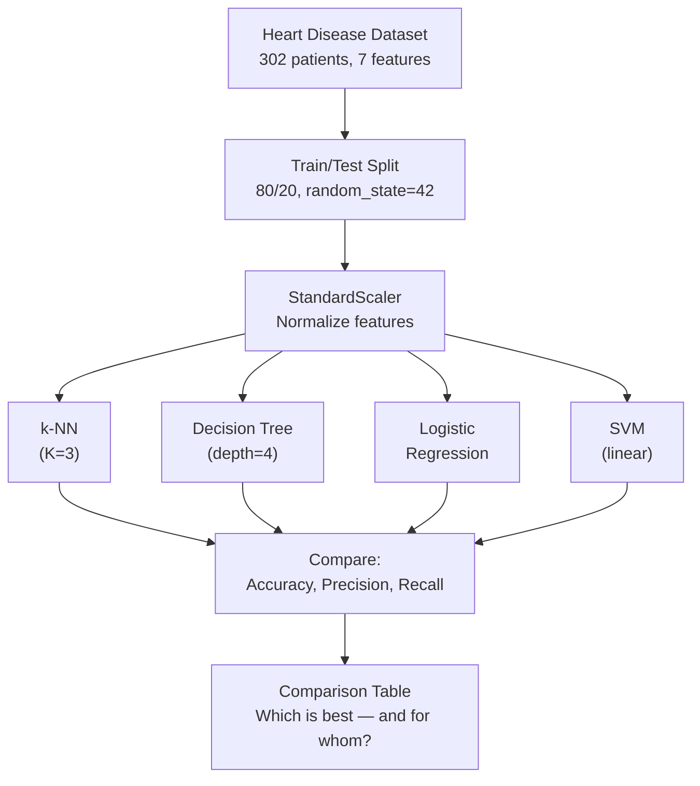
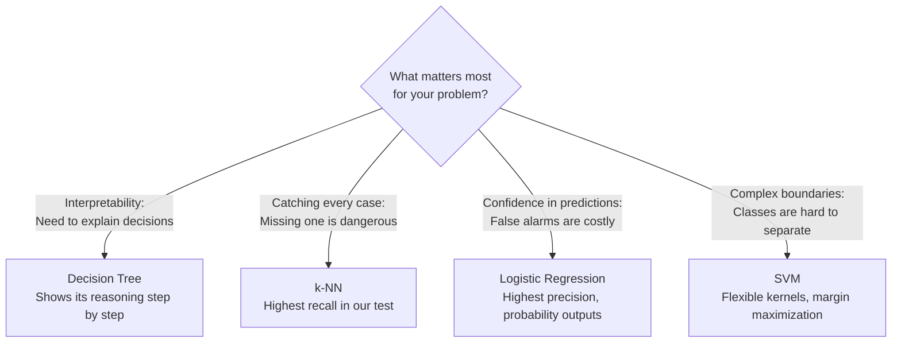
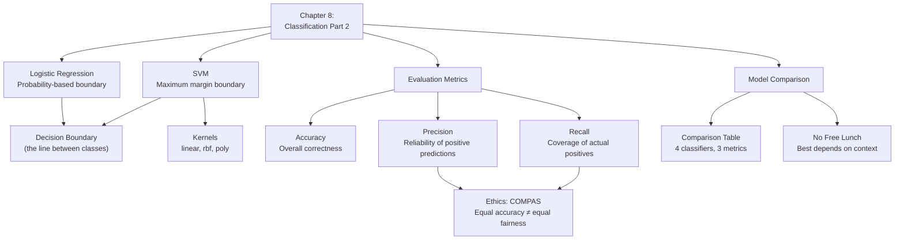

# Chapter 8: Classification Part 2 — Linear Classifiers & Support Vector Machines

<!-- [IMAGE: images/ch08/fig-8-0-four-robotic-sorters.png]
Alt text: Four sleek robotic sorting arms arranged around a circular conveyor belt, each using a different sorting mechanism — proximity sensors, branching rails, a laser dividing line, and a glowing margin corridor — to sort geometric data objects in a futuristic facility.
Nano Banana Pro Prompt: "Four sleek robotic sorting arms arranged in a circle around a central circular conveyor belt in a futuristic data processing facility. Each arm has a distinct sorting mechanism: the first uses an array of small blue proximity sensors to scan nearby objects on the belt (k-NN), the second follows a branching metallic rail system with decision nodes marked by small amber indicator lights (decision tree), the third projects a sharp coral-colored laser line across the belt surface dividing objects into two clean zones (linear classifier), and the fourth generates a wide turquoise glowing margin corridor between two groups of objects with small highlighted anchor points at the corridor edges (SVM). The conveyor belt carries dozens of small glowing geometric data objects — spheres and cubes in coral and turquoise colors. The facility has polished dark floors reflecting the colored light and subtle ambient lighting from recessed ceiling panels. The primary light comes from the glowing mechanisms and data objects themselves, creating colorful reflections on the brushed-aluminum robotic arms and the dark conveyor surface. Style: editorial textbook illustration with soft digital watercolor textures, clean lines, and a warm coral-and-turquoise color palette. Composition is a slight overhead angle centered on the circular conveyor belt, with all four robotic arms visible and balanced in the frame, each occupying a quadrant. No text or labels in this image."
-->

## Four Opinions, One Question

Sofia stares at the staffing whiteboard for Friday night. She's been running her family's restaurant long enough to know that *under*staffing means disaster and *over*staffing means wasted payroll — but the reservation count is sitting right on the edge, and she can't decide.

So she asks four people.

Abuela Carmen checks what happened on *similar* Friday nights — same season, similar reservation count, comparable weather. "Mija, last three Fridays like this were packed. Full staff." That's the k-NN approach from Chapter 7: look at the nearest neighbors and go with the majority.

Her cousin Miguel has a strict checklist. "More than 35 reservations? Full staff. Less than 25? Skeleton crew. Between 25 and 35? Check if there's an event at FIU." That's a decision tree — follow the rules, branch by branch.

Her mom draws a simple line. "Sofia, if reservations are above 30, it's full staff. Below 30, it's not. Don't overthink it." A straight cutoff. Simple, clear, and surprisingly effective — that's a **linear classifier**.

Her dad takes a different angle. "Forget the exact number. Find the zone where you're *most uncertain* — that gap between 'definitely slow' and 'definitely busy' — and make the widest buffer you can around it. That's where the real decision matters." He's not just drawing a line — he's finding the line with the most breathing room on both sides. That's a **support vector machine**.

Four people. Four strategies. Same question. The interesting part? They don't all agree. And figuring out *which* advice to follow is where the real skill lives.

---

*Technical Connection*: In Chapter 7, you learned two classification algorithms — k-Nearest Neighbors and decision trees. This chapter adds two more: logistic regression (Mom's straight line) and support vector machines (Dad's maximum-margin approach). By the end, you'll run all four on the same dataset and build a comparison table — the professional skill of knowing which tool fits which situation.

---

### Learning Objectives

By the end of this chapter, you will be able to:

- Train a logistic regression classifier and interpret its probability-based predictions
- Train a support vector machine and explain how margin maximization works
- Read a classification report and distinguish between precision and recall
- Compare four classifiers side by side and make a reasoned judgment about which performs best for a given problem

### Roadmap

We'll start with logistic regression — the simplest linear classifier — then move to SVMs and their margin-based approach. After running both on our heart disease dataset, we'll build the chapter's centerpiece: a four-classifier comparison table that puts all the algorithms side by side. Finally, we'll examine how classification algorithms have been used in criminal justice, and why "accurate" doesn't always mean "fair."

---

## 8.1 Logistic Regression: Drawing a Decision Line

Here's an idea that sounds strange but works beautifully: what if, instead of measuring distances to neighbors (k-NN) or following a tree of rules (decision trees), you just drew a line through your data?

Everything on one side of the line is Class A. Everything on the other side is Class B. Done.

That's logistic regression. Despite the confusing name — it's classification, not regression — it's one of the most widely used algorithms in the world. Banks use it for credit decisions. Hospitals use it for risk assessment. Email providers use it for spam detection.

> ⚠️ **Common Pitfall**: The name "logistic *regression*" trips everyone up. It's called that because of the math underneath (a logistic function), but its job is classification — assigning labels, not predicting numbers. If someone asks "is this regression or classification?" the answer is classification.

### How It Works

Logistic regression takes each feature in your data, assigns it a **weight** (how much it matters), and combines them into a single score. Then it converts that score into a **probability** between 0 and 1 using something called the **sigmoid function** — an S-shaped curve that squashes any number into the 0-to-1 range.

If the probability is above 0.5, the model predicts "yes" (heart disease). Below 0.5, it predicts "no." That 0.5 cutoff is the decision boundary — the line in the sand.

Think of it like drawing a line at the beach between the swim zone and the no-swim zone. Everything on one side gets one label, everything on the other side gets the other. The line is straight, the rule is simple, and for many real-world problems, it works surprisingly well.



**Figure 8.1: How Logistic Regression Makes a Prediction** — Features are weighted, summed, converted to a probability via the sigmoid function, then thresholded at 0.5 to produce a label.

### Let's See It in Code

We'll use the same heart disease dataset from Chapter 7 — 302 patients, 7 features, predicting whether each patient has heart disease. Since you already know this data, we can focus entirely on the new algorithm.

One important addition: we're introducing **StandardScaler** this time. Back in Chapter 7, we mentioned that k-NN measures distances between data points. When features are on wildly different scales — age ranges from 29 to 77, while exercise_angina is just 0 or 1 — the larger numbers dominate the distance calculation. Scaling puts all features on the same playing field.

> 💡 **Key Insight**: Scaling matters for algorithms that use distances or weights (k-NN, logistic regression, SVM). Decision trees don't care about scale — they just split on thresholds. This is why we scale *before* training for a fair comparison.

```python
# ============================================
# Example 8.1: Your First Logistic Regression
# Purpose: Train a logistic regression classifier 
#          and compare to Chapter 7's results
# Prerequisites: scikit-learn, pandas
# ============================================

# Step 1: Import libraries
import pandas as pd
from sklearn.model_selection import train_test_split
from sklearn.preprocessing import StandardScaler
from sklearn.linear_model import LogisticRegression
from sklearn.metrics import accuracy_score

# Step 2: Load the heart disease dataset (same as Chapter 7)
url = "https://raw.githubusercontent.com/c-marq/AI-Thinking-CAI1001C/refs/heads/main/07-Classification-Part-1/Datasets/heart_disease_patients.csv"
df = pd.read_csv(url)

# Step 3: Separate features (X) and target (y)
X = df.drop('heart_disease', axis=1)
y = df['heart_disease']

# Step 4: Split into training and testing sets
X_train, X_test, y_train, y_test = train_test_split(
    X, y, test_size=0.2, random_state=42
)

# Step 5: Scale features so all are on the same playing field
scaler = StandardScaler()
X_train_scaled = scaler.fit_transform(X_train)
X_test_scaled = scaler.transform(X_test)

# Step 6: Train logistic regression
lr = LogisticRegression(max_iter=1000, random_state=42)
lr.fit(X_train_scaled, y_train)

# Step 7: Evaluate
lr_accuracy = accuracy_score(y_test, lr.predict(X_test_scaled))
print(f"Logistic Regression accuracy: {lr_accuracy * 100:.2f}%")

# Expected Output:
# Logistic Regression accuracy: 81.97%
```

Logistic regression scores **81.97%** — exactly the same as our k-NN result from Chapter 7. Two completely different algorithms, same accuracy. That tie is actually informative: it suggests this dataset has a natural "ceiling" around 82% for simple models. Let's see if SVM can break through.

> 🔧 **Pro Tip**: We set `max_iter=1000` to give the algorithm enough iterations to find its best weights. With scaled data, it usually converges fast. If you ever see a `ConvergenceWarning`, try increasing `max_iter` or check that your data is scaled.

**Try It Yourself**: Logistic regression outputs probabilities, not just labels. Add this line after the model is trained: `print(lr.predict_proba(X_test_scaled)[:5])`. You'll see two columns — the probability of "No Heart Disease" and "Heart Disease" for the first 5 patients. Which patient is the model most confident about? Which is closest to the 0.5 line?

---

## 8.2 Support Vector Machines: Finding the Widest Margin

Logistic regression finds *a* line that separates the classes. But there are infinitely many lines that could work. SVM asks a better question: **which line gives the most breathing room?**

Picture two Miami neighborhoods — Brickell and Wynwood — separated by a street. You could draw the boundary line anywhere on that street. But SVM finds the widest possible street — the one that maximizes the gap between the closest buildings on each side. Those closest buildings are the **support vectors**, and the width of the street is the **margin**.

Why does a wider margin matter? Because it gives the model more room for error. New data points that land in the margin area are harder to classify, and a wider margin means fewer of them.



**Figure 8.2: The SVM Concept** — SVM finds the decision boundary that maximizes the margin between classes. Support vectors are the data points closest to the boundary.

### Kernels: When a Straight Line Isn't Enough

Sometimes the classes can't be separated by a straight line — they're tangled together in complex patterns. SVM handles this with **kernels** — mathematical functions that transform the data into a higher dimension where a straight line *can* separate them.

The three kernels you'll encounter most:

- **`linear`**: Draws a straight line. Best when the data is already fairly separable.
- **`rbf`** (radial basis function): Creates curved, flexible boundaries. The default in scikit-learn.
- **`poly`**: Creates polynomial (curved) boundaries. Good for moderately complex patterns.

```python
# ============================================
# Example 8.2: SVM with Kernel Exploration
# Purpose: Train SVMs with different kernels,
#          introduce the classification report
# Prerequisites: Example 8.1 (data already loaded and scaled)
# ============================================

# Step 1: Import SVM and classification report
from sklearn.svm import SVC
from sklearn.metrics import classification_report

# Step 2: Train SVM with linear kernel
svm_linear = SVC(kernel='linear', random_state=42)
svm_linear.fit(X_train_scaled, y_train)
linear_accuracy = accuracy_score(y_test, svm_linear.predict(X_test_scaled))
print(f"SVM (linear kernel): {linear_accuracy * 100:.2f}%")

# Step 3: Train SVM with rbf kernel
svm_rbf = SVC(kernel='rbf', random_state=42)
svm_rbf.fit(X_train_scaled, y_train)
rbf_accuracy = accuracy_score(y_test, svm_rbf.predict(X_test_scaled))
print(f"SVM (rbf kernel):    {rbf_accuracy * 100:.2f}%")

# Step 4: Print classification report for the better kernel
print("\nClassification Report — SVM (linear):")
print(classification_report(
    y_test, svm_linear.predict(X_test_scaled),
    target_names=['No Heart Disease', 'Heart Disease']
))

# Expected Output:
# SVM (linear kernel): 81.97%
# SVM (rbf kernel):    77.05%
#
# Classification Report — SVM (linear):
#                   precision    recall  f1-score   support
#
# No Heart Disease       0.76      0.90      0.83        29
#    Heart Disease       0.89      0.75      0.81        32
#
#         accuracy                           0.82        61
```

Two things to notice. First, the linear kernel (81.97%) beats rbf (77.05%) on this dataset. More complex isn't always better — sometimes the simplest approach wins. Second, and more important: look at that classification report. It tells a story that accuracy alone can't.

### Reading a Classification Report: Beyond Accuracy

The classification report introduces two critical metrics:

**Precision** answers: "When the model *says* heart disease, how often is it right?" Our SVM's precision for heart disease is 0.89 — when it flags someone, it's right 89% of the time. Only 3 out of 29 healthy patients got false alarms.

**Recall** answers: "Of all the people who *actually have* heart disease, how many did the model catch?" Our SVM's recall is 0.75 — it found 75% of actual cases but *missed* 25%. That means 8 out of 32 patients with heart disease walked away thinking they were fine.

Think of it like a bouncer at a Brickell club. A bouncer with **high precision** rarely lets in someone who shouldn't be there — but might turn away some VIPs. A bouncer with **high recall** makes sure every VIP gets in — but might let some crashers through too. You can't maximize both.

> 🤔 **Think About It**: In heart disease screening, which matters more — precision or recall? If precision is low, healthy people get unnecessary follow-up tests (stressful and expensive, but not dangerous). If recall is low, sick people get missed (potentially life-threatening). Most medical teams would sacrifice some precision to maximize recall.

**Try It Yourself**: Change the kernel to `'poly'` and run it. What accuracy do you get? Then try `SVC(kernel='rbf', C=10.0, random_state=42)` — the `C` parameter controls how hard the SVM tries to classify every training point correctly. Does a higher C help or hurt?

---

## Marcus at the Port

Marcus has been learning about cargo inspection at the Port of Miami, and his supervisor's explanation of how the new system works sounds oddly familiar.

"We used to rely on one approach," the supervisor explains. "Check the manifest, check the weight, make a call. But different inspectors had different strategies. Rodriguez always checked what *similar* containers held in the past — container from the same origin, same shipping line, similar weight. That's pattern matching." Marcus nods. Sounds like k-NN.

"Chen follows a decision flowchart the team built. Origin country? Check. Weight above threshold? Check. Declared contents match the category profile? Check." Decision tree, Marcus thinks.

"Thompson keeps it simple — anything above a certain risk score gets flagged, everything below doesn't. One clean line." Linear classifier.

"And Vasquez — she's the veteran — she focuses on the containers that are *barely* suspicious. The ones right on the edge. She says the obvious ones catch themselves; it's the borderline cases where experience matters." SVM margin, Marcus realizes. Focus on the boundary where it matters most.

"Now the new system runs all four approaches on every container. If two or more flag it, we inspect." The supervisor pauses. "No single method catches everything. But together, they're better than any one alone."

---

*Technical Connection*: Marcus's port scenario illustrates why comparing classifiers matters. Each algorithm has different strengths — k-NN is intuitive but sensitive to scale, decision trees are interpretable but can miss subtle patterns, linear classifiers are efficient but rigid, and SVMs handle boundary cases well. Running all four and comparing their results is exactly what you'll do next.

---

## 8.3 The Four-Classifier Showdown

This is the payoff. We're going to train all four classifiers on the same data, measure them on the same test set, and put the results side by side. This is what real data scientists do — they don't just pick one algorithm and hope. They compare.



**Figure 8.3: The Four-Classifier Comparison Workflow** — Same data, same split, same scaling, four different algorithms, one comparison table.

```python
# ============================================
# Example 8.3: The Four-Classifier Showdown
# Purpose: Train all four classifiers, build a
#          comparison table, interpret the results
# Prerequisites: Examples 8.1 and 8.2 (data loaded and scaled)
# ============================================

# Step 1: Import everything we need
from sklearn.neighbors import KNeighborsClassifier
from sklearn.tree import DecisionTreeClassifier
from sklearn.linear_model import LogisticRegression
from sklearn.svm import SVC
from sklearn.metrics import accuracy_score, precision_score, recall_score

# Step 2: Train all four classifiers
knn = KNeighborsClassifier(n_neighbors=3)
knn.fit(X_train_scaled, y_train)
knn_pred = knn.predict(X_test_scaled)

dt = DecisionTreeClassifier(max_depth=4, random_state=42)
dt.fit(X_train_scaled, y_train)
dt_pred = dt.predict(X_test_scaled)

lr = LogisticRegression(max_iter=1000, random_state=42)
lr.fit(X_train_scaled, y_train)
lr_pred = lr.predict(X_test_scaled)

svm = SVC(kernel='linear', random_state=42)
svm.fit(X_train_scaled, y_train)
svm_pred = svm.predict(X_test_scaled)

# Step 3: Build the comparison table
results = pd.DataFrame({
    'Classifier': ['k-NN (K=3)', 'Decision Tree (depth=4)',
                   'Logistic Regression', 'SVM (linear)'],
    'Accuracy (%)': [
        round(accuracy_score(y_test, knn_pred) * 100, 2),
        round(accuracy_score(y_test, dt_pred) * 100, 2),
        round(accuracy_score(y_test, lr_pred) * 100, 2),
        round(accuracy_score(y_test, svm_pred) * 100, 2)
    ],
    'Precision (%)': [
        round(precision_score(y_test, knn_pred) * 100, 2),
        round(precision_score(y_test, dt_pred) * 100, 2),
        round(precision_score(y_test, lr_pred) * 100, 2),
        round(precision_score(y_test, svm_pred) * 100, 2)
    ],
    'Recall (%)': [
        round(recall_score(y_test, knn_pred) * 100, 2),
        round(recall_score(y_test, dt_pred) * 100, 2),
        round(recall_score(y_test, lr_pred) * 100, 2),
        round(recall_score(y_test, svm_pred) * 100, 2)
    ]
})

# Step 4: Display and interpret
print("The Four-Classifier Comparison Table:\n")
print(results.to_string(index=False))

# Expected Output:
#              Classifier  Accuracy (%)  Precision (%)  Recall (%)
#              k-NN (K=3)         81.97          83.87       81.25
# Decision Tree (depth=4)         80.33          85.71       75.00
#     Logistic Regression         81.97          88.89       75.00
#            SVM (linear)         81.97          88.89       75.00
```

Look at that table. If you only checked accuracy, you'd shrug — three classifiers tied at 81.97%, decision tree slightly behind at 80.33%. Boring, right?

But now look at precision and recall. The story changes completely.

**k-NN is the best at finding sick patients.** Its recall of 81.25% means it caught 26 out of 32 heart disease cases — missing only 6. But its precision is the lowest at 83.87%, meaning it also triggered 5 false alarms among healthy patients.

**Logistic regression and SVM are the most precise.** Their 88.89% precision means when they flag someone, they're almost always right — only 3 false alarms. But their recall of 75.00% means they missed 8 out of 32 sick patients. Eight people walked out thinking they were healthy.

**The decision tree sits in the middle** — decent precision (85.71%), moderate recall (75.00%), but the lowest overall accuracy.

> 💡 **Key Insight**: Accuracy tells you the *overall* score. Precision and recall tell you *who pays the price* for the errors. In medical diagnosis, 8 missed heart disease cases is a very different problem than 5 unnecessary follow-up tests. The "best" classifier depends entirely on which error is more dangerous.

This is the lesson Sofia's family was teaching her: the best advice depends on what you're optimizing for. If missing a busy night costs more than overstaffing, go with the strategy that catches more busy nights (high recall). If wasting payroll is the bigger concern, go with the strategy that's right when it *does* predict busy (high precision).

> 📊 **By The Numbers**: Logistic regression and SVM produced *identical* results — same accuracy, same precision, same recall. This happens because both algorithms found the same linear decision boundary in this dataset. Two different approaches, same answer. When independent methods agree, you can be more confident in the result.

**Try It Yourself**: Change `test_size` from 0.2 to 0.3 and re-run the comparison. Do the rankings shift? (Spoiler: they do. Logistic regression pulls ahead at 83.52%, and k-NN drops to 72.53%. A single accuracy number on a single split isn't the final word.)

---

## 8.4 Choosing the Right Classifier

There's a principle in machine learning called **"no free lunch"** — no single algorithm is best for every problem. The right choice depends on your data, your goals, and what kind of errors you can afford.

Think of it like four different Waze routes to the same destination. One is fastest, one avoids tolls, one has the fewest turns, and one avoids highways. There's no "best route" in the abstract — only the best route *for your situation*.

Here's a simplified guide:



**Figure 8.4: A Starting Guide for Algorithm Selection** — The "best" classifier depends on your priorities. This is a starting point, not a rigid rule.

> 🌎 **Real-World Application**: In the real world, data scientists don't just pick one. They run multiple classifiers, compare metrics, and sometimes combine them. The four-classifier comparison table you just built is a standard industry practice — it's called **model selection**, and it's a skill hiring managers look for.

---

## ⚖️ Ethics in Focus: COMPAS and Criminal Justice

In 2016, a ProPublica investigation revealed something disturbing about an algorithm called **COMPAS** (Correctional Offender Management Profiling for Alternative Sanctions). Courts across the United States were using COMPAS to predict whether criminal defendants would re-offend — to help decide who gets bail, how long sentences should be, and who qualifies for parole.

COMPAS is a classifier. It sorts people into "high risk" and "low risk," just like our heart disease model sorts patients into "heart disease" and "no heart disease." And just like our model, its precision and recall told very different stories for different groups.

ProPublica found that Black defendants were almost twice as likely to be *incorrectly* flagged as high risk compared to white defendants with similar criminal histories. The model's overall accuracy looked reasonable — but the false positive rate was dramatically unequal. Healthy people getting an unnecessary follow-up test is one thing. Innocent people getting denied bail is another.

How did this happen? COMPAS used features like neighborhood, employment history, and family criminal record. It never used race directly. But those features *correlate* with race because of historical systemic inequalities — they're **proxy variables**. A model trained on historically biased data learns those biases, then reproduces them at scale and speed.

This connects directly to what you just learned. You saw that three classifiers can tie on accuracy while producing different precision and recall scores. Now imagine those differences aren't just between algorithms — they're between demographic groups *within* the same algorithm. Overall accuracy looks fine. But one group gets far more false positives. That's the COMPAS problem.

Abuela Carmen heard Sofia explaining this at dinner. She set down her cafecito and said, "So the computer is making the same mistakes people do, just faster." Prof. Reyes couldn't have said it better — COMPAS didn't create bias. It automated it.

**Reflect & Discuss:**

1. You just learned that precision and recall can tell different stories than accuracy alone. How could different error rates across demographic groups explain what happened with COMPAS? What would you look for in the classification report?
2. If you were advising a judge, what questions would you tell them to ask before trusting any AI prediction about a person's future behavior?
3. Should AI systems that affect people's freedom — criminal justice, immigration, child welfare — be required to pass fairness audits before deployment? Who should conduct them?

---

## Closing Materials

### Key Takeaways

- **Logistic regression** finds a decision boundary by converting weighted features into a probability through the sigmoid function, then classifying based on a 0.5 threshold.
- **Support vector machines** find the boundary with the widest margin between classes; the closest points to the boundary are called support vectors.
- **Scaling matters.** Algorithms that use distances or weights (k-NN, logistic regression, SVM) need features on the same scale. Decision trees don't — they split on thresholds regardless of magnitude.
- **Accuracy alone is misleading.** Precision tells you how reliable positive predictions are; recall tells you how many actual positives the model catches. Both are needed for a complete picture.
- **Different classifiers can produce different precision/recall tradeoffs on the same data** — k-NN caught 81.25% of heart disease cases but had more false alarms, while logistic regression and SVM were more precise but missed more actual cases.
- **No single classifier is always best.** Algorithm selection is a professional judgment that depends on the problem, the data, and the cost of different types of errors.

### Concept Map



**Figure 8.5: Chapter 8 Concept Map** — Logistic regression and SVM add two new approaches to classification. Precision and recall reveal what accuracy hides, connecting directly to questions of algorithmic fairness.

### Vocabulary Review

| Term | Definition |
|------|-----------|
| **Logistic regression** | A classifier that assigns weights to features, sums them, and converts the result to a probability using the sigmoid function |
| **Sigmoid function** | An S-shaped curve that squashes any number into a value between 0 and 1 |
| **Decision boundary** | The line (or surface) that separates one predicted class from another |
| **Support vector machine (SVM)** | A classifier that finds the decision boundary with the maximum margin between classes |
| **Margin** | The gap between the decision boundary and the nearest data points on each side |
| **Support vectors** | The data points closest to the decision boundary — they define the margin |
| **Kernel** | A function that transforms data into a higher-dimensional space where classes become more separable (linear, rbf, poly) |
| **Precision** | Of all the cases the model labeled positive, how many actually were? (reliability of positive predictions) |
| **Recall** | Of all actual positive cases, how many did the model catch? (coverage of real positives) |
| **Classification report** | A scikit-learn output showing precision, recall, and f1-score for each class |
| **Proxy variable** | A feature that indirectly encodes a protected attribute (e.g., neighborhood as a proxy for race) |
| **StandardScaler** | A preprocessing tool that transforms features to have mean=0 and standard deviation=1, putting all features on equal footing |

### Bridge to Next Chapter

We've now compared four classical classifiers. Each one draws a boundary, follows rules, or measures distances — approaches that a human could, in principle, trace and explain. But what happens when the patterns in the data are too complex, too layered, too curved for any of these approaches? What if we need a model that can learn *its own* rules?

That's where neural networks come in. In Chapter 9, we'll build a classifier inspired by the human brain — layers of artificial neurons that learn patterns no hand-drawn boundary could capture. The tradeoff? Power comes at a cost: when a neural network says "heart disease," it can't show you why.

### Self-Check Questions

1. What does logistic regression output — a class label directly, or a probability that's then converted to a label?
   *A probability (via the sigmoid function), then converted to a label using a 0.5 threshold.*

2. What makes SVM different from logistic regression, given that both draw decision boundaries?
   *SVM maximizes the margin — the gap between the boundary and the nearest points. Logistic regression finds a boundary but doesn't optimize for the widest margin.*

3. In our comparison, k-NN had the highest recall (81.25%) while logistic regression and SVM had the highest precision (88.89%). In a heart disease screening context, which tradeoff is more dangerous and why?
   *Lower recall is more dangerous — it means missing actual heart disease cases. Patients leave thinking they're healthy when they're not. Lower precision means extra follow-up tests, which is costly but not life-threatening.*

4. Why did we use StandardScaler before training, and which classifiers benefit from it?
   *StandardScaler normalizes features to the same scale. k-NN, logistic regression, and SVM all benefit because they rely on distances or feature weights. Decision trees don't need scaling — they split on thresholds regardless of magnitude.*

5. What is a proxy variable? Give an example from the COMPAS case.
   *A feature that indirectly encodes a protected attribute. In COMPAS, neighborhood and employment history served as proxies for race — they correlated with race due to systemic inequalities, even though race wasn't an explicit input.*

### Hands-On Challenge

**Time: 40–60 minutes | Dataset: Heart Disease Patients**

Build on today's four-classifier comparison to analyze which model best serves different clinical priorities:

1. **Run the four-classifier comparison** using the code from Example 8.3 (10 min)
2. **Modify and observe**: Change the k-NN value from K=3 to K=7, change the SVM kernel from 'linear' to 'rbf', and change the test_size from 0.2 to 0.25. Record how the comparison table changes each time (15 min)
3. **Analyze false negatives**: For each classifier, count how many heart disease patients were *missed*. Which classifier misses the fewest? (10 min)
4. **Write your recommendation**: You're advising a hospital on which classifier to use for initial heart disease screening. In 5–6 sentences, recommend one classifier and justify your choice using accuracy, precision, recall, and the false negative count. Address the tradeoff explicitly — what does your recommended model sacrifice, and why is that acceptable? (15 min)
5. **Ethics connection**: In 1 paragraph, connect the precision/recall tradeoff to the COMPAS case. How could different error rates across groups — even with the same overall accuracy — lead to unfair outcomes? (10 min)

### Discussion Prompts

1. Our comparison showed three classifiers tied at 81.97% accuracy but with different precision/recall profiles. If you were presenting these results to a non-technical hospital administrator, how would you explain why accuracy alone isn't enough?
2. The COMPAS algorithm was widely used for years before ProPublica's investigation. What systems or processes could prevent similar situations in the future?
3. Logistic regression and SVM produced identical results on this dataset. Does that make one of them unnecessary, or is there value in running both? Why?
