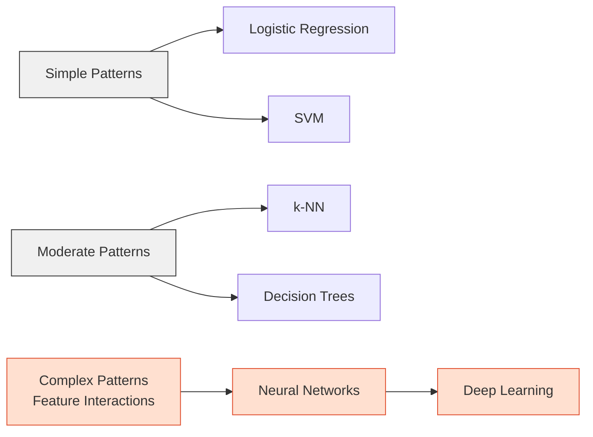
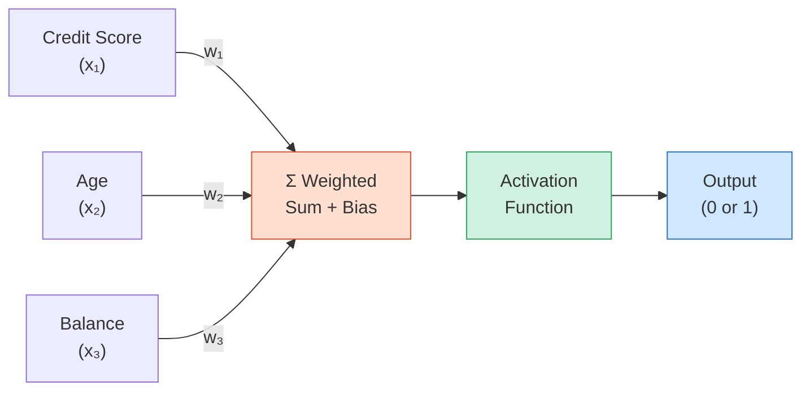
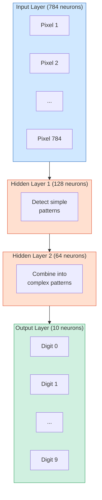
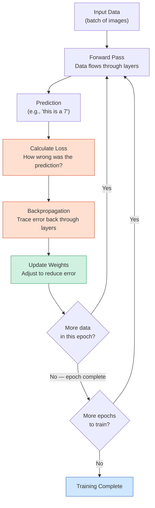
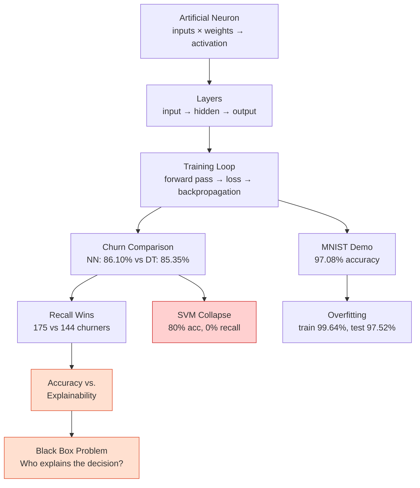

# Chapter 9: Neural Networks


## Sofia's Ceiling

Sofia thought she had it figured out. Her decision tree from Chapter 8 was predicting catering cancellations at 85% accuracy, and the best part was she could see *why* — large party size, last-minute booking, no deposit meant high risk. She'd even printed the decision tree and taped it to the wall behind the register at her family's restaurant in Hialeah.

Then Friday happened. Three orders the model marked as "safe" got cancelled within two hours. One was a corporate lunch for forty. Another was a quinceañera appetizer platter. The third was a small family order that had seemed completely routine. Eight hundred dollars in wasted prep, and the model had missed all three.

"The patterns were there," Prof. Reyes told the class the following Monday. "But they were *combinations* of factors — things like a new customer placing a large order during a holiday weekend, paying with a card that was different from their profile, and requesting delivery to an address they'd never used before. No single split in a decision tree could catch that. Each factor alone looked normal. Together, they spelled trouble."

Marcus leaned forward. "So the model needed to process those factors *together* — like how the port runs cargo through multiple checkpoints instead of relying on one."

"Exactly," Prof. Reyes said. "When the patterns get too complex for a single decision rule, you need something that processes data more like a brain — in layers. That's a neural network."

---

*Technical Connection:* Sofia's classifiers from Chapters 7–8 are powerful, but they have a ceiling. Decision trees draw straight-line splits. Logistic regression draws a single boundary. When the real pattern involves complex *interactions* between features — combinations that no single rule can capture — we need a model that builds understanding in layers. Neural networks process data through connected layers of artificial neurons, each one extracting progressively more complex patterns. By the end of this chapter, you'll understand how they work, build one yourself, and see exactly where they outperform the classifiers you already know.

---

**By the end of this chapter, you will be able to:**

- Explain how an artificial neuron receives inputs, applies weights, and produces an output
- Describe how neural networks organize neurons into layers that process data sequentially
- Build and train a neural network using TensorFlow/Keras in Google Colab
- Compare neural network performance against classical classifiers on the same dataset
- Evaluate the tradeoff between model accuracy and model explainability

**Roadmap:** We'll start with why classical classifiers sometimes fall short (9.1), then zoom into the building block — the artificial neuron (9.2). From there, we'll scale up to layers and full network architecture (9.3), understand how networks learn through training (9.4), build our first neural network on handwritten digits (9.5), and finish with a head-to-head comparison against every classifier you've learned so far (9.6).

---

## 9.1 From Classifiers to Neural Networks

In Chapters 7 and 8, you built four classifiers: k-Nearest Neighbors, decision trees, logistic regression, and support vector machines. Each has strengths. k-NN is intuitive — find the closest neighbors, take a vote. Decision trees are explainable — you can trace every decision. Logistic regression and SVMs draw clean boundaries between classes.

But all four share a limitation: they struggle when the patterns in the data are *nonlinear and interactive*. When whether a customer churns depends not on any single feature, but on specific *combinations* of features interacting in complex ways, these classifiers start missing things.

Think of it like tools in a kitchen. A sharp knife, a cutting board, a good pan, and a reliable spatula — those are your four classifiers. You can cook most meals with them. But some dishes — a three-layer cake with custom frosting, a multi-course tasting menu — require something more. Not because the basic tools are bad, but because the job demands more coordinated processing.

Neural networks are that next level. They don't replace your earlier tools — they add capability for problems that require it.



**Figure 9.1: The Complexity Spectrum** — Classical classifiers handle simple and moderate patterns well. Neural networks extend into complex, nonlinear territory where feature interactions matter.

---

## 9.2 What Is a Neuron?

The building block of every neural network is the **artificial neuron** — a tiny mathematical function inspired (loosely) by how brain cells work. Here's the idea: a neuron receives several input values, multiplies each by a **weight** that represents how important that input is, adds everything up, and then applies an **activation function** that decides whether the neuron "fires" — whether it passes a signal forward.

Imagine a vote at a Miami condo association meeting. Each board member casts a vote (the inputs), but not all votes carry equal weight — the president's vote counts more than a new member's (the weights). A secretary tallies the weighted votes (the sum), and if the total exceeds a threshold, the motion passes (the activation function). The output is binary: passed or not.

In mathematical terms, a neuron does this:

1. **Receive inputs**: x₁, x₂, x₃, ... (these are your features — credit score, age, balance)
2. **Multiply each by a weight**: w₁·x₁ + w₂·x₂ + w₃·x₃ + ...
3. **Add a bias**: the sum + b (a baseline adjustment)
4. **Apply activation**: pass the result through a function that determines the output

The **weights** are the key. They determine how much each input matters. A large weight means that input has a strong influence on the output. A small weight means it barely matters. A negative weight means that input pushes the output in the opposite direction.



**Figure 9.2: An Artificial Neuron** — Inputs are multiplied by weights, summed with a bias, and passed through an activation function to produce an output.

💡 **Key Insight:** The neuron doesn't "know" anything at first. The weights start as random numbers. Training is the process of adjusting those weights until the neuron makes good predictions. Every weight starts as a guess, and the network learns by improving those guesses — thousands of times.

---

## 9.3 Layers and Architecture

A single neuron isn't very powerful. But when you connect many neurons into **layers**, something remarkable happens — the network can learn patterns that no individual neuron could.

A neural network has three types of layers:

- **Input layer**: Receives the raw data. Each neuron in this layer represents one feature. For a 28×28 pixel image, that's 784 input neurons — one per pixel.
- **Hidden layers**: Where the learning happens. Neurons in these layers detect patterns in the data. The first hidden layer might detect simple patterns (edges, basic shapes). Deeper layers combine those into more complex patterns (curves, digit shapes). The word "hidden" just means these layers aren't directly visible as input or output — they're internal processing.
- **Output layer**: Produces the final prediction. For digit recognition (0–9), this layer has 10 neurons — one per possible digit. The neuron with the highest activation wins.

---

**Marcus at the Port**

Marcus saw the parallel immediately. Every shipping container arriving at the Port of Miami passes through a sequence of checkpoints. The first station checks the manifest paperwork — is everything documented correctly? The second runs an X-ray scan — does the contents match the declaration? The third flags anything suspicious for a physical inspection. The fourth station clears or holds the container.

No single checkpoint sees the full picture. The document checker doesn't know what the X-ray shows. The X-ray operator doesn't see the paperwork. But by the time a container reaches the final checkpoint, the port has made an informed decision based on *layered, sequential processing* that no single station could have made alone.

"Same thing?" Marcus asked.

"Same thing," Prof. Reyes confirmed. "Each hidden layer in a neural network is a checkpoint. It processes what it receives, extracts what's relevant, and passes its findings forward. Understanding emerges from the sequence."

---

*Technical Connection:* Marcus's port checkpoint analogy maps directly to neural network architecture. The input layer is the container arriving with raw data. Each hidden layer is a processing station that transforms the data, detecting progressively more complex patterns. The output layer is the final decision — cleared or held, digit 0 through 9, churned or stayed.



**Figure 9.3: Neural Network Architecture for MNIST** — 784 pixel inputs flow through two hidden layers that detect progressively complex patterns, producing 10 output neurons — one per digit.

⚠️ **Common Pitfall:** Students often think "more layers = always better." Not necessarily. Adding layers adds complexity, increases training time, and can actually hurt performance on simpler problems. The right architecture depends on the data. For MNIST, one or two hidden layers is plenty. For recognizing faces in photos, you might need dozens. Match the tool to the job.

---

## 9.4 How Neural Networks Learn

You know what a neuron does and how layers are organized. But how does the network go from random weights to a model that recognizes handwriting at 97% accuracy? The answer is a training loop — a cycle of predict, measure, adjust, and repeat.

Think of learning to make cafecito. Your first attempt is terrible — too bitter, too watery, wrong temperature. But you know *how far off* you were. Too bitter? Use a little less coffee next time. Too watery? Tamp the grounds harder. Each attempt, you adjust one variable at a time based on how wrong the result was. After fifty cups, you're making cafecito that Abuela Carmen approves of.

Neural networks learn the same way:

1. **Forward pass**: Data enters the input layer and flows through the network. Each neuron applies its weights and activation. The output layer produces a prediction.
2. **Calculate loss**: The **loss function** measures how wrong the prediction was. If the network predicted "7" but the actual digit was "5," the loss is high. If it predicted "5" correctly, the loss is low.
3. **Backpropagation**: The network traces backward through every layer, calculating how much each weight contributed to the error. This is **backpropagation** — the mathematical engine of learning.
4. **Update weights**: Each weight gets adjusted slightly in the direction that would reduce the error. Weights that caused more error get adjusted more.
5. **Repeat**: Process the next batch of training data. One complete pass through the entire training dataset is called an **epoch**.



**Figure 9.4: The Training Loop** — Neural networks learn by repeatedly predicting, measuring error, tracing the error backward, and adjusting weights. Each full pass through the data is one epoch.

📊 **By The Numbers:** Our MNIST model processes 60,000 training images per epoch, in batches of 32. That means 1,875 weight updates per epoch. Over 5 epochs, the network adjusts its weights 9,375 times — starting from random and arriving at 97% accuracy. The model has 101,770 trainable parameters (weights and biases), and every one of them gets adjusted during each update.

🤔 **Think About It:** If training always improves the model, why not train for 1,000 epochs? Because at some point, the model starts memorizing the training data instead of learning general patterns. This is called **overfitting** — the model performs beautifully on data it's seen but poorly on new data. It's like studying only the practice test. You'll ace those exact questions, but new ones on the real exam might stump you. We'll see this happen live in the next section.

---

## 9.5 Your First Neural Network: MNIST

Time to build. The **MNIST dataset** is the most famous dataset in machine learning — 70,000 images of handwritten digits (0–9), each a 28×28 pixel grayscale image. It's the "Hello, World" of neural networks.

Each image is just a grid of numbers. Every pixel has a value from 0 (black) to 255 (white). That means each image is really 784 numbers — and those numbers are the features our neural network will learn from.

```python
# ============================================
# Example 9.1: Loading and Exploring MNIST
# Purpose: Understand images as numerical data
# Prerequisites: TensorFlow (pre-installed in Colab)
# ============================================

# Step 1: Import TensorFlow and load the dataset
import tensorflow as tf
from tensorflow import keras
import numpy as np

# MNIST is built into Keras — no download needed
(X_train, y_train), (X_test, y_test) = keras.datasets.mnist.load_data()

# Step 2: Explore the data shape
print(f"Training images: {X_train.shape}")     # 60,000 images, each 28x28
print(f"Test images:     {X_test.shape}")       # 10,000 images for evaluation
print(f"Each image is {X_train.shape[1]}x{X_train.shape[2]} pixels")
print(f"Pixel value range: {X_train.min()} to {X_train.max()}")
print(f"First 10 labels: {y_train[:10]}")

# Expected Output:
# Training images: (60000, 28, 28)
# Test images:     (10000, 28, 28)
# Each image is 28x28 pixels
# Pixel value range: 0 to 255
# First 10 labels: [5 0 4 1 9 2 1 3 1 4]
```

There it is — 60,000 training images, each a 28×28 grid of pixel values from 0 to 255. The labels tell us what digit each image represents. The first training image is a 5, the second is a 0, the third is a 4.

⚠️ **Common Pitfall:** Students sometimes think `X_train.shape` of `(60000, 28, 28)` means three features. It's actually 60,000 images, each with 28 rows and 28 columns of pixels. When we feed this to the network, we'll flatten each image into a single row of 784 numbers.

**Try It Yourself:** Type `print(X_train[0])` and look at the output — it's a 28×28 grid of numbers. Values near 0 are black (background), values near 255 are white (the digit). That grid of numbers *is* the image the neural network will learn to read.

Now let's build the model.

```python
# ============================================
# Example 9.2: Build, Train, and Evaluate a Neural Network
# Purpose: First complete neural network pipeline
# Prerequisites: Example 9.1 (MNIST loaded)
# ============================================

from tensorflow.keras import Sequential
from tensorflow.keras.layers import Dense, Flatten

# Step 1: Normalize pixel values from 0-255 to 0-1
# Neural networks train better on small, consistent number ranges
X_train_norm = X_train / 255.0
X_test_norm = X_test / 255.0

# Step 2: Build the model architecture
tf.random.set_seed(42)        # For reproducible results
np.random.seed(42)

model = Sequential([
    Flatten(input_shape=(28, 28)),   # Flatten 28x28 image → 784 numbers
    Dense(128, activation='relu'),    # Hidden layer: 128 neurons
    Dense(10, activation='softmax')   # Output layer: 10 neurons (digits 0-9)
])

# Step 3: Compile — tell the model how to learn
model.compile(
    optimizer='adam',                          # Algorithm for updating weights
    loss='sparse_categorical_crossentropy',    # Loss function for classification
    metrics=['accuracy']                       # Track accuracy during training
)

# Step 4: Train for 5 epochs
print("Training the neural network...")
model.fit(X_train_norm, y_train, epochs=5, batch_size=32, validation_split=0.1)

# Step 5: Evaluate on the test set (data the model has NEVER seen)
test_loss, test_accuracy = model.evaluate(X_test_norm, y_test, verbose=0)
print(f"\nTest accuracy: {test_accuracy*100:.2f}%")

# Step 6: See predictions vs. actual labels
predictions = model.predict(X_test_norm[:20], verbose=0)
pred_labels = np.argmax(predictions, axis=1)
print(f"Predicted: {pred_labels}")
print(f"Actual:    {y_test[:20]}")

# Expected Output:
# Test accuracy: 97.08%
# Predicted: [7 2 1 0 4 1 4 9 6 9 0 6 9 0 1 5 9 7 3 4]
# Actual:    [7 2 1 0 4 1 4 9 5 9 0 6 9 0 1 5 9 7 3 4]
# 19/20 correct — the model confused a 5 for a 6 (84.6% confidence)
```

97.08% accuracy. Out of 10,000 test images the model has never seen, it correctly identified over 9,700 handwritten digits. And look at that one mistake — it predicted a 6 when the actual digit was 5, and it was 84.6% confident in that wrong answer. If you look at the actual handwritten 5, you can probably see why the model was confused — some handwritten 5s and 6s look remarkably similar.

Let's break down the key parts of the code:

- **`Flatten(input_shape=(28, 28))`** transforms each 28×28 image into a flat row of 784 numbers — the input layer
- **`Dense(128, activation='relu')`** creates a hidden layer with 128 neurons. `relu` is the activation function — it lets positive signals pass through and blocks negatives
- **`Dense(10, activation='softmax')`** creates the output layer. `softmax` converts the 10 outputs into probabilities that sum to 1 — the highest probability is the model's prediction
- **`model.fit(..., epochs=5)`** trains for 5 complete passes through the training data
- **`validation_split=0.1`** holds back 10% of training data to monitor for overfitting

💡 **Key Insight:** The model has 101,770 trainable parameters — 100,480 connecting the 784 inputs to 128 hidden neurons, plus 1,290 connecting the hidden layer to the 10 outputs. Every one of those parameters started as a random number and was adjusted through 5 epochs of training. That's the entire secret of neural networks: start random, adjust toward correct, repeat.

**Try It Yourself:** Change `epochs=5` to `epochs=10` and re-run. Watch the training output — does test accuracy improve? *(It should reach about 97.52%.)* Now look closely at the training accuracy versus the validation accuracy. By epoch 10, training accuracy will be around 99.64% while validation hovers around 97.3%. That growing gap is **overfitting** — the model is memorizing the training data without getting better at new data.

Now try adding a second hidden layer. Change the model to:
```python
model = Sequential([
    Flatten(input_shape=(28, 28)),
    Dense(128, activation='relu'),     # Hidden layer 1
    Dense(64, activation='relu'),      # Hidden layer 2 (NEW)
    Dense(10, activation='softmax')
])
```
Re-run. You should get about 97.25% — a slight improvement over the single-layer model, but not dramatic. On a well-behaved dataset like MNIST, a simple network already captures most of the patterns. More complexity gives diminishing returns.

🔧 **Pro Tip:** If you're not sure whether adding layers or epochs will help, add layers first. Extra layers let the network learn more complex patterns. Extra epochs just give the network more time to memorize — which can backfire through overfitting.

---

## 9.6 Neural Networks vs. Classical Classifiers

This is the moment everything in Part 3 comes together. You've learned five types of classifiers across three chapters — k-NN, decision trees, logistic regression, SVM, and now neural networks. But which one should you actually use? The only way to answer that is to run them all on the same dataset and compare.

We'll use a bank customer churn dataset — 10,000 bank customers with features like credit score, age, balance, number of products, and whether they're an active member. The target variable is whether the customer left the bank (churned). The churn rate is about 20%.

```python
# ============================================
# Example 9.3: Neural Network vs. Classical Classifiers
# Purpose: Compare all five classifier types on the same dataset
# Prerequisites: pandas, sklearn, tensorflow
# ============================================

import pandas as pd
from sklearn.model_selection import train_test_split
from sklearn.preprocessing import StandardScaler
from sklearn.linear_model import LogisticRegression
from sklearn.neighbors import KNeighborsClassifier
from sklearn.tree import DecisionTreeClassifier
from sklearn.svm import SVC
from sklearn.metrics import accuracy_score, precision_score, recall_score

# Step 1: Load and prepare the data
df = pd.read_csv('https://raw.githubusercontent.com/c-marq/AI-Thinking-CAI1001C/refs/heads/main/09-Neural-Networks/Datasets/bank_churn.csv')
df = df.drop(columns=['RowNumber', 'CustomerId', 'Surname'])

# Encode categorical variables
df['Gender'] = df['Gender'].map({'Male': 1, 'Female': 0})
df = pd.get_dummies(df, columns=['Geography'], drop_first=True)

# Step 2: Split features and target
X = df.drop(columns=['Exited'])
y = df['Exited']

# Step 3: Train/test split and scale
X_train, X_test, y_train, y_test = train_test_split(
    X, y, test_size=0.2, random_state=42
)
scaler = StandardScaler()
X_train_scaled = scaler.fit_transform(X_train)
X_test_scaled = scaler.transform(X_test)

print(f"Training: {X_train.shape[0]} rows | Test: {X_test.shape[0]} rows")
print(f"Test set: {y_test.sum()} churned, {(y_test==0).sum()} stayed")

# Step 4: Train the neural network
tf.random.set_seed(42)
np.random.seed(42)

nn_model = Sequential([
    Dense(64, activation='relu', input_shape=(X_train_scaled.shape[1],)),
    Dense(32, activation='relu'),
    Dense(1, activation='sigmoid')    # Binary output: churned or stayed
])
nn_model.compile(optimizer='adam', loss='binary_crossentropy', metrics=['accuracy'])
nn_model.fit(X_train_scaled, y_train, epochs=10, batch_size=32,
             validation_split=0.1, verbose=0)

# Step 5: Train the four classical classifiers
lr = LogisticRegression(random_state=42, max_iter=1000)
lr.fit(X_train_scaled, y_train)

knn = KNeighborsClassifier(n_neighbors=5)
knn.fit(X_train_scaled, y_train)

dt = DecisionTreeClassifier(max_depth=4, random_state=42)
dt.fit(X_train_scaled, y_train)

svm = SVC(kernel='linear', random_state=42)
svm.fit(X_train_scaled, y_train)

# Step 6: Predict and compare
models = {
    'Logistic Regression': lr,
    'k-NN (K=5)': knn,
    'Decision Tree (depth=4)': dt,
    'SVM (linear)': svm,
}

print(f"\n{'Model':<30} {'Accuracy':<12} {'Precision':<12} {'Recall':<10}")
print("-" * 64)

for name, m in models.items():
    preds = m.predict(X_test_scaled)
    acc = accuracy_score(y_test, preds)
    prec = precision_score(y_test, preds, zero_division=0)
    rec = recall_score(y_test, preds)
    print(f"{name:<30} {acc*100:.2f}%{'':<6} {prec*100:.2f}%{'':<6} {rec*100:.2f}%")

# Neural network predictions
nn_preds = (nn_model.predict(X_test_scaled, verbose=0) > 0.5).astype(int).flatten()
nn_acc = accuracy_score(y_test, nn_preds)
nn_prec = precision_score(y_test, nn_preds)
nn_rec = recall_score(y_test, nn_preds)
print("-" * 64)
print(f"{'Neural Network (2 layers)':<30} {nn_acc*100:.2f}%{'':<6} {nn_prec*100:.2f}%{'':<6} {nn_rec*100:.2f}%")

# Expected Output:
# Model                          Accuracy     Precision    Recall
# ----------------------------------------------------------------
# Logistic Regression            81.10%       55.24%       20.10%
# k-NN (K=5)                    83.00%       61.09%       37.15%
# Decision Tree (depth=4)        85.35%       76.60%       36.64%
# SVM (linear)                   80.35%       0.00%        0.00%
# ----------------------------------------------------------------
# Neural Network (2 layers)      86.10%       74.47%       44.53%
```

Let that table sink in. Five classifiers. Same data. Same split. Same scaling. Wildly different results.

The neural network wins on accuracy (86.10%) and recall (44.53%) — it caught 175 out of 393 churners. The decision tree is close behind at 85.35% accuracy but caught only 144 churners. That's 31 more customers the neural network identified. If each churning customer costs the bank $500 per year in lost revenue, the neural network's advantage is worth $15,500.

But look at the SVM row. It achieved 80.35% accuracy — and caught *zero* churners. Not a single one. How? Because about 80% of customers in the dataset stayed. The SVM learned the laziest possible strategy: just predict "stayed" for everyone. It's technically right 80% of the time, but it's completely useless for the actual problem — identifying who's about to leave.

This is the most important lesson in this chapter: **accuracy alone is a lie when your classes are imbalanced**. A model that does literally nothing gets 80% accuracy on this dataset. That's why precision and recall matter — they reveal what accuracy hides.

🌎 **Real-World Application:** This isn't a classroom exercise. Banks, telecom companies, and subscription services run exactly this comparison when deciding which model to deploy for churn prevention. The model that catches the most at-risk customers — even at the cost of some false alarms — often wins. A retention call to a customer who wasn't going to churn costs a few minutes. Missing a customer who *was* going to churn costs years of lost revenue.

**Try It Yourself:** Look at the comparison table. The decision tree achieved 85.35% accuracy — only 0.75% less than the neural network. But the decision tree can explain every prediction (you saw its splits in Chapter 7). The neural network can't explain any of its predictions. If you were a bank manager choosing between these two models, which would you deploy? What would change your answer?

---

## ⚖️ Ethics in Focus: The Black Box Problem

The bank deploys the neural network. It catches 175 churners per quarter — 31 more than the decision tree would have caught. The retention team calls each flagged customer with a special offer: waived fees, a bonus interest rate, a personal account review.

Then a flagged customer asks: "Why do you think I'm leaving? What about my account triggered this call?"

The retention agent has no answer. The neural network processed 11 features through two hidden layers with 2,881 parameters, and the math said this customer was likely to churn. But *which* features mattered? Was it the low balance? The age? The fact they only have one product? The model can't say. It's a **black box** — data goes in, predictions come out, and the reasoning is opaque.

Meanwhile, the decision tree the bank *didn't* deploy could have answered clearly: "Customers over 45 with a single product and inactive status churn at a high rate." Specific. Explainable. Actionable.

This is the accuracy vs. explainability tradeoff — one of the most consequential decisions in applied AI. More powerful models tend to be less transparent. The neural network catches more churners, but it can't justify its decisions. The decision tree catches fewer, but every prediction comes with a clear rationale.

In banking, this might seem like a minor inconvenience. But apply the same logic to loan approvals, hiring decisions, or medical diagnoses, and the stakes escalate. The EU's AI Act now requires "meaningful explanations" for high-risk AI decisions. A churn prediction probably doesn't qualify as high-risk. A mortgage denial absolutely does.

**Reflect & Discuss:**

1. The neural network caught 31 more churners than the decision tree. If each customer is worth $500/year, that's $15,500. Is that financial gain worth deploying a model that can't explain its decisions?
2. The EU's AI Act requires "meaningful explanations" for high-risk AI decisions. Where would you draw the line between "explanation required" and "accuracy is enough"?
3. You're advising a Miami credit union that serves a largely immigrant community. Many members are already skeptical of institutions. Would you recommend the neural network or the decision tree for their churn model? Why?

---

## Closing Materials

### Key Takeaways

- **Neural networks learn by adjusting connection weights across layers** — each layer extracts progressively more complex patterns from the data, building understanding sequentially.
- **A simple neural network on MNIST achieved 97.08% accuracy**, recognizing handwritten digits by treating each image as 784 numbers and processing them through 128 hidden neurons.
- **On the bank churn dataset, the best neural network (86.10%) outperformed all four classical classifiers** — but the accuracy gap over the decision tree was less than 1%.
- **The neural network's real advantage was recall** — catching 175 churners versus the decision tree's 144. In business terms, that's 31 more customers your retention team can reach.
- **The SVM achieved 80% accuracy by predicting every customer would stay**, catching zero churners — proof that accuracy alone is meaningless without precision and recall.
- **Neural networks trade explainability for power.** A decision tree shows its reasoning. A neural network cannot. This tradeoff is one of the most important decisions in applied AI.

### Concept Map



**Figure 9.5: Chapter 9 Concept Map** — From the building blocks of neurons and layers through training and comparison, arriving at the central tradeoff of the chapter: accuracy vs. explainability.

### Vocabulary Review

| Term | Definition |
|------|-----------|
| **Neural network** | A machine learning model organized as layers of connected artificial neurons that learn patterns by adjusting weights during training |
| **Artificial neuron** | The basic unit of a neural network — receives inputs, multiplies by weights, sums, and applies an activation function |
| **Hidden layer** | A layer of neurons between the input and output that detects patterns in the data — not directly visible as input or output |
| **Activation function** | A mathematical function applied to a neuron's output that determines whether and how strongly it fires (e.g., ReLU, softmax, sigmoid) |
| **Epoch** | One complete pass through the entire training dataset during the training process |
| **Loss function** | A measure of how wrong the model's predictions are — the value the training process tries to minimize |
| **Backpropagation** | The algorithm that traces errors backward through the network to calculate how much each weight contributed to the mistake |
| **Overfitting** | When a model performs well on training data but poorly on new data — it has memorized rather than learned generalizable patterns |
| **Black box model** | A model whose internal decision-making process is not interpretable by humans — you see the input and output but not the reasoning |
| **TensorFlow / Keras** | Open-source libraries for building and training neural networks — Keras provides the high-level interface, TensorFlow powers the computation |

### Self-Check Questions

1. What is the role of hidden layers in a neural network?
2. If a model achieves 95% training accuracy but only 80% test accuracy, what is likely happening?
3. Why did the SVM achieve 80% accuracy on the churn dataset but catch zero churners?
4. Name one advantage of a decision tree over a neural network, and one advantage of a neural network over a decision tree.
5. What does the activation function do in an artificial neuron?

### Bridge to Chapter 10

You just taught a neural network to recognize handwritten digits — 10 possible categories from a 28×28 pixel image. What if the image were bigger, more complex, and the categories numbered in the thousands? A photo of a dog, a medical X-ray, a satellite image of a coastline — these are all just grids of pixels, the same data type MNIST taught you. But recognizing objects in real photos requires networks that are deeper, more specialized, and trained on millions of images. That's **computer vision** — and it's powered by the same neural networks you just built, only bigger and more sophisticated. Next week, we teach machines to see.

### Hands-On Challenge

**TensorFlow Playground Exploration** (40–50 minutes)

This activity uses [TensorFlow Playground](https://playground.tensorflow.org) — a browser-based tool that lets you watch a neural network learn in real time.

**Milestone 1 (10 min):** Open TensorFlow Playground. Select the "circle" dataset. Start with 1 hidden layer and 2 neurons. Click the play button and watch the network try to learn the pattern. Can it separate the two classes? Increase to 4, then 8 neurons. Describe what happens to the decision boundary.

**Milestone 2 (10 min):** Switch to the "spiral" dataset — this is a much harder pattern. Try 1 hidden layer with 8 neurons. Can it solve it? Now add a second hidden layer. Adjust neurons in each layer until the network can separate the spirals. Record your architecture (layers, neurons per layer, epochs to converge).

**Milestone 3 (10 min):** Keep the spiral dataset. Experiment with the learning rate slider. Set it to 10 — what happens? Set it to 0.001 — what happens? Find a learning rate that works well and explain why extremes fail.

**Milestone 4 (10 min):** Increase the noise slider to 25, then 50. How does noise affect the network's ability to learn? Does adding more neurons help with noisy data, or does it make things worse? Write 2–3 sentences explaining what you observe.

### Discussion Prompts

1. The neural network beat the decision tree by less than 1% in accuracy but caught 31 more churners. In what situations would that small accuracy gap matter a lot? When would it not matter?
2. Abuela Carmen says: "If the machine can't tell me *why*, I don't trust it." Is she wrong? When is her instinct exactly right?
3. You're building a model to predict which students are at risk of dropping out of college. Would you choose a neural network or a decision tree? What factors would influence your decision?
