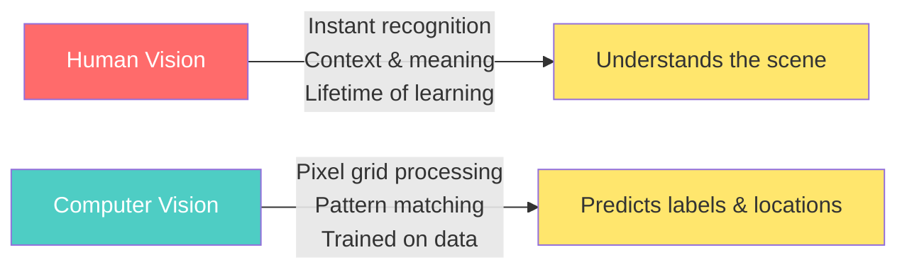
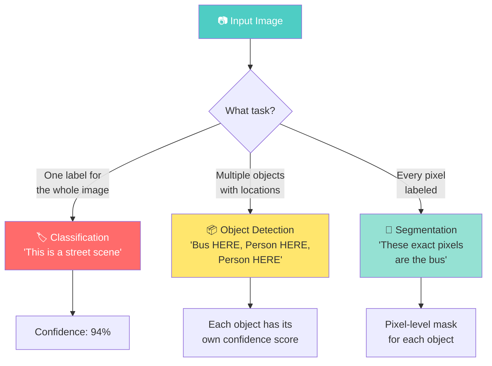
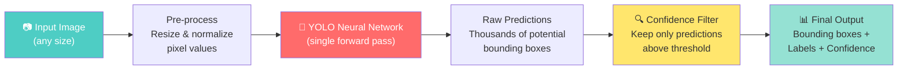
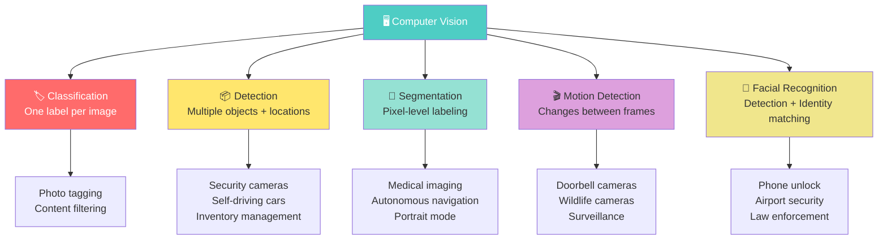
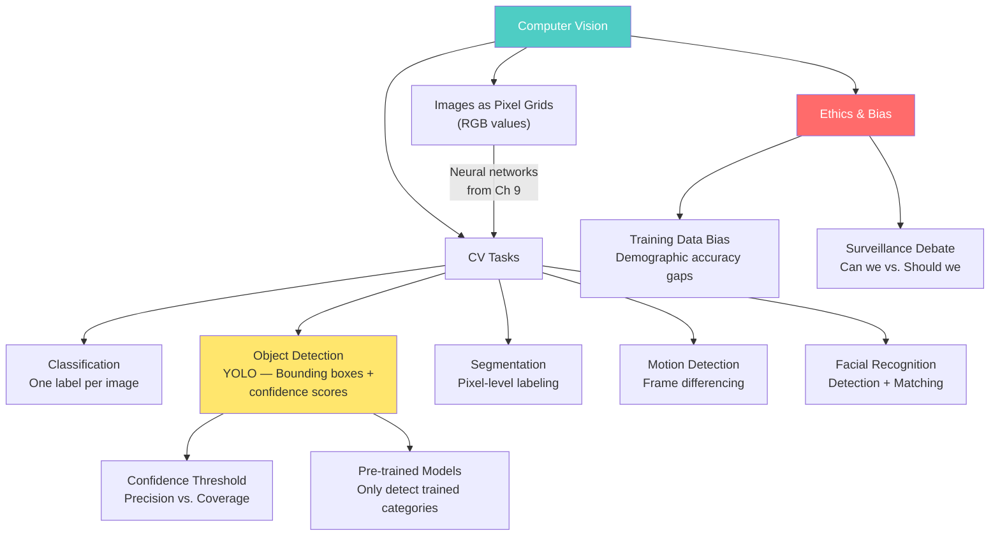

# Chapter 10: Computer Vision


---

## Sofia's Surprise Tagger

Sofia snapped a quick photo of the restaurant kitchen to post on Instagram — the stove gleaming, a cutting board loaded with ingredients for tonight's special, and her cousin Daniela prepping in the background. Before she even typed a caption, her phone suggested tags: *stove, person, cutting board, bowl.*

She paused. How did the phone know Daniela was in the photo? Sofia hadn't told it to look for a person. And it labeled the *tostón press* as "kitchen utensil" — close, but not exactly right. Still, the phone had scanned the entire image in less than a second and found multiple objects, drawn invisible boxes around each one, and assigned labels with no instructions from Sofia at all.

"That's wild," Daniela said, looking over her shoulder. "But it doesn't know what a tostón press is?"

"Apparently not," Sofia said. "It only knows what it was trained on."

She thought back to the MNIST neural network from last week — the model that recognized handwritten digits by learning from thousands of examples. That model worked with tiny 28×28 pixel grids in black and white. Her phone photo was millions of pixels, full color, with multiple objects at different sizes and angles. The jump in complexity was enormous, but the underlying idea was the same: a neural network, trained on massive amounts of image data, turning pixels into meaning.

Prof. Reyes opened class that week with a simple question: "Your phone can find every face in a group photo, your car can read speed limit signs, and a security camera can track a person across a parking lot. How does any of that work?"

He pulled up a photo on the projector — a busy Miami intersection. "By the end of today, you'll be able to feed an image like this to an AI model and watch it draw boxes around every object it recognizes. But more importantly, you'll understand *why* it recognizes some things and completely misses others."

---

*Technical Connection:* Computer vision is what happens when neural networks are trained on images instead of spreadsheets. The models you built in Chapters 7–9 learned from rows of numbers. Computer vision models learn from millions of photographs — and the same concepts apply: training data, accuracy, confidence, and bias all determine how well the system performs.

---

### Learning Objectives

By the end of this chapter, you will be able to:

- Explain how computers represent and process images as numerical data
- Distinguish between object classification, object detection, image segmentation, and facial recognition
- Use a pre-trained object detection model (YOLO) to identify and locate objects in images
- Analyze how confidence thresholds affect the precision-coverage tradeoff in detection results
- Evaluate the ethical implications of computer vision in surveillance and facial recognition

### Roadmap

We'll start with how computers "see" — spoiler: they don't see at all, they crunch numbers. Then we'll walk through the spectrum of computer vision tasks, from simple classification to pixel-level segmentation. The hands-on demo is the highlight: you'll feed real images to a pre-trained object detection model called YOLO and watch it draw bounding boxes around everything it recognizes. We'll experiment with confidence thresholds to see the tradeoff between catching everything and being selective. Finally, we'll tackle the ethics of facial recognition — a computer vision application that's deeply personal, especially in a city with as many cameras as Miami.

---

## 10.1 What Is Computer Vision?

**Computer vision** is a field of artificial intelligence that enables machines to extract meaningful information from images and video. When your phone unlocks with your face, when a self-driving car reads a stop sign, when a doctor's X-ray gets flagged for a potential tumor — that's computer vision at work.

But here's the thing every semester someone asks: "Does the computer actually *see* the image?"

No. Not even close. When you look at a photo of Biscayne Bay at sunset, you see water, sky, buildings, colors, beauty. Your brain processes all of that instantly, drawing on a lifetime of visual experience. A computer sees none of that. It sees a grid of numbers. Every pixel is just three values — how much red, how much green, how much blue. The entire image is a massive spreadsheet of numbers, and the AI's job is to find patterns in those numbers that correspond to objects, faces, or scenes.

You've actually already experienced this. In Chapter 9, when you loaded the MNIST dataset, each handwritten digit was a 28×28 grid of numbers from 0 (black) to 255 (white). That was computer vision in its simplest form — grayscale, single object, tiny image. What we're doing today is the full-color, multi-object, real-world version.



**Figure 10.1: Human Vision vs. Computer Vision** — Humans understand scenes instantly from experience. Computers process pixel values through trained models to generate predictions. Neither approach is "better" — they fail in different ways.

> 💡 **Key Insight:** Computer vision models don't understand images the way you do. They find statistical patterns in pixel values. A model might correctly identify a dog in a photo without any concept of what "dog" means — it just learned that certain pixel patterns correlate with the label "dog" in its training data.

---

## 10.2 How Computers "See" Images

Every digital image is a grid of **pixels** — tiny squares of color. A 1920×1080 photo contains over 2 million pixels. Each pixel stores its color as three numbers between 0 and 255, one for each color channel: **Red, Green, and Blue (RGB)**. Pure red is (255, 0, 0). Pure white is (255, 255, 255). Black is (0, 0, 0). That coral color in our textbook's palette? Something like (255, 127, 80).

Think of it like mixing paint at Home Depot. Every color you can imagine is just a recipe of three base amounts. The store doesn't stock ten thousand paint cans — it stocks three base colors and mixes them in different proportions. Your screen does the same thing with light.

A **grayscale** image simplifies things further — each pixel is a single number from 0 (black) to 255 (white). That's exactly what MNIST was in Chapter 9. Color images are three times as complex because every pixel carries three values instead of one.

> 📊 **By The Numbers:** A single 1920×1080 color photo contains 1,920 × 1,080 × 3 = **6,220,800 numbers**. When a computer vision model processes your photo, it's crunching over six million values to decide what's in the image. And it does this in milliseconds.

So when Sofia's phone analyzed her kitchen photo, it didn't see a stove or a cutting board. It processed millions of numbers, ran them through a neural network trained on millions of labeled images, and matched the patterns it found against the categories it knows. The magic isn't in seeing — it's in pattern matching at a scale no human could manage.

---

**What the Camera Sees**

Sofia showed Abuela Carmen a zoomed-in screenshot on her phone — just a grid of colored squares, maybe twenty pixels across.

"¿Qué es eso?" Carmen squinted at the screen.

Sofia zoomed out slowly. The colored squares merged into shapes, then textures, and finally — a photo of Carmen's paella from last Sunday.

"¡Ay, mi paella!" Carmen laughed. "So the phone just sees little colored squares? It doesn't see *food*?"

"Exactly," Sofia said. "Every pixel is three numbers — red, green, blue. The AI figures out what the numbers mean."

Carmen shook her head slowly. "At least when *I* look at the paella, I know it needs more saffron."

---

*Technical Connection:* Images are stored as grids of RGB pixel values. Computer vision models process these raw numbers to extract meaning — they must learn to associate patterns of pixels with objects through training, not through understanding.

---

## 10.3 From Classification to Detection

In Chapters 7–9, you worked with **classification** — assigning one label to one input. "This digit is a 7." "This customer will churn." Computer vision has its own version of this: **image classification** assigns one label to an entire image. Show the model a photo and it says: "This is a dog." One image, one label.

That's useful, but limited. What if the photo has a dog *and* a cat *and* a person? Image classification picks one answer. What you really want is a system that says: "There's a dog in the bottom-left, a cat on the couch in the center, and a person standing on the right."

That's **object detection** — and it's a fundamentally different task.

Think of it like a customs officer at Miami International Airport. Image classification is the officer looking at your suitcase on the X-ray and saying: "This bag contains electronics." Object detection is the officer saying: "There's a laptop in the top-left pocket, a phone in the side pocket, and something unidentified near the bottom — let me check that."



**Figure 10.2: The Computer Vision Task Spectrum** — Classification assigns one label to the whole image. Detection finds multiple objects and their locations. Segmentation labels every pixel. Each task builds on the complexity of the previous one.

> 🤔 **Think About It:** Your phone's camera app uses classification when it tags a photo as "beach" or "food." It uses detection when it draws boxes around faces for autofocus. It uses segmentation when it blurs the background in portrait mode (it needs to know exactly which pixels are "you" and which are "background"). Three different CV tasks in one app.

The key difference is output format. Classification returns a single label. Detection returns a list of objects, each with a **bounding box** (the rectangle showing where the object is in the image) and a **confidence score** (how sure the model is). Segmentation returns a mask — a pixel-by-pixel map showing exactly which parts of the image belong to which object.

For this chapter's hands-on demo, we're focusing on object detection. It's the sweet spot: more powerful than classification, more visual than tabular data, and the results are immediately satisfying to see.

---

## 10.4 Meet YOLO: You Only Look Once

The model we'll use is called **YOLO** — "You Only Look Once." It's one of the most widely used object detection models in the world, and the name describes exactly how it works: unlike older approaches that scanned an image multiple times looking for objects in different regions, YOLO processes the entire image in a single pass. That's what makes it fast enough for real-time applications like security cameras and self-driving cars.

The version we're using, **YOLO11n**, is the "nano" variant — the smallest and fastest in the YOLO family. It's **pre-trained** on a dataset called **COCO** (Common Objects in Context), which contains hundreds of thousands of labeled images covering **80 object categories**: person, car, dog, bicycle, pizza, laptop, chair, and 73 others.

This is an important concept: YOLO11n is a **pre-trained model**. Someone else — the Ultralytics team, using massive computing resources — already trained it. We're downloading their finished model and using it directly. Think of it like hiring an experienced chef instead of training someone from scratch. The chef already knows 80 recipes; we just hand them ingredients (images) and they cook (detect objects).

> ⚠️ **Common Pitfall:** Students often assume a pre-trained model can detect *anything*. It can't. YOLO11n knows exactly 80 categories — no more, no less. If you show it a photo of a croqueta, it won't say "croqueta." It might say "donut" or "sandwich" — or it might not detect it at all. **The model can only find what it was trained to find.** This is the same training data principle from every chapter, applied to images.

Here's how the detection pipeline works:



**Figure 10.3: The YOLO Object Detection Pipeline** — An image goes in, gets preprocessed, passes through the neural network in one shot, and comes out with labeled bounding boxes. The confidence filter is where you control how selective the model is.

Notice that confidence filter step — it's going to become the most important concept in today's demo. The model actually generates *thousands* of potential detections on every image. Most are garbage — random boxes with near-zero confidence. The threshold filter keeps only the detections where the model is confident enough to report. Change that threshold, and you change the results dramatically.

---

## 10.5 Beyond Detection: Segmentation, Motion, and Faces

Before we dive into the Colab demo, let's complete the map of computer vision tasks. C5.1 covers five key capabilities, and we need to understand all of them — even the ones we won't code today.

### Image Segmentation

Object detection draws boxes. **Image segmentation** goes further — it labels every single pixel in the image. Instead of "there's a dog in this rectangular region," segmentation says "these exact 47,000 pixels are the dog, and these other pixels are the background."

Think of it like coloring inside the lines. Detection tells you *where* the lines are; segmentation actually fills in the color for every pixel.

There are two flavors. **Semantic segmentation** labels every pixel by category — all "road" pixels get one color, all "car" pixels get another, all "sky" pixels get a third. **Instance segmentation** goes one step further and distinguishes between individual objects — "this is Car #1, that's Car #2" — even though both are the same category.

Self-driving cars rely heavily on segmentation. They don't just need to know "there's a pedestrian somewhere in the image." They need to know the exact boundary of the pedestrian to calculate safe distances and trajectories.

### Motion Detection

**Motion detection** identifies what's changing between consecutive frames of video. Your Ring doorbell uses this — it compares frame after frame and flags when something moves into view. The simplest approach is **frame differencing**: subtract one frame from the next, and wherever the pixel values change significantly, something moved.

This sounds simple, but it gets complicated fast. Wind blowing tree branches creates pixel changes that aren't meaningful. Lighting shifts from clouds cause the whole frame to change. More sophisticated motion detection uses background modeling — learning what the "normal" scene looks like and flagging deviations.

> 🌎 **Real-World Application:** Walmart uses computer vision for shelf monitoring — cameras detect when products run low by comparing current frames to the "fully stocked" reference image. The Florida Fish and Wildlife Conservation Commission uses motion-triggered camera traps to detect and classify animals in the Everglades — the cameras only activate when motion is detected, saving storage and battery.

### Facial Recognition

**Facial recognition** combines two tasks. First, **face detection** — finding where faces are in an image (this is object detection specialized for faces). Second, **face matching** — comparing the detected face against a database of known faces to determine identity.

Your phone uses face detection every time you take a photo — that's the box that appears around people's faces in the camera app. Facial recognition is the next step: your phone's Face ID matches the detected face against the one stored during setup.

The distinction matters because face *detection* is relatively benign — it just finds faces without identifying anyone. Facial *recognition* is where the ethical stakes get high, which we'll explore in the Ethics section.



**Figure 10.4: Computer Vision Task Map** — Five key tasks, each with distinct outputs and real-world applications. Classification labels images; detection locates objects; segmentation maps pixels; motion detection tracks changes; facial recognition identifies individuals.

---

## 10.6 Hands-On: Object Detection with YOLO

Let's get to the code. We're going to load a pre-trained YOLO11n model, feed it images, and watch it detect objects in real time. All of this runs in Google Colab with no GPU required — the nano model is fast enough on CPU for our purposes.

### Example 10.1: Your First Object Detection

```python
# ============================================
# Example 10.1: Load YOLO and Detect Objects
# Purpose: Run object detection on a single image
# Prerequisites: ultralytics library
# ============================================

# Step 1: Install the ultralytics library (includes YOLO)
!pip install ultralytics -q

# Step 2: Import the model
from ultralytics import YOLO
import matplotlib.pyplot as plt

# Step 3: Load the pre-trained YOLO11 nano model
# This auto-downloads the model weights (~6MB) on first run
model = YOLO("yolo11n.pt")

# Step 4: Download and run detection on a test image
results = model("https://ultralytics.com/images/bus.jpg", verbose=False)
result = results[0]

# Step 5: Display the image with bounding boxes
annotated = result.plot()  # Draws boxes on the image
plt.figure(figsize=(10, 7))
plt.imshow(annotated[:, :, ::-1])  # Convert BGR to RGB
plt.title("Object Detection Results", fontsize=14, fontweight="bold")
plt.axis("off")
plt.show()

# Step 6: Print what was detected
print(f"\n📊 Objects detected: {len(result.boxes)}")
for i, box in enumerate(result.boxes):
    cls_name = result.names[int(box.cls[0])]
    conf = float(box.conf[0])
    print(f"   {i+1}. {cls_name} ({conf:.1%} confidence)")

# Expected Output:
# Objects detected: 5
#    1. bus (94.0% confidence)
#    2. person (88.8% confidence)
#    3. person (87.8% confidence)
#    4. person (85.6% confidence)
#    5. person (62.2% confidence)
```

Look at those results. With just a few lines of code, the model found five objects in the image — a bus and four people — each with a bounding box showing exactly *where* in the image they are, and a confidence score showing how sure the model is.

Notice the range of confidence scores. The bus at 94.0% — the model is very confident. The fourth person at 62.2% — less confident. Maybe that person is partially obscured, or far away, or in an unusual pose. The model does its best, but some detections are stronger than others.

> ⚠️ **Common Pitfall:** The exact confidence scores may vary slightly each time you run the model, due to floating-point differences across hardware. The bus will always be detected with high confidence, but the precise percentages might shift by a point or two. This is normal — focus on the pattern, not the exact numbers.

**Try It Yourself:**
- Change the image URL to `"https://ultralytics.com/images/zidane.jpg"` — this shows two people. How many objects does it detect? Does it find anything besides people? (Hint: look for a tie at around 45% confidence — should you trust that detection?)
- What happens if you run it on a completely blank white image? Try it: create a white image and pass it in.

---

### Example 10.2: The Confidence Threshold Experiment

This is the key interactive moment. The confidence threshold is a number between 0 and 1 that tells the model: "Only show me detections where you're at least this confident." Change it, and watch objects appear and disappear.

```python
# ============================================
# Example 10.2: Confidence Threshold Comparison
# Purpose: See how thresholds affect detection results
# Prerequisites: Example 10.1 (model already loaded)
# ============================================

# Step 1: Define three confidence thresholds to compare
thresholds = [0.25, 0.50, 0.75]

# Step 2: Run detection at each threshold and display side by side
fig, axes = plt.subplots(1, 3, figsize=(18, 6))

for idx, conf_threshold in enumerate(thresholds):
    # Run detection with this threshold
    results = model("https://ultralytics.com/images/bus.jpg", 
                     conf=conf_threshold, verbose=False)
    
    # Draw bounding boxes on the image
    annotated = results[0].plot()
    
    # Display in the subplot
    axes[idx].imshow(annotated[:, :, ::-1])
    axes[idx].set_title(
        f"Threshold ≥ {conf_threshold:.0%}\n"
        f"({len(results[0].boxes)} objects detected)", 
        fontsize=12, fontweight="bold"
    )
    axes[idx].axis("off")

plt.suptitle("Effect of Confidence Threshold on Detection", 
             fontsize=14, fontweight="bold")
plt.tight_layout()
plt.show()

# Step 3: Print the comparison
print("\n📊 Threshold Comparison:")
print(f"   Threshold 25%: 5 objects detected (catches everything)")
print(f"   Threshold 50%: 5 objects detected (still catches all)")
print(f"   Threshold 75%: 4 objects detected (drops the 62.2% person)")

print("\n🔑 The person at 62.2% confidence disappears at 75%.")
print("   Is that person real? Yes — but the model isn't sure enough.")
print("   What if this were a security camera? You just lost a detection.")

# Expected Output:
# Three panels showing the same image with 5, 5, and 4 detections
# At 75% threshold, the least-confident person disappears
```

This is the precision-coverage tradeoff in action. Think of it like a smoke detector's sensitivity dial. Set it too sensitive and it goes off every time you cook. Set it too low and it misses a real fire. There's no universally "right" setting — it depends entirely on what you're using the detector for.

For a security camera at the Port of Miami, you probably want a *low* threshold — better to flag something that turns out to be nothing than to miss a real threat. For a medical imaging system flagging potential tumors, you might want a *lower* threshold too — missing a cancer is worse than ordering an extra scan. But for an automated checkout system identifying products, a *high* threshold prevents billing errors.

> 💡 **Key Insight:** The confidence threshold is the single most important parameter you control when deploying an object detection model. It doesn't change how the model works — it changes how much of the model's output you trust. This is a design decision, not a technical one, and it should be made by people who understand the consequences of false positives vs. false negatives in their specific application.

**Try It Yourself:**
- Try threshold 0.10 — what new detections appear? Are they real objects or mistakes?
- Try threshold 0.90 — how many objects survive? Is the bus still detected?
- What threshold would you set for a camera monitoring a school entrance? What about a camera counting cars on I-95? Why would they be different?

---

**The Confidence Game**

Marcus ran the YOLO demo on a photo he'd taken at the port loading dock. The model detected a truck at 92% confidence, a person at 87%, and labeled a forklift as "car" at 41%.

He laughed. "A car? That's a forklift. It doesn't even have doors."

Prof. Reyes walked over. "What happens if you raise the threshold to 50%?"

Marcus changed the number and re-ran the cell. The forklift-as-car disappeared from the results.

"Now try 90%," Prof. Reyes said.

Marcus typed it in. The person disappeared too — only the truck remained.

"So if port security sets the threshold too high," Marcus said slowly, "they miss actual people on the dock. Too low, and they get phantom cars all day."

"Exactly," Prof. Reyes said. "And who gets to decide where to set it?"

---

*Technical Connection:* Confidence thresholds control the precision-recall tradeoff. Raising the threshold increases precision (detections are more reliable) but reduces recall (you miss real objects). The right setting depends on the cost of errors in your specific application.

---

### Example 10.3: Upload Your Own Image

Now let's see what YOLO makes of *your* world. This is where you upload an image from your phone or computer and test the model's limits.

```python
# ============================================
# Example 10.3: Test YOLO on Your Own Images
# Purpose: Upload images and explore model strengths/limits
# Prerequisites: Examples 10.1–10.2 (model loaded)
# ============================================

from google.colab import files

# Step 1: Upload an image
print("📷 Upload an image to test the object detector!")
print("   Try: a photo of your desk, a street view, your lunch...\n")
uploaded = files.upload()

# Step 2: Run detection on the uploaded image
if uploaded:
    filename = list(uploaded.keys())[0]
    results = model(filename, verbose=False)
    result = results[0]
    
    # Step 3: Display results
    annotated = result.plot()
    plt.figure(figsize=(10, 7))
    plt.imshow(annotated[:, :, ::-1])
    plt.title(f"Your Image — {len(result.boxes)} Objects Detected", 
              fontsize=14, fontweight="bold")
    plt.axis("off")
    plt.show()
    
    # Step 4: Print detections
    print(f"\n📊 Found {len(result.boxes)} objects:")
    for i, box in enumerate(result.boxes):
        cls_name = result.names[int(box.cls[0])]
        conf = float(box.conf[0])
        print(f"   {i+1}. {cls_name} ({conf:.1%} confidence)")
    
    if len(result.boxes) == 0:
        print("   No objects detected! Try a lower threshold:")
        print("   results = model(filename, conf=0.15, verbose=False)")

# Step 5: See ALL 80 categories YOLO knows
print("\n\n🏷️  All 80 COCO Categories YOLO Can Detect:\n")
for i, name in model.names.items():
    print(f"   {i:>2}: {name}", end="")
    if (i + 1) % 5 == 0:
        print()

print("\n\n🤔 What's NOT on this list?")
print("   No croquetas, no tostón press, no plantains")
print("   No specific dog breeds (just 'dog')")
print("   No Miami Dolphins jersey (just 'person' wearing something)")
print("\n   → The model only knows its 80 trained categories!")

# Expected Output (varies by image):
# When tested with a driver's license:
#    Found 2 objects:
#    1. book (67.3% confidence)
#    2. person (62.5% confidence)
# The model doesn't know what a license is — it guesses
# the closest categories it knows: book and person.
```

When we tested this with a driver's license, the model detected a "book" at 67.3% and a "person" at 62.5%. It doesn't know what a driver's license is — that's not one of its 80 categories. So it did the only thing it could: find the closest match from what it knows. The card shape looks vaguely like a book. The photo on the license looks like a person. The model can never say "I don't know" — it always picks the best match from its menu.

This is exactly like a restaurant that only serves 80 dishes. You walk in and ask for croquetas. The waiter can't say "we don't have that." Instead, they bring you the closest thing on the menu — maybe mozzarella sticks. Not wrong, exactly, but not what you wanted.

> 🔧 **Pro Tip:** When evaluating any AI model, always test it with inputs that are *outside* its training categories. That's where you learn its real limitations. A model that's 95% accurate on its known categories can be 0% accurate on everything else.

**Try It Yourself:**
- Upload 3 different images: one with many objects (a busy kitchen, a street scene), one with just one object (a single item on a clean background), and one with something YOLO probably doesn't know (a specific food, a musical instrument, a specialty tool). Compare the results.
- Try the same image at three different confidence thresholds. When does the model start making mistakes?

---

## 10.7 Real-World Computer Vision Applications

Computer vision isn't a lab exercise — it's deployed at massive scale across industries right now. Here's where the techniques from this chapter show up in the real world.

> 🌎 **Real-World Application: Computer Vision Across Industries**
> 
> **Healthcare:** Radiology AI systems analyze X-rays and MRI scans to flag potential tumors, fractures, and anomalies. These systems use classification (is this scan normal or abnormal?) and detection (where exactly is the concerning area?). Some achieve accuracy comparable to experienced radiologists — but they still require human review for final diagnosis.
> 
> **Automotive:** Self-driving vehicles use detection, segmentation, and motion analysis simultaneously. Cameras identify pedestrians, other vehicles, lane markings, and traffic signs. Segmentation maps the drivable surface. Motion detection tracks everything that's moving. Tesla, Waymo, and Cruise process millions of frames per second across their camera arrays.
> 
> **Retail:** Amazon Go stores use ceiling-mounted cameras with detection and tracking to monitor what shoppers pick up and put back, enabling checkout-free shopping. Walmart uses computer vision for shelf monitoring — cameras detect when products run low.
> 
> **Agriculture:** Drones with CV systems survey crops to detect disease, estimate yield, and identify areas needing irrigation. The Florida citrus industry has piloted detection systems that identify citrus greening disease from aerial images before visible symptoms appear.
> 
> **Security:** Airports, stadiums, and public spaces use detection and facial recognition for security screening. Miami-Dade County uses license plate recognition on major highways. The technology works — but as we'll discuss next, "working" and "working fairly" are not the same thing.

---

## ⚖️ Ethics in Focus: Facial Recognition and Surveillance

A convenience store chain in Miami installs AI-powered facial recognition cameras at all 47 locations. The stated goal: identify known shoplifters and alert store security in real time. The system works — within the first month, it flags 200 matches, leading to 35 detentions. The company calls it a success.

Then the complaints start. Customers report being followed by security guards despite never having shoplifted. A local news investigation reveals the system's false positive rate is nearly three times higher for Black and Latino customers than for white customers. One grandmother — not unlike Abuela Carmen — was flagged as a shoplifting suspect at the store where she's bought groceries for fifteen years.

Meanwhile, at Miami International Airport, the same underlying technology helps reunite a missing child with her family. Customs and Border Protection uses facial recognition to verify travelers' identities, processing millions of passengers per year. Supporters point to legitimate use cases: finding missing persons, verifying identities at borders, solving crimes faster.

The tension isn't simple. A 2019 NIST study tested 189 facial recognition algorithms and found the majority showed demographic differences in accuracy — with higher false positive rates for African American and Asian faces compared to white faces, and higher error rates for women compared to men. These aren't random glitches. They're the result of training datasets that overrepresented certain demographics, the same pattern we've seen throughout this course: biased training data produces biased models.

But the ethical question extends beyond accuracy. Even if facial recognition were perfectly accurate across all demographics, should it be deployed in every grocery store, on every street corner, at every school entrance? There's a difference between *can we* and *should we*. Some cities — San Francisco, Boston, Minneapolis — have banned government use of facial recognition. Others argue the bans prevent legitimate public safety uses.

**Reflect & Discuss:**

1. You saw that lowering the confidence threshold catches more objects but increases errors. If a facial recognition system at MIA airport has a 2% false positive rate on 100,000 passengers per day, how many innocent people get flagged daily? Is that acceptable for airport security? What about for a grocery store?

2. Several U.S. cities have banned government use of facial recognition. Others argue it helps solve crimes and find missing persons. Where do you stand, and what evidence or conditions would change your mind?

3. If you owned a small business in your neighborhood, would you install facial recognition cameras? What factors would influence your decision — cost, accuracy, customer trust, legal liability, community norms?

---

## Chapter 10 Summary

### Key Takeaways

- **Computer vision enables machines to extract information from images and video** — but they process grids of numbers, not visual understanding. Every image is a matrix of pixel values that the model analyzes for patterns.

- **Object detection finds and locates multiple objects in a single image**, returning bounding boxes with labels and confidence scores. This is fundamentally different from classification, which assigns one label to the entire image.

- **Confidence thresholds control the precision-coverage tradeoff.** Higher thresholds mean fewer but more reliable detections. Lower thresholds catch more objects but include more errors. The right setting depends on the application's tolerance for false positives vs. false negatives.

- **Pre-trained models like YOLO know only the categories they were trained on.** YOLO11n detects 80 COCO categories. Anything outside that list gets misclassified or missed entirely — the model can never say "I don't know."

- **Image segmentation labels every pixel**, going beyond bounding boxes to map exact object boundaries. Motion detection identifies changes between video frames. Both are critical for autonomous vehicles and surveillance systems.

- **Facial recognition combines face detection with identity matching** — and carries significant, documented accuracy disparities across demographic groups, driven by imbalanced training data.

- **The ethical questions around computer vision extend beyond accuracy.** Even a perfectly accurate facial recognition system raises questions about consent, surveillance, and the appropriate limits of automated monitoring.

### Concept Map



**Figure 10.5: Chapter 10 Concept Map** — Computer vision processes pixel grids through neural networks to perform tasks ranging from classification to facial recognition. Object detection with YOLO is the hands-on focus; confidence thresholds and training data bias are the critical analytical themes.

### Vocabulary Review

| Term | Definition |
|------|-----------|
| **Computer vision** | A field of AI that enables machines to extract information from images and video |
| **Pixel** | The smallest unit of a digital image — a single point of color stored as RGB values |
| **RGB** | Red, Green, Blue — the three color channels that combine to create any digital color |
| **Object classification** | Assigning a single label to an entire image ("this is a dog") |
| **Object detection** | Finding multiple objects in an image and marking each with a bounding box, label, and confidence score |
| **Bounding box** | The rectangle drawn around a detected object showing its location in the image |
| **Confidence score** | A percentage (0–100%) indicating how sure the model is about a specific detection |
| **Confidence threshold** | The minimum confidence required for a detection to be included in results |
| **Image segmentation** | Labeling every pixel in an image by category, creating exact outlines of objects |
| **Motion detection** | Identifying changes between consecutive video frames to detect movement |
| **Facial recognition** | A two-step process: detecting faces in an image, then matching them against a database of known identities |
| **Pre-trained model** | A model that has already been trained on a large dataset and can be used directly without additional training |

### Bridge to Next Chapter

We taught machines to see images — to find objects, draw boxes, and assign labels. But images aren't the only data humans produce constantly. What about text? Every restaurant review, every tweet, every customer service message is text data. How does a machine read a sentence and know if it's positive or negative? How does Google Translate convert Spanish to English in real time? How does Siri understand "Hey Siri, what's the weather?"

That's **Natural Language Processing** — and it's where we're headed next.

### Self-Check Questions

1. **What's the difference between object classification and object detection?**
   Classification assigns one label to the entire image. Detection finds multiple objects, each with its own label, location (bounding box), and confidence score.

2. **If you raise the confidence threshold from 25% to 75%, what happens to the number of detections, and why?**
   The number of detections decreases because only objects where the model is at least 75% confident are shown. Less-certain detections are filtered out.

3. **YOLO11n is trained on COCO's 80 categories. If you show it a photo of a croqueta, what will likely happen?**
   The model will either miss it entirely or misclassify it as the closest category it knows (possibly "donut" or "sandwich"). It cannot detect objects outside its training categories.

4. **Why might a facial recognition system perform differently on different demographic groups?**
   If the training data overrepresents certain demographics, the model learns to recognize those faces better. Groups underrepresented in training data experience higher error rates — this is training data bias applied to faces.

5. **Name two real-world applications of computer vision and identify which CV task each uses.**
   Examples: Self-driving cars use detection and segmentation to identify pedestrians and map drivable surfaces. Amazon Go stores use detection and tracking to monitor what shoppers pick up. Hospital radiology AI uses classification to flag abnormal scans.

### Hands-On Challenge

**Google AI Studio Image Analysis (40–60 minutes)**

This challenge prepares you for the homework assignment. You'll use Google AI Studio to explore how a multimodal AI analyzes images — a completely different approach from the YOLO bounding-box detection you did in class.

**Milestone 1 (10 min):** Open Google AI Studio (aistudio.google.com). Upload a simple image — a photo of your desk or a common object. Ask Gemini: "What objects do you see in this image?" Compare its response to what YOLO would detect.

**Milestone 2 (15 min):** Upload 3 more images with increasing complexity — one with multiple objects, one with food, one of a street scene. For each, ask: "List every object you can identify" and "Describe what's happening in this scene." Note where Gemini gives detailed, accurate descriptions vs. where it's vague or wrong.

**Milestone 3 (15 min):** Test Gemini's limits. Upload an image that's blurry, taken from an unusual angle, or shows something uncommon. Try asking it questions it probably can't answer from the image alone: "What does this food taste like?" "How old is this person?" "What will happen next?" Document what it does with questions it can't really answer.

**Milestone 4 (10 min):** Write a quick comparison: How is Gemini's approach to images different from YOLO's? What can each one do that the other can't? Which would you rather have for a security camera? For a personal assistant?

### Discussion Prompts

1. YOLO detected a person in the street scene with only 62.2% confidence. If you were designing a security system for a school, would you include or exclude that detection? What's the cost of each choice?

2. Computer vision systems are being used in stores, schools, airports, and city streets. At what point does "smart security" become "mass surveillance"? Where do you draw the line?

3. Your phone's Face ID uses facial recognition to unlock your phone. You probably use it without thinking twice. Would you feel differently if the same technology were used at the entrance to your school or workplace? Why or why not?
