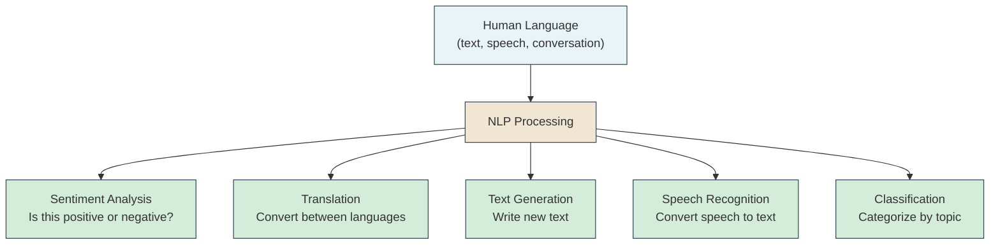
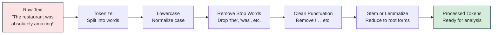
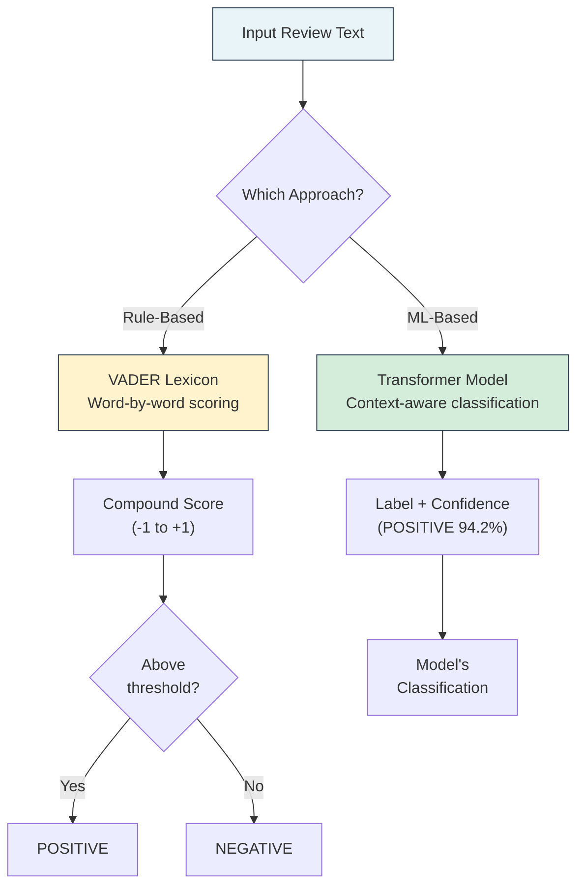
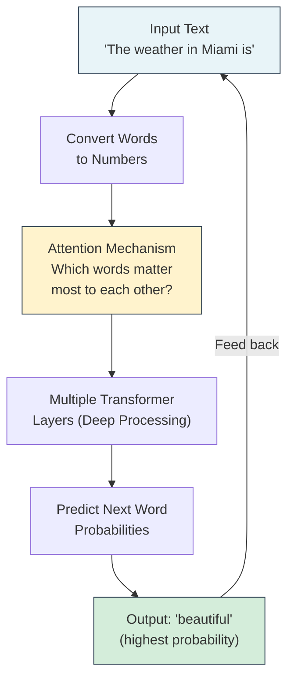
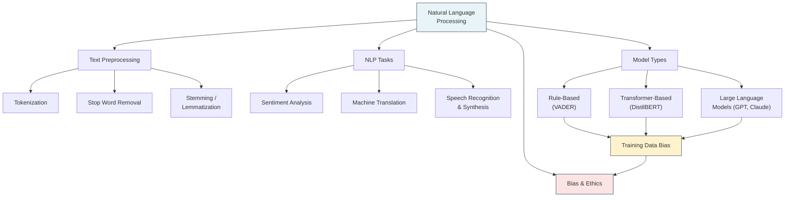

# Chapter 11: Natural Language Processing

<!-- [IMAGE: images/ch11/fig-11-0-nlp-text-processor.png]
Alt text: A futuristic robotic processing unit with streams of multilingual text flowing through neural network pathways, some text glowing green and others glowing red
Nano Banana Pro Prompt: "A sleek robotic processing unit shaped like a cylindrical tower sits in the center of a dark futuristic data chamber. Dozens of translucent streams of text in multiple languages — English phrases, Spanish sentences, and mixed Spanglish fragments — flow horizontally into the machine from the left side. Inside the transparent chamber walls, layers of glowing neural network nodes pulse with electric blue light as they process the text. On the right side, processed text streams exit: some glow bright green (correctly classified), while others glow warning red (misclassified), with one prominent red stream showing the words 'fire bro no cap.' The chamber floor is polished dark metal reflecting the colored light. A large circular display screen mounted above the machine shows a simplified sentiment gauge swinging between POSITIVE and NEGATIVE. The lighting comes primarily from the glowing text streams and neural nodes inside the machine, casting colored reflections on the surrounding dark walls and floor. Style: editorial textbook illustration with soft digital watercolor textures, clean lines, and a warm coral-and-turquoise color palette. Composition is a medium-wide shot centered on the machine, with text streams creating strong horizontal leading lines from left to right. The green and red exit streams are balanced on the right side of the frame. No text other than the sentiment gauge labels 'POSITIVE' and 'NEGATIVE' and the fragment 'fire bro no cap' on one red stream. No human characters."
-->

---

**The Lost Reviews**

Sofia had been staring at the numbers for twenty minutes, and something wasn't adding up.

Her family's restaurant in Hialeah — *Rincón de Sabor* — had recently started using an online platform that analyzed customer reviews automatically. The tool promised to surface the most negative feedback first so the team could respond quickly. But when Sofia scrolled through the "urgent negative" alerts, she kept finding reviews that didn't sound negative at all.

One alert flagged a review from a regular named Yolanda: *"La comida está fire bro, the tostones were on point no cap. 10/10 would come back."* The system had scored it as strongly negative. Another alert surfaced a review that read: *"Mira, this place is lowkey the best kept secret in Hialeah fr fr."* Also flagged as negative.

Sofia switched to the "positive" tab. Those reviews were all written in formal, standard English: *"The food quality was excellent and the service outstanding."* Perfectly articulated. Perfectly boring. And perfectly *not* how most of her customers actually talked.

"Abuela, come look at this," Sofia called. She showed Carmen the flagged reviews.

Abuela Carmen read Yolanda's review and laughed. "She's saying she loved it! *Fire* means good, *no cap* means she's not lying. Even I know that."

"The computer doesn't," Sofia said.

Carmen shook her head slowly. "So the machine understands rich people's English but not ours? Mija, that's not a technology problem. That's a respect problem."

Sofia didn't say anything for a moment. She was thinking about how many of her customers' voices were being silently ignored — not because they had nothing to say, but because they said it in the wrong language.

---

*Technical Connection*: Sofia just encountered a real consequence of **Natural Language Processing (NLP)** bias. The review analysis tool uses sentiment analysis — a technique that classifies text as positive or negative based on the words it contains. But like every AI system we've studied, it learned from training data. If that training data mostly contained formal English, the model treats anything else as unfamiliar — and unfamiliar often gets classified as negative. In this chapter, you'll learn how NLP works, why it fails in situations like Sofia's, and what it means when the language your community speaks isn't represented in the data.

---

### Learning Objectives

By the end of this chapter, you will be able to:

- **Define** Natural Language Processing and explain its core components: tokenization, stop word removal, and text preprocessing
- **Explain** how sentiment analysis classifies text as positive or negative, and identify where it fails
- **Describe** how machine translation, speech recognition, and speech synthesis work at a conceptual level
- **Compare** rule-based NLP approaches (VADER) with deep learning approaches (transformers) and explain why both can inherit training data bias
- **Analyze** how NLP models treat different language varieties — and what that means for fairness

### Roadmap

We'll start with the big picture — what NLP is and why it matters in a city where English, Spanish, and Spanglish flow through every conversation. Then we'll break text down into data: tokens, stop words, and the preprocessing pipeline that turns messy human language into something a machine can work with. From there, we'll dive into sentiment analysis — first understanding how it works conceptually, then running it hands-on in our GP demo on real restaurant reviews. We'll also explore machine translation and speech recognition, and close with the big question: how do Large Language Models like ChatGPT actually work? Along the way, we'll see exactly where and why these systems fail — especially for communities whose language doesn't look like the training data.

---

## 11.1 What Is NLP?

Every time you ask Siri for directions, let Gmail finish your sentence, or scroll past a translated post on Instagram, you're using Natural Language Processing. **NLP** is the branch of artificial intelligence that gives computers the ability to read, interpret, and generate human language. It's the technology that bridges the gap between how humans communicate — messy, contextual, full of slang and sarcasm — and how computers process information: structured, numerical, literal.

Think about what happens when you text a friend "omw, running late, save me a cortadito." A human reader instantly understands: you're on your way, you'll be late, you want a coffee waiting. But to a computer, that's just a string of characters. It doesn't know that "omw" means "on my way," that "cortadito" is a Cuban espresso with steamed milk, or that "save me" is a request, not a cry for help. NLP is the set of techniques that teach machines to make those leaps.



**Figure 11.1: The NLP Landscape** — Natural Language Processing takes human language as input and enables a range of applications, from analyzing the sentiment of a review to translating between languages to generating entirely new text.

Here's why NLP is harder than it looks. In Chapter 10, we taught machines to "see" images — pixels are numbers, and patterns in those numbers correspond to objects. Language seems simpler — it's already text, already symbols. But language is deceptively complex because the same words can mean completely different things depending on context.

Consider this sentence: "The food was sick." In a doctor's report, that's a health concern. In a review from a 20-year-old in Wynwood, that's the highest praise. A computer processing text word-by-word has no idea which meaning applies unless it understands the context surrounding it — and context is exactly what makes NLP so challenging.

💡 **Key Insight**: NLP is harder than computer vision in one critical way: images have a universal visual structure (pixels, edges, shapes), but language changes across cultures, communities, generations, and even neighborhoods. The same word can mean opposite things depending on who's speaking and where.

### The NLP Stack: What Computers Do With Language

NLP isn't one technique — it's a layered set of tools. At the foundation, computers need to break text apart (tokenization), clean it up (preprocessing), and convert it to numbers (representation). On top of that foundation, specific tasks like sentiment analysis, translation, and text generation each add their own methods. Think of it like cooking: before you can make *ropa vieja*, you have to prep your ingredients — wash, peel, chop, measure. The prep work is tedious, but without it, nothing else works.

Here's the fundamental challenge: computers don't read words. They process numbers. So every NLP pipeline starts with the same question: how do we turn human language into numbers that preserve meaning? That's what Section 11.2 is all about.

---

## 11.2 Text as Data: Tokenization, Stop Words, and Preprocessing

Before a computer can analyze a sentence, it has to break that sentence into pieces it can work with. This process — turning raw text into structured data — is called **text preprocessing**, and it's the unglamorous but essential first step of every NLP pipeline.

Let's walk through it with a real example. Say we start with this sentence:

> "The restaurant was absolutely amazing! Best Cuban food I've ever had."

A human reads that and immediately knows: positive review, great food, Cuban cuisine. A computer sees a 63-character string with no inherent meaning. Here's how we transform it:

**Step 1: Tokenization.** We split the text into individual words, or **tokens**. This is like separating ingredients before cooking — you can't analyze a sentence until you know what pieces it's made of.

```
["The", "restaurant", "was", "absolutely", "amazing", "!", "Best", "Cuban", "food", "I've", "ever", "had", "."]
```

That gives us 13 tokens (including punctuation). But not all tokens are equally useful.

**Step 2: Stop word removal.** Words like "the," "was," "ever," and "had" appear in almost every English sentence. They're grammatically necessary but carry little meaning for analysis. These are called **stop words**, and we remove them to focus on the words that actually tell us something.

After removing stop words and lowercasing, we get:

```
["restaurant", "absolutely", "amazing", "best", "cuban", "food", "i've"]
```

⚠️ **Common Pitfall**: Notice that "i've" survived the stop word filter. Most stop word lists include "i" and "have" separately, but the contraction "i've" doesn't match either entry. This is a perfect example of why text preprocessing is tricky — edge cases are everywhere. In our GP demo, you'll see exactly this happen with 11 tokens reduced to 9 after stop words and punctuation cleanup.

**Step 3: Stemming and Lemmatization.** These techniques reduce words to their root forms. **Stemming** chops off endings: "amazing" becomes "amaz," "running" becomes "run." **Lemmatization** is smarter — it uses vocabulary rules: "better" becomes "good," "ran" becomes "run." Lemmatization produces real words; stemming sometimes doesn't.

Why bother? Because to a computer, "amazing," "amazed," and "amazingly" are three completely different strings. Reducing them to a common root helps the model recognize they're all expressing the same concept.



**Figure 11.2: The Text Preprocessing Pipeline** — Raw text goes through a series of cleaning steps before it's ready for NLP analysis. Each step strips away noise and standardizes the text so the model can focus on meaning.

🔧 **Pro Tip**: The order of preprocessing steps matters. If you remove stop words *before* lowercasing, "The" won't match "the" in your stop word list and will survive the filter. Always lowercase first, then remove stop words. Small sequencing mistakes create big data quality issues — the same lesson from Chapter 4's data wrangling.

### From Words to Numbers

Even after preprocessing, we still have a list of text strings. Computers need numbers. There are several ways to convert tokens into numerical representations, but the simplest is **Bag of Words**: count how many times each word appears. The sentence "the food was great and the service was great" becomes a vector of word counts: {food: 1, great: 2, service: 1}. You lose word order — the model doesn't know that "great" described both food and service — but you gain a numerical representation that algorithms can process.

More sophisticated approaches like **TF-IDF** (Term Frequency–Inverse Document Frequency) weight words by how important they are — a word that appears in every review ("restaurant") gets a low weight, while a word that appears in only a few reviews ("disgusting") gets a high weight. Think of it like this: if every house on the block has a mango tree, mango trees aren't a useful feature for identifying a specific house. But if only one house has a flamingo mailbox? That's distinctive.

---

**The Shipping Manifest Problem**

Marcus was explaining his latest frustration to Prof. Reyes after class. At the Port of Miami, shipping manifests arrived in dozens of languages — Spanish, Portuguese, Mandarin, French. The port's document processing system used automated translation to convert everything to English for customs review.

"Most of the time it works fine," Marcus said. "But last week, a manifest from Brazil listed cargo as *manga* — which means 'mango' in Portuguese. The system translated it as 'sleeve.'"

Prof. Reyes nodded. "Because *manga* in Spanish can also mean sleeve. The system picked the wrong meaning because it didn't have enough context. How much information was in the document?"

"Just a cargo list. No sentences, no descriptions. Just items and quantities."

"That's the problem," Prof. Reyes said. "Translation models need context. When all they see is a single word, they guess based on what was most common in their training data. And I'd bet that training data had more clothing catalogs than import manifests."

Marcus thought about that. "So the model doesn't actually *understand* Portuguese."

"No. It learned statistical patterns between words in two languages. Most of the time, those patterns produce good translations. But when the context is ambiguous or specialized — maritime vocabulary, medical terminology, legal language — the patterns break down."

---

*Technical Connection*: Marcus's experience illustrates a core NLP challenge: **ambiguity**. The word *manga* has different meanings in different languages and even different contexts within the same language. NLP models handle ambiguity by relying on surrounding context — but when context is limited (like a single word on a cargo list), even sophisticated models can fail. This same challenge affects every NLP task, from translation to sentiment analysis.

---

## 11.3 Sentiment Analysis

Of all the NLP tasks, **sentiment analysis** is the one you've probably experienced most directly. Every time a company asks "How did we do?" after a customer service call, every time Netflix decides which reviews to highlight, every time a brand monitors social media mentions — sentiment analysis is working behind the scenes, trying to determine whether text expresses a positive, negative, or neutral feeling.

At its core, sentiment analysis is classification — the same concept from Chapters 7 and 8. Instead of classifying a loan application as "approved" or "denied" based on numerical features, we're classifying text as "positive" or "negative" based on the words it contains.

There are two main approaches:

**Rule-based (lexicon) methods** use a dictionary of words with pre-assigned sentiment scores. The word "excellent" might score +3, "terrible" scores -3, "okay" scores +1. Add up all the scores in a sentence, and you get an overall sentiment. The most popular rule-based tool is **VADER** (Valence Aware Dictionary and sEntiment Reasoner), which we'll use in our GP demo. VADER is fast, requires no training data, and handles common patterns like exclamation marks (which boost intensity) and words like "very" (which amplify the next word).

**Machine learning methods** train a classifier on thousands of labeled examples — reviews that humans have already tagged as positive or negative. The model learns patterns: which words, phrases, and combinations tend to appear in positive vs. negative text. Modern **transformer** models like BERT and its smaller cousin DistilBERT use this approach, and they're significantly more powerful than rule-based methods because they understand context — they know that "not bad" is different from "bad."

🤔 **Think About It**: VADER treats the word "great" as positive no matter what. But what about "used to be great"? Or "not as great as last time"? Context can flip the meaning of a positive word entirely. This is why rule-based methods hit a ceiling — and why machine learning approaches exist.

### Where Sentiment Analysis Breaks Down

Here's a sentence that trips up almost every sentiment analysis tool: "I can't believe how bad this place has gotten. Used to be great."

A human reads that and immediately knows: negative review. The restaurant declined. But a rule-based system sees "believe," "great," and no strong negative modifiers — and may score it as *positive*. The phrase "used to be" reverses the meaning of "great," but VADER doesn't understand temporal context. It sees "great" and adds points.

This is exactly what happens in our GP demo. When we test five individual reviews with VADER, it correctly classifies the clearly positive and clearly negative ones — but fails on reviews with negation, sarcasm, or temporal context. You'll see the specific scores when we run the code in Section 11.5.



**Figure 11.3: Two Approaches to Sentiment Analysis** — Rule-based methods like VADER score individual words and sum them up, then apply a threshold. Transformer models analyze the full context and produce a classification with confidence. Both have strengths and weaknesses.

📊 **By The Numbers**: In our GP demo, VADER achieves ~89% accuracy on 10,000 restaurant reviews — which sounds impressive until you look at the errors. VADER produces approximately 594 false positives (negative reviews it calls positive) but only 74 false negatives (positive reviews it calls negative). That's an 8:1 ratio. VADER has a strong positive bias — it's far more likely to miss a complaint than to incorrectly flag a compliment.

---

## 11.4 Machine Translation and Speech

NLP isn't just about reading text. It's about every way humans communicate with language — including speaking and listening across language barriers.

### Machine Translation

If you've used Google Translate, you've used machine translation. Early systems in the 1950s tried a brute-force approach: translate word by word from a dictionary. The results were often unusable because word order, idioms, and grammar differ across languages. "I'm on my way" translated word-by-word into Spanish produces "Yo estoy en mi camino" — which technically makes sense but sounds robotic and unnatural to a native speaker. The natural phrasing is "Ya voy" — two words that share almost no overlap with the English.

Modern translation systems use **neural machine translation** — deep learning models trained on millions of parallel text pairs (the same document in two languages). These models learn patterns between language structures, not just word equivalents. They handle word order changes, idiomatic expressions, and even formal vs. informal register.

🌎 **Real-World Application**: In Miami, machine translation is everywhere. Hospitals use it for patient intake forms. The airport uses it for signage and announcements. But as Marcus discovered with his shipping manifests, translation models struggle with specialized vocabulary. A model trained mostly on news articles and web content won't know that *manga* on a cargo list means "mango," not "sleeve." Domain-specific translation remains one of NLP's open challenges.

### Speech Recognition and Synthesis

**Speech recognition** (speech-to-text) converts spoken language into written text. When you say "Hey Siri, what's the weather?" your phone runs a speech recognition model that converts your audio waveform into the text string "what's the weather," then passes that text to another NLP system that interprets your intent and fetches the answer.

**Speech synthesis** (text-to-speech) goes the other direction — it converts written text into spoken audio. Modern synthesis systems don't just read words robotically; they model intonation, emphasis, and natural pauses. The GPS voice that says "In 300 feet, turn right" is a synthesis system, as are AI assistants that read your notifications aloud.

Both technologies have improved dramatically thanks to deep learning. Speech recognition accuracy has gone from roughly 70% in 2010 to over 95% in controlled environments. But the key phrase is "controlled environments." Accuracy drops significantly for speakers with strong accents, speakers who code-switch between languages (common in Miami), speakers in noisy environments, and speakers who use dialects underrepresented in training data. If you've ever had Siri or Alexa completely misunderstand you, you've experienced this gap firsthand.

💡 **Key Insight**: Speech recognition, machine translation, and sentiment analysis all share the same vulnerability: they work best for the language varieties that dominate their training data. For communities that speak AAVE, Spanglish, Patois, or any non-standard variety, accuracy is consistently lower. The technology doesn't fail because these languages are harder — it fails because it was never adequately trained on them.

---

## 11.5 Hands-On: Restaurant Review Sentiment Analysis

Now let's see NLP in action. In our Guided Project demo, we'll build a sentiment analysis pipeline from scratch — starting with basic text preprocessing, running VADER on real restaurant reviews, testing its limits, and then comparing it to a transformer-based model. Every number you see below comes from our verified Colab demo using a real dataset of 10,000 restaurant reviews.

### Example 11.1: Text Preprocessing (Basic)

Our first step is seeing how text becomes data. We'll tokenize a sentence, remove stop words, and clean up punctuation — the preprocessing pipeline from Section 11.2 in action.

```python
# ============================================
# Example 11.1: Text Preprocessing Pipeline
# Purpose: Transform raw text into clean tokens
# Prerequisites: nltk library
# ============================================

# Step 1: Import libraries and download resources
import nltk
nltk.download('punkt_tab')
nltk.download('stopwords')
from nltk.tokenize import word_tokenize
from nltk.corpus import stopwords
import string

# Step 2: Define our sample text
text = "The restaurant was absolutely amazing! Best Cuban food I've ever had."

# Step 3: Tokenize — split into individual words
tokens = word_tokenize(text.lower())
print(f"Tokens ({len(tokens)}): {tokens}")

# Step 4: Remove stop words
stop_words = set(stopwords.words('english'))
filtered = [t for t in tokens if t not in stop_words]
print(f"After stop words ({len(filtered)}): {filtered}")

# Step 5: Remove punctuation
cleaned = [t for t in filtered if t not in string.punctuation]
print(f"After punctuation ({len(cleaned)}): {cleaned}")

# Expected Output:
# Tokens (11): ['the', 'restaurant', 'was', 'absolutely', 'amazing', '!', 'best', 'cuban', 'food', "i've", 'ever', 'had', '.']
# After stop words (9): ['restaurant', 'absolutely', 'amazing', '!', 'best', 'cuban', 'food', "i've", '.']
# After punctuation (7): ['restaurant', 'absolutely', 'amazing', 'best', 'cuban', 'food', "i've"]
```

Notice that we start with 11 tokens and end with 9 after stop word removal, then 9 after punctuation cleanup. The contraction "i've" survives because it doesn't exactly match "i" or "have" in the stop word list — a small but instructive preprocessing quirk.

⚠️ **Common Pitfall**: Students often assume that lowercasing and stop word removal are optional cleanup steps. They're not — they're essential. Without lowercasing, "The" and "the" are treated as different words. Without stop word removal, the most common words in your dataset are all generic filler ("the," "is," "was") that tell you nothing about sentiment. Always preprocess before analyzing.

**Try It Yourself:**
- Change the sample text to a review in Spanish. What happens when you use English stop words on Spanish text?
- Try a review with sarcasm: "Oh sure, the hour-long wait was absolutely *delightful*." Do the remaining tokens capture the sarcasm?
- Add your own review about a restaurant you've been to recently. How many meaningful tokens survive?

### Example 11.2: VADER Sentiment on Individual Reviews (Intermediate)

Now let's use VADER to score individual reviews. We'll test five reviews of varying complexity and see where VADER succeeds and where it fails.

```python
# ============================================
# Example 11.2: VADER Sentiment Analysis
# Purpose: Score individual reviews and identify failures
# Prerequisites: nltk with vader_lexicon
# ============================================

# Step 1: Import VADER
nltk.download('vader_lexicon')
from nltk.sentiment.vader import SentimentIntensityAnalyzer
sia = SentimentIntensityAnalyzer()

# Step 2: Define test reviews
reviews = [
    "The food was absolutely delicious! Best meal I've had in months.",
    "Terrible service. We waited over an hour and the food was cold.",
    "The restaurant was okay. Nothing special but not bad either.",
    "I can't believe how bad this place has gotten. Used to be great.",
    "Not the worst meal I've ever had, but definitely not worth the price."
]

# Step 3: Score each review
for i, review in enumerate(reviews, 1):
    scores = sia.polarity_scores(review)
    compound = scores['compound']
    label = "POSITIVE" if compound >= 0.05 else "NEGATIVE"
    print(f"Review {i}: {compound:+.4f} → {label}")
    print(f"  '{review}'\n")

# Expected Output:
# Review 1: +0.8678 → POSITIVE   ✅ Correct
# Review 2: -0.4767 → NEGATIVE   ✅ Correct
# Review 3: +0.5568 → POSITIVE   ⚠️ Debatable
# Review 4: +0.7876 → POSITIVE   ❌ Should be NEGATIVE
# Review 5: +0.5716 → POSITIVE   ❌ Should be NEGATIVE
```

Look at Reviews 4 and 5 carefully. Review 4 says "I can't believe how bad this place has gotten. Used to be great." That's clearly negative — the restaurant has declined. But VADER scores it +0.7876, *strongly* positive. Why? Because VADER sees the words "believe," "great" and treats them at face value. It doesn't understand that "used to be great" means "is no longer great."

Review 5 — "Not the worst meal I've ever had, but definitely not worth the price" — is also negative. The diner is saying the food wasn't worth what they paid. But VADER scores it +0.5716 because double negatives ("not the worst") and hedged phrases confuse the word-by-word scoring.

🤔 **Think About It**: If you were building a system to alert a restaurant manager about unhappy customers, Reviews 4 and 5 would slip through undetected. The manager would think everything is fine while two dissatisfied customers never get a follow-up. What's the real cost of a false positive in sentiment analysis?

**Try It Yourself:**
- Write a sarcastic positive review (sounds positive, means negative) and run it through VADER. Does it catch the sarcasm?
- Write the same sentiment in formal English and in Spanglish. Do the scores differ?
- Try a review with mixed sentiment: "The food was incredible but the service was awful." Which sentiment does VADER pick?

### Example 11.3: Full Sentiment Pipeline (Applied)

Now we scale up. We'll run VADER on the full dataset of ~10,000 restaurant reviews, measure its accuracy, test it for language bias, and then bring in a transformer model for comparison.

```python
# ============================================
# Example 11.3: Full Sentiment Analysis Pipeline
# Purpose: VADER at scale + bias testing + transformer comparison
# Prerequisites: pandas, nltk, transformers, torch
# ============================================

# Step 1: Load and prepare the dataset
import pandas as pd
df = pd.read_csv('https://raw.githubusercontent.com/manthanpatel98/Restaurant-Review-Sentiment-Analysis/master/Restaurant%20reviews.csv')
df = df.dropna(subset=['Review', 'Rating'])
print(f"Total usable reviews: {len(df)}")
# Expected Output: Total usable reviews: 9954

# Step 2: Create binary labels (exclude neutral 3-star)
df_binary = df[df['Rating'] != 3].copy()
df_binary['actual'] = df_binary['Rating'].apply(lambda x: 'POSITIVE' if x >= 4 else 'NEGATIVE')
print(f"Positive: {(df_binary['actual']=='POSITIVE').sum()}")
print(f"Negative: {(df_binary['actual']=='NEGATIVE').sum()}")
# Expected Output: Positive: 6268 / Negative: 2447

# Step 3: Run VADER on all reviews
from nltk.sentiment.vader import SentimentIntensityAnalyzer
sia = SentimentIntensityAnalyzer()
df_binary['vader_compound'] = df_binary['Review'].apply(lambda x: sia.polarity_scores(str(x))['compound'])
df_binary['vader_label'] = df_binary['vader_compound'].apply(lambda x: 'POSITIVE' if x >= 0.05 else 'NEGATIVE')

# Step 4: Calculate accuracy
correct = (df_binary['vader_label'] == df_binary['actual']).sum()
accuracy = correct / len(df_binary) * 100
print(f"VADER Accuracy: {accuracy:.1f}%")
# Expected Output: VADER Accuracy: ~89.0%

# Step 5: Analyze errors
false_pos = ((df_binary['vader_label']=='POSITIVE') & (df_binary['actual']=='NEGATIVE')).sum()
false_neg = ((df_binary['vader_label']=='NEGATIVE') & (df_binary['actual']=='POSITIVE')).sum()
print(f"False positives (neg reviews called pos): {false_pos}")
print(f"False negatives (pos reviews called neg): {false_neg}")
# Expected Output: False positives: ~594 / False negatives: ~74
```

Let's unpack these results. VADER achieves approximately 89% accuracy, which sounds solid. But the error pattern is revealing: 594 false positives versus only 74 false negatives. That means VADER is roughly 8 times more likely to classify a negative review as positive than vice versa. VADER has a strong **positive bias** — it defaults to calling things positive when it's uncertain.

For a restaurant manager, this means the tool would systematically hide complaints. 594 unhappy customers' reviews would be filed under "positive feedback" while only 74 satisfied customers' reviews would be incorrectly flagged as concerns. That asymmetry matters.

📊 **By The Numbers**: When we look at average VADER scores by star rating, the pattern becomes even clearer. 1-star reviews average -0.3352 and 2-star reviews average -0.0629 — VADER can barely tell the difference between "terrible" and "bad." On the positive side, 4-star and 5-star reviews average +0.7745 and +0.7673 respectively — VADER literally cannot distinguish "good" from "great." The model collapses meaningful gradations into a binary blob.

### The Language Bias Test

This is where the chapter's central lesson comes into focus. We tested five pairs of reviews — each pair expressing the same sentiment, but one written in formal English and one in informal Spanglish or slang.

```python
# Step 6: Language bias test
formal_reviews = [
    "The food quality was excellent and the service was outstanding.",
    "Terrible experience. The food was undercooked and the staff was rude.",
    "A pleasant dining experience with attentive service.",
    "The meal was average. Nothing remarkable.",
    "A pleasant dining experience with attentive service and a lovely ambiance."
]

informal_reviews = [
    "Bro the food was fire, on point no cap frfr",
    "Nah fam this place was straight trash, food was nasty af",
    "Lowkey this spot slaps, the vibes were immaculate",
    "It was aight, nothing to write home about tbh",
    "This place was bussin, the staff was mad cool and the vibes were chef's kiss"
]

print("PAIR | FORMAL          | INFORMAL        | GAP")
for i in range(5):
    f_score = sia.polarity_scores(formal_reviews[i])['compound']
    i_score = sia.polarity_scores(informal_reviews[i])['compound']
    gap = f_score - i_score
    f_label = "POS" if f_score >= 0.05 else "NEG"
    i_label = "POS" if i_score >= 0.05 else "NEG"
    match = "✅" if f_label == i_label else "❌ FLIP"
    print(f"  {i+1}  | {f_score:+.4f} ({f_label})  | {i_score:+.4f} ({i_label})  | {gap:+.4f} {match}")

# Expected Output:
#   1  | +0.8271 (POS)  | -0.5574 (NEG)  | +1.3845 ❌ FLIP
#   2  | -0.5256 (NEG)  | -0.7351 (NEG)  | +0.2095 ✅
#   3  | +0.6997 (POS)  | +0.5859 (POS)  | +0.1138 ✅
#   4  | +0.0000 (NEG)  | +0.0258 (POS)  | -0.0258 ✅
#   5  | +0.5859 (POS)  | +0.7717 (POS)  | -0.1858 ✅
```

Pair 1 is the showstopper. "The food quality was excellent and the service was outstanding" scores +0.8271 (positive). "Bro the food was fire, on point no cap frfr" scores -0.5574 (*negative*). Same sentiment. Opposite classification. A gap of +1.3845 on a scale from -1 to +1.

Why does this happen? VADER's lexicon was built from Standard American English. It knows "excellent" is positive and "outstanding" is positive. But "fire," "on point," and "no cap" aren't in its dictionary. When VADER encounters unknown words, they don't contribute to the score — or worse, "no" is treated as a negation modifier that flips the sentiment of whatever follows it. The result: a glowing review from a Spanglish speaker gets classified as negative.

The average formal score across all five pairs is +0.3174. The average informal score is +0.0182. That's a gap of +0.2992 — informal and bilingual language is systematically scored nearly 0.3 points lower on a 2-point scale.

### Bringing in the Transformer

Can a more powerful model fix this? We tested DistilBERT, a transformer model fine-tuned for sentiment analysis, on the same reviews.

```python
# Step 7: HuggingFace transformer comparison (on 5 individual reviews)
from transformers import pipeline
classifier = pipeline("sentiment-analysis",
                      model="distilbert-base-uncased-finetuned-sst-2-english")

print("VADER vs HuggingFace on 5 Reviews:")
for i, review in enumerate(reviews, 1):
    vader = sia.polarity_scores(review)['compound']
    v_label = "POS" if vader >= 0.05 else "NEG"
    hf = classifier(review[:512])[0]
    h_label = hf['label'][:3]
    print(f"  Review {i}: VADER={v_label} | HF={h_label}")

# Expected Output:
#   Review 1: VADER=POS | HF=POS  (both correct)
#   Review 2: VADER=NEG | HF=NEG  (both correct)
#   Review 3: VADER=POS | HF=POS  (both agree)
#   Review 4: VADER=POS | HF=NEG  ← HF gets it right! (99.7% confidence)
#   Review 5: VADER=POS | HF=NEG  ← HF gets it right! (99.9% confidence)
```

The transformer correctly classifies Reviews 4 and 5 as negative — with 99.7% and 99.9% confidence. It understands that "used to be great" is negative and "not worth the price" is negative. Transformers process the full context of a sentence, not individual words, which is why they handle negation and temporal shifts far better than VADER.

On a sample of 100 reviews, the transformer achieves 93% accuracy compared to VADER's 91% — a meaningful improvement.

But here's the twist that ties everything together. When we test the transformer on our bias Pair 1 — "fire bro, on point no cap" — it *also* classifies it as negative. At 100% confidence.

The transformer is more accurate overall and handles linguistic complexity better. But it inherited the same blind spot from its training data: Spanglish and informal slang aren't well-represented in the dataset it learned from. The bias isn't in the method — it's in the data. Upgrade the algorithm all you want; if the training data doesn't represent your community's language, the model won't understand your community's voice.

🌎 **Real-World Application**: In 2021, researchers at the University of Washington found that major content moderation systems — the tools that decide what gets flagged on social media — identified African American Vernacular English as "toxic" at roughly twice the rate of Standard American English. The same mechanism we just demonstrated with restaurant reviews — training data that underrepresents certain language varieties — affects content moderation at the scale of billions of posts.

---

**Abuela Carmen's Test**

After watching Sofia run the GP demo in class, Abuela Carmen had questions.

"So I could write 'la comida estaba buenísima, tremendo sabor' and the machine would say I'm upset?"

"Probably," Sofia said. "It doesn't know those words."

"But half of Miami talks like that!"

"That's the point, Abuela. The models were trained on English from newspapers and Amazon reviews. Not on how we actually talk."

Carmen was quiet for a moment. "When I was young, they told us not to speak Spanish at school. They said it wasn't 'proper.' Now the computers are doing the same thing — deciding whose language counts and whose doesn't."

Sofia hadn't thought about it that way. But once Carmen said it, she couldn't unthink it.

---

*Technical Connection*: Abuela Carmen draws a direct line from historical language discrimination to algorithmic language bias. When NLP training data overrepresents one language variety, the model effectively treats that variety as "correct" and everything else as noise. This isn't a new problem — it's an old pattern repeated at scale.

---

## 11.6 From NLP to Large Language Models

Everything we've done so far — tokenization, sentiment scoring, even the transformer comparison — is traditional NLP. But you've probably been waiting for the question that hangs over this entire chapter: *How does ChatGPT actually work?*

The answer starts with a concept that's deceptively simple: **next-word prediction**.

Open your phone's keyboard and start typing "I'm on my..." Your keyboard suggests "way." Type "The weather is..." and it suggests "nice" or "good." That's a tiny language model — it has learned statistical patterns about which words tend to follow other words.

**Large Language Models (LLMs)** like GPT-4, Claude, and Gemini do exactly the same thing, but at a breathtaking scale. Instead of learning from your text messages, they've learned from trillions of words — books, articles, websites, forums, code, conversations. Instead of predicting one word ahead, they can generate entire paragraphs that are coherent, contextually appropriate, and sometimes genuinely creative.

The architecture that makes this possible is the **transformer**, introduced in a 2017 research paper. The transformer's key innovation is **attention** — the ability to look at *every* word in a sentence when deciding what comes next, rather than reading left to right like earlier models. When processing the sentence "The cat sat on the mat because it was tired," attention lets the model figure out that "it" refers to "the cat," not "the mat." This ability to track long-range relationships between words is what makes transformers so powerful.



**Figure 11.4: How a Large Language Model Generates Text** — The model converts input words to numbers, uses attention to understand relationships between words, processes through multiple layers, and predicts the most likely next word. This word is then fed back as input, and the process repeats — one word at a time.

Here's the critical thing to understand: LLMs don't "know" anything in the way humans know things. They've learned incredibly sophisticated statistical patterns about how language works. When ChatGPT writes a paragraph about the history of Miami, it's not recalling facts from a database — it's generating the most statistically likely sequence of words based on everything it read during training. Most of the time, those statistical patterns produce accurate information. Sometimes they don't — which is why LLMs can "hallucinate," generating confident-sounding text that is completely wrong.

⚠️ **Common Pitfall**: Many people assume ChatGPT "looks things up" like a search engine. It doesn't. It generates text word by word based on learned patterns. This is why it can confidently state things that aren't true — the pattern says "this word should come next," even if the resulting sentence is factually incorrect. Always verify important claims from LLMs against reliable sources.

### The Scale of LLMs

What makes modern LLMs different from the sentiment analysis models we used in this chapter? Scale. VADER uses a dictionary of about 7,500 words with pre-assigned scores. DistilBERT has 66 million trainable parameters. GPT-4 is estimated to have over a *trillion* parameters. The jump from VADER to DistilBERT to GPT-4 is like comparing a pocket calculator to a laptop to a supercomputer — same fundamental operations (math), vastly different capabilities.

But that scale also amplifies the same bias problems we've been studying. If the trillion words of training data underrepresent Spanglish, AAVE, or other language varieties, the model's understanding of those varieties will be shallow. More data doesn't automatically mean more diverse data.

**Prof. Reyes's Framing**

At the end of the class session, Prof. Reyes put it this way: "Every AI system we've studied — from the classifiers in Chapters 7 and 8, to the neural networks in Chapter 9, to computer vision in Chapter 10, to today's NLP models — has the same dependency. They learn from data. If the data is biased, the model is biased. What we proved today isn't just that VADER has a Spanglish problem. We proved that *both* simple and sophisticated models fail the same way when the training data doesn't represent the people it's being used on. The technology improves. The core vulnerability stays the same."

---

## ⚖️ Ethics in Focus: Language Bias

### The Problem

In 2021, researchers demonstrated that content moderation AI used by a major social media platform flagged African American Vernacular English (AAVE) as "toxic" at roughly twice the rate of Standard American English. Posts that were perfectly normal within Black online communities — using terms, syntax, and communication styles that are part of a legitimate linguistic tradition — were being silenced by an algorithm that treated one dialect as the default and everything else as deviant.

The same pattern shows up in sentiment analysis. As we proved in our GP demo, both VADER and DistilBERT classify the Spanglish review "fire bro, on point no cap" as *negative* while classifying the equivalent formal English review "excellent and outstanding" as *positive*. The gap between those two scores — 1.3845 points on a 2-point scale — isn't a rounding error. It's a measurement of how invisible certain communities are in training data.

### Why It Happens

NLP models learn from text. The text they train on is overwhelmingly formal, published, English-language content: news articles, Wikipedia, book text, product reviews from major platforms. Spanglish, AAVE, Patois, code-switching, regional slang, and informal digital communication are all underrepresented. When the model encounters these language varieties, it treats them the same way it treats genuine gibberish — as unrecognized noise.

This isn't a flaw in the algorithm. It's a reflection of whose language gets published, digitized, and included in datasets. The bias is structural. In Miami, where Spanglish isn't slang but a fully functional mode of daily communication — used in homes, businesses, churches, and classrooms — being invisible to NLP models means being invisible to every system built on them: review aggregators, customer service tools, content moderation, voice assistants, translation services.

### The Complexity

Fixing this isn't simple. You can't just "add more Spanglish" to training data — who defines what Spanglish is? It varies by neighborhood, generation, and individual speaker. There's no standardized Spanglish corpus. The same challenge applies to AAVE, Creole languages, indigenous language mixtures, and hundreds of other varieties.

Some companies are working on multilingual and multicultural NLP models. But these efforts require intentional investment — someone has to decide that representing these communities matters, fund the data collection, and validate the results with speakers of those languages. The default path — scraping more internet text — just produces more of the same English-dominant data.

**Reflect & Discuss:**

1. You just ran sentiment analysis on restaurant reviews. If you tested it on reviews written in Spanglish, do you think the accuracy would be the same? Why or why not?
2. Content moderation AI is used to decide what millions of people can post online. If the model is biased against certain dialects, what are the real-world consequences for those communities?
3. Should AI companies be required to test their NLP models on diverse language varieties before deploying them? Who should define what "diverse" means?

---

## Closing Materials

### Key Takeaways

1. **NLP is the branch of AI that processes human language** — powering applications from sentiment analysis to translation to ChatGPT, all built on converting text into numbers that machines can analyze.

2. **Text preprocessing (tokenization, stop word removal, stemming) is essential** — raw text must be broken into tokens, cleaned, and standardized before any analysis can happen. Small preprocessing decisions have big downstream effects.

3. **Sentiment analysis classifies text as positive or negative** using either rule-based methods (VADER scores individual words) or machine learning methods (transformers analyze full context). VADER is fast but misses negation and sarcasm; transformers are more accurate but require more computation.

4. **VADER has a strong positive bias** — in our demo, it produced ~594 false positives vs. only ~74 false negatives, making it roughly 8 times more likely to miss a complaint than to falsely flag a compliment.

5. **Language bias is real and measurable** — the same positive sentiment expressed in formal English vs. Spanglish received scores 1.38 points apart on a 2-point scale. Both VADER and DistilBERT failed on the same informal pair, proving the bias is in the training data, not just the method.

6. **Large Language Models predict the next word at massive scale** — transformers use attention mechanisms to understand word relationships, enabling them to generate coherent text. But they don't "know" facts — they produce the most statistically likely sequence based on training data.

7. **NLP bias reflects whose language is represented in training data** — communities that speak non-standard varieties (Spanglish, AAVE, Creole) are systematically underserved by NLP systems because their language isn't well-represented in the datasets these models learn from.

### Concept Map



**Figure 11.5: Chapter 11 Concept Map** — NLP encompasses preprocessing, multiple tasks, and different model approaches. All model types — from simple rule-based systems to massive LLMs — share the same vulnerability to training data bias.

### Vocabulary Review

| Term | Definition |
|------|-----------|
| **Natural Language Processing (NLP)** | The branch of AI that enables computers to read, interpret, and generate human language |
| **Tokenization** | Splitting text into individual words or units (tokens) that can be analyzed separately |
| **Stop words** | Common words (the, is, was, a) that carry little meaning and are typically removed during preprocessing |
| **Stemming** | Reducing words to their root by chopping off endings — sometimes produces non-words (amaz, run) |
| **Lemmatization** | Reducing words to their dictionary root form — always produces real words (better → good) |
| **Sentiment analysis** | Classifying text as positive, negative, or neutral based on the emotions or opinions expressed |
| **VADER** | A rule-based sentiment tool that scores words from a predefined dictionary and sums them to classify text |
| **Transformer** | A neural network architecture that uses attention to understand relationships between all words in a sequence simultaneously |
| **Attention mechanism** | The transformer's ability to weigh which words in a sentence are most relevant to each other when making predictions |
| **Large Language Model (LLM)** | A massive transformer model trained on trillions of words that generates text by predicting the most likely next word |
| **False positive** | An error where the model predicts positive when the actual label is negative (e.g., calling a bad review good) |
| **Language bias** | The systematic tendency of NLP models to perform worse on language varieties underrepresented in their training data |

### Bridge to Next Chapter

We've taught machines to read. They can classify reviews, translate between languages, and even generate entire paragraphs of text. But all of these are one-way interactions — the model processes input and produces output. What if the model could *converse*? What if it could ask clarifying questions, remember context from earlier in the exchange, and maintain a coherent conversation across multiple turns?

That's what chatbots do. In Chapter 12, you'll build one from scratch — starting with simple keyword matching and working up to a system that handles multiple intents, recognizes when it doesn't understand, and responds gracefully. You'll go from understanding NLP to *using* NLP to create something interactive. And you'll confront a new ethical question: when a machine is good enough at conversation, should it have to tell you it's not human?

### Self-Check Questions

1. What is tokenization, and why is it the first step in most NLP pipelines?

2. Explain the difference between stemming and lemmatization. Which produces more reliable results, and why?

3. VADER scored the review "I can't believe how bad this place has gotten. Used to be great" as +0.7876 (positive). Why did it get this wrong? What feature of the review caused the error?

4. In our language bias test, the formal review scored +0.8271 and the equivalent Spanglish review scored -0.5574. Both models (VADER and DistilBERT) failed on this pair. What does this tell us about where the bias originates?

5. Explain how a Large Language Model generates text. Use the phrase "next-word prediction" in your answer and explain why this approach can sometimes produce factually incorrect information.

### Hands-On Challenge

**Build Your Own Bias Detector** (40–60 minutes)

Using the tools from this chapter, investigate how sentiment analysis performs on language from *your* community.

**Milestone 1 (10 min):** Write 3 pairs of reviews. Each pair should express the same sentiment — one in formal English, one in your community's natural communication style (Spanglish, AAVE, slang, code-switching, whatever feels authentic to you).

**Milestone 2 (15 min):** Run all 6 reviews through VADER. Record the compound scores and labels. Calculate the gap for each pair.

**Milestone 3 (10 min):** Test your most divergent pair on HuggingFace's online sentiment analysis demo (distilbert). Does the transformer model agree with VADER, or does it catch the bias?

**Milestone 4 (15 min):** Write a 1-paragraph analysis: What did you find? Did the models treat formal and informal language equally? What would happen if a business used this tool to prioritize customer feedback from your community?

### Discussion Prompts

1. We proved that both VADER and DistilBERT fail on Spanglish reviews. But DistilBERT was significantly better at handling negation and context. Does partial improvement count as progress, or does it just mask the remaining bias?

2. Imagine you're advising a restaurant chain that wants to use sentiment analysis on customer reviews in Miami. What would you recommend they do *before* deploying the tool? What testing would you require?

3. Abuela Carmen said the computer is "deciding whose language counts and whose doesn't." Do you agree with that framing? How is algorithmic language bias similar to — or different from — historical language discrimination?

---

*Next up: Chapter 12 — Building Chatbots. We've taught machines to read. Now let's build something that talks back.*
