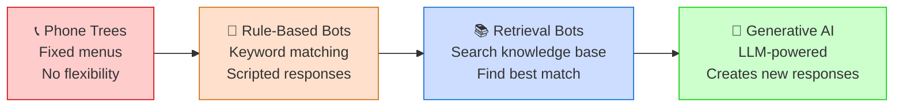
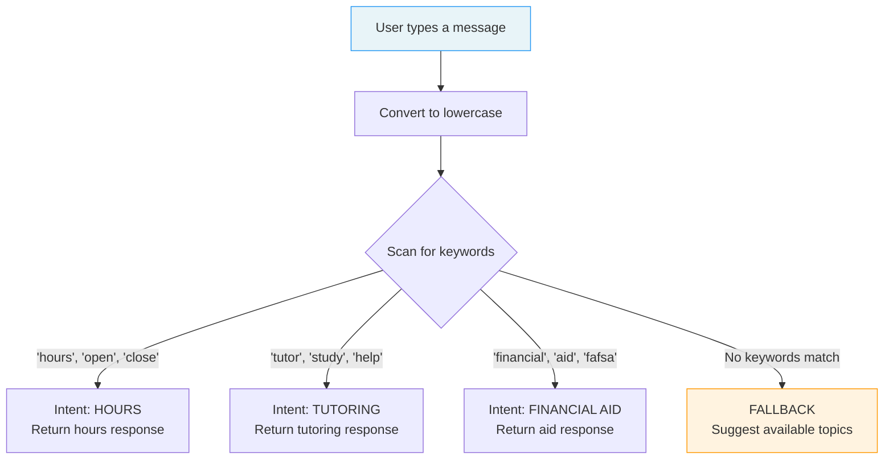
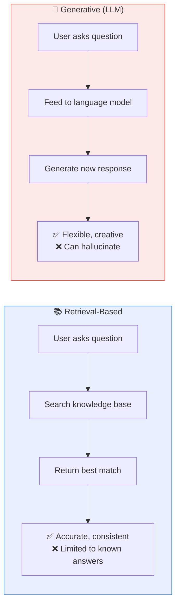
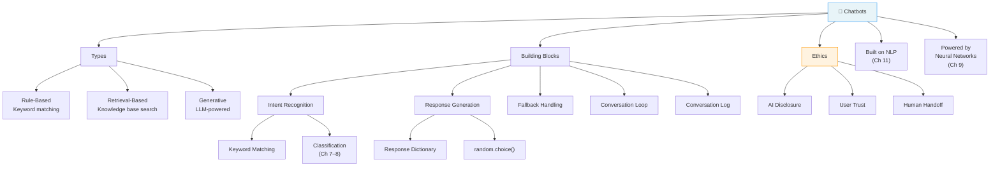

# Chapter 12: Building Chatbots


**Sofia's Late-Night Problem**

It's 11pm on a Thursday and Sofia's phone buzzes again. Another Instagram DM: *"Do you guys deliver?"*

She scrolls back through the last week of messages. "What are your hours?" — seventeen times. "Do you deliver?" — twelve. "What's today's special?" — nine. "Do you do catering?" — eight. "Where are you located?" — six. That's fifty-two messages, and she gave the same five answers over and over.

The next morning, she shows Marcus her phone at the campus coffee cart. "I need a clone of myself that just sits there and answers these."

Marcus looks at the screen. "That's literally what a chatbot is. Five questions, five answers, done."

"But chatbots are... advanced, right? Like ChatGPT?"

"Some are. But the basic version? It's just a recipe binder. Someone asks a question, you look it up, you give the answer."

Sofia pauses. That sounds exactly like the laminated FAQ sheet Abuela Carmen taped behind the restaurant counter twenty years ago — every common question with a handwritten answer. New employees read the sheet on Day 1. If a customer asked something not on the sheet, the answer was always: *"Let me get the manager."*

That afternoon, Prof. Reyes walks them through the plan: "By the end of today, you'll build a working chatbot. It won't be ChatGPT. But it will answer questions, hold a conversation, and teach you exactly how every chatbot — from the simplest to the most advanced — actually works."

---

*Technical Connection:* Sofia's five repeated questions are **intents** — categories of things users want to know. Her five answers are **responses**. The pattern — recognize the question, match it to a known category, return the right answer — is exactly how rule-based chatbots work. Today we'll build this system from scratch in Python.

---

### Learning Objectives

By the end of this chapter, you will be able to:

- Explain the spectrum of chatbots from rule-based to AI-powered
- Identify how chatbots recognize user intent through keyword matching
- Build a working rule-based chatbot in Python with multiple intents and response variations
- Compare retrieval-based and generative AI approaches to chatbot design
- Evaluate when and how chatbots should disclose they are not human

### Roadmap

We'll start by understanding what chatbots actually are — and why the phone tree at the DMV and ChatGPT are technically related. Then we'll learn how chatbots figure out what you want (intent recognition), build one from scratch in three progressive steps, explore how AI-powered chatbots go beyond keyword matching, test our creation until it breaks, and close with the ethics of AI that pretends to be human. This is your last coding chapter — let's make it count.

---

## 12.1 What Is a Chatbot?

Here's something that might surprise you: chatbots have been around since 1966. A program called ELIZA, created at MIT, simulated a therapist by reflecting users' own words back at them. Type "I feel sad," and ELIZA would respond: "Why do you feel sad?" It used simple pattern matching — no intelligence, no understanding. But people found it genuinely comforting. Some refused to believe it wasn't human.

Sixty years later, the technology has changed enormously. But the fundamental idea hasn't: a chatbot is any software that simulates a conversation with a human user. That's it. The "conversation" can be as rigid as a phone tree or as fluid as ChatGPT — both are chatbots.

Think of it like a spectrum. On one end, you've got the DMV phone tree: "Press 1 for renewals. Press 2 for appointments." Fixed paths, zero flexibility — you're navigating a flowchart. On the other end, you've got a system like ChatGPT that can discuss philosophy, write code, or help you draft an email to your landlord. In between sits everything from the customer service chat on your bank's website to Siri to the pizza ordering bot on Domino's app.



**Figure 12.1: The Chatbot Spectrum** — Chatbots range from rigid phone trees (left) to generative AI systems like ChatGPT (right). Today you'll build a rule-based bot — the foundation that every system on this spectrum shares.

The chatbot you'll build today sits in the second position — a rule-based bot that recognizes keywords and returns scripted responses. That might sound primitive compared to what you use daily. But here's the thing every semester someone asks me: *"Why are we building this when ChatGPT exists?"*

The answer is the same reason mechanics learn to work on simple engines before touching a Tesla. Every chatbot — no matter how advanced — does three things: figure out what the user wants (**intent recognition**), find or create an appropriate answer (**response generation**), and manage the flow of the conversation (**conversation management**). When you build a rule-based bot, you see all three of these mechanisms clearly. In ChatGPT, they're buried under billions of parameters. Here, they're right in front of you.

> 💡 **Key Insight:** A chatbot is any software that simulates conversation. The technology ranges from simple keyword matching to advanced AI — but intent recognition, response generation, and conversation flow are universal to all of them.

---

## 12.2 How Chatbots Understand Intent

When you walk up to the cafecito window and say "lo de siempre," the person behind the counter doesn't parse your grammar or look up words in a dictionary. They recognize your *intent* — you want your usual order. They've heard enough variations ("the regular," "same as always," "you know what I want") to know they all mean the same thing.

That's intent recognition: figuring out *what the user wants* from what they typed (or said). It's the single most important thing a chatbot does, because everything else — choosing a response, managing the conversation — depends on getting this right.

In the rule-based world, intent recognition works through **keyword matching**. The chatbot scans the user's message for specific words that signal a particular intent. If someone types "What are your hours?", the word "hours" signals the *hours* intent. If they type "When do you open?", the word "open" signals the same intent. Different words, same meaning.

Think of it like searching your abuela's recipe box by ingredient. You flip through looking for "pollo" and everything with chicken comes up — *arroz con pollo, pollo a la plancha, croquetas de pollo*. You didn't understand the full recipe name; you spotted the keyword.



**Figure 12.2: Intent Recognition Flow** — The chatbot converts the message to lowercase, scans for keywords, and routes to the matching intent. If no keywords match, it triggers the fallback response.

There's an important subtlety here that connects back to what we learned in Chapters 7 and 8. Intent recognition is actually a **classification problem**. The user's message is the input, and the intent label (hours, tutoring, financial aid) is the predicted category. In our rule-based bot, we're doing classification with keyword matching — the simplest possible classifier. In production chatbots, companies use the same machine learning classifiers you built in Chapters 7–9 to handle intent recognition. Same concept, more power.

> 🤔 **Think About It:** What happens when a message contains keywords from *two* different intents? If someone types "What are the hours for tutoring?", should the bot respond about hours or tutoring? This is the keyword priority problem — and you'll encounter it firsthand in your code.

---

**The Binder Behind the Desk**

Sofia told Marcus about Abuela Carmen's FAQ binder, and he couldn't stop thinking about it. "Wait — so your grandmother basically built a chatbot in the 1990s?"

"With a three-ring binder and a Sharpie, yeah."

When Sofia was eight, she'd watch new employees on their first day. Abuela Carmen would hand them the binder — blue, faded, held together with electrical tape. Every page had a question on top and the answer below, in Abuela's careful handwriting:

*"¿Dónde está el baño?"* → "Past the kitchen, on the left."

*"Is the chicken halal?"* → "No, but the fish is prepared separately."

*"Do you have high chairs?"* → "Two — by the front window."

*"Can I make a reservation?"* → "We don't take reservations. First come, first served."

If a customer asked something that wasn't in the binder, the instructions on the last page were clear: *"Smile, say 'Let me check with the manager,' and come get me."*

"That last page," Marcus said, "that's a fallback response."

"Exactly," Sofia laughed. "And when Abuela heard a new question three times, she'd add a page. That's updating your training data."

---

*Technical Connection:* Abuela Carmen's binder is a perfect physical model of a rule-based chatbot. Each page is an **intent** (the question) paired with a **response** (the answer). The keywords that help employees find the right page are **keyword matching**. And the last page — "Let me get the manager" — is the **fallback response** that handles unrecognized inputs. The only difference between the binder and code is speed.

---

## 12.3 Building a Rule-Based Chatbot

Time to build. We're going to create a Student Services chatbot for MDC — something every student in this class has interacted with (or wished existed). We'll do it in three steps, each one adding capability.

### Example 12.1: Your First Chatbot

Let's start with the simplest possible chatbot: three intents, no loop, one interaction.

```python
# ============================================
# Example 12.1: Your First Chatbot
# Purpose: Basic keyword matching with if/elif
# Prerequisites: None — just Python basics
# ============================================

# Step 1: Get the user's message and convert to lowercase
user_message = input("You: ").lower()

# Step 2: Check for keywords and respond
if "hours" in user_message or "open" in user_message:
    print("Bot: We're open Monday through Friday, 8am to 6pm, and Saturday 9am to 1pm!")
elif "tutoring" in user_message or "tutor" in user_message:
    print("Bot: Free tutoring is available in the Learning Center, Room 2201. No appointment needed!")
elif "financial" in user_message or "aid" in user_message:
    print("Bot: The Financial Aid office is in Room 1145. You can also apply online at studentaid.gov.")
else:
    print("Bot: I'm not sure how to help with that. Try asking about hours, tutoring, or financial aid.")

# Expected Output (if user types "what are your hours?"):
# You: what are your hours?
# Bot: We're open Monday through Friday, 8am to 6pm, and Saturday 9am to 1pm!

# Expected Output (if user types "tell me about the weather"):
# You: tell me about the weather
# Bot: I'm not sure how to help with that. Try asking about hours, tutoring, or financial aid.
```

That's it. Twelve lines of actual code, and you have a working chatbot. Let's break down what's happening:

The `.lower()` call on the input is critical — it converts "WHAT ARE YOUR HOURS?" and "What are your hours?" to the same lowercase string so our keyword matching works regardless of how the user capitalizes their message. Without this, "Hours" wouldn't match "hours" and the bot would fail on a perfectly valid question.

Each `if/elif` branch checks whether a keyword appears anywhere in the message using Python's `in` operator. "hours" `in` "what are your hours?" returns `True`. The `or` lets us check multiple keywords for the same intent — someone might say "hours" or "open" and mean the same thing.

The `else` at the end is the fallback — the "Let me get the manager" page from Abuela Carmen's binder. Every chatbot needs one.

> ⚠️ **Common Pitfall:** Forgetting `.lower()` is the #1 chatbot bug. Without it, "What are your HOURS?" won't match "hours" and the bot will hit the fallback. Always normalize input before checking keywords.

**Try It Yourself:**
- Add a fourth intent — try "parking" with keywords "parking" and "permit". What response would you give?
- Type "WHAT ARE YOUR HOURS?" in all caps. Does it still work? Remove `.lower()` and try again — what happens?
- Type a message with two keywords: "what are the hours for tutoring?" Which intent fires? Why?

### Example 12.2: A Smarter Chatbot

Example 12.1 works, but it has limitations. Each intent is a hardcoded `if/elif` branch, the response never varies, and the conversation ends after one exchange. Let's fix all three problems.

```python
# ============================================
# Example 12.2: A Smarter Chatbot
# Purpose: Dictionary-based intents, random responses, conversation loop
# Prerequisites: Example 12.1 concepts
# ============================================

import random

# Step 1: Define intents with keyword lists and multiple responses
intents = {
    "hours": {
        "keywords": ["hours", "open", "close", "schedule"],
        "responses": [
            "We're open Monday–Friday, 8am–6pm, and Saturday 9am–1pm!",
            "Our hours are Mon–Fri 8am to 6pm. Saturdays we're open 9am to 1pm.",
            "You can visit us Monday through Friday, 8am–6pm. We also have Saturday hours: 9am–1pm."
        ]
    },
    "tutoring": {
        "keywords": ["tutoring", "tutor", "help", "study"],
        "responses": [
            "Free tutoring is available in the Learning Center, Room 2201. No appointment needed!",
            "Head to Room 2201 for free tutoring — walk-ins welcome!",
            "The Learning Center in Room 2201 offers free tutoring. Just show up!"
        ]
    },
    "financial_aid": {
        "keywords": ["financial", "aid", "scholarship", "fafsa"],
        "responses": [
            "The Financial Aid office is in Room 1145. Apply online at studentaid.gov!",
            "Visit Room 1145 for Financial Aid, or start your FAFSA at studentaid.gov.",
            "Need help paying for school? Room 1145 has your answers. Start at studentaid.gov!"
        ]
    },
    "registration": {
        "keywords": ["register", "enroll", "class", "sign up", "registration"],
        "responses": [
            "You can register for classes through MyMDC at my.mdc.edu.",
            "Head to my.mdc.edu to register! Your advisor can help you pick classes.",
            "Registration is online at my.mdc.edu. See your advisor if you need help choosing courses."
        ]
    },
    "greeting": {
        "keywords": ["hello", "hi", "hey", "good morning", "good afternoon"],
        "responses": [
            "Hello! Welcome to MDC Student Services. How can I help you today?",
            "Hey there! What can I help you with?",
            "Hi! I'm the Student Services Bot. Ask me about hours, tutoring, financial aid, or registration."
        ]
    }
}

# Step 2: Create a function to find the matching intent
def get_response(message):
    message = message.lower()
    for intent_name, intent_data in intents.items():
        for keyword in intent_data["keywords"]:
            if keyword in message:
                return random.choice(intent_data["responses"])
    return "I'm not sure how to help with that. Try asking about hours, tutoring, financial aid, or registration."

# Step 3: Run the conversation loop
print("Student Services Bot: Hi! Ask me anything. Type 'bye' to exit.\n")
while True:
    user_input = input("You: ")
    if user_input.lower() in ["bye", "quit", "exit"]:
        print("Bot: Goodbye! Good luck with your studies! 🎓")
        break
    response = get_response(user_input)
    print(f"Bot: {response}\n")

# Expected Output (sample conversation):
# Student Services Bot: Hi! Ask me anything. Type 'bye' to exit.
#
# You: hi
# Bot: Hey there! What can I help you with?
#
# You: when are you open?
# Bot: Our hours are Mon–Fri 8am to 6pm. Saturdays we're open 9am to 1pm.
#
# You: I need help with my fafsa
# Bot: Visit Room 1145 for Financial Aid, or start your FAFSA at studentaid.gov.
#
# You: how do I sign up for classes?
# Bot: Registration is online at my.mdc.edu. See your advisor if you need help choosing courses.
#
# You: what's the cafeteria menu?
# Bot: I'm not sure how to help with that. Try asking about hours, tutoring, financial aid, or registration.
#
# You: bye
# Bot: Goodbye! Good luck with your studies! 🎓
```

Three major upgrades from Example 12.1:

**The response dictionary.** Instead of hardcoding each intent as an if/elif branch, we store everything in a Python dictionary called `intents`. Each intent has a name, a list of keywords, and a list of possible responses. Adding a new intent means adding a new dictionary entry — not rewriting the logic. Think of it like the laminated FAQ sheet taped behind every small business counter in Hialeah — organized, easy to update, same structure for every question.

**`random.choice()` for variation.** A good server doesn't say "Enjoy your meal!" the exact same way to every table. `random.choice()` picks a random response from the list each time an intent matches, so the bot feels less robotic. Run the same question twice and you'll likely get a different answer.

**The conversation loop.** `while True` keeps the conversation going indefinitely. The only exit is typing "bye," "quit," or "exit" — which triggers `break` to end the loop. This transforms the bot from a one-shot answer machine into something that feels like an actual conversation.

The `get_response()` function is the engine. It takes the user's message, converts to lowercase, then loops through every intent checking every keyword. First match wins — it returns a random response from that intent. If nothing matches, the fallback kicks in.

> 🔧 **Pro Tip:** The dictionary-based approach scales beautifully. A chatbot with 5 intents and one with 50 intents use the *exact same* `get_response()` function. You just add more entries to the dictionary. This is why real chatbot platforms like Dialogflow and Rasa use the same pattern — intents with training phrases and responses.

> ⚠️ **Common Pitfall:** Notice that "help" is a keyword for the tutoring intent. If someone types "Can you help me with parking?", the bot will match "help" and respond about tutoring. Generic keywords cause false matches. Be specific: use "tutoring help" instead of just "help", or order your intents so more specific matches come first.

**Try It Yourself:**
- Add a sixth intent for "parking" with keywords ["parking", "park", "permit", "garage"] and 3 response variations. Test it.
- Run the chatbot and type "hi" three times in a row. Do you get different responses each time?
- Type just "help" — which intent does it match? Is that the right one? How would you fix it?

### Example 12.3: The Full Chatbot

Now let's build the production version. We'll add two more intents (parking and advising), upgrade the fallback to suggest available topics instead of a dead-end message, and add a conversation log that tracks every exchange.

```python
# ============================================
# Example 12.3: Student Services Bot — Full Version
# Purpose: Complete chatbot with logging and smart fallback
# Prerequisites: Examples 12.1 and 12.2
# ============================================

import random

# Step 1: Define comprehensive intents
intents = {
    "greeting": {
        "keywords": ["hello", "hi", "hey", "good morning", "good afternoon", "what's up"],
        "responses": [
            "Hello! Welcome to MDC Student Services. How can I help you today?",
            "Hey there! What can I help you with?",
            "Hi! I'm the Student Services Bot. Ask me about hours, tutoring, financial aid, registration, parking, or advising."
        ]
    },
    "hours": {
        "keywords": ["hours", "open", "close", "schedule", "time"],
        "responses": [
            "We're open Monday–Friday, 8am–6pm, and Saturday 9am–1pm!",
            "Our hours are Mon–Fri 8am to 6pm. Saturdays we're open 9am to 1pm.",
            "You can visit us Monday through Friday, 8am–6pm. We also have Saturday hours: 9am–1pm."
        ]
    },
    "tutoring": {
        "keywords": ["tutoring", "tutor", "study", "learning center"],
        "responses": [
            "Free tutoring is available in the Learning Center, Room 2201. No appointment needed!",
            "Head to Room 2201 for free tutoring — walk-ins welcome!",
            "The Learning Center in Room 2201 offers free tutoring. Just show up!"
        ]
    },
    "financial_aid": {
        "keywords": ["financial", "aid", "scholarship", "fafsa", "pay"],
        "responses": [
            "The Financial Aid office is in Room 1145. Apply online at studentaid.gov!",
            "Visit Room 1145 for Financial Aid, or start your FAFSA at studentaid.gov.",
            "Need help paying for school? Room 1145 has your answers. Start at studentaid.gov!"
        ]
    },
    "registration": {
        "keywords": ["register", "enroll", "class", "sign up", "registration", "add", "drop"],
        "responses": [
            "You can register for classes through MyMDC at my.mdc.edu.",
            "Head to my.mdc.edu to register! Your advisor can help you pick classes.",
            "Registration is online at my.mdc.edu. See your advisor if you need help choosing courses."
        ]
    },
    "parking": {
        "keywords": ["parking", "park", "car", "garage", "permit"],
        "responses": [
            "Parking permits are available online at my.mdc.edu under 'Parking Services.'",
            "You'll need a parking permit — grab one online through your MyMDC portal.",
            "Parking info is at my.mdc.edu. Permits are required in all campus garages and lots."
        ]
    },
    "advising": {
        "keywords": ["advisor", "advising", "major", "degree", "transfer", "graduate"],
        "responses": [
            "Academic advising is in Room 1201. You can also book online through MyMDC.",
            "Need to talk about your major or transfer plans? Visit Advising in Room 1201.",
            "Your advisor can help with degree planning — book an appointment at my.mdc.edu."
        ]
    }
}

# Step 2: Improved response function with smart fallback
def get_response(message):
    message = message.lower()
    for intent_name, intent_data in intents.items():
        for keyword in intent_data["keywords"]:
            if keyword in message:
                return intent_name, random.choice(intent_data["responses"])
    
    # Smart fallback: suggest available topics
    available = list(intents.keys())
    available.remove("greeting")
    topic_list = ", ".join(available).replace("_", " ")
    return "unknown", f"I'm not sure about that one. I can help with: {topic_list}. What would you like to know?"

# Step 3: Conversation loop with logging
conversation_log = []
print("🤖 Student Services Bot")
print("-" * 40)
print("Bot: Hi! I'm the MDC Student Services Bot.")
print("     Ask me about hours, tutoring, financial aid,")
print("     registration, parking, or advising.")
print("     Type 'bye' to exit.\n")

while True:
    user_input = input("You: ")
    
    if user_input.lower().strip() in ["bye", "quit", "exit", "goodbye"]:
        farewell = "Goodbye! Good luck with your studies! 🎓"
        print(f"Bot: {farewell}")
        conversation_log.append((user_input, farewell, "exit"))
        break
    
    intent, response = get_response(user_input)
    print(f"Bot: {response}\n")
    conversation_log.append((user_input, response, intent))

# Step 4: Display conversation log
print("\n" + "=" * 50)
print("CONVERSATION LOG")
print("=" * 50)
print(f"Total exchanges: {len(conversation_log)}")
print("-" * 50)
for i, (user_msg, bot_msg, intent) in enumerate(conversation_log, 1):
    print(f"  [{i}] You: {user_msg}")
    print(f"      Bot: {bot_msg}")
    print(f"      Intent: {intent}")
    print()

# Step 5: Intent summary statistics
intent_counts = {}
for _, _, intent in conversation_log:
    if intent != "exit":
        intent_counts[intent] = intent_counts.get(intent, 0) + 1

print("Intent Summary:")
for intent, count in sorted(intent_counts.items()):
    print(f"  {intent}: {count}")

unknown_count = intent_counts.get("unknown", 0)
total = len(conversation_log) - 1  # Exclude the exit
if total > 0:
    success_rate = ((total - unknown_count) / total) * 100
    print(f"\nSuccess rate: {total - unknown_count}/{total} ({success_rate:.0f}%)")

# Expected Output (using 10-input test transcript):
# Test inputs:
#   1. "Hello!"
#   2. "What are your hours?"
#   3. "I need tutoring for math"
#   4. "How do I apply for financial aid?"
#   5. "I want to sign up for classes"
#   6. "Where do I park?"
#   7. "Who is my advisor?"
#   8. "What's the wifi password?"
#   9. "Can I get food on campus?"
#   10. "bye"
#
# Results: 8 successful matches (inputs 1-7 + exit), 2 unknowns (inputs 8-9)
# Success rate: 7/9 (78%) — excludes greeting and exit from success calc
# (Note: responses will vary due to random.choice())
```

Let's walk through what's new.

**The smart fallback.** Compare the fallback in Example 12.1 ("I'm not sure how to help with that") to this one. Instead of a dead end, the bot now lists every available topic. It's like your GPS saying "recalculating" instead of just going silent — it doesn't crash, it redirects. The `available.remove("greeting")` line keeps "greeting" out of the suggestion list because nobody needs to be told they can say hello.

**The conversation log.** Every exchange is stored as a tuple: `(user_input, bot_response, intent_name)`. After the conversation ends, the bot prints a complete log with numbered entries and intent labels. This is how real chatbot systems track performance — you need to know which intents are being triggered (and which are being missed) to improve the system.

**Intent summary statistics.** The bot counts how many times each intent was triggered and calculates a success rate — what percentage of user messages were successfully matched to an intent vs. hitting the fallback. In our test transcript, 2 out of 9 non-exit messages were unknowns, giving us roughly a 78% success rate. In production, a chatbot team would use this data to identify the most common "unknown" queries and add new intents to cover them.

> 📊 **By The Numbers:** Industry chatbots aim for 85–95% intent recognition rates. Below 80%, users get frustrated and leave. Above 95%, the bot is handling almost everything autonomously. Our test chatbot hits about 78% — not bad for 7 intents, but there's room to grow.

> ⚠️ **Common Pitfall:** Try typing "what are the hours for tutoring?" — the bot matches "hours" because the `get_response()` function returns on the *first* keyword match it finds. Since "greeting" and "hours" come before "tutoring" in the dictionary, "hours" wins. This is the **keyword priority problem**. In production systems, more sophisticated techniques (like checking which intent has the *most* keyword matches) solve this. For now, be aware that keyword order matters.

**Try It Yourself:**
- Add an 8th intent (library, campus safety, or IT help desk) and re-run the 10-input test. Does your success rate improve?
- Try 5 messages you think will break the bot. What patterns cause failures? Make a list.
- Modify the fallback to be even smarter: instead of listing all topics, have it suggest the *single* topic that seems closest to what the user asked. (Hint: check if any keyword is *partially* in the message.)

---

**The Two Bartenders**

After class, Marcus ran into Prof. Reyes at the coffee cart. "Okay, I get the rule-based chatbot. But I use ChatGPT every day, and it doesn't match keywords. How does *that* work?"

Prof. Reyes smiled. "Let me give you two bartenders."

"The first bartender has memorized exactly 50 cocktail recipes. You order a mojito, you get a perfect mojito — every single time. Same proportions, same mint, same glass. Order something that's not on the list? 'Sorry, we don't make that.' That's your rule-based chatbot. Predictable. Reliable. Fast. Limited."

"The second bartender has tasted thousands of drinks, understands flavor profiles, and has been improvising for years. You say 'Give me something tropical but not too sweet,' and they'll invent something on the spot. Maybe it's brilliant. Maybe it's weird. But it's *new* — they didn't look it up, they created it. That's an LLM-powered chatbot."

Marcus thought about it. "So the first one never messes up your mojito, but can't handle anything off-menu. The second one can handle anything, but might give you something unexpected."

"Exactly. And here's the real question — if you're running a hospital, which bartender do you want answering patient questions?"

---

*Technical Connection:* The two bartenders illustrate the **retrieval-based vs. generative** divide in chatbot design. Retrieval-based systems search a knowledge base for the best existing answer — like looking up a recipe. Generative systems (LLMs) create new responses from patterns learned during training — like improvising a drink. Most production chatbots use a hybrid: retrieval for structured, fact-based queries (hours, policies, prices) and generative AI for open-ended questions that need flexibility.

---

## 12.4 Rule-Based to AI-Powered: The Spectrum

You've now built a rule-based chatbot. It works. It's fast. It's predictable. And it breaks the moment someone asks something you didn't anticipate — which, if you've ever worked in customer service, you know happens constantly.

So how do chatbots get smarter? There are two main upgrade paths, and understanding them helps you see where the chatbot you just built fits in the bigger picture.

### Retrieval-Based Chatbots

A retrieval-based chatbot doesn't generate answers — it *finds* them. Instead of keyword matching against a small dictionary, it searches a large knowledge base (FAQs, documentation, product catalogs) and returns the best match. Think of a librarian: you ask a question, they don't write a book — they find the right one on the shelf.

The upgrade from our rule-based bot to a retrieval system is straightforward conceptually: replace keyword matching with semantic search. Instead of checking if "fafsa" appears in the message, the system understands that "How do I pay for school?" and "FAFSA application process" are about the same thing — even though they share zero keywords. This is where the NLP concepts from Chapter 11 (tokenization, embeddings, transformers) come into play.

Most customer service chatbots you interact with — on bank websites, airline apps, e-commerce platforms — are retrieval-based. They search a curated knowledge base and return the best match. The answers are pre-written by humans, so they're accurate and on-brand. The AI just handles the matching.

### Generative Chatbots

Generative chatbots — the ChatGPTs and Claudes of the world — don't search for answers. They *create* them. Under the hood, they're Large Language Models (LLMs) that predict the next word in a sequence, billions of times, to produce responses that feel human.

Remember from Chapter 11 when we discussed how transformers work? LLMs are transformers scaled up massively — trained on enormous amounts of text from the internet, books, code, and more. They don't "know" things the way you do. They've learned statistical patterns about how language works, and they use those patterns to generate plausible continuations of any conversation.

The power is obvious: a generative chatbot can discuss virtually anything, adapt to tone, follow complex instructions, and handle questions no one anticipated. The tradeoffs are equally significant. Generative chatbots can **hallucinate** — produce confident-sounding answers that are completely wrong. They're expensive to run (each response requires massive computation). And they're **black boxes** — just like the neural networks from Chapter 9, you can't easily explain *why* they said what they said.



**Figure 12.3: Retrieval vs. Generative Chatbots** — Retrieval-based systems find existing answers (accurate but limited). Generative systems create new responses (flexible but unpredictable). Most production chatbots combine both approaches.

> 🌎 **Real-World Application:** Most modern chatbot deployments use a **hybrid approach**. When a user asks a structured question ("What are your return policy hours?"), the system retrieves the answer from a knowledge base — fast, accurate, no hallucination risk. When a user asks something open-ended ("I'm frustrated with my order and need help figuring out my options"), the system routes to a generative model that can handle nuance and emotion. The rule-based logic you built today? It's still in the mix — it handles the routing that decides which system takes over.

### Where Your Chatbot Fits

The chatbot you built today is a fully functional rule-based system. It's the same architectural pattern that billions of customer service interactions run on every day. The core concepts — intent recognition, response mapping, fallback handling, conversation flow — are identical whether you're using if/elif or GPT-4.

Here's the progression:

| Feature | Your Chatbot (Rule-Based) | Retrieval-Based | Generative (LLM) |
|---------|---------------------------|-----------------|-------------------|
| **How it matches intent** | Keyword matching | Semantic search / ML classifier | Context understanding |
| **How it responds** | Pre-written responses | Pre-written, best-match | Generated on the fly |
| **Handles unknown questions** | Fallback message | Searches for closest match | Generates a response |
| **Accuracy** | 100% for known intents | High for knowledge base content | Variable — can hallucinate |
| **Setup effort** | Low — define keywords + responses | Medium — build knowledge base | High — train or pay for LLM |
| **Cost to run** | Nearly free | Low to moderate | Expensive |

The important takeaway: these aren't competing technologies. They're layers. Your rule-based bot handles the 80% of questions that are predictable. A retrieval layer handles the next 15% that need flexibility. A generative model handles the final 5% that need true creativity. Together, they form a complete system.

---

## 12.5 Testing and Improving

Here's something every software developer knows and every new chatbot builder discovers the hard way: your chatbot works perfectly — until someone actually uses it.

Testing a chatbot is like hurricane prep. You board up the windows, stock water, charge your devices — you prepare for everything you can predict. But the storm can always surprise you. A tree falls where you didn't expect. The power goes out from a direction you didn't anticipate. In chatbot terms: a user types something you never imagined.

Let's look at what breaks.

### Edge Cases

An **edge case** is an input that falls outside what you designed for — the question that wasn't in Abuela Carmen's binder. Here are the most common types:

**Typos and misspellings.** A user types "finacial ade" instead of "financial aid." Our keyword matching looks for exact matches, so "finacial" doesn't contain "financial" and the bot misses it entirely. Production chatbots handle this with fuzzy matching — checking if a word is *close enough* to a keyword.

**Multi-intent messages.** "I need to register for classes and find out about parking" contains keywords for both registration and parking. Our bot returns the first match. A better system would recognize both intents and address each one.

**Context and follow-ups.** A user asks "What are your hours?" and gets an answer. Then they ask "What about Saturday?" Our bot has no memory — it treats every message independently. It doesn't know "Saturday" refers to hours because it doesn't remember the previous exchange. Production chatbots solve this with **context management** — tracking conversation state across multiple turns.

**Out-of-scope emotional messages.** A user types "I'm really stressed about my grades and I don't know what to do." This isn't a question about hours or parking — it's a human in distress. Our fallback ("I can help with: hours, tutoring...") is technically correct but emotionally tone-deaf. Real chatbot design includes intent categories for emotional states that trigger empathetic responses or human handoffs.

> 💡 **Key Insight:** The quality of a chatbot isn't measured by how well it handles expected inputs — that's easy. It's measured by how *gracefully* it handles unexpected ones. A great fallback is worth more than ten new intents.

### Testing Strategy

Every chatbot should be tested with three categories of input:

1. **Happy path** — messages that clearly match your intents. "What are your hours?" "I need tutoring." These should always work.

2. **Near misses** — messages that are *about* a topic but don't contain your exact keywords. "When can I come in?" (about hours but doesn't say "hours" or "open"). These reveal gaps in your keyword lists.

3. **Curveballs** — messages you never anticipated. "What's the wifi password?" "Who's the president of MDC?" "Tell me a joke." These test your fallback. A good fallback redirects. A bad one frustrates.

Here's a testing template you can use on any chatbot:

| Test # | Input | Expected Intent | Actual Intent | Match? | Notes |
|--------|-------|----------------|---------------|--------|-------|
| 1 | "What are your hours?" | hours | hours | ✅ | — |
| 2 | "When can I come in?" | hours | unknown | ❌ | Missing keyword: "come in" |
| 3 | "wifi password" | unknown | unknown | ✅ | Correct fallback |
| 4 | "hours for tutoring" | hours OR tutoring | hours | ⚠️ | First match wins — is this right? |

> 🔧 **Pro Tip:** After testing, don't just fix failures — categorize them. Are most failures from missing keywords (easy fix — add more keywords), ambiguous intents (harder — rethink your categories), or truly out-of-scope questions (expected — improve your fallback)? The category tells you where to invest your time.

---

**Abuela's Test**

Sofia couldn't wait to show Abuela Carmen the chatbot she'd built in class. She pulled up the Colab notebook on her phone, ran the code, and handed it over.

"Pregúntale algo," Sofia said proudly.

Abuela Carmen typed slowly with one finger: *"My granddaughter works here and she's very talented."*

The bot responded: *"I'm not sure about that one. I can help with: hours, tutoring, financial aid, registration, parking, advising."*

Abuela laughed. "At least it's honest."

Then she typed something else: *"I'm locked out of my account and I'm panicking."*

Same response. Same flat list of topics.

Abuela put the phone down and looked at Sofia. "Mija, when someone tells you they're panicking, the worst thing you can say is 'I don't understand.' It doesn't matter if you can't fix the problem. You say 'I hear you, let me connect you with someone who can help.' That's not a technology problem. That's a people problem."

Sofia stared at the fallback message. Abuela was right. The bot didn't need to solve the locked-account problem. It needed to recognize that someone was upset and respond differently. A fallback isn't just a technical catch-all — it's the bot's chance to be *human* about its limitations.

---

*Technical Connection:* Abuela Carmen identified the most important lesson in chatbot design: **not every failure is a missing intent — some are missing empathy.** Production chatbots include **sentiment-aware fallbacks** that detect emotional language (words like "panicking," "frustrated," "help," "urgent") and route to a human agent or offer a more supportive response. The technical term is **escalation routing** — recognizing when the bot has reached its limits and handing off gracefully.

---

## 12.6 The Ethics of Chatbots: AI Impersonation

### ⚖️ Ethics in Focus: When Should AI Say "I'm Not Human"?

A real estate company in Brickell launched an AI chatbot to handle initial inquiries from potential buyers. The bot was well-designed — it answered questions about listings, neighborhood details, pricing ranges, and scheduled callbacks. It responded within seconds at any hour. Its language was natural and professional. Many clients had full conversations without realizing they were talking to a machine.

The problems started when clients asked for showings. The chatbot would say "Let me connect you with an agent" — and the client would be transferred to a human for the first time. Some clients were fine with it. Others felt deceived. One left a Google review: "I thought I was building a relationship with a real person. Turns out I was talking to a robot for 20 minutes. I don't trust this company anymore."

The company faced a genuine dilemma. The chatbot was faster than any human agent. It never forgot a listing detail. It was available at 2am on a Sunday. By every performance metric, it was better. But some clients valued transparency over efficiency. They wanted to know *who* — or *what* — they were talking to.

This is the **AI disclosure question**, and it's one of the most debated topics in AI ethics today. You just built a chatbot. You saw how keyword matching, response design, and fallback handling can create convincing interactions. Now scale that up with an LLM behind it, and the conversation becomes nearly indistinguishable from a human one. The question isn't "can we build it?" — you already know we can. The question is: **should the bot tell you it's not human?**

There's no easy answer, and the debate has real nuance. On one side: transparency builds trust, and people have a right to know when they're interacting with AI. On the other: if the bot provides better service faster and the user gets what they need, does it matter? A doctor's office chatbot that triages patients at 3am saves lives regardless of whether the patient knows it's AI.

The EU's AI Act takes a clear position: chatbots must disclose they are AI when interacting with humans. California's B.O.T. Act requires similar disclosure in certain commercial contexts. But enforcement is uneven, and many companies argue that forced disclosure reduces user trust more than the AI interaction itself.

**Reflect & Discuss:**

1. You just built a chatbot. At what point in a conversation should the chatbot disclose that it's not human? At the start? Only if asked? Never?
2. A mental health support chatbot helps people in crisis at 3am when no humans are available. But it doesn't disclose that it's AI. Is this ethical? Does the benefit outweigh the deception?
3. Design a disclosure policy for a chatbot at a business you care about. What would it say, when would it say it, and why?

---

## Closing Materials

### Key Takeaways

- **A chatbot is any software that simulates conversation** — from rigid phone trees to ChatGPT. The technology ranges widely, but intent recognition, response generation, and conversation flow are universal.
- **Intent recognition is how a chatbot figures out what the user wants.** In rule-based systems, this works through keyword matching. In AI-powered systems, it uses machine learning classifiers or large language models.
- **Keyword matching maps user messages to predefined intents** — simple, fast, and effective for structured queries. The dictionary-based approach scales to any number of intents without changing the core logic.
- **`random.choice()` makes chatbots feel more natural** by varying responses for the same intent. Small touches like this are the difference between a bot that feels robotic and one that feels conversational.
- **Fallback responses handle unknown inputs** — and their quality defines the chatbot experience. Good fallbacks suggest alternatives and redirect. Great fallbacks detect frustration and offer human handoff.
- **AI-powered chatbots generate responses instead of looking them up** — more flexible but less predictable. Retrieval-based systems search knowledge bases; generative systems (LLMs) create new text. Most production systems use both.
- **Chatbot ethics includes disclosure and trust** — when AI communicates convincingly, transparency about its nature becomes a design decision with real consequences for users and businesses.

### Concept Map



**Figure 12.4: Chapter 12 Concept Map** — Chatbots connect to classification (Ch 7–8), neural networks (Ch 9), and NLP (Ch 11). The building blocks — intent recognition, response generation, fallback handling, and conversation flow — are universal across all chatbot types.

### Vocabulary Review

| Term | Definition |
|------|-----------|
| **Chatbot** | Any software that simulates conversation with a human user |
| **Intent** | What the user is trying to accomplish or ask about in a message |
| **Keyword matching** | Scanning a message for specific words that signal a particular intent |
| **Response dictionary** | A structured data collection mapping intents to their possible responses |
| **Fallback response** | The default response when no intent matches the user's message |
| **Conversation loop** | Code that keeps the chatbot running and accepting new inputs until the user exits |
| **Rule-based chatbot** | A chatbot that uses predefined rules (if/elif, keyword lists) to match intents and select responses |
| **Retrieval-based chatbot** | A chatbot that searches a knowledge base to find the best existing answer to a question |
| **Generative chatbot** | A chatbot that uses a language model to create new responses rather than retrieving pre-written ones |
| **Escalation routing** | The process of recognizing when a chatbot has reached its limits and handing the conversation to a human |

### Bridge to Chapter 13

You've now built AI systems from the ground up — classifiers that predict, neural networks that learn, computer vision that sees, NLP that reads, and chatbots that converse. But here's the question nobody's asked yet: *how do real companies actually deploy these things?*

Building a model in Colab is one thing. Running it for millions of users, keeping it fair, keeping it legal, keeping it running at 3am when something breaks — that's enterprise AI. How do organizations decide if they're ready? What infrastructure do they need? What regulations apply? And what happens when an AI system causes harm at scale?

This was also your last coding chapter. From here on, the focus shifts from *building* AI to thinking critically about how it's deployed, governed, and shaped by the people who use it — including you. The code you wrote this semester isn't going away. The question now is: what do you do with it?

### Self-Check Questions

1. What is the difference between a rule-based chatbot and a generative chatbot?
2. If a chatbot has 7 intents and a user sends a message that doesn't match any keyword, what should happen?
3. Why does `random.choice()` improve a chatbot's user experience?
4. A chatbot matches "I need help with parking" to the "tutoring" intent instead of "parking." What caused this error and how would you fix it?
5. Give one reason a company should disclose that its customer service agent is a chatbot, and one reason they might choose not to.

### Hands-On Challenge: Build a Custom Chatbot (40–60 minutes)

Now it's your turn to build a chatbot for a context that matters to you. This challenge forms the foundation for your group lab activity.

**Choose a scenario:**
- A restaurant (like Sofia's) answering customer questions
- A campus club or organization answering member questions
- A small business (barbershop, gym, tutoring service) answering client questions

**Build it with these requirements:**
1. At least 6 intents with 3+ keyword variations each
2. At least 2 response variations per intent using `random.choice()`
3. A fallback response that suggests available topics
4. A conversation loop with a clean exit command
5. A conversation log that prints after the session ends

**Milestones:**
- **15 min:** Define your intents, keywords, and responses in a dictionary
- **25 min:** Write the `get_response()` function and conversation loop
- **35 min:** Test with 10+ inputs, document what works and what breaks
- **45 min:** Improve — add keywords that cover your failures, upgrade your fallback
- **60 min:** Run your final test transcript and report your success rate

### Discussion Prompts

1. You built a rule-based chatbot and used ChatGPT the same week. What specific things does ChatGPT do that your chatbot can't? Now flip it: what does your chatbot guarantee that ChatGPT doesn't?
2. If you were advising a small business owner in your community, would you recommend a rule-based chatbot, an AI-powered one, or no chatbot at all? What factors would influence your recommendation?
3. Abuela Carmen said the worst thing to say when someone is panicking is "I don't understand." How should chatbot designers handle emotional or urgent messages that fall outside the bot's capabilities?
