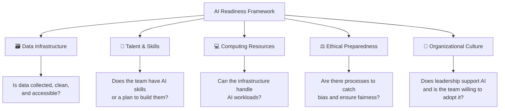
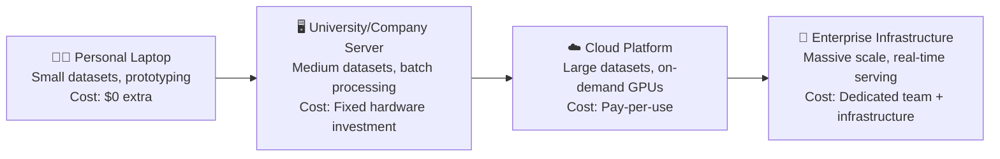
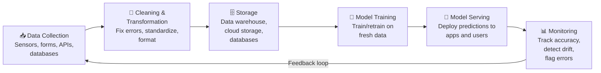
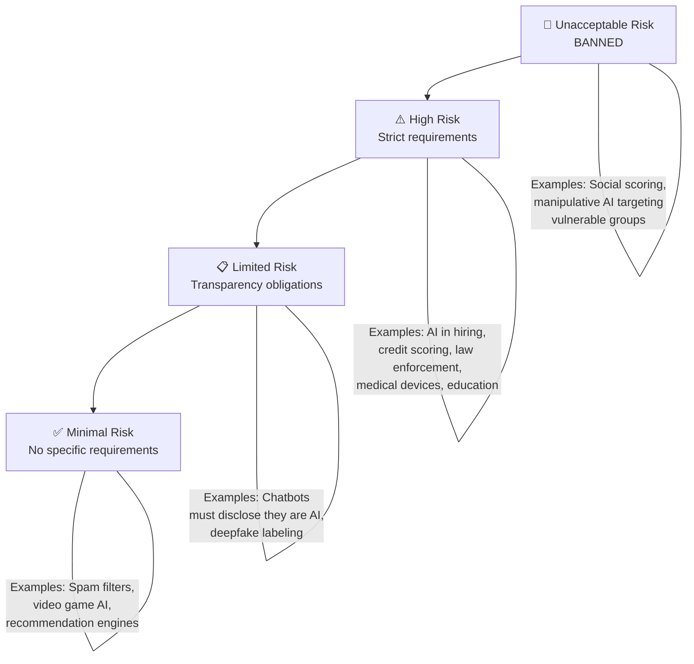
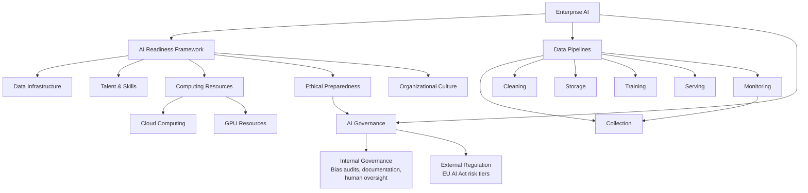

# Chapter 13: Enterprise AI & Implementation

---

## Sofia's Big Pitch

Sofia had been rehearsing all week.

Standing in the back office of *Café Bustelo y Más*, her family's Hialeah restaurant, she pulled up the spreadsheet she'd been building since Chapter 4. Three years of daily sales data — every plate of ropa vieja, every order of croquetas, every Friday night rush and every slow Tuesday afternoon. She'd cleaned it, visualized it, even run a basic demand prediction model in Colab. The numbers were clear: the restaurant was throwing away roughly $400 worth of food every week because they were cooking based on instinct instead of data.

"Mira," she said, turning her laptop toward her uncle Tomás, the co-owner. "If we use this model, we could cut food waste by at least 30%. That's over $600 a month back in our pockets."

Her uncle leaned back in his chair and crossed his arms. He wasn't dismissing her — Sofia knew that look. He was thinking.

"Okay, sobrina. I have three questions." He held up one finger. "Where do we store all this data? Your laptop? What happens when it breaks?" A second finger. "Who's going to maintain this thing when you graduate? You think your cousin Miguelito is going to learn Python?" A third finger. "And what happens when the computer says we don't need arroz con pollo on a Thursday, and then forty people walk in and we've got nothing to serve them?"

Sofia opened her mouth, then closed it. She had built the model. She knew it worked. But she didn't have answers to any of those questions.

That night, she texted Marcus: *"Built a working AI model. Can't actually deploy it. Is this what enterprise AI means?"*

Marcus replied: *"Welcome to the real world. Come to class tomorrow. Prof. Reyes is covering exactly this."*

---

*Technical Connection*: Sofia's experience captures the central challenge of enterprise AI. A working model is only one piece of the puzzle. Deploying AI in a real organization — even a small family restaurant — requires data infrastructure, ongoing talent, computing resources, ethical safeguards, and organizational buy-in. This chapter explores what it actually takes to go from a Colab notebook to a running AI system.

---

### Learning Objectives

By the end of this chapter, you will be able to:

- **Identify** real-world applications of AI across multiple industries
- **Apply** the AI Readiness Framework to assess an organization's preparedness for AI adoption
- **Explain** computing scalability concepts, including cloud vs. on-premise infrastructure
- **Describe** how data pipelines move information from collection through model serving
- **Evaluate** AI governance frameworks, including the EU AI Act's risk classification system

### Roadmap

We'll start by looking at how companies actually use AI today — not in labs, but in daily operations. Then we'll introduce a structured framework for assessing whether an organization is ready for AI. From there, we'll explore the computing infrastructure that makes large-scale AI possible, trace how data flows through an enterprise pipeline, and examine the governance and regulation landscape that shapes how AI gets deployed responsibly.

---

## 13.1 How Companies Actually Use AI

Here's something that might surprise you: the most common uses of AI in business aren't the flashy ones you see in headlines. They're not self-driving cars or robot surgeons. They're recommendation engines that suggest what you might want to buy next. Fraud detection systems that flag suspicious credit card transactions. Chatbots that handle the first round of customer service questions at 2 AM so human agents can sleep. Demand forecasting systems that tell a warehouse how many umbrellas to stock before hurricane season.

AI is everywhere — and it's been quietly reshaping industries that don't make the tech news.

💡 **Key Insight**: The most impactful AI applications in business are often invisible to customers. The recommendation that kept you browsing for ten more minutes, the price that adjusted to fill an empty hotel room, the fraud alert that stopped a stolen credit card — these are AI at work.

Let's look at how different industries deploy AI today:

**Hospitality and Tourism**: Marriott International uses AI-driven dynamic pricing to adjust room rates in real time based on demand, competitor pricing, and market conditions. The system processes dozens of variables — from local events to weather forecasts — and has delivered significant improvements in revenue per available room across their portfolio. But the same dynamic pricing system has also devalued loyalty program points, frustrating long-time customers who feel their rewards buy less than they used to. Success in one metric doesn't always mean success in every dimension.

**Logistics and Supply Chain**: At major shipping ports — including PortMiami, the cruise capital of the world — AI systems optimize container routing, predict equipment maintenance needs, and forecast cargo volumes. When Emerson, a global technology company, implemented AI-powered transportation management, they could reroute freight around natural disasters — hurricanes, floods, volcanic disruptions — while simultaneously cutting costs and improving on-time delivery.

**Healthcare**: AI assists radiologists in detecting tumors in medical images, helps hospitals predict patient admission volumes, and accelerates drug discovery by analyzing molecular interactions. But remember the skin cancer detection bias from Chapter 7 — accuracy that varies by patient demographics isn't accuracy at all.

**Retail and E-Commerce**: Beyond product recommendations, retailers use computer vision for inventory tracking, NLP for analyzing customer reviews (just like you did in Chapter 11), and predictive analytics to manage supply chains.

**Finance**: Banks use classification models (the same kind you built in Chapters 7 and 8) to detect fraudulent transactions, assess credit risk, and automate compliance reporting.

🌎 **Real-World Application**: Think about the last time you used a ride-sharing app. The price you paid was set by an AI model weighing demand, supply, traffic, weather, and time of day. The driver's route was optimized by another AI model. The estimated arrival time? Another model. You interacted with at least three AI systems in a single ride — and never thought about any of them.

Notice a pattern across all these industries? None of them deployed AI by having one person build a model in a notebook and clicking "run." Every single one required infrastructure to collect and store data continuously, teams to maintain and improve models, computing power to process millions of predictions, governance frameworks to catch errors before they reach customers, and organizational buy-in from leadership to front-line workers.

That's what enterprise AI actually looks like. And the gap between "I built a model" and "we deployed a system" is where most AI projects die.

📊 **By The Numbers**: According to industry research, a significant majority of AI projects never make it from prototype to production. The failure isn't usually the model — it's everything around it: data quality, infrastructure, talent, and organizational readiness.

---

## 13.2 The AI Readiness Framework

So how do you know if an organization is ready for AI? Not every company needs AI, and not every company that needs it is ready for it. Deploying AI without readiness is like opening a restaurant without checking whether you have a working kitchen, a chef who knows the menu, health department permits, and customers who actually want what you serve.

The **AI Readiness Framework** assesses an organization across five dimensions. Think of it as a diagnostic tool — a health checkup for your organization before you start the AI treatment.

**Figure 13.1: The AI Readiness Framework** — Five dimensions that determine whether an organization is prepared to deploy AI successfully. Weakness in any single dimension can block the entire initiative.

Let's walk through each dimension.

### Dimension 1: Data Infrastructure

This is the foundation everything else sits on. Without good data infrastructure, AI is impossible — not difficult, *impossible*. Data infrastructure answers three questions: Do you collect the right data? Is it clean and organized? Can your systems access it when needed?

Think of data infrastructure as the plumbing in your house. You never think about it until it breaks — but without functioning pipes, nothing in the kitchen or bathroom works. Sofia's restaurant actually has decent data infrastructure for a small business: three years of sales records in a spreadsheet. But it's on one laptop, there's no backup, and the format is inconsistent (sometimes "Croquetas x4," sometimes "4 croquetas," sometimes just "croq"). That inconsistency would need to be fixed before any model could use the data reliably.

**Scoring guide:**
- **1 (Not Ready)**: Data is scattered, inconsistent, or barely collected
- **2 (Early Stage)**: Some data exists but isn't organized or accessible
- **3 (Developing)**: Data is collected systematically but may have quality issues
- **4 (Strong)**: Clean, organized data with regular collection and storage processes
- **5 (Advanced)**: Automated data collection, robust storage, quality monitoring, and easy access across the organization

### Dimension 2: Talent & Skills

Having data and infrastructure means nothing if no one knows what to do with it. The talent dimension asks: Does your organization have people who can build, maintain, and interpret AI systems? If not, do you have a plan to hire or train them?

This is the commercial kitchen analogy — you can have the best equipment in the world, but if nobody knows how to use the industrial oven, you're still cooking on a hot plate. Sofia's uncle nailed this one: *"Who's going to maintain this thing when you graduate?"* A model that no one can update, debug, or retrain is a model with an expiration date.

⚠️ **Common Pitfall**: Many organizations think hiring one data scientist solves the talent dimension. It doesn't. You also need people who understand the business problem (domain experts), people who can manage data infrastructure (data engineers), and leadership that understands what AI can and can't do. A data scientist without a data engineer is like a chef without a kitchen crew — brilliant but bottlenecked.

**Scoring guide:**
- **1 (Not Ready)**: No AI-related skills in the organization
- **2 (Early Stage)**: One or two people with basic data skills, no formal AI expertise
- **3 (Developing)**: Some team members with AI knowledge; training programs starting
- **4 (Strong)**: Dedicated data/AI team with clear roles and ongoing development
- **5 (Advanced)**: Cross-functional AI literacy; specialists and generalists work together

### Dimension 3: Computing Resources

AI workloads demand more computing power than traditional business software. Training a neural network on millions of records (like you did with MNIST in Chapter 9, but at production scale) requires specialized hardware — particularly GPUs (Graphics Processing Units), which handle the parallel math operations that AI models depend on.

Here's the key question: does your organization have the infrastructure to train and run AI models at the scale you need?

The analogy here is cooking for your family versus catering a quinceañera for 200 guests. The recipes might be the same, but the equipment, space, prep time, and coordination are completely different. You don't make arroz con pollo for 200 people in a home kitchen.

For most organizations, the answer isn't buying expensive hardware — it's renting it through **cloud computing**. Cloud platforms like Amazon Web Services (AWS), Google Cloud Platform (GCP), and Microsoft Azure let you rent computing power by the hour. Need 100 GPUs for a training run? Rent them for three hours, train your model, and stop paying. It's the difference between renting a food truck for one event and building a permanent brick-and-mortar restaurant — different cost structures, different flexibility.

🔧 **Pro Tip**: You've already been using cloud computing. Every time you ran a Colab notebook, Google was lending you access to their cloud infrastructure — including a GPU. That "free" computing power costs Google real money. At enterprise scale, those costs become a major budget item. A single large model training run can cost thousands of dollars in cloud computing fees.

**Scoring guide:**
- **1 (Not Ready)**: Consumer-grade hardware only (personal laptops, basic desktops)
- **2 (Early Stage)**: Some server infrastructure but not configured for AI workloads
- **3 (Developing)**: Access to cloud computing or basic GPU infrastructure
- **4 (Strong)**: Established cloud pipeline with appropriate compute for current AI needs
- **5 (Advanced)**: Scalable infrastructure with cost optimization, monitoring, and redundancy

### Dimension 4: Ethical Preparedness

This is the dimension that most organizations skip — and the one that causes the most spectacular failures when neglected. Ethical preparedness asks: Does your organization have processes to check for bias, ensure fairness, protect privacy, and maintain accountability in its AI systems?

We've talked about ethics in every chapter of this course. Now we're formalizing it: ethics isn't just a conversation topic. It's an operational requirement. Does the organization audit its models for bias? Can it explain how its AI makes decisions? Does it have a plan for when the model gets something wrong?

🤔 **Think About It**: Remember the skin cancer classifier from Chapter 7 that performed poorly on darker skin tones? The bank churn model from Chapter 9 where the SVM collapsed and predicted that no customers would leave? The sentiment analyzer from Chapter 11 that scored Spanglish reviews as more negative? Every one of those failures would have been caught by a proper bias audit before deployment. Ethical preparedness isn't bureaucracy — it's quality control for AI.

**Scoring guide:**
- **1 (Not Ready)**: No awareness of AI ethics issues
- **2 (Early Stage)**: Awareness exists but no formal processes
- **3 (Developing)**: Basic fairness checks; some documentation of model decisions
- **4 (Strong)**: Formal bias auditing process, model documentation, designated oversight
- **5 (Advanced)**: Comprehensive AI ethics policy, regular audits, diverse review teams, transparent reporting

### Dimension 5: Organizational Culture

The most technically ready organization in the world will fail at AI if the people in it don't support the change. Organizational culture asks: Does leadership understand and champion AI adoption? Are front-line workers willing to use AI tools and trust AI-informed decisions? Is the organization comfortable with experimentation and learning from failures?

This might be the hardest dimension to change. You can buy better hardware in a week. You can hire a data scientist in a month. But shifting an organization's culture — getting people to trust a model's recommendation over their gut feeling, or to admit that the AI found something they missed — that takes sustained effort and leadership.

Sofia's uncle Tomás isn't anti-technology. He's asking the right questions: *"What happens when it's wrong?"* That's a leader who needs evidence and a pilot program, not a lecture about machine learning. If Sofia shows him a three-month trial where the model runs alongside their current system — making predictions but not yet replacing decisions — that builds trust incrementally. That's culture change done right.

**Scoring guide:**
- **1 (Not Ready)**: Leadership dismisses AI; workforce is resistant or fearful
- **2 (Early Stage)**: Curiosity exists but no commitment; "we should look into AI someday"
- **3 (Developing)**: Leadership supports AI exploration; some teams experimenting
- **4 (Strong)**: Clear AI strategy from leadership; training programs; willingness to pilot
- **5 (Advanced)**: AI-first thinking integrated into planning; data-driven culture; learning from AI experiments is the norm

---

**Applying the Framework: Sofia's Restaurant**

Let's see how *Café Bustelo y Más* scores:

| Dimension | Score | Justification |
|---|:---:|---|
| Data Infrastructure | 2 | Three years of sales data exists, but it's on one laptop, inconsistently formatted, with no backup or automated collection |
| Talent & Skills | 2 | Sofia has AI skills, but she's graduating. No one else on staff can maintain a model |
| Computing Resources | 1 | Consumer laptop only. No cloud account, no server infrastructure |
| Ethical Preparedness | 1 | No awareness of what could go wrong — what if the model consistently underestimates demand for certain menu items? |
| Organizational Culture | 3 | Tomás is skeptical but willing to listen. He asked hard questions, which is better than ignoring AI entirely |

**Total: 9 out of 25. Verdict: Not ready for AI deployment — but not hopeless.** Sofia's biggest gaps are computing resources and ethical preparedness. Her recommended first step? Don't build a production system. Start by cleaning and standardizing her sales data (moving from a 2 to a 3 on Data Infrastructure) while researching free-tier cloud options. That's a foundation she can build on.

🤔 **Think About It**: Imagine applying this same framework to a company you've worked for or a business you visit regularly. Which dimension would score lowest? What would you recommend they do first?

---

## 13.3 Computing Scalability

When you ran your neural network on MNIST in Chapter 9, you probably noticed Colab's progress bar ticking through each epoch. Training took maybe a minute or two. Now imagine training that same model architecture not on 60,000 handwritten digits, but on 60 *million* customer records with 200 features each, updated every hour, serving predictions to 10,000 users simultaneously.

That's the scalability challenge. The techniques don't change — the infrastructure does.

**Figure 13.2: The Computing Scalability Spectrum** — AI workloads demand different infrastructure at different stages. Most organizations move from left to right as their AI maturity grows.

**Cloud computing** has democratized access to powerful hardware. Before cloud platforms, only large corporations and universities could afford the GPUs needed for serious AI work. Now, a startup can rent the same hardware that Fortune 500 companies use — for a few dollars per hour.

But cloud computing isn't free lunch. Costs add up quickly. A single GPU instance on a major cloud platform can cost $2–8 per hour. A large training run using multiple GPUs for several days can reach thousands of dollars. And once a model is deployed and serving predictions continuously, those hourly costs run 24/7.

This is why the computing resources dimension of the readiness framework matters so much. It's not just "do we have hardware?" — it's "can we afford to run this continuously, and do we have someone who knows how to manage cloud costs?"

The environmental cost is worth noting too. Training large AI models requires enormous amounts of electricity. Data centers that power cloud computing consume significant energy and generate heat that requires cooling systems. As AI adoption grows, so does its carbon footprint. Some companies now report the energy cost of their AI operations alongside financial costs — a practice that's becoming a governance expectation.

---

## 13.4 Data Pipelines

Every AI system you've built in this course followed a similar pattern: load data → clean it → train a model → evaluate results. In a Colab notebook, that workflow runs once — you click "Run All" and get your output.

In the real world, that workflow runs *continuously*. New data arrives every minute. Models need retraining on fresh data. Predictions need to be served to applications in real time. And every step needs to be monitored for failures.

This continuous workflow is called a **data pipeline** — the end-to-end system that moves data from collection through serving. If the AI Readiness Framework is the diagnostic, the data pipeline is the circulatory system — the thing that keeps the AI alive and functioning.

---

**Marcus Maps the Pipeline**

Marcus had been to the PortMiami operations center before — as a part-time logistics worker, he'd seen the control room from the outside. But today, his supervisor invited him to observe a shift.

He watched a container ship dock at Terminal D. Within minutes, data started flowing. The ship's manifest — a digital list of every container, its contents, origin, and destination — was transmitted to the port's customs system. Scanners captured images of each container as cranes lifted them off the ship. Weight sensors recorded the load. GPS trackers logged the container's location on the yard. The routing system — which used a basic optimization algorithm, not yet AI — assigned each container to a truck, a train, or a warehouse bay.

"Every one of those is a data source," Marcus muttered, sketching on a napkin. He drew arrows: manifest data flows into customs → scan images flow into inspection → weight data flows into safety checks → all of it flows into routing → routing feeds delivery tracking → delivery data feeds back into demand forecasting for next month's schedule.

He brought the napkin to class the next day.

"You just drew a data pipeline," Prof. Reyes said, holding it up for the class to see. "This is exactly how enterprise AI works. Raw data enters on one end. Useful predictions come out the other. And if any stage breaks — if the scanner goes offline, if the manifest format changes, if the routing algorithm gets stale data — the whole system degrades."

---

*Technical Connection*: A data pipeline is the supply chain of AI. Just as raw cargo at PortMiami flows through stages — unloading, customs, storage, routing, delivery — raw data flows through collection, cleaning, storage, model training, and model serving. A break at any stage means the final output is delayed, inaccurate, or missing entirely.

**Figure 13.3: The Enterprise Data Pipeline** — Data flows from collection through serving, with monitoring feeding back into the cycle. This pipeline runs continuously in production AI systems.

Let's walk through each stage:

**Data Collection**: Where does the data come from? Sensors on equipment, user interactions on a website, transaction records in a database, forms filled out by employees. In Sofia's restaurant, it would be the point-of-sale system recording every order. At PortMiami, it's ship manifests, container scanners, and GPS trackers. The quality of everything downstream depends on the quality of what's collected here.

**Cleaning & Transformation**: Raw data is almost never ready for AI. Remember Chapter 4 — data wrangling? At enterprise scale, that process is automated. Scripts run continuously to fix formatting errors, handle missing values, standardize units, and transform raw inputs into the features your model expects. If Sofia's POS system records "Croquetas x4" one day and "4 croq" the next, automated cleaning scripts would standardize both entries into a consistent format.

**Storage**: Clean data needs a home. Enterprise systems use **data warehouses** (structured storage for organized data), **data lakes** (less structured storage for raw data that might be useful later), and **cloud databases** that scale as data volumes grow. The choice of storage architecture affects how quickly data can be accessed for training and serving.

**Model Training**: With clean data available, models can be trained — and retrained. Production AI systems don't train once and run forever. They retrain on fresh data regularly (daily, weekly, or triggered by performance drops) to stay accurate as conditions change. Marriott's pricing model doesn't use 2019 hotel demand patterns to set 2026 room rates — it retrains continuously on current booking data.

**Model Serving**: A trained model needs to deliver its predictions to users. This means deploying the model as a service that applications can query — a website asks the model "what price should this room be?" and the model responds in milliseconds. This is the difference between developing a recipe in your test kitchen and putting it on the menu for 500 customers a night. The recipe is the same, but now it needs to work consistently, quickly, and under pressure.

**Monitoring**: How do you know the pipeline is working? Monitoring tracks model accuracy over time, detects **data drift** (when incoming data starts looking different from what the model was trained on), and flags errors before they reach users. Without monitoring, a model can silently degrade — still serving predictions, but increasingly wrong ones. This is why the feedback loop in Figure 13.3 matters: monitoring results feed back into data collection and model retraining.

⚠️ **Common Pitfall**: "We have data, so we're ready for AI" is one of the most dangerous assumptions in enterprise AI. Having data is like having raw ingredients in a kitchen — useful, but miles away from a finished dish. That data needs to be clean, structured, stored properly, flowing through a pipeline, and continuously monitored. Most AI project failures happen not because the model was bad, but because the pipeline wasn't built to support it.

---

## 13.5 AI Governance and Regulation

You wouldn't move into a building that hadn't passed a safety inspection. You wouldn't eat at a restaurant that hadn't passed a health inspection. So why would you deploy an AI system that hasn't been checked for bias, fairness, and safety?

That's the argument behind **AI governance** — the set of internal policies and external regulations that ensure AI systems are developed, deployed, and monitored responsibly. Governance isn't bureaucracy for bureaucracy's sake. It's quality control for systems that make decisions affecting people's lives.

### Internal Governance

Organizations that deploy AI responsibly establish internal processes before regulators require them. These typically include:

**Model documentation**: A record of what the model does, what data it was trained on, what its known limitations are, and how it should (and shouldn't) be used. Think of it as a nutrition label for AI — not the full recipe, but enough information for someone to make an informed decision about using it.

**Bias auditing**: Regular testing to check whether the model performs differently for different groups. Remember the COMPAS system from Chapter 8 — the criminal justice algorithm that flagged Black defendants as high risk at nearly twice the rate of white defendants with similar profiles? A bias audit would have caught that disparity before deployment. These audits should run on each model version and whenever the training data changes significantly.

**Human oversight**: For high-stakes decisions — loans, hiring, medical diagnoses, criminal sentencing — AI should inform human decision-makers, not replace them. The most dangerous AI deployments are the ones where the human in the loop has been quietly removed because the model "usually gets it right."

**Incident response**: A plan for when the AI gets something wrong. What happens when the demand prediction tells Sofia's restaurant to prepare half the usual amount of ropa vieja, and then a tour bus pulls up? What happens when a fraud detection model starts flagging legitimate transactions from a specific zip code? Incident response is the fire drill — you plan it before you need it.

### External Regulation: The EU AI Act

The most comprehensive AI regulation in the world is the European Union's **AI Act**, which classifies AI systems into four risk tiers and imposes requirements accordingly.

**Figure 13.4: EU AI Act Risk Classification** — AI systems are categorized by potential harm, with requirements increasing at higher risk levels. The classification determines what safeguards an organization must implement before deployment.

The EU AI Act establishes several key principles that are worth understanding even if you never deploy a system in Europe — because they represent where regulation worldwide is heading:

**Unacceptable risk** systems are banned entirely. These include AI that manipulates people's behavior to cause harm, government social scoring systems (rating citizens based on behavior), and real-time facial recognition in public spaces for law enforcement (with limited exceptions).

**High-risk** systems — including AI used in hiring, credit scoring, law enforcement, education, and medical devices — must meet strict requirements: risk assessments, high-quality training data, detailed documentation, human oversight, and accuracy/robustness testing.

**Limited risk** systems have transparency obligations. If you interact with a chatbot, the system must tell you it's not human. Deepfake content must be labeled as AI-generated. This connects directly to the disclosure ethics discussion from Chapter 12.

**Minimal risk** systems like spam filters and video game AI face no specific requirements beyond existing consumer protection laws.

🌎 **Real-World Application**: Even if you're not deploying AI in Europe, the EU AI Act matters because multinational companies apply EU standards globally rather than maintaining different systems for different regions. When the EU sets a standard, it often becomes the *de facto* global standard — the same way the EU's GDPR privacy regulation influenced privacy laws worldwide.

---

**Abuela Carmen Reads the News**

"Sofía, ven acá." Abuela Carmen was sitting at the kitchen table with her tablet, reading a news article with a furrowed brow.

"Look at this. Amazon — the biggest company in the world, maybe — they built a computer to pick who to hire. And the computer learned to say no to women." She looked up. "If *they* can't get it right, with all their money and all their engineers, how is anybody supposed to?"

Sofia sat down and read the article. Amazon had built an AI hiring tool trained on a decade of résumé data. Because the tech industry had been predominantly male during that period, the model learned that male candidates were more likely to be hired — and started penalizing résumés that contained the word "women's," as in "women's chess club captain" or "women's college." Amazon eventually scrapped the tool, but not before it had been used internally to evaluate real candidates.

"It's exactly what Prof. Reyes was talking about," Sofia said. "The model learned from biased data. But the real problem wasn't the model — it was that nobody checked it before they started using it. No bias audit. No fairness test. No one asked 'what are the patterns in our training data, and are they the patterns we want the model to learn?'"

Abuela Carmen nodded slowly. "So the rules they're making in Europe — the ones about checking the machines before you let them make decisions about people — that makes sense to me." She paused. "But who checks the checkers?"

It was a question Prof. Reyes would appreciate.

---

*Technical Connection*: Amazon's hiring tool failure illustrates every dimension of the readiness framework. The company had strong data infrastructure (dimension 1), deep AI talent (dimension 2), and massive computing resources (dimension 3). But their ethical preparedness (dimension 4) had a critical gap — no bias audit caught the gender discrimination before deployment. The AI Act's high-risk classification for hiring AI exists precisely because of cases like this.

---

## ⚖️ Ethics in Focus: Responsible AI Deployment

### When "Working" Isn't Enough

Amazon's AI hiring tool worked, in the narrow technical sense — it processed résumés and ranked candidates. Marriott's dynamic pricing algorithm worked too — it optimized room rates and boosted revenue per available room by an estimated 8–10%. Both companies had the technical talent, the data, and the infrastructure to deploy AI successfully.

But "working" and "working responsibly" are not the same thing.

Amazon's tool systematically disadvantaged women — not because anyone programmed it to, but because the training data reflected a decade of male-dominated hiring patterns in tech. The model learned the world as it was, not as it should be. And because no one audited the model's recommendations for fairness before deployment, real people were affected by real decisions before the problem was discovered.

Marriott's case is subtler but equally instructive. Their AI-driven pricing strategy was a revenue success — but the same dynamic system devalued loyalty points for millions of members, with some analyses showing point values dropping substantially after the switch to dynamic pricing. The technology "worked" for Marriott's bottom line, but long-time customers who had earned those points under different expectations felt the impact. Success for the company and fairness for the customer pulled in opposite directions.

### The Deeper Pattern

These cases reveal a pattern that applies to AI deployment at every scale — from a global hotel chain to Sofia's family restaurant. Every AI system creates winners and losers. Dynamic pricing wins revenue but loses customer trust. Automated hiring wins efficiency but risks discrimination. Demand prediction wins cost savings but risks empty shelves when it's wrong.

The question isn't whether to deploy AI. It's whether you've thought through who benefits, who might be harmed, and what safeguards prevent the worst outcomes. That thinking needs to happen *before* deployment, not after the news article is published.

This is why ethical preparedness is a full dimension of the readiness framework — not a footnote, not a sidebar, not a training module that employees click through and forget. It's an operational requirement on the same level as data infrastructure and computing resources.

### Reflect & Discuss

1. Using the readiness framework from this chapter, assess a company you've worked for or a business you know. What's their weakest dimension? What would you recommend they do first?
2. The EU AI Act classifies AI systems by risk level — from minimal (spam filters) to unacceptable (social scoring). Do you agree with their classifications? What would you change?
3. If you were hired as an "AI Ethics Officer" at a company, what would your first three priorities be?

---

## Key Takeaways

- **Enterprise AI requires more than a working model.** Deployment demands data infrastructure, talent, computing resources, ethical safeguards, and organizational buy-in — a working Colab notebook is just the starting line.
- **The AI Readiness Framework assesses organizations across 5 dimensions.** Weakness in any single dimension — data, talent, computing, ethics, or culture — can block an entire AI initiative.
- **Computing scalability means matching infrastructure to workload.** Cloud computing provides flexible, pay-per-use access to the GPUs and processing power that AI demands at scale.
- **Data pipelines are the supply chain of AI.** Raw data flows continuously through collection, cleaning, storage, training, serving, and monitoring — and a break at any stage degrades everything downstream.
- **AI governance isn't optional — it's operational.** Internal processes like bias auditing and model documentation prevent costly failures, while external regulations like the EU AI Act are setting legally binding requirements.
- **Successful deployments and failures both teach essential lessons.** Marriott's revenue optimization and Amazon's hiring tool failure show that technical success without ethical readiness creates real harm.
- **Every organization can assess its readiness.** The same framework applies to a family restaurant in Hialeah and a global shipping port — the scores will differ, but the dimensions don't.

---

## Concept Map

**Figure 13.5: Chapter 13 Concept Map** — Enterprise AI connects readiness assessment, data pipelines, and governance into a unified deployment framework. Ethical preparedness bridges the readiness framework and governance structures.

---

## Vocabulary Review

| Term | Definition |
|---|---|
| **Enterprise AI** | The practice of deploying AI systems within organizations to solve business problems at scale |
| **AI Readiness Framework** | A structured assessment tool that evaluates an organization's preparedness for AI across five dimensions |
| **Data infrastructure** | The systems, storage, and processes an organization uses to collect, organize, and access its data |
| **Computing scalability** | The ability to increase computing resources as AI workloads grow, typically through cloud platforms |
| **Cloud computing** | Renting computing power (servers, GPUs, storage) from providers like AWS, Google Cloud, or Azure on a pay-per-use basis |
| **GPU (Graphics Processing Unit)** | Specialized hardware that excels at the parallel math operations AI models require for training and prediction |
| **Data pipeline** | The end-to-end system that moves data from collection through cleaning, storage, model training, and model serving |
| **Model serving** | Deploying a trained AI model so applications and users can query it for predictions in real time |
| **Data drift** | When incoming data starts looking different from what a model was trained on, causing accuracy to degrade |
| **AI governance** | Internal policies and external regulations that ensure AI systems are developed, deployed, and monitored responsibly |
| **EU AI Act** | The European Union's comprehensive AI regulation that classifies AI systems into risk tiers with corresponding requirements |
| **Bias audit** | A systematic evaluation of whether an AI model performs differently — and potentially unfairly — for different groups |

---

## Bridge to Next Chapter

We've explored how AI deploys in software systems — pricing algorithms, recommendation engines, data pipelines running on cloud infrastructure. But all of these systems live inside computers. What happens when AI enters the physical world?

When robots sense their environment, navigate warehouse floors, and drive on public roads, the deployment challenges multiply. The model doesn't just need to be accurate — it needs to be accurate *in real time*, with physical consequences for every mistake. A pricing algorithm that sets the wrong room rate loses revenue. A robotic arm that misjudges a grab distance breaks equipment — or hurts someone.

That's where we're headed in Chapter 14: Robotics, Sensing, and Autonomous Systems. The readiness framework still applies — but the stakes are different when AI has a body.

---

## Self-Check Questions

1. **Name the five dimensions of the AI Readiness Framework.** What does each one assess?

2. **What is the key difference between cloud computing and on-premise infrastructure for AI?** Why do most organizations choose cloud for AI workloads?

3. **Put these data pipeline stages in the correct order:** Model Serving, Data Collection, Storage, Cleaning & Transformation, Model Training, Monitoring.

4. **Under the EU AI Act, which risk category does AI used in hiring decisions fall into?** What requirements does that classification impose?

5. **Amazon's AI hiring tool was scrapped because of gender bias.** Using the readiness framework, which dimension was Amazon's biggest failure — and what should they have done differently?

---

## Hands-On Challenge: Enterprise AI Readiness Assessment

**Time**: 40–60 minutes
**Format**: Written analysis (no Colab)
**What you'll produce**: A readiness scorecard for a real organization

### Your Task

Choose a real company — one you've worked for, shopped at regularly, or know well enough to assess. Apply the AI Readiness Framework to evaluate their preparedness for AI adoption (or to assess an AI system they've already deployed).

### Milestones

**Milestone 1 (10 min)**: Choose your company and identify one specific AI use case — either one they already use, or one you think they should adopt. Write 2–3 sentences describing the company and the AI application.

**Milestone 2 (20 min)**: Score each of the 5 readiness dimensions (1–5) and write 2–3 sentences justifying each score. Use the scoring guides from Section 13.2. Be specific — "they have good data" isn't enough. What data? How is it stored? Who maintains it?

**Milestone 3 (10 min)**: Identify the company's 2 biggest gaps (lowest-scoring dimensions) and recommend one specific next step for each. Your recommendations should be actionable — something a manager could actually implement within 6 months.

**Milestone 4 (10 min)**: Write 1 paragraph reflecting on one of the Reflect & Discuss prompts from the Ethics in Focus section. Connect it to your company assessment where possible.

### Stretch Goal

If you finish early, assess a *second* company in the same industry. Compare their readiness scores. What explains the difference?

---

## Discussion Prompts

1. Think about the AI systems you interact with most frequently (recommendations, search, navigation, social media feeds). For each one, sketch what the data pipeline behind it might look like. Where does the data come from? How often is the model retrained?

2. The EU AI Act classifies chatbots as "limited risk" — they just need to disclose they're AI. But in Chapter 12, you built a chatbot that could handle sensitive student services questions. Should all chatbots be limited risk, or should the context determine the risk level? Where would you draw the line?

3. Abuela Carmen asked: "If the biggest company in the world couldn't get AI hiring right, how is anybody supposed to?" How would you answer her?
