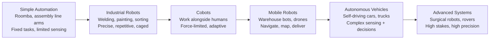
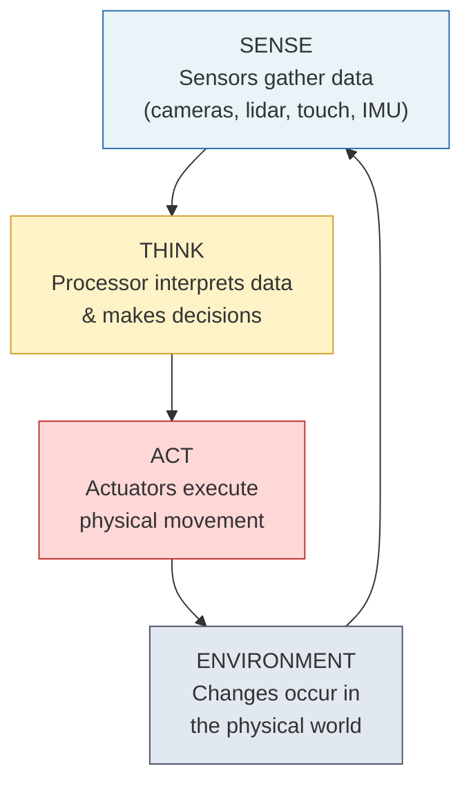
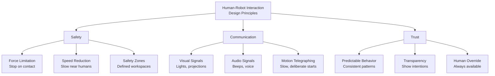
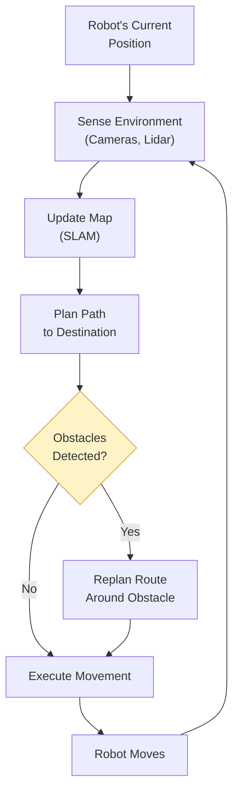
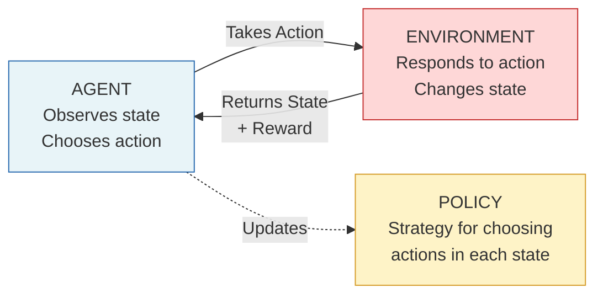
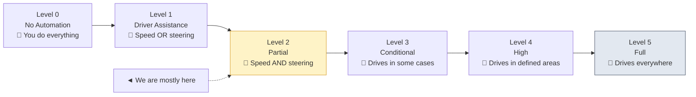
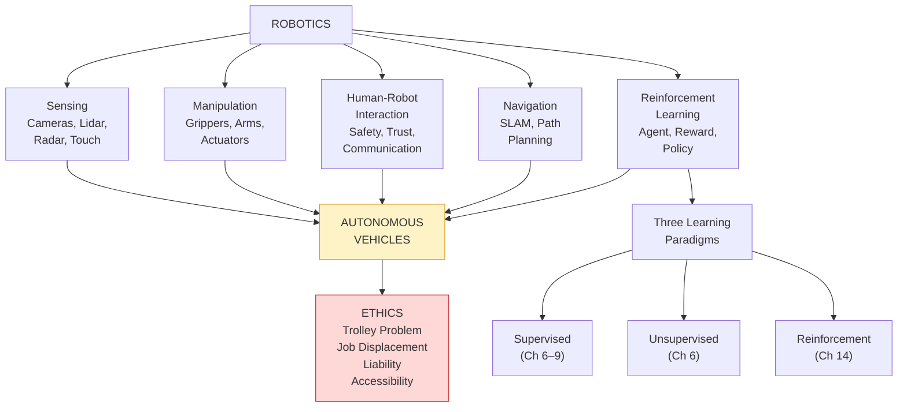

# Chapter 14: Robotics, Sensing, and Autonomous Systems

---

## The Crane That Didn't Need a Driver

Marcus arrived at PortMiami for his Thursday shift and noticed something different on Dock 7. A new automated container crane was unloading a cargo ship — no operator in the cab. He stood near the safety barrier and watched. The crane's sensors — cameras mounted on its frame and lidar units sweeping invisible beams across the deck — identified each container's exact position, size, and orientation. Its massive arms gripped a forty-foot steel box, lifted it smoothly off the ship, swung it over the dock, and lowered it onto a waiting transport platform. The whole operation took ninety seconds. No radio call, no hand signals, no human judgment call about clearance.

"That thing unloads faster than any of us," said Tomás, a veteran crane operator standing next to Marcus. "And it doesn't take breaks."

Marcus was genuinely impressed. He'd seen autonomous systems in military training simulations — drones that navigated obstacle courses, vehicles that drove themselves through desert terrain. But watching it happen on his own dock, doing the work his coworkers did every day, made it feel different. He noticed the details: the yellow safety perimeter painted on the concrete, the flashing amber lights warning workers to maintain distance, and the supervisor in a glass-walled control room monitoring three screens of sensor data.

The crane wasn't just lifting containers. It was *sensing* the environment (cameras and lidar), *thinking* through decisions (which container next, where to place it, how to avoid the maintenance crew on the south side), and *acting* on those decisions (moving its arms with millimeter precision). All without a person touching a single control.

Marcus turned to Tomás. "So what happens to crane operators?"

Tomás shrugged. "Same thing that happened to elevator operators. Same thing that happened to switchboard operators. Progress."

Marcus wasn't so sure it was that simple.

---

*Technical Connection*: Marcus just witnessed the three core components of every robotic system: **sensing** (cameras and lidar detecting container positions), **thinking** (onboard processors deciding which container to grab and where to place it), and **acting** (motors and hydraulics executing the physical movement). This Sense-Think-Act loop is the foundation of all robotics — from warehouse cranes to surgical instruments to self-driving cars. In this chapter, we'll explore how robots perceive the world, make decisions, learn from experience, and increasingly work alongside — and sometimes replace — human workers.

---

### Learning Objectives

By the end of this chapter, you will be able to:

- Define robotics and describe the spectrum of robotic systems from simple automation to fully autonomous vehicles
- Explain the Sense-Think-Act loop and identify the sensors and actuators that power robotic systems
- Describe how human-robot interaction (HRI) principles keep people safe when working alongside robots
- Explain navigation and path planning, including how robots map and move through dynamic environments
- Define reinforcement learning as the third learning paradigm and distinguish it from supervised and unsupervised learning
- Evaluate the technologies, benefits, risks, and ethical implications of autonomous vehicles

### Chapter Roadmap

We'll start with the basics — what counts as a robot, and how the spectrum stretches from your Roomba to the Mars rover. Then we'll look inside: the sensors that let robots perceive the world and the actuators that let them act on it. We'll explore how humans and robots coexist in shared workspaces, how robots navigate spaces they've never seen before, and how reinforcement learning lets machines teach themselves through trial and error. We'll close with the technology that brings all of these concepts together: autonomous vehicles — and the ethical questions they force us to confront.

---

## 14.1 What Is Robotics?

When most people hear "robot," they picture something humanoid — a metal figure with arms, legs, and glowing eyes. That image comes from science fiction, and it's mostly wrong. The vast majority of real robots look nothing like humans. They look like arms, wheels, drones, and boxes.

A **robot** is a machine capable of sensing its environment, processing information, and taking physical action. That definition is deliberately broad because the field is broad. A robot could be:

- A Roomba navigating your living room, vacuuming around chair legs
- A welding arm on a Toyota assembly line, joining metal frames with perfect precision
- A drone surveying a farmer's crops in the Everglades, mapping irrigation needs from the air
- A surgical instrument controlled by a doctor, making incisions smaller than a human hand could manage
- A Mars rover crawling across another planet, analyzing rock samples with no human within 140 million miles

What unites these wildly different machines? They all run the same fundamental loop: sense the environment, process the information, and take action. The complexity of each step varies enormously, but the loop is universal.

**Figure 14.1: The Robotics Spectrum** — Robotic systems range from simple automation to advanced autonomous systems. Complexity increases left to right in sensing capability, decision-making sophistication, and environmental unpredictability.

Think of this spectrum like comparing a cafecito machine to a full commercial kitchen. The cafecito machine does one thing reliably — it heats water, pushes it through grounds, and produces coffee. A commercial kitchen handles hundreds of different tasks in a chaotic environment with multiple people moving through it simultaneously. Both produce food. But the complexity gap between them is enormous. Robots span that same gap.

> 💡 **Key Insight:** Most robots in the world today are on the left side of the spectrum — industrial arms doing repetitive tasks in controlled environments. The challenge — and the excitement — in modern robotics is moving rightward toward systems that handle unpredictable, dynamic, real-world situations.

---

## 14.2 Sensing and Manipulation

Every robot needs to answer two questions: *What's happening around me?* and *What should I do about it?* The first question is handled by **sensors**. The second is handled by **actuators**. Together, they create the Sense-Think-Act loop — the heartbeat of every robotic system.

### Sensors: A Robot's Five Senses (and Then Some)

Sensors are a robot's version of *los cinco sentidos* — but a robot can have dozens of "senses" running simultaneously, each specialized for a different type of information.

| Sensor Type | What It Detects | Human Equivalent | Example Use |
|---|---|---|---|
| **Camera** | Light, color, shapes, text | Eyes | A warehouse robot reading package labels |
| **Lidar** | Distance using laser pulses | — (no human equivalent) | A self-driving car mapping the road ahead |
| **Radar** | Distance and speed using radio waves | — | Adaptive cruise control detecting the car ahead |
| **Ultrasonic** | Short-range distance using sound | Echolocation (bats) | A parking sensor beeping as you back up |
| **IMU (Inertial Measurement Unit)** | Acceleration, rotation, orientation | Inner ear (balance) | A drone maintaining stable flight |
| **Force/Torque** | Pressure and resistance | Touch | A surgical robot sensing tissue resistance |
| **Temperature** | Heat and cold | Skin | An industrial robot monitoring weld temperature |
| **GPS** | Global position | — | A delivery drone finding an address |

Notice that some sensors have human equivalents and some don't. Lidar — which fires thousands of laser pulses per second and measures how long each takes to bounce back — gives robots a spatial awareness that humans simply don't have. A lidar-equipped car "sees" the world as a detailed 3D point cloud, measuring the exact distance to every object within 200 meters. Your eyes can't do that.

> 📊 **By The Numbers:** A modern autonomous vehicle generates approximately 1–2 terabytes of sensor data *per hour* from its cameras, lidar, radar, and other sensors. Processing that data in real time is one of the greatest computing challenges in robotics.

### Actuators: From Decisions to Movement

If sensors are the senses, **actuators** are the muscles. An actuator is any component that converts a command into physical movement — motors that spin wheels, hydraulic pistons that lift crane arms, servos that rotate a camera, grippers that close around objects.

Think of the mechanical claw game at the Dolphin Mall. The claw is an actuator — a simple one that usually drops your prize. But it follows the same principle as a surgical robot's instrument arm that sutures tissue with sub-millimeter accuracy. Both convert electronic commands into physical motion. The sophistication is in the precision, the feedback, and the control.

**Manipulation** is a robot's ability to interact physically with objects — gripping, lifting, placing, assembling, cutting, welding. Manipulation is especially hard because the real world is messy. A robot that perfectly picks up identical metal bolts from a conveyor belt might struggle to grip a ripe tomato without crushing it. The difference? The bolt is rigid, uniform, and predictable. The tomato is soft, variable, and fragile. Handling both requires different sensors (force feedback for the tomato), different grippers (soft grippers vs. hard jaws), and different control strategies.

### The Sense-Think-Act Loop

Every robotic action — from a Roomba avoiding a table leg to a surgical robot making an incision — follows the same three-step cycle:

**Figure 14.2: The Sense-Think-Act Loop** — Every robotic system runs this continuous cycle. Sensors gather data, processors make decisions, actuators execute actions, and the environment changes — which the sensors detect, starting the loop again.

This loop runs continuously. For a warehouse robot navigating an aisle, the cycle might execute hundreds of times per second: cameras capture images, processors identify obstacles, motors adjust wheel speed and direction, the robot moves a few centimeters, and new images are captured. The faster and more accurately this loop runs, the more capable the robot.

Every time you drive your car, you run the same loop: *see* the red light ahead (sense), *decide* to brake (think), *press* the brake pedal (act). The difference is that a robot runs this loop with more sensors, faster processing, and no fatigue — but also with less common sense and zero intuition.

> ⚠️ **Common Pitfall:** Students often assume "smarter sensors = better robot." Not always. More sensor data means more processing required, more power consumed, and more potential points of failure. The best robotic designs use the *minimum* sensors needed for the task. A floor-cleaning robot doesn't need lidar — simple bump sensors and infrared work fine.

---

**Sofia's Kitchen Robot Fantasy**

Sofia couldn't stop watching the videos. A robotic arm flipping burgers at a fast-food chain in California. Another one assembling salads — placing each ingredient in concentric circles, perfectly even. She showed Marcus on her phone during their study break.

"We should get one for the restaurant," she joked.

Then she started listing what the robot would actually need to handle in her family's kitchen. It would need to *see* different ingredients — the golden brown of a fried croqueta vs. the pale beige of one that's underdone (computer vision). It would need to *feel* the difference between a firm plantain ready for tostones and a ripe one for maduros (tactile sensing). It would need to *grip* a delicate empanada without crushing the crimped edges (manipulation with force feedback). And it would need to *navigate* a kitchen where Abuela Carmen walks unpredictably between the stove and the counter, where a wet floor changes traction, and where the layout shifts every time someone moves a prep cart (path planning in a dynamic environment).

The YouTube robot worked in a controlled environment — identical burger patties, same grill position every time, no one walking through its workspace. Her kitchen was chaos.

"AI in a lab and AI in the real world," Sofia said, putting her phone away, "are two completely different things."

---

*Technical Connection:* Sofia identified the core challenge of real-world robotics: the gap between controlled environments and unstructured ones. Industrial robots thrive in factories where everything is predictable. But kitchens, hospitals, homes, and streets are dynamic — objects move, surfaces change, people behave unpredictably. Every sensor, actuator, and algorithm we discuss in this chapter is an attempt to bridge that gap.

---

## 14.3 Human-Robot Interaction

The first generation of industrial robots worked behind cages. Literally — metal fences surrounded the robot's workspace, and humans were not allowed inside while the robot operated. If a 500-pound welding arm swings at full speed and a person walks into its path, the result is catastrophic. The cage was the safety solution: separate humans and robots completely.

But complete separation limits what robots can do. Many tasks require humans and robots to work *together* — a surgeon guiding a robotic arm, a warehouse worker handing packages to a mobile robot, a factory technician adjusting a robot's tooling while it runs. This is the domain of **Human-Robot Interaction (HRI)**: the study of how humans and robots communicate, collaborate, and coexist safely.

### Cobots: Robots That Share Your Space

A **cobot** (collaborative robot) is specifically designed to work alongside humans without a safety cage. Cobots achieve this through several design principles:

**Force limitation:** Cobots are programmed to stop or reverse if they detect unexpected resistance. If a cobot's arm bumps a person, it stops immediately rather than pushing through. Traditional industrial robots don't do this — they'll push through a brick wall if that's what their program says.

**Speed reduction:** Cobots move slower when humans are nearby. Many use proximity sensors to detect people and automatically reduce speed or pause.

**Rounded edges and lightweight design:** Unlike heavy industrial arms with sharp tooling, cobots typically have rounded casings, padded surfaces, and lower mass to reduce injury risk.

**Clear communication:** Cobots signal their intentions — indicator lights show their current state (green = idle, blue = working, red = error), and some use projected light patterns on the floor to show their planned path.

Working alongside a cobot is like sharing a kitchen with someone who is incredibly fast and precise but has absolutely no common sense. You need clear rules about who does what, where each person stands, and what happens when your paths cross. Without those rules, someone gets hurt.

> 🌎 **Real-World Application:** Amazon's warehouses use thousands of Kiva robots — mobile platforms that slide under shelving units, lift entire shelves, and deliver them to human packers. The humans pick and pack items; the robots handle the heavy lifting and navigation. Neither could do the full job alone. This human-robot division of labor is one of the most successful HRI implementations in the world.

### Trust and Predictability

HRI research has shown that the most important factor in successful human-robot collaboration isn't the robot's speed or accuracy — it's **predictability**. Humans work well with robots they can predict. If a cobot always moves the same way, always signals before turning, and always stops when a person enters its space, workers learn to trust it. If its behavior seems random or inconsistent, workers become anxious, work slower, and make more mistakes.

This is the same principle that makes traffic work. You trust other drivers because they follow predictable rules — stop at red lights, signal before turning, stay in their lane. A driver who behaves unpredictably makes everyone around them nervous and unsafe. Robots need to follow "traffic rules" too.

**Figure 14.3: HRI Design Principles** — Effective human-robot interaction requires three pillars: physical safety measures, clear communication channels, and designs that build trust through predictability and transparency.

> 🤔 **Think About It:** Marcus noticed that the automated crane at PortMiami had a human supervisor monitoring from a control room. Even when a robot can work autonomously, should a human always have the ability to override it? What situations would require immediate human intervention?

---

## 14.4 Navigation and Path Planning

A robot arm bolted to a factory floor doesn't need to navigate — it knows exactly where it is because it never moves. But mobile robots — delivery drones, warehouse bots, autonomous vehicles — face a harder challenge: *How do you move through an environment that changes?*

### Building a Map While Lost In It

Imagine you're dropped into a neighborhood you've never visited — no GPS, no street signs, no phone. You'd start walking, noting landmarks: "There's a yellow house on this corner, a park two blocks north, a dead end to the west." As you explore, you'd build a mental map. And here's the hard part — you'd be *using* that incomplete map to decide where to go next, even as you're still building it.

This is exactly what robots do using a technique called **SLAM: Simultaneous Localization and Mapping**. The robot builds a map of its environment while simultaneously tracking its own position within that map. SLAM uses sensor data — usually lidar or cameras — to detect features (walls, corners, objects), estimate distances, and construct a spatial model in real time.

SLAM is one of the most important algorithms in mobile robotics. Without it, a robot entering a new building would have no way to avoid obstacles, find routes, or remember where it's been. With SLAM, the robot creates its own GPS from scratch.

### Path Planning: Getting from A to B

Once a robot has a map (or is building one), it needs to find the best route from its current position to its destination. This is **path planning** — and it's more complex than it sounds.

The simplest version is like Google Maps: find the shortest route between two points. But robots face challenges that Google Maps doesn't:

**Dynamic obstacles:** A warehouse worker walks into the robot's planned path. A door that was open is now closed. A pallet was moved since the map was last updated.

**Physical constraints:** The robot can't make sharp turns (turning radius), can't go up stairs (unless it has legs or tracks), and might be too wide for certain aisles.

**Multiple objectives:** The "best" path might not be the shortest. It might be the safest (avoids crowded areas), the most energy-efficient (avoids slopes), or the fastest (uses wider corridors for higher speed).

**Figure 14.4: Navigation and Path Planning** — A mobile robot continuously senses its environment, updates its map, plans a path, checks for obstacles, and adjusts in real time. This cycle runs hundreds of times per second in autonomous vehicles.

> 🔧 **Pro Tip:** Path planning in robotics uses many of the same algorithms that GPS navigation apps use — A* (A-star) search, Dijkstra's algorithm, and rapidly-exploring random trees (RRT). If you've ever watched Google Maps recalculate your route when you miss a turn, you've seen path planning in action. Now imagine the "car" is making those decisions itself, hundreds of times per second.

---

## 14.5 Reinforcement Learning: The Third Paradigm

Throughout this course, we've explored two ways machines learn:

**Supervised learning** (Chapters 6–9): Give the model labeled examples — "this email is spam, this one isn't" — and it learns the pattern. The teacher provides the right answers.

**Unsupervised learning** (Chapter 6, briefly): Give the model unlabeled data and let it find hidden patterns — clusters, groupings, structures that humans didn't specify in advance.

Now we add the third paradigm: **reinforcement learning (RL)**. In RL, there are no labeled examples and no hidden patterns to discover. Instead, an **agent** takes actions in an **environment**, receives **rewards** or **penalties** for those actions, and gradually learns a **policy** — a strategy for choosing actions that maximize reward over time.

The analogy is training a puppy. You don't hand the puppy a textbook on proper behavior (supervised learning). You don't let it discover hidden patterns in your carpet (unsupervised learning). You let it explore, reward it when it sits on command, redirect it when it chews your shoes, and over time, it learns what works. That's reinforcement learning.

### The RL Framework

Every reinforcement learning system has five core components:

| Component | Definition | Puppy Example | Robot Example |
|---|---|---|---|
| **Agent** | The learner that takes actions | The puppy | A warehouse navigation robot |
| **Environment** | The world the agent operates in | Your house | The warehouse floor |
| **State** | The current situation | Where the puppy is, what it sees | Robot's position, obstacles detected |
| **Action** | What the agent does | Sit, run, chew, bark | Move forward, turn left, stop |
| **Reward** | Feedback signal (+/-) | Treat (+1), scolding (-1) | Reach goal (+10), hit wall (-5), each step (-1) |

The agent's goal is to learn a **policy** — a mapping from states to actions — that maximizes cumulative reward over time. Not just the immediate reward, but the total reward across many steps. A chess-playing agent might sacrifice a piece now (negative immediate reward) to set up a checkmate later (massive future reward).

**Figure 14.5: The Reinforcement Learning Cycle** — The agent observes the current state, takes an action, and receives a reward signal from the environment. Over many iterations, the agent updates its policy to maximize cumulative reward.

### Exploration vs. Exploitation

One of the most fascinating challenges in RL is the **exploration vs. exploitation tradeoff**. Should the agent keep doing what it already knows works (exploitation), or try something new that might lead to a better outcome (exploration)?

Imagine you've found a decent Cuban restaurant near campus. The food is solid — 7 out of 10 every time. Do you keep going there (exploit what you know), or try a new place down the street that might be a 9 out of 10 or might be a 3 out of 10 (explore)? If you always exploit, you never discover better options. If you always explore, you waste time on bad meals when you already know a good spot.

RL agents face this tradeoff constantly. Early in training, they explore more — trying random actions to discover what works. As they learn, they gradually shift toward exploitation — relying on their learned policy while occasionally exploring to find improvements.

---

**Marcus and the Training Simulation**

Marcus leaned back in his chair. "This sounds exactly like military training simulations."

Prof. Reyes nodded. "How so?"

"In the Army, we ran combat simulations over and over. Virtual environments where you'd make decisions — move here, take cover there, engage the target or hold fire. After each run, the debrief would tell you what you did right and what got you 'killed.' After enough runs, you'd develop instincts. You'd just *know* the right move in a given situation."

"That's exactly reinforcement learning," Prof. Reyes said. "The simulation is the environment. You were the agent. The debrief scores were the rewards. And the 'instincts' you developed — that's the learned policy."

Marcus laughed. "My drill sergeant was definitely a reward function. Mostly negative rewards."

"The penalties are important too," Prof. Reyes said. "An RL agent that only receives positive rewards never learns what to avoid."

---

*Technical Connection:* Military training simulations are, in fact, early implementations of reinforcement learning environments. Modern RL takes this further — instead of training human soldiers, we train software agents in simulated environments millions of times faster than real time. A self-driving car's RL system can simulate millions of driving hours in a single day, encountering situations that a human test driver might not see in a lifetime.

### Where RL Shines

Reinforcement learning excels at problems where:

- **The "right answer" isn't known in advance.** Unlike supervised learning, where you have labeled examples, RL discovers optimal behavior through exploration. How should a robot walk? There's no training dataset of "correct walking motions" — the robot learns by trying different movements and seeing which ones keep it upright.

- **Decisions are sequential.** Each action affects future options. In chess, each move changes the board. In robot navigation, each turn changes what paths are available. RL is designed for these chain-of-consequence problems.

- **Simulation is available.** RL agents often need millions of training episodes. Running a physical robot millions of times would take years and destroy hardware. But in simulation, an agent can train 24/7 at accelerated speed.

> 📊 **By The Numbers:** DeepMind's AlphaGo, which defeated the world champion Go player in 2016, trained by playing approximately 30 million games against itself. At the rate of one game per hour (a typical human pace), that would take over 3,400 years of continuous play. In simulation, it took weeks.

> ⚠️ **Common Pitfall:** Students sometimes think reinforcement learning is "just trial and error." It's not. Trial and error is random. RL has a mathematical framework — reward functions, value functions, policies, discount factors — that makes exploration *structured* and *efficient*. A random agent would never learn to play chess in a lifetime. An RL agent can learn in days.

---

## 14.6 Autonomous Vehicles

Everything in this chapter converges here. Autonomous vehicles are the ultimate integration challenge in robotics — they require advanced sensing, real-time navigation, reinforcement learning, human-robot interaction, and life-or-death decision-making, all operating simultaneously at highway speeds.

And here's the thing: your car probably already has some of this technology. If it has adaptive cruise control, lane-keeping assist, or automatic emergency braking, you've been riding with AI for years. The question isn't whether cars will be autonomous — it's *how* autonomous, *how* soon, and *who decides what the car does when things go wrong.*

### Levels of Autonomy

The Society of Automotive Engineers (SAE) defines six levels of vehicle autonomy:

| Level | Name | What the Car Does | What the Human Does | Example |
|---|---|---|---|---|
| **0** | No Automation | Nothing — the human does everything | Everything | Manual transmission, no assists |
| **1** | Driver Assistance | Controls speed OR steering (not both) | Everything else; always watching | Cruise control, lane-keeping |
| **2** | Partial Automation | Controls speed AND steering simultaneously | Must monitor and be ready to take over | Tesla Autopilot, GM Super Cruise |
| **3** | Conditional Automation | Handles most driving in defined conditions | Can look away, but must take over when asked | Honda Sensing Elite (limited markets) |
| **4** | High Automation | Drives itself in specific areas/conditions | No intervention needed in those areas | Waymo robotaxis (Phoenix, SF) |
| **5** | Full Automation | Drives anywhere, any conditions, no human needed | Nothing — may not even have a steering wheel | Does not exist yet |

**Figure 14.6: The Autonomy Spectrum** — Most consumer vehicles today operate at Level 1–2. Level 4 exists in limited geographic areas (Waymo robotaxis). Level 5 — full automation in all conditions — remains unsolved.

> ⚠️ **Common Pitfall:** The jump from Level 2 to Level 3 is enormous — much bigger than it looks. At Level 2, the human must always be watching. At Level 3, the human can look away. That shift in responsibility is a legal, engineering, and ethical earthquake. It means the car manufacturer — not the driver — is responsible for what happens during autonomous operation.

### Sensor Fusion: Seeing the World Multiple Ways

A self-driving car doesn't rely on a single sensor. It combines data from multiple sensor types — **sensor fusion** — to create a more complete and reliable picture of its environment.

**Cameras** provide rich visual information: lane markings, traffic signs, traffic lights, pedestrians' clothing and gestures. But cameras struggle in darkness, rain, fog, and direct sunlight glare.

**Lidar** creates precise 3D maps of the surroundings by firing millions of laser pulses per second. It works in darkness but struggles in heavy rain and snow (water droplets scatter the laser beams).

**Radar** detects the distance and speed of objects using radio waves. It works in rain, snow, fog, and darkness — but provides less detail than cameras or lidar.

Each sensor has strengths and weaknesses. Sensor fusion combines them so the system's limitations are the *intersection* of each sensor's weaknesses, not the *union*. If cameras can't see in fog but radar can, and radar can't read signs but cameras can, the fused system handles both.

This is the same principle as confidence thresholds from Chapter 10 — but applied to the physical world with life-or-death stakes. When a computer vision model misclassifies an image, it's an interesting data point. When an autonomous vehicle misclassifies a stop sign, someone could die.

> 🌎 **Real-World Application:** Waymo's autonomous vehicles in Phoenix use 29 cameras, 6 lidar units, 6 radar units, and an array of external microphones (to hear emergency sirens). Each sensor type covers the others' blind spots. The result is a system that "perceives" the world more completely than any human driver — but still can't match human judgment in novel situations.

### The Decision Problem

This is where autonomous vehicles connect to every other chapter in the course. The car's AI system is running multiple models simultaneously:

- **Computer vision** (Ch 10): Identifying objects — cars, pedestrians, cyclists, traffic signs, lane markings
- **Classification** (Ch 7–8): Categorizing each detected object — "that's a pedestrian crossing the street" vs. "that's a mailbox on the corner"
- **Neural networks** (Ch 9): Processing the massive, complex sensor data that simpler classifiers can't handle
- **Path planning** (Ch 14.4): Calculating the optimal route, avoiding obstacles, obeying traffic rules
- **Reinforcement learning** (Ch 14.5): The driving policy trained on millions of simulated scenarios

And all of this must happen in *real time* — decisions in milliseconds, not seconds. At 60 mph, a car travels 88 feet per second. A 200-millisecond delay in decision-making means the car has traveled 17 feet before it even begins to react.

> 🤔 **Think About It:** You've now seen how all the AI concepts from this course combine in a single application. Classification, neural networks, computer vision, path planning, reinforcement learning — autonomous vehicles use all of them simultaneously. Which concept do you think is the weakest link? Where would you focus more research if you worked on self-driving cars?

---

**Abuela Carmen's Ride**

Sofia had been thinking about it since class. She found Abuela Carmen in the kitchen, stirring a pot of black beans.

"Abuela, what if there were a car that could drive you to church? No driver. It drives itself."

Abuela Carmen didn't look up from the beans. "Who's driving?"

"Nobody. The car drives itself. It uses cameras and sensors to see the road."

"*Nadie?*" Now she looked up. "Then who do I yell at when it takes a wrong turn?"

Sofia pulled up a video on her phone — a Waymo robotaxi navigating through traffic in Phoenix. No steering wheel turning. No driver's seat occupied. Just smooth, careful driving.

Abuela Carmen watched silently. Then: "It drives better than your cousin Miguel."

Sofia laughed. "It does."

"But here's what I want to know." Abuela Carmen put down the wooden spoon. "If it has to choose between hitting a dog and swerving into a wall, what does it do?"

Sofia paused. They'd talked about this in class — the trolley problem, but with real cars and real stakes.

"Someone programmed that decision," Sofia said. "Before the car ever hit the road."

"And that someone," Abuela Carmen said, turning back to the beans, "better have the wisdom to know that not every decision has a good answer."

---

*Technical Connection:* Abuela Carmen's question cuts to the heart of autonomous vehicle ethics: pre-programmed decision-making in unavoidable harm scenarios. These aren't hypothetical — they're engineering specifications that someone writes into code before the car ever leaves the factory. The "trolley problem" from philosophy class becomes a software requirement. And as Abuela Carmen intuitively grasps, some of these decisions have no "right" answer — only tradeoffs.

---

## ⚖️ Ethics in Focus: The Autonomous Vehicle Debate

A self-driving delivery van operated by a logistics startup approaches an intersection in the Wynwood neighborhood of Miami. A cyclist runs a red light from the left. A pedestrian steps off the curb from the right. The van's sensor fusion system — cameras, lidar, and radar — detects both simultaneously. 

Three options exist. Braking hard will stop the van but may cause the following car to rear-end it, injuring the van's passenger. Swerving left avoids the pedestrian but moves toward the cyclist. Swerving right avoids the cyclist but moves toward the pedestrian.

This decision must be made in approximately 200 milliseconds. And someone programmed the decision logic months ago, sitting in an office, making choices about whose safety to prioritize. This isn't a philosophy thought experiment anymore — it's a software specification.

### The Engineering Reality

Students sometimes think the trolley problem is overblown — "the car will just stop." But physics doesn't always cooperate. At 35 mph on wet Miami asphalt, stopping distance is approximately 130 feet. If the cyclist and pedestrian appear at 60 feet, stopping in time is physically impossible. The car *must* choose.

Reinforcement learning makes this even more complex. If the car's driving policy was trained in simulation, the reward function encoded specific values: "avoiding a pedestrian is worth X, avoiding a collision with a cyclist is worth Y, protecting the passenger is worth Z." Someone chose those numbers. Those numbers are moral judgments expressed as mathematics.

### Beyond the Trolley Problem

The ethical dimensions of autonomous vehicles extend far beyond crash scenarios:

**Job displacement** is perhaps the most immediate real-world impact. Miami-Dade County has thousands of truck drivers, delivery workers, taxi drivers, and rideshare operators. Autonomous vehicles could reduce traffic fatalities caused by human fatigue and distraction — but they would also eliminate livelihoods. The people most likely to lose their jobs are disproportionately from working-class communities.

**Liability** remains unresolved. When a self-driving car crashes, who is responsible? The owner who bought the car? The manufacturer who built the hardware? The software company whose algorithm made the decision? The engineer who designed the reward function? Current legal frameworks were built for a world where a human driver is always responsible. That framework breaks when the driver is an algorithm.

**Accessibility** represents the other side of the ledger. Abuela Carmen can't drive anymore — she depends on family for every trip. For millions of elderly and disabled people, autonomous vehicles could mean independence: the ability to get to medical appointments, social gatherings, and grocery stores without depending on anyone. This potential benefit is enormous, and it's easy to overlook when the conversation focuses only on risks.

**Reflect & Discuss:**

1. You're programming a self-driving car's decision-making system. Who should it prioritize in an unavoidable crash — the passenger, a pedestrian, or the algorithm's "best statistical outcome"? Who gets to decide, and how should that decision be documented?

2. Autonomous trucks could reduce accidents (most crashes are caused by human fatigue) but would displace millions of drivers. How should society balance safety gains against job losses? What responsibility do the companies deploying this technology have?

3. Abuela Carmen can't drive anymore. An autonomous car could give her independence back. Does this potential benefit change how you think about the technology's risks?

---

## Closing Materials

### Key Takeaways

1. **Robotics spans a wide spectrum** — from simple automated arms to fully autonomous vehicles — and each level involves different combinations of sensing, decision-making, and physical action.

2. **The Sense-Think-Act loop is the foundation of all robotic systems**: sensors gather data, processors make decisions, and actuators execute actions in the physical world. This cycle runs continuously.

3. **Human-robot interaction (HRI) design is critical for safety** — cobots must communicate clearly with human coworkers through visual signals, defined zones, and predictable, consistent behavior.

4. **Navigation and path planning allow robots to move through dynamic environments** using techniques like SLAM (Simultaneous Localization and Mapping), which builds and updates a map at the same time the robot navigates it.

5. **Reinforcement learning is the third learning paradigm** — agents learn through trial, error, and reward signals rather than from labeled data (supervised) or hidden patterns (unsupervised).

6. **Autonomous vehicles combine every concept in this chapter** — sensing, navigation, decision-making, and HRI — with the added complexity of life-or-death stakes and unresolved ethical questions.

### Concept Map

**Figure 14.7: Chapter 14 Concept Map** — All chapter concepts converge on autonomous vehicles, which require sensing, manipulation, navigation, reinforcement learning, and human-robot interaction. The ethical implications — from the trolley problem to job displacement to accessibility — connect to every technical component.

### Vocabulary Review

1. **Robot** — A machine capable of sensing its environment, processing information, and taking physical action
2. **Sensor** — A device that detects physical properties (light, distance, pressure, temperature) and converts them to data a computer can process
3. **Actuator** — A component that converts electronic commands into physical movement — motors, grippers, hydraulic pistons, wheels
4. **Sense-Think-Act loop** — The continuous cycle of gathering sensor data, making decisions, and executing physical actions that drives every robotic system
5. **Cobot (collaborative robot)** — A robot designed to work alongside humans in a shared workspace, with safety features like force limitation, speed reduction, and clear communication signals
6. **SLAM (Simultaneous Localization and Mapping)** — A technique where a robot builds a map of its environment while simultaneously tracking its own position within it
7. **Reinforcement learning** — A learning paradigm where an agent learns optimal behavior through trial-and-error interactions with an environment, guided by reward and penalty signals
8. **Reward function** — The mathematical rule that assigns a numerical score to each action the agent takes, defining what "good" and "bad" behavior means
9. **Sensor fusion** — Combining data from multiple sensor types (cameras, lidar, radar) to create a more complete and reliable understanding of the environment
10. **Levels of autonomy** — A 0–5 scale classifying how much human control is required for a vehicle or system, from no automation (Level 0) to full self-driving in all conditions (Level 5)

### Bridge to Next Chapter

From classification to computer vision to chatbots to robots — you've now seen AI across every domain. You've built models, analyzed their errors, debated their ethics, evaluated companies' readiness, and explored AI in the physical world. One question remains: *Where is all of this going?*

In our final chapter, we look at the future of AI — emerging trends like generative AI and multimodal models, how AI will reshape the job market, what scientists actually think about artificial general intelligence, and most importantly, the role you'll play in shaping what comes next. Everything you've learned this semester was preparation for that conversation.

### Self-Check Questions

1. What are the three components of the Sense-Think-Act loop, and what role does each play in a robotic system?

2. How does reinforcement learning differ from supervised learning? Describe a scenario where RL would be more appropriate than supervised learning, and explain why.

3. A warehouse robot uses cameras and lidar to navigate between shelves. What is the advantage of using multiple sensor types instead of just one? What is this approach called?

4. What is the difference between Level 2 and Level 4 vehicle autonomy? Give a real-world example of each, and explain why the gap between them is so significant.

5. Why is human-robot interaction design important for cobots in a factory setting? Name two specific HRI design principles and explain how each one keeps workers safe.

### Hands-On Challenge: Robotics Concept Spotter (40–60 minutes)

**Objective:** Apply the concepts from this chapter to a real-world robotics application by watching a robotics or autonomous vehicle demonstration and identifying every chapter concept in action.

**Milestone 1 (10 min):** Choose one robotics application to investigate. Options: warehouse robots (Amazon, Ocado), surgical robots (da Vinci system), delivery robots (Starship Technologies), autonomous vehicles (Waymo, Cruise), agricultural robots, or military drones. Find 1–2 videos of the system in operation.

**Milestone 2 (15 min):** Watch the video(s) and complete a concept observation table:

| Chapter Concept | Observed? (Y/N) | What Did You See? | How Is It Used? |
|---|---|---|---|
| Sensors (which types?) | | | |
| Actuators / Manipulation | | | |
| Human-Robot Interaction | | | |
| Navigation / Path Planning | | | |
| Reinforcement Learning (likely?) | | | |
| Level of Autonomy (0–5) | | | |

**Milestone 3 (15 min):** Write a 1-paragraph analysis: Which chapter concepts are most critical for your chosen application? What would fail first if one of those concepts didn't work properly?

**Milestone 4 (10 min):** Write a 1-paragraph ethical reflection: What ethical issues does your chosen application raise? Consider job displacement, safety, privacy, accessibility, and liability. Use one of the Reflect & Discuss prompts as a starting point.

### Discussion Prompts

1. Marcus's coworker said the automated crane "doesn't take breaks." If robots work 24/7 without fatigue, should the savings go to company profits, lower prices for consumers, or support for displaced workers? Who should decide?

2. Reinforcement learning agents learn by exploring — sometimes making bad decisions on purpose to discover better strategies. Is it ethical to let a self-driving car "explore" on public roads? Where should the boundary be between simulation training and real-world deployment?

3. Prof. Reyes said the three learning paradigms are "three different ways of teaching a machine." If you had to teach a robot to cook in your kitchen, which paradigm would you use — and what would the training process look like?
