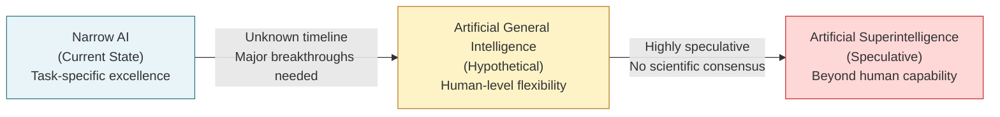
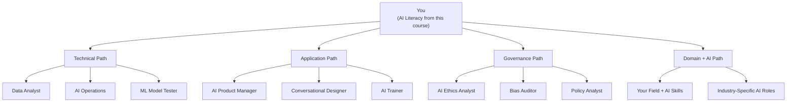
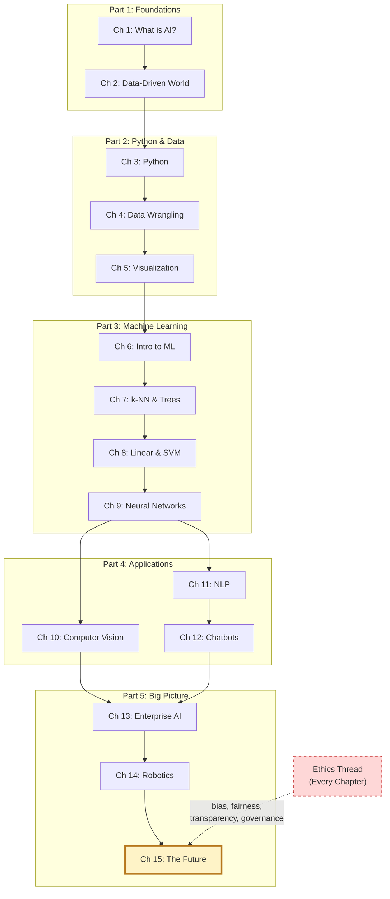

# Chapter 15: The Future of AI

<!-- [IMAGE: images/ch15/fig-15-0-future-horizon.png]
Alt text: A sleek humanoid robot standing at the edge of a glowing digital landscape, holding a brass compass and looking toward a luminous horizon where streams of colored light converge
Nano Banana Pro Prompt: "A sleek humanoid robot with a brushed-aluminum torso and articulated joints stands at the edge of a vast glowing digital landscape, viewed from a low angle behind the robot looking outward toward a luminous horizon. The robot holds a brass navigational compass in its right hand, arm extended slightly forward as if taking a bearing. From the left side of the frame, four distinct streams of colored light arc gracefully toward the horizon — coral, turquoise, gold, and lavender — each stream composed of tiny flowing data particles. Where the streams converge at the horizon line, they merge into a brilliant warm white glow that illuminates the robot's silhouette from the front. The ground beneath the robot is a translucent grid of softly glowing interconnected nodes that fade into the distance, creating depth. The sky transitions from deep navy at the top to warm gold near the horizon, with faint constellation-like dot patterns in the upper portion. Style: editorial textbook illustration with soft digital watercolor textures, clean lines, and a warm coral-and-turquoise color palette. Composition is a low-angle wide shot from behind the robot, centered on the horizon convergence point, with the robot occupying the lower-left third of the frame for scale. No text or labels."
-->

---

*You've spent fourteen weeks learning how AI sees, reads, predicts, and decides. Now the question isn't what AI can do — it's what you're going to do with what you know.*

---

## The Last Day of Class

Prof. Reyes walks into the classroom without slides. No presentation loaded, no Colab notebook projected on the screen. Just a question.

"Before we start the last chapter," he says, "I want to hear from you. One sentence. What's one thing you know about AI now that you didn't know fourteen weeks ago?"

Sofia goes first. "I used to think AI was something only Google and Amazon could use. Now I've built a chatbot, run object detection, trained a neural network — and I know how to tell whether a tool is actually helping my business or just burning money."

Marcus leans back. "I thought AI was magic. Turns out it's math, data, and a lot of decisions about what counts as 'good enough.' The SVM that predicted every customer would stay? That changed how I think about accuracy forever."

Abuela Carmen is sitting in the back row. She came for the last class — Sofia insisted. "I'm not afraid of the computers anymore," she says. "I'm afraid of the people who use them without thinking about who gets hurt."

Prof. Reyes smiles. "That," he says, "might be the most important answer anyone's given all semester."

He opens the final chapter.

---

**Technical Connection:** Every response in that classroom reflects a different dimension of AI literacy — technical capability (Sofia), critical evaluation (Marcus), and ethical awareness (Abuela Carmen). Chapter 15 brings all three together and asks: *now what?*

---

## Learning Objectives

By the end of this chapter, you will be able to:

- Describe the current state of AI and identify where it's heading
- Explain emerging trends including generative AI, multimodal models, AI agents, and edge computing
- Analyze how AI is reshaping the job market — which roles are changing, which are emerging, and why the "AI will take your job" narrative is an oversimplification
- Distinguish between narrow AI, artificial general intelligence (AGI), and artificial superintelligence (ASI)
- Create a personal action plan connecting your AI literacy to your career goals

## Roadmap

We'll start with where AI stands right now — not the hype, not the fear, but the reality. Then we'll explore four emerging trends that are reshaping the field. We'll confront the job market question with data and nuance. We'll examine what experts actually think about AGI. And we'll close with the most practical section of the entire course: what *you* do next.

---

## 15.1 Where AI Stands Right Now

If you've been paying attention to the news, you might think AI arrived suddenly — like it appeared one day and changed everything overnight. But you know better. You've spent fourteen chapters learning that AI is built on decades of research in statistics, computer science, and data engineering. What changed recently isn't the fundamental ideas — it's the scale of data, computing power, and investment behind them.

Here's the landscape as it stands. AI is **excellent** at narrow, well-defined tasks: classifying images (Ch 10), analyzing sentiment in text (Ch 11), detecting objects in video, recommending products, translating languages, and generating content. These aren't emerging capabilities — they're deployed in production at massive scale across industries. The restaurant recommendation you got on your phone this morning? AI. The spam filter that caught that phishing email? AI. The route your GPS chose to avoid I-95 traffic? AI.

AI is **improving rapidly** at tasks that require combining multiple skills: understanding an image *and* answering questions about it (multimodal AI), writing code from natural language descriptions, and holding extended conversations that maintain context. These capabilities have moved from research labs to consumer products in the span of a few years.

AI is **still struggling** with tasks that require genuine reasoning, common sense, long-term planning, and understanding causation rather than correlation. It can tell you that umbrella sales and rain are correlated, but it can't reason about *why* in the way a five-year-old can. It can generate a persuasive essay on any topic, but it doesn't *understand* what it wrote.

> 💡 **Key Insight:** The gap between "impressive demo" and "reliable production system" is enormous. AI models that perform beautifully in controlled demonstrations can fail unpredictably in the real world — exactly what you saw when YOLO confidently labeled a book as a "person" (Ch 10) or when VADER scored a Spanglish review as negative when it was positive (Ch 11).

This matters because the conversations around AI tend to cluster at two extremes: either "AI will solve everything" or "AI will destroy everything." The truth is messier and more interesting. AI is a powerful tool with specific strengths, known limitations, and real consequences — and the people who understand that nuance are the ones who will use it well.

---

## 15.2 Emerging Trends: What's Coming Next

Four trends are reshaping AI right now. Each one builds on concepts you've already learned — the difference is scale, capability, and how quickly they're moving from research to everyday use.

### Generative AI: Creating, Not Just Classifying

Every model you built in this course was a **classifier** — it took an input and assigned it to a category. Heart disease or not (Ch 7–8). Churner or not (Ch 9). Positive review or negative (Ch 11). Generative AI flips the script: instead of sorting existing content, it creates *new* content — text, images, code, audio, video.

Think of it this way: a traditional cafecito machine follows the same recipe every time. You put in coffee and water, you get cafecito. A generative AI is more like a chef who has tasted a million cafecitos and can now invent new variations — cortadito with lavender, colada with oat milk — that nobody has made before. The chef isn't following a recipe. It's predicting what *should* come next based on everything it's learned.

That prediction mechanism is the key insight. Large language models (LLMs) — the technology behind tools like ChatGPT, Claude, and Gemini — work by predicting the next word in a sequence, billions of times, trained on enormous amounts of text. The result looks like understanding, but it's sophisticated pattern completion. You explored this distinction in Chapter 11 when you learned how transformers process text with attention mechanisms.

> 🤔 **Think About It:** You've used generative AI throughout this course — every time you interacted with Google AI Studio (Ch 10, 12) or HuggingFace (Ch 11), you were working with models that generate outputs rather than simply classify inputs. The line between classification and generation isn't always sharp.

### Multimodal AI: Processing Everything at Once

In this course, you worked with different data types in different chapters: numbers (Ch 6–9), images (Ch 10), and text (Ch 11). Each required its own tools and models. Multimodal AI combines them — a single model that can process text, images, audio, and video simultaneously.

The analogy: imagine someone who's fluent in English and Spanish (common enough in Miami). Now imagine they can also read body language, interpret tone of voice, and understand visual context — all at the same time. That's what multimodal AI does with data. When you uploaded images to Google AI Studio and asked Gemini to describe what it saw and answer questions about it, you were using a multimodal model — it processed the image *and* your text prompt together to generate a response.

This matters because the real world is multimodal. A doctor doesn't just read test results — they look at scans, listen to symptoms, review medical history, and observe the patient. An autonomous vehicle doesn't just use cameras — it combines lidar, radar, GPS, and road maps (Ch 14). Multimodal AI is moving toward that kind of integrated perception.

### AI Agents: From Answering to Acting

The chatbot you built in Chapter 12 could answer questions, but it couldn't *do* anything. It couldn't check your order status, update a database, or schedule an appointment. AI agents are the next step: systems that can plan a sequence of actions, use external tools, and work toward a goal with minimal step-by-step human direction.

Think of the difference between a search engine and an assistant manager at Sofia's restaurant. The search engine answers your question: "What's today's special?" The assistant manager handles the whole task: checks the inventory, sees what's freshest, considers today's reservations, sets the special, updates the menu board, and texts Sofia to confirm. AI agents aspire to that kind of end-to-end task completion.

The important caveat: AI agents still operate within defined boundaries and tools. They're not autonomous decision-makers — they're sophisticated automation systems that can chain together multiple steps. The "agent" framing is useful, but it can overstate the independence these systems actually have.

> ⚠️ **Common Pitfall:** Don't confuse "AI agent" with "artificial general intelligence." An AI agent that can book travel, manage emails, and update spreadsheets is still narrow AI — it's very good at specific tasks within defined parameters. It doesn't understand what it's doing in the way you do.

### Edge AI: Intelligence Where the Data Lives

Every model you ran in this course used cloud computing — your Colab notebooks processed data on Google's servers. Edge AI moves the processing to the device itself: your phone, a security camera, a sensor on a factory floor, or the computer inside an autonomous vehicle.

The analogy: processing your food order at the food truck window instead of sending it downtown to a central kitchen and waiting for the answer to come back. It's faster, it works without an internet connection, and your order (your data) never leaves the truck.

Edge AI matters for three reasons: speed (autonomous vehicles can't wait for a cloud server to respond), privacy (medical devices can process patient data locally without sending it over the internet), and cost (running inference on a local chip is cheaper than paying for cloud computing at scale). The tradeoff is that edge devices have less computing power, so the models need to be smaller and more efficient — which is an active area of research.

**Figure 15.1: AI Trend Maturity Spectrum** — Where different AI capabilities sit on the maturity curve. Notice that the concepts you learned in this course (image classification, sentiment analysis, chatbots) are already in the Mature or Growing categories. The speculative end remains uncertain.

---

## 15.3 AI and the Job Market

Let's address the question directly: *Is AI going to take your job?*

The honest answer: it depends. Not on whether AI is powerful enough — it already is, for certain tasks — but on what your job actually involves and how you adapt.

Here's the pattern from every previous technology revolution. When ATMs appeared, people predicted the end of bank tellers. What actually happened? Banks opened *more* branches (because ATMs made each branch cheaper to operate), and tellers shifted from counting cash to advising customers on financial products. The number of bank tellers in the U.S. actually increased for decades after ATMs were introduced. The job changed. The title survived. The day-to-day work transformed completely.

AI is following the same pattern — but faster, and across more industries simultaneously.

### What AI Automates (Tasks, Not Whole Jobs)

AI doesn't replace *jobs* — it replaces *tasks within jobs*. This distinction matters enormously. Consider a radiologist: AI can flag potential abnormalities on a scan faster and more consistently than a human. But the radiologist still reviews the AI's findings, considers the patient's full medical history, communicates with the referring physician, and makes judgment calls in ambiguous cases. The AI automated one task (initial screening). The other tasks require human judgment, communication, and contextual understanding that current AI can't replicate.

The same principle applies across industries. In logistics (Marcus's world), AI can optimize container routing and predict equipment maintenance needs — but someone still needs to manage the teams, handle exceptions, coordinate with international partners, and make decisions when the model's recommendation doesn't match reality. In food service (Sofia's world), AI can forecast demand and automate inventory ordering — but someone still needs to taste the food, manage the staff, handle a customer complaint that doesn't fit any template, and decide when to deviate from the algorithm's suggestion.

> 📊 **By The Numbers:** Research from multiple institutions consistently finds that most occupations have a mix of automatable and non-automatable tasks. Very few jobs are 100% automatable. The jobs most affected tend to involve routine, predictable tasks with clear rules — exactly the kind of structured problems that classifiers and rule-based systems handle well.

### What AI Creates

Every technology shift eliminates some roles and creates others. The interesting question isn't whether new roles will emerge — they always do — but what those roles look like and who gets access to them.

AI is already creating entire job categories that didn't exist a few years ago: prompt engineers who design inputs for generative AI systems, AI trainers who provide feedback to improve model outputs, fairness auditors who test models for bias (remember COMPAS from Ch 8 and the skin cancer classifier from Ch 7?), data curators who build and maintain training datasets, and AI operations specialists who monitor deployed models for drift and degradation (Ch 13's data pipeline discussion).

Here's the key insight: **many of these roles don't require you to build AI from scratch.** They require you to *understand* how AI works, evaluate its outputs critically, identify when it's failing, and communicate its limitations to non-technical stakeholders. That's AI literacy. That's what this course taught you.

> 🌎 **Real-World Application:** In South Florida, AI is reshaping hospitality (dynamic pricing at hotels, automated guest services), logistics (PortMiami's container tracking and predictive maintenance), healthcare (diagnostic assistance at Baptist Health, patient scheduling optimization), and real estate (property valuation models, automated listing descriptions). Each of these creates new roles for people who understand both the industry and the AI.

### The Skills That Matter

The jobs that are most resilient to AI automation share a common thread: they require skills that current AI can't replicate well. These include creative problem-solving in novel situations, emotional intelligence and human relationship management, ethical judgment in ambiguous scenarios, cross-domain thinking that connects ideas from different fields, and the ability to ask the right questions (not just find answers).

Notice something? You've practiced several of these skills in this course. Every time you wrote an ethics reflection, you exercised ethical judgment. Every time you interpreted why a model failed, you practiced critical analysis. Every time you connected a technical concept to Sofia's restaurant or Marcus's port, you did cross-domain thinking.

---

**Sofia's Five-Year Plan**

Sofia sits at the corner booth of her family's restaurant after closing. The chairs are stacked, the kitchen lights are off, and her laptop screen is the only glow in the room.

She's been thinking about this since Chapter 13 — the readiness assessment. Her family's restaurant scored well on culture (they're open to change) and terribly on data infrastructure (their "inventory system" is a clipboard). She's not going to build a neural network to predict how many croquetas to make on a Friday. That's not where to start.

She opens a document and types three columns: *Now*, *Next Year*, *Three Years*.

Under *Now*: Use Google AI Studio to analyze customer reviews (she already knows how — Ch 10 and 11). Set up a simple spreadsheet to track daily sales by item. That's free. That's today.

Under *Next Year*: Take a data analytics certificate. Learn enough SQL to query a real database. Start using a proper POS system that tracks inventory automatically. Budget: the cost of one Saturday's croqueta ingredients per month.

Under *Three Years*: Evaluate AI-powered inventory and demand forecasting tools. She'll know enough by then to tell the difference between a tool that actually helps and one that's just selling buzzwords. Maybe build a chatbot for online orders — she's already built one once (Ch 12).

She closes the laptop. The restaurant isn't going to be replaced by AI. But the restaurant that *uses* AI will outcompete the one that doesn't. She learned that in Chapter 13. Now she has a plan.

---

*Technical Connection:* Sofia's plan demonstrates the practical application of AI literacy — not building systems from scratch, but knowing enough to evaluate tools, identify starting points, and make incremental progress. The readiness framework from Chapter 13 gave her the diagnostic; the career exploration in this chapter gives her the action plan.

---

## 15.4 The Path to AGI: What the Experts Actually Think

Every few months, a headline declares that artificial general intelligence is "just around the corner." Let's unpack what AGI actually means, where current AI stands relative to it, and what researchers who work on this full-time actually think.

### The Intelligence Spectrum

**Narrow AI** (also called Artificial Narrow Intelligence, or ANI) is AI that excels at one specific task or a small set of related tasks. Every model you built or interacted with in this course is narrow AI. YOLO detects objects in images — brilliantly — but it can't write a poem or diagnose a disease. Your rule-based chatbot handles restaurant FAQs but can't discuss philosophy. Even the most impressive generative AI models are narrow in a fundamental sense: they predict patterns in data. They don't understand the world the way you do.

**Artificial General Intelligence** (AGI) is a hypothetical system that could perform *any* intellectual task a human can, with the same flexibility and transfer ability. An AGI wouldn't just play chess — it would understand what chess *is*, learn new games from instructions alone, and apply strategic thinking from chess to completely unrelated domains like business negotiation or scientific research. No system today comes close to this.

**Artificial Superintelligence** (ASI) is an even more speculative concept: AI that surpasses human intelligence across every domain. This is the scenario that fuels both utopian and dystopian science fiction. It remains firmly in the realm of speculation.

**Figure 15.2: The Intelligence Spectrum** — Current AI is firmly in the Narrow category. The transitions to AGI and ASI are not inevitable progressions — each requires fundamental breakthroughs that may or may not be achievable.

### Where Do Experts Stand?

The honest answer: there's no consensus. Some prominent AI researchers believe AGI could emerge within the next few decades as computing power increases and new architectures are discovered. Others argue that current approaches — no matter how much you scale them — will never achieve genuine understanding, because statistical pattern matching is fundamentally different from reasoning.

The analogy that captures the debate: imagine you've built an incredibly detailed map of Miami. Every street, every building, every traffic light. The map is so detailed it can predict traffic patterns, suggest routes, and identify landmarks. But the map doesn't *know* Miami. It's never felt the humidity, smelled the cafecito, or navigated a sudden afternoon thunderstorm by instinct. Current AI is the map — astonishingly detailed, genuinely useful, but fundamentally different from the territory it represents.

What *is* clear: the path from narrow AI to AGI isn't just "more computing power" or "more training data." It likely requires breakthroughs in how AI represents knowledge, reasons about cause and effect, transfers learning across domains, and handles genuinely novel situations. These are open research problems, not engineering challenges.

> 💡 **Key Insight:** The distinction between narrow AI and AGI isn't just academic — it has practical implications. When someone tells you an AI system "understands" something, ask: does it understand the way I do, or does it recognize patterns in data the way VADER recognized positive and negative words (Ch 11)? The answer matters for how much you trust its outputs and how you design its role in decision-making.

---

## 15.5 Your Role in the AI Future

Here's the part that matters most. You've spent fourteen weeks building technical skills, developing critical thinking, and practicing ethical analysis. What do you do with it?

### AI Literacy Is Career Capital

Let's be direct: this course didn't make you a machine learning engineer. It wasn't designed to. What it gave you is something that most people — including many professionals already working in AI-adjacent fields — don't have: a structured understanding of how AI systems work, what they can and can't do, and what questions to ask before trusting their outputs.

That's AI literacy, and it's valuable in every industry. Knowing how to read a blueprint doesn't make you an architect, but it makes you invaluable on any construction team. You can communicate with the builders, spot problems in the plan, and ask the right questions when something doesn't look right. That's your position with AI now.

Specifically, you can:
- **Evaluate AI tools** for your workplace — you know the difference between a model that's 95% accurate on average and one that fails for specific groups (Ch 7, 8, 10)
- **Ask the right questions** when a vendor pitches an AI product — you know about training data quality, bias, explainability, and the gap between demo performance and real-world reliability (Ch 9, 13)
- **Identify ethical risks** before they become headlines — you understand proxy variables, disparate impact, disclosure obligations, and the importance of testing across diverse populations (Ch 8, 10, 11, 12)
- **Communicate across technical and non-technical teams** — you can explain what a classification model does to your manager, what a confidence threshold means to a customer, and why accuracy alone is a dangerous metric to a decision-maker (entire course)

### Finding Your Path

AI career paths aren't limited to "data scientist" and "machine learning engineer." The field has diversified dramatically, and many of the most impactful roles sit at the intersection of AI and domain expertise:

**If you're interested in the technical side:** Data analyst, junior data scientist, AI operations specialist, ML model tester. These roles use the Python, data wrangling, and model evaluation skills you practiced in Chapters 3–9. A data analytics certificate or a deeper Python course is the natural next step.

**If you're interested in the application side:** AI product manager, AI trainer, conversational design specialist, UX researcher for AI products. These roles require understanding how AI works without necessarily building models. The chatbot design thinking from Chapter 12 and the readiness assessment from Chapter 13 are directly relevant.

**If you're interested in the governance side:** AI ethics analyst, bias auditor, policy analyst, AI compliance specialist. These roles are growing fast as regulation (like the EU AI Act from Ch 13) expands. Your ethics work throughout this course — from COMPAS (Ch 8) to facial recognition (Ch 10) to responsible deployment (Ch 13) — is the foundation.

**If you're staying in your current field:** Every field has AI-related roles emerging. Healthcare has clinical AI coordinators. Finance has algorithmic risk analysts. Logistics has operations optimization specialists. Hospitality has revenue management analysts. The common thread: people who understand both the domain and the technology.

**Figure 15.3: AI Career Pathways** — Four directions from the AI literacy foundation you've built. Each path values different strengths from the course, and none requires you to become a full-stack machine learning engineer.

---

**Marcus Gets the Interview**

Marcus adjusts his tie in the lobby bathroom mirror. He's early — fifteen minutes before the interview, just like he was trained. The position: AI Operations Coordinator at a logistics technology company. He found it on LinkedIn during the career exploration lab.

The job posting asked for "familiarity with AI/ML concepts, data pipelines, and model monitoring." It didn't ask for a computer science degree. It asked for someone who could "communicate effectively between technical teams and business stakeholders" and "identify when model outputs need human review."

The interviewer — a VP of Operations who's clearly done a dozen of these today — asks the question Marcus has been preparing for: "What do you know about how AI models are deployed and maintained?"

Marcus doesn't talk about writing code. He talks about data pipelines — how data moves from collection through cleaning, storage, training, and monitoring (Ch 13). He talks about the difference between a model that performs well in testing and one that degrades over time in production. He mentions the SVM from Chapter 9 — the one that collapsed to 0% recall — and explains what that taught him about class imbalance and the danger of relying on accuracy alone.

The interviewer puts down her pen. "Most candidates I've talked to today can define machine learning. You just explained what goes wrong when it's deployed without oversight. That's what this job actually is."

Marcus walks out with a second interview scheduled. He doesn't have a CS degree. He has AI literacy, professional discipline, and the ability to explain complex systems to non-technical people. That turned out to be exactly what they were looking for.

---

*Technical Connection:* Marcus's interview demonstrates that AI career readiness isn't just about technical skills — it's about understanding systems, anticipating failure modes, and communicating clearly. Every chapter in this course contributed to those capabilities, even the ones that felt purely technical at the time.

---

## ⚖️ Ethics in Focus: Full Ethical Convergence

This is the longest ethics section in the book, because it's the most important one. We're not introducing a new ethical issue — we're pulling together every thread you've encountered across fourteen chapters and looking at the whole picture.

### The Threads

**Training data determines outcomes.** This was the first ethical lesson and the most persistent one. In Chapter 4, you learned that dirty data produces unreliable results. In Chapter 7, you saw how a skin cancer detection model trained primarily on lighter skin tones achieved 95% overall accuracy but only 60% for patients with darker skin. In Chapter 10, you explored how facial recognition systems exhibit the same pattern. In Chapter 11, you discovered that sentiment analysis tools score bilingual text differently than monolingual text — not because the sentiment is different, but because the training data didn't represent how your community actually speaks.

The lesson: *bias isn't a bug that gets fixed once. It's a structural property of any system trained on imperfect data — which is all data.*

**Accuracy can hide injustice.** The COMPAS case from Chapter 8 remains the clearest example: a system that was equally "accurate" overall but produced dramatically different false positive rates for Black and white defendants. Your bank churn model in Chapter 9 had 86% accuracy — impressive on paper — but only caught 44% of the customers who actually left. The SVM that scored 80% accuracy by simply predicting every customer would stay? That was a model that *looked* functional by one metric and was completely useless by another.

The lesson: *always ask "accurate for whom?" and "what does the model miss?"*

**Transparency and explainability aren't optional.** The decision tree from Chapter 7 shows its reasoning — every split, every rule. The neural network from Chapter 9 doesn't. When a neural network denies someone a mortgage, they can't ask why. The EU AI Act (Ch 13) is trying to address this by requiring "meaningful explanations" for high-risk AI decisions, but the technical challenge of explaining a model with millions of parameters remains unsolved.

The lesson: *the more powerful the model, the harder it is to explain — and the more important explanation becomes.*

**AI should identify itself.** Your chatbot in Chapter 12 raised the question directly: when should an AI system tell people it's not human? The convenience store scenario in Chapter 10 — facial recognition tracking customers without their knowledge — extended this to surveillance. The common thread is consent and trust: people deserve to know when they're interacting with AI and when AI is making decisions about them.

**Responsible deployment requires institutional accountability.** Chapter 13's readiness framework included an ethical dimension for a reason: technology doesn't deploy itself. People in organizations make decisions about what to build, how to test it, who to consult, and when to stop. Amazon's AI hiring tool discriminated against women not because the algorithm was inherently sexist, but because no one in the deployment process caught the problem — or had the authority to stop it — before it affected real applicants.

**Technology doesn't exist in a vacuum.** Chapter 14's autonomous vehicle discussion brought this home: a self-driving car might reduce accidents overall, but the trolley problem — who does the algorithm protect when a collision is unavoidable? — is a question about human values that no amount of engineering can resolve. Job displacement from automation is real, and the benefits and costs aren't distributed equally. Abuela Carmen's mobility scenario showed that the same technology that threatens some communities can liberate others.

### The Synthesis

These aren't separate issues. They're all expressions of the same fundamental challenge: **AI amplifies the values, biases, and priorities of the people who build and deploy it.** If the data is biased, the model is biased. If the organization doesn't test for fairness, fairness doesn't happen. If the deployment process doesn't include diverse perspectives, the blind spots become someone else's problem.

The good news: you now have the vocabulary to identify these issues, the framework to analyze them, and the ethical foundation to advocate for better practices. That puts you ahead of most people working with AI today — including many of the people building it.

**Reflect & Discuss:**

1. Choose 2–3 ethical issues from the course that resonated most with you. For each, explain what you learned and why it matters for AI's future. *(This prompt directly maps to the Final Portfolio's Ethics Reflection essay.)*
2. "AI will create more jobs than it destroys" — take a position and support it with at least 2 specific examples from the course. Which chapters influenced your thinking most?
3. What is the single most important thing you want people in your field or community to understand about AI? How would you explain it to them?

---

## Key Takeaways

1. **AI is a powerful tool, not a replacement** — its value depends entirely on how humans deploy, govern, and evaluate it.
2. **Every AI system is shaped by its training data** — biased data produces biased outcomes, regardless of how sophisticated the algorithm is.
3. **The accuracy-explainability tradeoff affects real people** — more powerful models are often harder to explain, and explanation matters most when decisions have human consequences.
4. **AI literacy is a career skill regardless of your field** — understanding how AI works, what it can and can't do, and what questions to ask makes you valuable in any industry.
5. **Ethical AI requires active governance, not just good intentions** — organizations need frameworks, testing, and accountability structures, not just awareness.
6. **The job market is shifting, but AI creates new roles as it transforms existing ones** — the key variable is how quickly individuals and institutions adapt.
7. **You are better prepared than you realize** — this course gave you the vocabulary, critical thinking framework, and ethical awareness to engage with AI as an informed citizen and professional.

---

## Course Concept Map

**Figure 15.4: Complete Course Concept Map** — Every chapter connected. Data flows into Python skills, which enable machine learning, which powers applications, which require enterprise thinking and ethical governance. The ethics thread runs through every chapter and converges here.

---

## Vocabulary Review

| Term | Definition |
|------|-----------|
| **Generative AI** | AI systems that create new content (text, images, code, audio) rather than classifying existing data |
| **Multimodal model** | An AI system that can process and connect multiple types of input — text, images, audio, video — simultaneously |
| **AI agent** | A system that can plan sequences of actions, use external tools, and work toward a goal with minimal step-by-step human direction |
| **Edge AI** | Running AI models on local devices (phones, cameras, sensors) rather than on remote cloud servers |
| **Narrow AI (ANI)** | AI that excels at one specific task or a small set of related tasks — all current AI systems |
| **Artificial General Intelligence (AGI)** | A hypothetical AI system capable of performing any intellectual task a human can, with the same flexibility and adaptability |
| **Artificial Superintelligence (ASI)** | A speculative concept of AI that surpasses human intelligence across every domain |
| **AI augmentation** | Using AI to enhance human capabilities and productivity rather than replacing human workers entirely |
| **AI governance** | The frameworks, policies, and accountability structures that guide responsible AI development and deployment |
| **AI literacy** | The ability to understand how AI systems work, evaluate their outputs, identify their limitations, and communicate about them effectively |

---

## Bridge to Final Portfolio

This chapter is your launchpad. The Final Portfolio is where you show what you've built, what you've learned, and where you're going.

You've spent fourteen weeks thinking about AI — building models, testing tools, writing analyses, confronting ethical questions. The portfolio brings it all together: your best work, your growth, your voice. The ethics reflection you write for this chapter's homework directly seeds the portfolio's Ethics Reflection essay.

You know more about AI than most people. What you do with that knowledge is up to you.

---

## Self-Check Questions

1. What is the difference between narrow AI and AGI? Give one example of each.

2. Name two emerging AI trends and explain how they might affect a South Florida industry (hospitality, logistics, healthcare, or another of your choice).

3. Why is the statement "AI will take all jobs" an oversimplification? Use a specific example from the course to support your answer.

4. What does "AI literacy" mean, and why is it valuable even for careers that don't involve coding?

5. Choose one ethical issue from the course. In 2–3 sentences, explain what you learned and why it matters for AI's future.

---

## Hands-On Challenge: Your AI Action Plan

**Time: 40–60 minutes**

This challenge prepares you for both the homework assignment and the Final Reflection Essay (NG15).

**Milestone 1 (10 min):** Self-Assessment
List every AI-related skill you've developed in this course. Be specific — not just "machine learning" but "trained a k-NN classifier on a health dataset and interpreted precision vs. recall" or "evaluated a sentiment analysis tool for language bias." Review your work from Chapters 3–14 if needed.

**Milestone 2 (15 min):** Career Research
Find 3 job postings in your field that mention AI, data, or machine learning. For each: note the required skills, identify which ones you already have, and mark the gaps.

**Milestone 3 (10 min):** Gap Analysis
For each gap, identify one resource (online course, certification, book, tutorial) that could help you develop that skill. Be specific — include the name of the resource and whether it's free or paid.

**Milestone 4 (10 min):** 12-Month Roadmap
Create a timeline: what will you learn in months 1–3, 4–6, 7–9, and 10–12? Include at least one milestone per quarter (e.g., "complete SQL course," "build a portfolio project," "earn Google Data Analytics certificate").

**Milestone 5 (5 min):** Ethical Commitment
Write 2–3 sentences about how you'll apply the ethical awareness from this course in your professional life. What will you watch for? What questions will you ask?

---

## Discussion Prompts

1. Looking back at the entire course, which chapter changed how you think about AI the most? What specifically shifted?

2. If you could add one topic to this course that we didn't cover, what would it be and why?

3. Abuela Carmen said she's "afraid of people who use AI without thinking." What does "thinking" about AI use actually look like in practice? Give a concrete example from your life or intended career.
