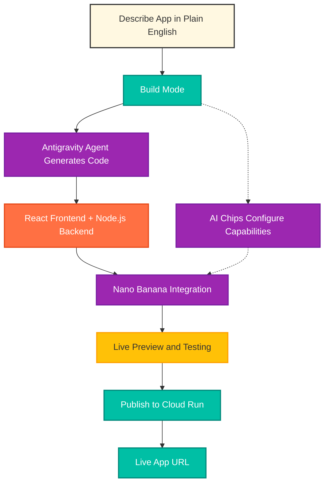
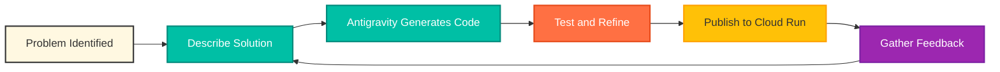

# Build a No-Code Professional Headshot Generator with Google AI Studio and Nano Banana

**Transform casual selfies into LinkedIn-ready headshots by describing what you want in plain English, then publish a live app to the internet using vibe coding**

[IMAGE PROMPT: A wide cinematic shot of a student sitting at a laptop in a warm-lit study space, hands hovering over the keyboard. On the laptop screen, a split view shows a casual smartphone selfie on the left transforming into a polished corporate headshot on the right. Soft golden-hour light through a nearby window, shallow depth of field, 35mm lens. The student's expression is focused but relaxed, capturing the exact moment of realizing "I can actually do this." EXCLUDE: no text, no labels, no logos, no recognizable brand names, no faces clearly visible]

---

Before we begin, download the complete step-by-step guide:
📥 [Download Complete Build Mode Guide](no-code-headshot-generator-guide.md)

The companion guide includes detailed screenshots references, troubleshooting tips, and verification checkpoints for each part of the tutorial.

---

## From Curious Observer to Confident Builder

You've watched AI transform images with stunning results. You've seen developers build apps that feel like magic. You've thought "I wish I could create something like that," but assumed you'd need to learn programming first.

That assumption ends today. By the time you finish reading this guide, you'll have built and published a live web application that transforms amateur photos into professional headshots. You won't write a single line of code, but you'll have created something real that solves actual problems for real people.

## The Opening

"The best technology disappears. It becomes so accessible that using it feels natural, not technical." (A modern take on Arthur C. Clarke's famous observation about sufficiently advanced technology.)

I discovered this possibility while helping prepare students for their first professional interviews. One student, Maria, had the skills but not the budget for professional headshots. "Professor Marquez," she said, "the career center wants a LinkedIn photo by Friday, but photographers want $200 I don't have."

I opened Google AI Studio on my laptop right there in office hours. "Let me show you something."

Instead of testing prompts or tweaking settings, I opened Build mode and started typing: "Build a professional headshot generator that transforms casual photos into corporate portraits using AI."

Ninety seconds later, a complete web application appeared on screen. Upload area. Transform button. Download functionality. All working. All generated from that one description.

"Wait, can I do this myself?" Maria asked, watching the AI write code in real time.

"Better," I told her. "You're going to build an app that does this for everyone you know, publish it live on the internet, and you'll have your own professional headshot in the next twenty minutes."

Her eyes went wide. "But I'm a business major. I don't know how to code."

"You don't need to. You need to describe what you want clearly. Watch."

## Why Google AI Studio's Build Mode Changes Everything

Traditional app development follows a brutal path. Learn programming languages, set up development environments, write backend code, design frontend interfaces, configure servers, manage databases, publish to cloud platforms, and pray nothing breaks. Developers spend years mastering these skills.

Google AI Studio's Build mode collapses that entire journey into natural language descriptions. Think of it as having a development team, a cloud infrastructure specialist, and a deployment engineer working for you automatically. You describe what you want, the AI generates the code, and Google publishes it. No IDE required. No terminal commands. No Stack Overflow debugging sessions at 2 AM.

Build mode now runs on the **Antigravity coding agent**, which Google introduced in March 2026. Unlike older code generators that produced isolated snippets, Antigravity maintains context across your entire project. It understands how files connect, remembers your previous changes, and makes precise edits without breaking existing functionality. This matters because it means non-coders can actually iterate on their apps without needing a developer to fix things when something goes sideways.

**This democratizes technology creation.** The best ideas don't always come from people who know React. Sometimes they come from business students like Maria who understand real problems but hit a wall when technology is required to solve them.



**Figure: The Vibe Coding Workflow.** Your plain-English description flows through the Antigravity agent, which scaffolds the app, integrates Nano Banana for image transformation, and publishes to Cloud Run. You interact at the top and bottom of this diagram; everything in the middle happens automatically.

The magic happens through "vibe coding," Google's term for development by description. Unlike traditional no-code builders where you drag and drop predefined components, Build mode understands intent. It reads your description, plans the architecture, generates the code, integrates APIs, and creates a complete application. You're not limited to templates. You're creating custom solutions from scratch.

For image transformation, Build mode uses **Nano Banana** (technically Gemini 2.5 Flash Image). This is the original model in Google's image generation family, and it has something its newer siblings don't: a genuine free tier. You get approximately 500 image generations per day through AI Studio with no credit card required. Newer models like Nano Banana 2 and Nano Banana Pro produce slightly sharper results, but their API access requires paid billing. For a tutorial where students need to actually build and test without spending money, the original Nano Banana is the right choice.

Unlike simple photo filters that overlay effects, Nano Banana understands context. It recognizes faces, lighting conditions, backgrounds, and clothing. Then it reconstructs the entire scene based on your description. You're not editing a photo, you're reimagining it with AI as your creative partner.

## Building Your Professional Headshot Generator

### Step 1: Open Build Mode and Add Image Generation

Navigate to aistudio.google.com and sign in with any Google account. In the left sidebar you'll see five sections: Home, Playground, Build, Dashboard, Documentation. Click **Build**.

You'll land on the Build mode interface with the App Gallery, an "I'm Feeling Lucky" button, and a large prompt input area. Near the input box, look for **AI Chips**. Click the **Image Generation** chip to tell the agent your app will use Nano Banana. This pre-configures the capability so the scaffolding happens correctly.

**Why This Matters:** AI Chips eliminate guesswork. Without selecting the Image Generation chip, the agent has to infer your intent from the prompt text alone. With it, you're explicit about what capability you need.

**Common Mistake:** Don't click Playground looking for a "build app" button. Playground is for testing AI prompts. Build mode is for creating applications, and it lives in its own dedicated section of the sidebar.

### Step 2: Describe Your Complete App

This is where vibe coding either succeeds or struggles. The more specific you are about features, workflow, and user experience, the better your first version will be. Think of this as briefing a developer on exactly what to build.

In the description area, paste a detailed specification that includes the image upload flow, the exact transformation prompt you want Nano Banana to use, the UI design preferences, and the user experience details. The full prompt is in the companion guide, but here's the structure it follows:

```
Build a professional headshot generator with:
1. IMAGE UPLOAD (drag and drop, JPG/PNG)
2. AI TRANSFORMATION using Nano Banana
   (gemini-2.5-flash-image) with this prompt: [detailed
   transformation description]
3. USER INTERFACE (professional design, side by side
   comparison, download button)
4. USER EXPERIENCE (helpful instructions, loading states,
   error messages)
```

Notice the prompt explicitly specifies `gemini-2.5-flash-image` as the model. This is the original Nano Banana, the one with the free tier. Being explicit removes ambiguity for the agent.

**Why This Matters:** Vague descriptions produce generic apps. Specific descriptions produce apps that match your vision. The extra five minutes you spend writing a detailed description saves you an hour of iteration later.

**Common Mistake:** Don't write short descriptions like "build a photo editor app." The Antigravity agent works best with specific UI requirements, exact model names, and the transformation prompt as a quoted block.

### Step 3: Watch the Antigravity Agent Build

After clicking Build, the agent works for 30 to 90 seconds. The right panel shows two tabs: Preview and Code. Watch the Code tab populate with files, including `geminiService.ts` where your Nano Banana integration lives. When generation completes, the Preview tab shows your live app running.

Behind the scenes, the agent is scaffolding a React frontend, writing the Gemini API integration using the GenAI TS SDK, building drag-and-drop upload functionality, managing loading states, and wiring everything together with your transformation prompt embedded in the right places.

**Why This Matters:** You're watching software get built in real time. If you hired a developer to do this manually, the work would cost $2,000 to $5,000 and take days. The Antigravity agent handles frontend design, backend logic, API authentication, error handling, and responsive design simultaneously.

### Step 4: Test in the Preview Panel

Click the Preview tab and test your app. Drag a photo into the upload area, click Transform, watch the loading indicator, and review the result. Nano Banana typically completes a transformation in 10 to 20 seconds.

**Checkpoint:** You should see your original photo next to a professionally styled headshot, with a working download button below. If the transformation fails, check the Code tab for error messages. Most failures trace back to the model name not being recognized.

Testing in Preview is free. It uses your AI Studio free tier allocation, so experiment generously with different photos: blurry ones, side profiles, group photos, low-light shots. Seeing how the app handles edge cases tells you whether to add validation messages or adjust the transformation prompt.

### Step 5: Refine Using Chat or Annotation Mode

Perfect apps don't emerge from first prompts. Refinement is where vibe coding gets fun.

The chat panel at the bottom accepts plain-English change requests like "make the upload area larger with a dashed border" or "add a dropdown to choose background color." The agent updates the relevant files and the Preview refreshes.

**Annotation Mode** is even better for visual tweaks. Toggle annotation mode in the Preview, click the element you want to change, and describe your edit. The agent receives both your description and a screenshot of exactly what you're pointing at, which eliminates the "which button did you mean?" problem.

**Common Mistake:** Don't bundle five changes into one request. Make one change, verify it works, then make the next. If something breaks, you'll know which change caused it.

### Step 6: Publish to Cloud Run

Once your app works the way you want, it's time to get it on the internet.

In the top right, click the **Publish** button. A dialog opens with three options: Cloud Run (deploy as a live web app), GitHub (export to a repository), or Download (save as a ZIP file). Select Cloud Run.

You'll need a Google Cloud project with billing enabled. If this is your first Google Cloud setup, you get $300 in trial credits, and Cloud Run includes 2 million free requests per month after that. For a small headshot app, your hosting costs will realistically be zero.

Configure the settings: your Google Cloud project, a service name like `pro-headshot-gen`, a region close to your users like `us-central1`, and "Allow unauthenticated invocations" so anyone can use your app.

Click Publish. Wait 2 to 4 minutes while Google packages your code, builds a container, configures HTTPS, and generates your live URL. When complete, you'll see something like `https://pro-headshot-gen-xxxxx.run.app`. That's your live app, running on the same infrastructure Fortune 500 companies use.

**Why This Matters:** What happened in those 4 minutes would traditionally require DevOps expertise. Google containerized your entire application, set up auto-scaling infrastructure that handles 1 user or 10,000 users automatically, configured SSL encryption, created a globally accessible URL, and set up serverless hosting where you only pay when people actually use your app.

**Common Mistake:** Don't publish without testing in Preview first. Each publish cycle takes a few minutes, and the publish-update workflow has some rough edges (more on that in the companion guide). Catching issues before you publish saves real time.

## A Note on Cost and Honesty

This is where most vibe coding tutorials get dishonest, so let's be clear.

Two cost layers apply to your published app. Cloud Run hosting is free for the first 2 million requests per month, which easily covers personal projects. But every image transformation your users trigger is an API call to Nano Banana, and those do cost money once you exceed the AI Studio free tier.

At roughly $0.039 per image transformation, an app used by 10 people per day costs about $12 per month. At 100 users per day, it's around $117 per month. Setting a budget alert in Google Cloud Console (Billing → Budgets & alerts) before you share your URL widely protects you from surprise bills if your app goes viral.

For building, testing, and sharing with a handful of friends, you'll likely spend nothing. For public distribution, plan accordingly.

## The Transformation Is Complete

You started this article thinking you couldn't build apps. You're finishing it knowing how to generate a live web application that solves real problems for real people.

Maria, the student from my office hours, published her headshot generator and shared it with her entire business school cohort. Within a week, 47 students had used it to upgrade their LinkedIn photos before the career fair. Several got interview callbacks they attributed partially to looking more professional online. One recruiter specifically commented on a student's "great LinkedIn photo" during an interview that led to a job offer.

The app didn't get anyone the job. Their skills did that. But removing the $200 barrier to professional photos removed one more obstacle between talented students and the opportunities they deserved.

This pattern applies far beyond headshots. The same approach works for any AI-powered solution:

- Product photo enhancement for small business owners selling on Etsy or Amazon
- Virtual staging for real estate agents trying to sell properties faster
- Social media caption generation for marketers building brand presence
- Resume analysis and improvement for job seekers
- Educational content creation for teachers and trainers

Every time you identify a problem that AI can solve, Build mode gives you the tools to create a solution without writing code.

**The skills you practiced today transfer to bigger projects.** You learned to craft specific descriptions that produce consistent results. You tested across multiple inputs to validate quality. You configured user-facing settings thoughtfully. You published to production infrastructure. These are product development fundamentals, and you executed them without writing code.



**Figure: The Iteration Loop.** Every successful product follows this cycle. You're no longer just consuming technology; you're creating it, refining it based on real user feedback, and shipping improvements.

The democratization of technology creation is happening right now. A decade ago, building an app like this required 4 to 6 months learning web development, knowledge of multiple programming languages, cloud infrastructure expertise, and $50,000 or more to hire professional developers.

Today, you did it in 20 minutes with a clear description of what you wanted.

## Quick Resources

**Essential Links:**
- Google AI Studio: https://aistudio.google.com
- Build Mode Documentation: https://ai.google.dev/gemini-api/docs/aistudio-build-mode
- Nano Banana Documentation: https://ai.google.dev/gemini-api/docs/image-generation
- Gemini API Pricing: https://ai.google.dev/gemini-api/docs/pricing
- Cloud Run Pricing: https://cloud.google.com/run/pricing
- Deploy from AI Studio Codelab: https://codelabs.developers.google.com/deploy-from-aistudio-to-run

**Next Steps:**
- Join the Google AI Developers Forum: https://discuss.ai.google.dev
- Explore the App Gallery for inspiration: https://aistudio.google.com/apps?source=showcase
- Try building a resume reviewer next
- Learn about connecting databases to your apps with Firebase integration

## Your Turn: Build Something That Matters

Take what you've learned and adapt it to solve a problem in your own life or community. The fastest way to solidify these skills is by building something you'll actually use and share.

Think about the people around you. What challenges do they face that AI could solve?

- Your friend group might need event posters created from simple descriptions
- Your department might need consistent profile photos for the team directory
- Your side business might need product images enhanced automatically
- Your nonprofit might need social media content generated from mission statements

Open AI Studio. Click Build. Start describing. Publish something.

If this tutorial helped you realize you can create technology without traditional coding, I'd love to hear about it in the comments. What's the first app you're planning to build? What problem are you excited to solve?

And if you found value in this step-by-step approach to vibe coding, a few claps would help other learners discover this guide. (Did you know you can clap up to 50 times? Each clap helps this article reach someone who thinks "I could never build an app.")

Drop a comment with your published app URL when you finish. I want to see what you create.

---

**A note on my teaching approach:** I use AI as a co-creator and learning accelerator in both my classroom and my writing. As an educator in Applied AI, I practice what I teach. All core concepts, pedagogical structure, and educational insights are my own, refined through years of teaching students and professionals. The AI tools help me scale my ability to create clear, comprehensive guides that serve learners better.

— Carlos Marquez, Professor of Applied AI and Data Analytics, Miami Dade College
